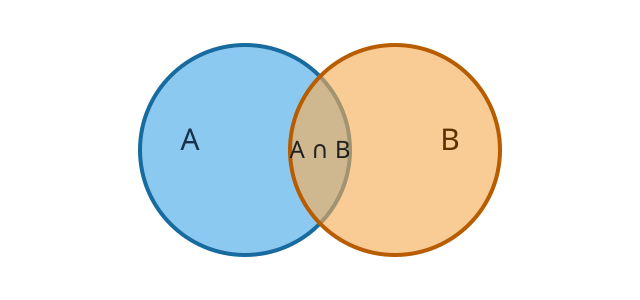
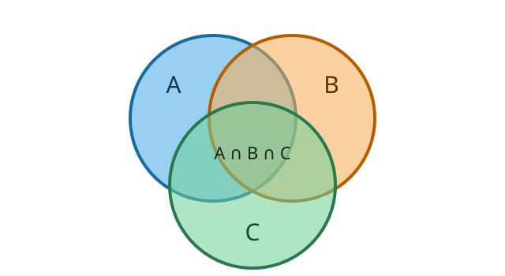

## Глава 5. Формула включений-исключений

Во многих задачах один объект может одновременно обладать несколькими свойствами. Например, школьник может посещать несколько кружков, пользователь — пользоваться несколькими сервисами, а строка — удовлетворять сразу нескольким условиям.

Если просто сложить количество объектов с каждым свойством, некоторые объекты будут посчитаны несколько раз. **Формула включений-исключений** позволяет исправить такой повторный учёт.

Для наглядного изображения множеств и их пересечений удобно использовать **диаграммы Эйлера — Венна**. Каждое множество изображается областью, обычно кругом, а пересечение областей соответствует объектам, которые одновременно принадлежат нескольким множествам.

## 5.1. Два свойства

Пусть $A$ — множество школьников, записавшихся в кружок робототехники, а $B$ — множество школьников, записавшихся в шахматный кружок.

На диаграмме множества изображаются двумя пересекающимися кругами:



Величина $|A|$ обозначает количество элементов множества $A$, а $|B|$ — количество элементов множества $B$.

Если сложить $|A|$ и $|B|$, то каждый школьник, посещающий оба кружка, будет посчитан дважды:

- один раз как участник кружка робототехники;
- ещё один раз как участник шахматного кружка.

Чтобы каждый школьник был учтён ровно один раз, необходимо вычесть размер пересечения $A\cap B$:

$$|A\cup B|=|A|+|B|-|A\cap B|.$$

Здесь $A\cup B$ — множество школьников, которые посещают хотя бы один из двух кружков.

Предположим, что:

- в кружок робототехники записались $18$ школьников;
- в шахматный кружок записались $16$ школьников;
- оба кружка посещают $7$ школьников.

Тогда хотя бы один кружок посещают $18+16-7=27$ школьников.

Сначала мы получили $18+16=34$, но семь школьников из пересечения были учтены дважды. После вычитания одного лишнего вхождения для каждого из них остаётся правильный ответ: $27$.

> [!IMPORTANT]
> При подсчёте объединения двух множеств их размеры сначала складываются, а затем размер пересечения вычитается. Благодаря этому каждый элемент объединения учитывается ровно один раз.

## 5.2. Объекты, не обладающие ни одним свойством

Иногда требуется найти не количество объектов в объединении, а количество объектов, которые не обладают ни одним из рассматриваемых свойств.

Пусть $U$ — множество всех школьников. Тогда школьники, не посещающие ни робототехнику, ни шахматы, образуют дополнение к объединению $A\cup B$.

Их количество равно

$$|U\setminus(A\cup B)|=|U|-|A\cup B|.$$

Подставим формулу для объединения:

$$|U\setminus(A\cup B)|=|U|-|A|-|B|+|A\cap B|.$$

Например, если всего в школе учатся $40$ человек, а хотя бы один из двух кружков посещают $27$, то ни в один из них не записались $40-27=13$ школьников.

Обратите внимание на знаки в формуле. Сначала из общего количества вычитаются размеры множеств $A$ и $B$. При этом школьники из пересечения вычитаются дважды, поэтому размер пересечения необходимо один раз добавить обратно.

## 5.3. Три свойства

Добавим третье множество. Пусть:

- $A$ — школьники из кружка робототехники;
- $B$ — школьники из шахматного кружка;
- $C$ — школьники из кружка программирования.

На диаграмме теперь изображены три пересекающихся множества:



Начнём со сложения размеров всех трёх множеств:

$$|A|+|B|+|C|.$$

Объекты, принадлежащие двум множествам, при таком подсчёте учитываются дважды. Поэтому вычтем все парные пересечения:

$$|A\cap B|,\quad |A\cap C|,\quad |B\cap C|.$$

Однако после этого возникает новая проблема с объектами, принадлежащими сразу трём множествам.

Рассмотрим один такой объект. При сложении $|A|+|B|+|C|$ он был учтён три раза. Затем он попал в каждое из трёх парных пересечений и был трижды вычтен. В результате он оказался учтён $3-3=0$ раз, хотя должен быть учтён один раз.

Поэтому размер тройного пересечения нужно добавить:

$$|A\cup B\cup C|=|A|+|B|+|C|-|A\cap B|-|A\cap C|-|B\cap C|+|A\cap B\cap C|.$$

Предположим, что известны следующие значения:

- $|A|=18$;
- $|B|=16$;
- $|C|=12$;
- $|A\cap B|=7$;
- $|A\cap C|=5$;
- $|B\cap C|=4$;
- $|A\cap B\cap C|=2$.

Тогда хотя бы один кружок посещают $18+16+12-7-5-4+2=32$ школьника.

> [!NOTE]
> Знаки в формуле чередуются: отдельные множества добавляются, парные пересечения вычитаются, а тройное пересечение снова добавляется.

Важно понимать, что парное пересечение включает и объекты из тройного пересечения. Например, в $A\cap B$ входят все школьники, посещающие кружки $A$ и $B$, в том числе те, кто одновременно посещает кружок $C$.

Именно такие полные пересечения используются в формуле включений-исключений.

## 5.4. Общая формула

Пусть имеется $s$ множеств:

$$A_1,A_2,\ldots,A_s.$$

Чтобы найти размер их объединения, необходимо рассмотреть пересечения всех непустых наборов множеств:

- пересечения одного множества добавляются;
- пересечения двух множеств вычитаются;
- пересечения трёх множеств добавляются;
- пересечения четырёх множеств вычитаются;
- далее знаки продолжают чередоваться.

Общая формула имеет следующий вид:

$$\left|\bigcup_{i=1}^{s}A_i\right|=\sum_{\emptyset\ne S\subseteq\{1,\ldots,s\}}(-1)^{|S|+1}\left|\bigcap_{i\in S}A_i\right|.$$

Здесь $S$ — непустое подмножество индексов, а $|S|$ — количество выбранных множеств.

Если в пересечении участвует нечётное количество множеств, его размер добавляется. Если количество множеств чётное, размер пересечения вычитается.

Непустых подмножеств множества из $s$ элементов существует $2^s-1$.

Поэтому прямое применение формулы требует $O(2^s)$ операций при условии, что размеры всех пересечений уже известны.

Экспоненциальная сложность быстро растёт:

| Количество свойств $s$ | Количество непустых подмножеств |
|---:|---:|
| $3$ | $7$ |
| $10$ | $1023$ |
| $20$ | $1048575$ |
| $25$ | $33554431$ |

Поэтому полный перебор подмножеств обычно применяют только при небольшом количестве свойств. Конкретная допустимая граница зависит от того, сколько времени требуется на обработку одного подмножества.

## 5.5. Перебор подмножеств с помощью битовых масок

В программе удобно представлять выбранный набор множеств битовой маской.

Пусть имеется $s$ множеств. Тогда маска содержит $s$ битов, и бит с номером $i$ показывает, выбрано ли множество $A_i$:

- бит равен `0` — множество не участвует в пересечении;
- бит равен `1` — множество участвует в пересечении.

Для трёх множеств маски интерпретируются так:

| Маска | Выбранные множества | Пересечение |
|---:|---|---|
| `001` | $A$ | $A$ |
| `010` | $B$ | $B$ |
| `011` | $A,B$ | $A\cap B$ |
| `100` | $C$ | $C$ |
| `101` | $A,C$ | $A\cap C$ |
| `110` | $B,C$ | $B\cap C$ |
| `111` | $A,B,C$ | $A\cap B\cap C$ |

Нулевая маска не выбирает ни одного множества, поэтому в сумму не входит.

Количество единичных битов показывает, сколько множеств участвует в пересечении. От чётности этого количества зависит знак слагаемого:

- нечётное количество единичных битов — `+`;
- чётное количество единичных битов — `-`.

В C++ количество единичных битов в `int` можно получить с помощью `__builtin_popcount(mask)`. В Python для этого используется метод `mask.bit_count()`.

## 5.6. Программная реализация

Программы получают количество свойств $s$, а затем размеры пересечений для всех масок от $1$ до $2^s-1$.

Значения вводятся в порядке возрастания масок. Например, при $s=3$ ожидается следующий порядок:

```text
|A|, |B|, |A ∩ B|, |C|, |A ∩ C|, |B ∩ C|, |A ∩ B ∩ C|
```

После этого программа перебирает все непустые маски. Пересечения нечётного количества множеств прибавляются к ответу, а пересечения чётного количества множеств вычитаются.

Полные реализации доступны отдельно для самостоятельного изучения: [C++](examples/example-01.cpp) и [Python3](examples/example-01.py).

<details>
<summary><strong>C++: формула включений-исключений</strong></summary>

Программа состоит из трёх логических частей:

1. По значению `s` вычисляется количество возможных масок `1 << s`.
2. Для каждой непустой маски считывается размер соответствующего пересечения.
3. Все пересечения объединяются с чередующимися знаками. Чётность количества единичных битов определяет, нужно прибавить или вычесть очередное значение.

```cpp
#include <bits/stdc++.h>
using namespace std;
using ll = long long;
main() {
	ios::sync_with_stdio(false);
	cin.tie(0);
	int s; cin >> s;
	int limit = 1 << s;
	// intersection[mask] хранит размер пересечения множеств, выбранных маской.
	vector<ll> intersection(limit);
	for (int mask = 1; mask < limit; mask++) cin >> intersection[mask];
	// Нечётное число свойств даёт плюс, чётное число свойств даёт минус.
	ll answ = 0;
	for (int mask = 1; mask < limit; mask++) {
		if (__builtin_popcount(mask) % 2 == 1) answ += intersection[mask];
		else answ -= intersection[mask];
	}
	cout << answ << '\n';
}
```

</details>

<details>
<summary><strong>Python3: формула включений-исключений</strong></summary>

Реализация повторяет те же шаги:

1. Вычисляет количество масок `1 << s`.
2. Считывает размеры пересечений в порядке возрастания масок.
3. С помощью `bit_count()` определяет знак каждого слагаемого и накапливает ответ.

Нулевой элемент добавляется в начало списка, чтобы индекс элемента совпадал с соответствующей маской.

```python
s = int(input())
limit = 1 << s
# intersection[mask] хранит размер пересечения множеств, выбранных маской.
intersection = [0] + list(map(int, input().split()))
# Нечётное число свойств даёт плюс, чётное число свойств даёт минус.
answ = 0
for mask in range(1, limit):
	if mask.bit_count() % 2 == 1: answ += intersection[mask]
	else: answ -= intersection[mask]
print(answ)
```

</details>

<details>
<summary><strong>Пример запуска</strong></summary>

```text
Ввод
3
18 16 7 12 5 4 2

Вывод
32
```

Для трёх множеств значения соответствуют маскам от `001` до `111`. Поэтому программа вычисляет выражение $18+16-7+12-5-4+2=32$.

</details>

> [!WARNING]
> Для каждой маски требуется размер полного пересечения выбранных множеств. Например, значение $|A\cap B|$ должно включать объекты из $A\cap B\cap C$. Не нужно заранее исключать из парных пересечений объекты с дополнительными свойствами.

## 5.7. Главное о формуле включений-исключений

Формула включений-исключений применяется, когда после обычного сложения или вычитания одни и те же объекты оказываются учтены несколько раз.

Знаки зависят от количества одновременно выбранных свойств:

| Количество множеств в пересечении | Знак |
|---:|:---:|
| Нечётное | `+` |
| Чётное | `-` |

Для двух множеств получаем формулу

$$|A\cup B|=|A|+|B|-|A\cap B|.$$

Для произвольного количества множеств перебираются все непустые подмножества. Битовые маски позволяют реализовать этот перебор напрямую за $O(2^s)$.

При решении задачи полезно последовательно ответить на три вопроса:

1. Какие свойства задают множества?
2. Что означает пересечение выбранных множеств?
3. Можно ли быстро посчитать размер такого пересечения для каждой маски?

Если ответы на эти вопросы известны, формула включений-исключений обычно сводит оставшуюся часть решения к перебору подмножеств с правильными знаками.