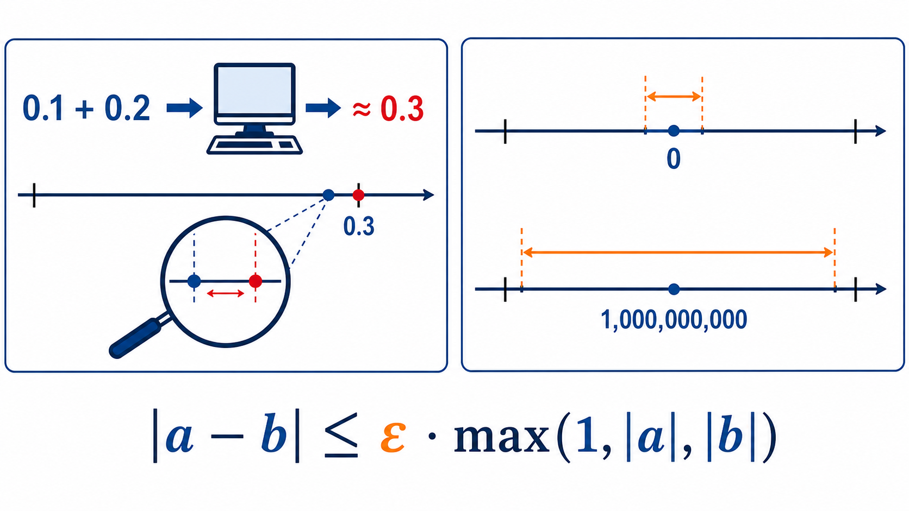
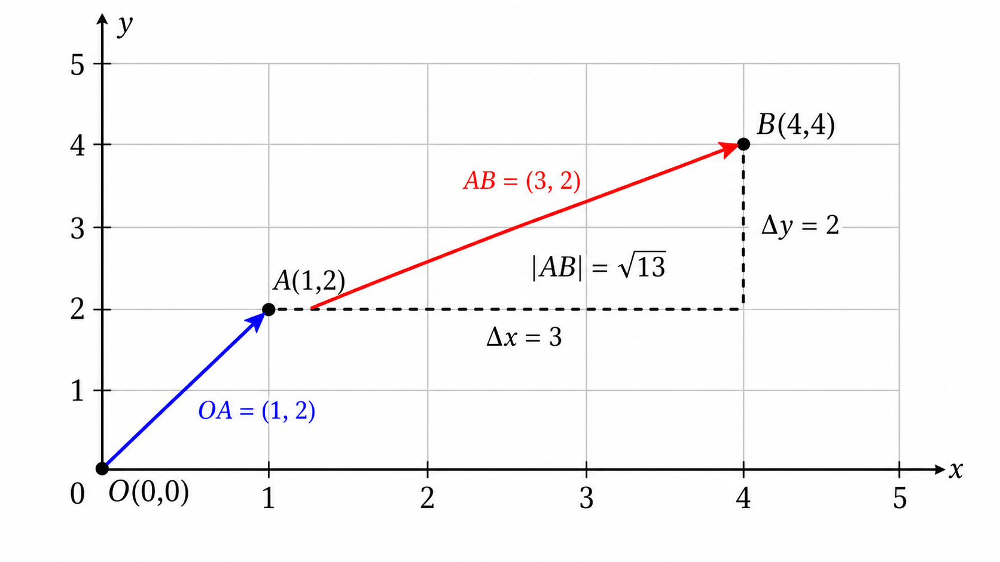
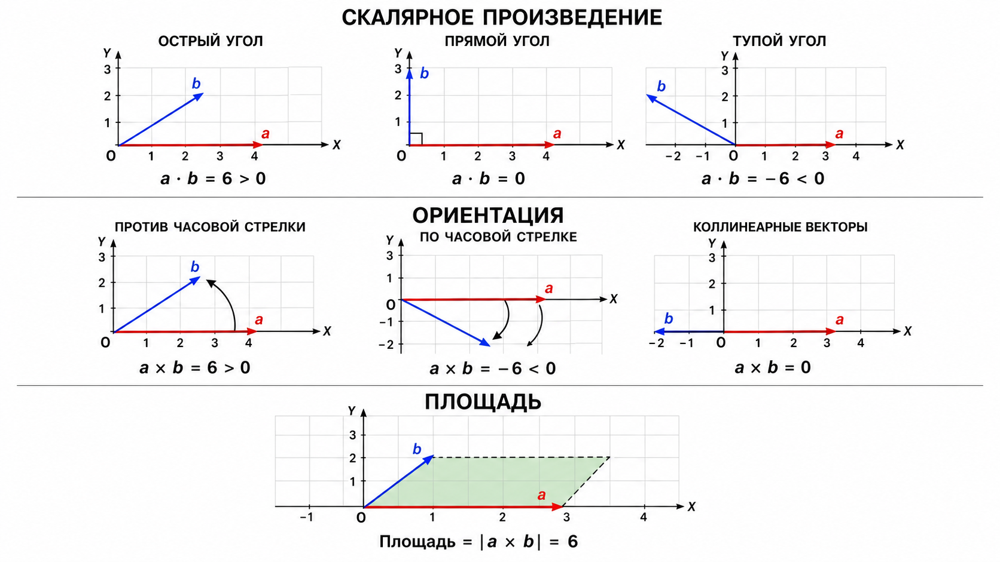
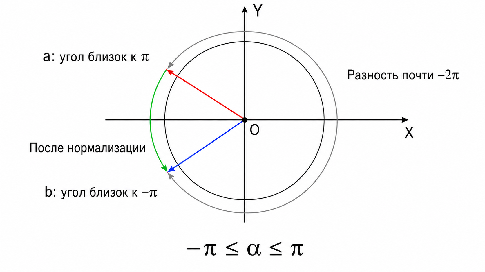
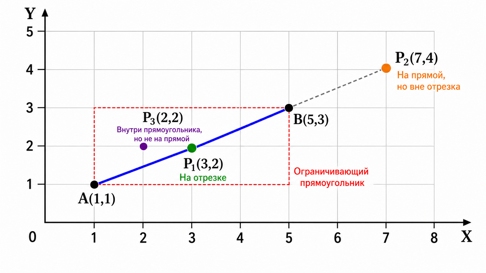

# Геометрия в олимпиадных задачах

## Глава 1. Базовые понятия и фундамент вычислительной геометрии

Вычислительная геометрия — это, пожалуй, самый контрастный раздел олимпиадного программирования. С одной стороны, её идеи интуитивно понятны, ведь все мы рисовали точки и линии на уроках математики. С другой стороны, именно геометрия славится коварными крайними случаями, потерей точности и зубодробительными багами, которые заставляют часами искать ошибку в, казалось бы, идеальном коде.

В этой главе мы заложим железобетонный фундамент. Мы забудем школьные формулы с синусами и уравнениями прямых $y = kx + b$, потому что в программировании они приносят больше вреда, чем пользы. Вместо этого мы научимся смотреть на плоскость через призму векторов и их произведений.

## 1.1. Точка и выбор системы координат

Всё начинается с **точки**. На двумерной плоскости точка — это просто пара чисел $(x, y)$. 

В школьной математике мы привыкли, что координаты могут быть любыми, включая сложные дроби. Однако в олимпиадных задачах координаты точек почти всегда задаются **целыми числами**. Обычно их значения по модулю ограничены разумными пределами: $10^4$, $10^6$ или $10^9$. Это не просто особенность формата ввода, а важнейшая подсказка к тому, как именно нужно писать код.

Отсюда вытекает первое и самое главное правило вычислительной геометрии: **если задачу можно решить в целых числах, её нужно решать в целых числах**. 

Переход к вещественным типам данных (`float`, `double`) таит в себе огромную опасность — погрешность вычислений. Компьютер не может абсолютно точно хранить бесконечные дроби, поэтому в мире программирования $0.1 + 0.2$ не всегда равно $0.3$. Использование деления, тригонометрии или извлечения корня там, где без этого можно обойтись, — верный путь к получению вердикта Wrong Answer на коварных тестах.

> [!WARNING]
> Никогда не сравнивайте два вещественных числа на точное равенство с помощью `==`. Из-за микроскопических погрешностей числа, которые математически равны, в памяти компьютера могут отличаться на миллиардные доли.



Но что делать, если специфика задачи — например, поиск центра описанной окружности или поворот на произвольный угол — всё же заставляет нас прибегнуть к вещественным числам? Тогда в игру вступает **эпсилон** ($\varepsilon$) — допустимая погрешность.

Одной только абсолютной погрешности недостаточно. Разница $10^{-7}$ огромна для чисел порядка $10^{-9}$, но совершенно незаметна для чисел порядка $10^9$. Поэтому обычно одновременно учитывают **абсолютную** и **относительную** погрешности:

$$|a-b| \leq \varepsilon \cdot \max(1, |a|, |b|)$$

Если оба числа близки к нулю, множитель $1$ превращает проверку в абсолютную. Если числа велики, допустимая погрешность растёт вместе с их масштабом и становится относительной. Значение $\varepsilon$ выбирают с учётом условия задачи; часто подходит $10^{-9}$, но это не универсальная магическая константа.

<details>
<summary><strong>C++: сравнение с абсолютной или относительной погрешностью</strong></summary>

```cpp
#include <bits/stdc++.h>
using namespace std;
const double eps = 1e-9;
bool isEqual(double a, double b) {
    return abs(a - b) <= eps * max({1.0, abs(a), abs(b)});
}
void solve() {
    double a, b; cin >> a >> b;
    if (isEqual(a, b)) cout << "YES" << endl;
    else cout << "NO" << endl;
}
main() {
    ios::sync_with_stdio(false);
    cin.tie(0);
    int tt; cin >> tt;
    while (tt --> 0) solve();
}
```

</details>

<details>
<summary><strong>Python3: сравнение с абсолютной или относительной погрешностью</strong></summary>

```python
eps = 1e-9

def is_equal(a, b):
    return abs(a - b) <= eps * max(1.0, abs(a), abs(b))

tt = int(input())
for _ in range(tt):
    a, b = map(float, input().split())
    print("YES" if is_equal(a, b) else "NO")
```

</details>

<details>
<summary><strong>Пример ввода и вывода</strong></summary>

**Ввод**
```text
5
0.1 0.10000000005
1000000000 1000000000.5
1000000000 1000000002
0 0.0000000005
0 0.000000002
```

**Вывод**
```text
YES
YES
NO
YES
NO
```

</details>

Но давайте вернёмся к целым числам, ведь именно они станут нашим главным и самым надёжным инструментом.

## 1.2. Векторы: больше, чем просто стрелочка

**Отрезок** — это часть прямой, соединяющая две точки. А вот **вектор** — это *направленный* отрезок. Он показывает, в каком направлении и на какое расстояние нужно переместиться.

Вектор задаётся двумя числами: смещением по оси $X$ и смещением по оси $Y$. Если вектор начинается в точке $A(x_1, y_1)$ и заканчивается в точке $B(x_2, y_2)$, то его координаты вычисляются элементарно: из координат конца вычитаем координаты начала.
$$\vec{AB} = (x_2 - x_1, y_2 - y_1)$$

Сама точка тоже может выступать вектором — так называемым *радиус-вектором*, который проведён из начала координат $(0, 0)$ в эту точку. Это позволяет нам складывать и вычитать точки так же, как векторы.



Вектор имеет **длину**. По теореме Пифагора длина вектора $\vec{v}(x, y)$ равна $\sqrt{x^2 + y^2}$. Если разделить координаты вектора на его длину, мы получим *единичный вектор* — вектор длины $1$, который указывает в том же направлении.

В коде точку и вектор удобно объединить в одну структуру.

<details>
<summary><strong>C++: структура точки/вектора</strong></summary>

```cpp
#include <bits/stdc++.h>
using namespace std;
struct Point {
    int64_t x, y;
};
Point operator+(Point a, Point b) {
    return {a.x + b.x, a.y + b.y};
}
Point operator-(Point a, Point b) {
    return {a.x - b.x, a.y - b.y};
}
void solve() {
    Point a, b; cin >> a.x >> a.y >> b.x >> b.y;
    Point v = b - a;
    cout << v.x << ' ' << v.y << endl;
}
main() {
    ios::sync_with_stdio(false);
    cin.tie(0);
    int tt; cin >> tt;
    while (tt --> 0) solve();
}
```

</details>

<details>
<summary><strong>Python3: класс точки/вектора</strong></summary>

```python
class Point:
    def __init__(self, x, y):
        self.x = x
        self.y = y

    def __add__(self, other):
        return Point(self.x + other.x, self.y + other.y)

    def __sub__(self, other):
        return Point(self.x - other.x, self.y - other.y)

tt = int(input())
for _ in range(tt):
    x1, y1, x2, y2 = map(int, input().split())
    a = Point(x1, y1)
    b = Point(x2, y2)
    v = b - a
    print(v.x, v.y)
```

</details>

<details>
<summary><strong>Пример ввода и вывода</strong></summary>

**Ввод**
```text
4
1 2 4 4
-3 5 2 -1
0 0 0 0
10 -4 -2 7
```

**Вывод**
```text
3 2
5 -6
0 0
-12 11
```

</details>

## 1.3. Фундаментальные операции: скалярное и векторное произведения

Это сердце олимпиадной геометрии. Забудьте про угловые коэффициенты прямых — два этих произведения заменят вам 90% школьных формул и избавят от деления на ноль.

### Скалярное произведение (Dot Product)

Скалярное произведение двух векторов $\vec{a}(x_1, y_1)$ и $\vec{b}(x_2, y_2)$ — это число, которое вычисляется по формуле:
$$\vec{a} \cdot \vec{b} = x_1 x_2 + y_1 y_2$$

**Геометрический смысл:** оно равно произведению длин векторов на косинус угла между ними ($|\vec{a}| |\vec{b}| \cos \alpha$). 

**Зачем оно нужно?** Скалярное произведение идеально подходит для определения *типа угла* между векторами:
* Если $\vec{a} \cdot \vec{b} > 0$, угол **острый** (косинус положителен).
* Если $\vec{a} \cdot \vec{b} < 0$, угол **тупой** (косинус отрицателен).
* Если $\vec{a} \cdot \vec{b} == 0$, векторы **перпендикулярны** (угол $90^\circ$).

### Векторное (косое) произведение (Cross Product)

В двумерном пространстве векторное произведение — это тоже число (строго говоря, проекция на ось Z), которое вычисляется так:
$$\vec{a} \times \vec{b} = x_1 y_2 - x_2 y_1$$

**Геометрический смысл:** его модуль равен **площади параллелограмма**, натянутого на эти два вектора. А само значение равно произведению длин на синус *ориентированного* угла между ними ($|\vec{a}| |\vec{b}| \sin \alpha$).



**Зачем оно нужно?** Это ваш главный инструмент для определения взаимного расположения объектов:
* Если $\vec{a} \times \vec{b} > 0$, вектор $\vec{b}$ находится **слева** от вектора $\vec{a}$ (поворот против часовой стрелки).
* Если $\vec{a} \times \vec{b} < 0$, вектор $\vec{b}$ находится **справа** от вектора $\vec{a}$ (поворот по часовой стрелке).
* Если $\vec{a} \times \vec{b} == 0$, векторы **коллинеарны** (лежат на одной прямой или параллельны).

> [!IMPORTANT]
> Обратите внимание: проверка на коллинеарность через векторное произведение работает абсолютно точно в целых числах! Нам не нужно делить координаты и сравнивать дроби.

Обе операции удобно оформить отдельными функциями. Для координат порядка $10^9$ произведения уже могут достигать порядка $10^{18}$, поэтому результат необходимо хранить в `int64_t`.

Следующая программа для каждой пары векторов выводит сначала их скалярное произведение, а затем векторное. По первому числу можно определить тип угла, а по второму — направление поворота от первого вектора ко второму.

<details>
<summary><strong>C++: скалярное и векторное произведения</strong></summary>

```cpp
#include <bits/stdc++.h>
using namespace std;
struct Point {
    int64_t x, y;
};
int64_t dot(Point a, Point b) {
    return a.x * b.x + a.y * b.y;
}
int64_t cross(Point a, Point b) {
    return a.x * b.y - a.y * b.x;
}
void solve() {
    Point a, b; cin >> a.x >> a.y >> b.x >> b.y;
    cout << dot(a, b) << ' ' << cross(a, b) << endl;
}
main() {
    ios::sync_with_stdio(false);
    cin.tie(0);
    int tt; cin >> tt;
    while (tt --> 0) solve();
}
```

</details>

<details>
<summary><strong>Пример ввода и вывода</strong></summary>

**Ввод**
```text
4
1 0 0 1
1 0 0 -1
2 3 4 6
1 2 -3 4
```

**Вывод**
```text
0 1
0 -1
26 0
5 10
```

</details>

В первом тесте векторы перпендикулярны, а поворот от первого ко второму идёт против часовой стрелки. Во втором тесте угол также прямой, но поворот идёт по часовой стрелке. В третьем тесте векторы коллинеарны и направлены в одну сторону. Последний тест показывает, что скалярное и векторное произведения одновременно могут быть положительными.

## 1.4. Угол между векторами и магия atan2

Иногда в задаче требуется не только определить направление поворота, но и вычислить сам угол между векторами. Школьный инстинкт подсказывает формулу через косинус:

$$\alpha=\arccos\left(\frac{\vec a\cdot\vec b}{|\vec a||\vec b|}\right)$$

В олимпиадном коде этот путь опасен. Из-за погрешности результат деления может оказаться равным, например, `1.0000000000000002`, хотя математически он не превосходит единицы. Функция `acos` получит аргумент вне своей области определения и вернёт `NaN`. Кроме того, косинус не позволяет отличить угол $\alpha$ от угла $-\alpha$, а значит, информация о направлении поворота потеряется.

Гораздо надёжнее использовать функцию `atan2(y, x)`. Она учитывает знаки обоих аргументов и возвращает угол в диапазоне от $-\pi$ до $\pi$.

Ориентированный угол от вектора $\vec a$ к вектору $\vec b$ можно найти непосредственно:

$$\alpha=\t{atan2}(\vec a\times\vec b,\vec a\cdot\vec b)$$

Векторное произведение играет роль синуса, скалярное — косинуса, а `atan2` самостоятельно определяет нужную четверть. Положительный результат означает поворот против часовой стрелки, отрицательный — по часовой.

Есть альтернативный способ, через разность двух углов, но...

> [!WARNING]
> Мир розовых пони заканчивается, когда мы начинаем отдельно работать с полярными углами векторов. Нельзя просто так взять и вычислить разность двух результатов `atan2` и сразу вывести её: один угол может находиться около $\pi$, а другой — около $-\pi$. Тогда вместо маленького поворота программа получит разность почти в $2\pi$.
>
> Если в задаче нужны именно полярные направления, сначала вычислите
> 
> $$\alpha=\t{atan2}(y_2,x_2)-\t{atan2}(y_1,x_1)$$,
> 
> а затем прибавляйте или вычитайте $2\pi$, пока результат не попадёт в диапазон $[-\pi,\pi]$.
>
> Обратите внимание на порядок аргументов: сначала передаётся координата $y$, затем координата $x$. Запись `atan2(x, y)` неверна.

Сама формула $\t{atan2}(\vec a\times\vec b,\vec a\cdot\vec b)$ также корректна и сразу возвращает нормализованный ориентированный угол. Однако при целочисленных координатах необходимо следить, чтобы вычисление произведений не вызвало переполнение. В следующем примере показан универсальный вариант через разность полярных углов.

Число $\pi$ не следует записывать вручную как `3.14159`. В C++ его можно вычислить как `acosl(-1.0L)` и сохранить в константе типа `long double`. В Python используется тот же математический приём: `math.acos(-1.0)`.

Оба заданных вектора должны быть ненулевыми: направление нулевого вектора геометрически не определено.

<details>
<summary><strong>C++: ориентированный угол между направлениями</strong></summary>

```cpp
#include <bits/stdc++.h>
using namespace std;
const long double pi = acosl(-1.0L);
long double normAngle(long double a) {
    while (a > pi) a -= 2 * pi;
    while (a < -pi) a += 2 * pi;
    return a;
}
void solve() {
    long double x1, y1, x2, y2;
    cin >> x1 >> y1 >> x2 >> y2;
    long double a = atan2l(y2, x2) - atan2l(y1, x1);
    cout << fixed << setprecision(12) << normAngle(a) << endl;
}
main() {
    ios::sync_with_stdio(false);
    cin.tie(0);
    int tt; cin >> tt;
    while (tt --> 0) solve();
}
```

</details>

<details>
<summary><strong>Python3: ориентированный угол между направлениями</strong></summary>

```python
import math

pi = math.acos(-1.0)

def norm_angle(a):
    while a > pi:
        a -= 2 * pi
    while a < -pi:
        a += 2 * pi
    return a

tt = int(input())
for _ in range(tt):
    x1, y1, x2, y2 = map(float, input().split())
    angle = math.atan2(y2, x2) - math.atan2(y1, x1)
    print(f"{norm_angle(angle):.12f}")
```

</details>

<details>
<summary><strong>Пример ввода и вывода</strong></summary>

**Ввод**
```text
4
1 0 0 1
-1 0 0 -1
-1 0 0 1
0 1 1 0
```

**Вывод**
```text
1.570796326795
1.570796326795
-1.570796326795
-1.570796326795
```

</details>

Во втором тесте особенно хорошо видно, зачем нужна нормализация. Полярный угол первого вектора равен $\pi$, а второго — $-\frac{\pi}{2}$. Их обычная разность равна $-\frac{3\pi}{2}$, но после прибавления $2\pi$ мы получаем правильный кратчайший поворот $\frac{\pi}{2}$ против часовой стрелки.



## 1.5. Принадлежность точки отрезку

Давайте применим наши новые знания на практике. Классическая задача: даны координаты отрезка $AB$ и точки $P$. Нужно определить, лежит ли точка $P$ на отрезке $AB$. И сделать это нужно исключительно в целых числах.

Разделим задачу на два логических шага:
1. **Лежит ли точка на прямой $AB$?** Для этого векторы $\vec{AP}$ и $\vec{AB}$ должны быть коллинеарны. Как мы уже знаем, их векторное произведение должно быть равно нулю.
2. **Лежит ли точка внутри границ отрезка?** Точка может лежать на прямой, но за пределами самого отрезка. Чтобы отсечь этот случай, достаточно проверить, что проекция точки $P$ на оси $X$ и $Y$ попадает в диапазон между проекциями точек $A$ и $B$. Это называется проверкой попадания в *ограничивающий прямоугольник* (Bounding Box).



Объединив эти два условия, мы получаем элегантный алгоритм без деления и вещественных вычислений. Он корректно обрабатывает горизонтальные и вертикальные отрезки, их концы и даже вырожденный отрезок, у которого $A=B$.

> [!WARNING]
> Целочисленные вычисления не имеют погрешности, но всё ещё могут переполниться. Если координаты по модулю достигают $10^9$, разности координат могут достигать $2\cdot10^9$, а их произведения — $4\cdot10^{18}$. Поэтому для координат и результата векторного произведения здесь используется `int64_t`. Для более широких ограничений может понадобиться тип `__int128`.

<details>
<summary><strong>C++: точка на отрезке</strong></summary>

```cpp
#include <bits/stdc++.h>
using namespace std;
struct Point {
    int64_t x, y;
};
Point operator-(Point a, Point b) {
    return {a.x - b.x, a.y - b.y};
}
int64_t cross(Point a, Point b) {
    return a.x * b.y - a.y * b.x;
}
bool onSegment(Point a, Point b, Point p) {
    if (cross(p - a, b - a) != 0) return false;
    bool inX = min(a.x, b.x) <= p.x && p.x <= max(a.x, b.x);
    bool inY = min(a.y, b.y) <= p.y && p.y <= max(a.y, b.y);
    return inX && inY;
}
void solve() {
    Point a, b, p;
    cin >> a.x >> a.y >> b.x >> b.y >> p.x >> p.y;
    if (onSegment(a, b, p)) cout << "YES" << endl;
    else cout << "NO" << endl;
}
main() {
    ios::sync_with_stdio(false);
    cin.tie(0);
    int tt; cin >> tt;
    while (tt --> 0) solve();
}
```

</details>

<details>
<summary><strong>Python3: точка на отрезке</strong></summary>

```python
class Point:
    def __init__(self, x, y):
        self.x = x
        self.y = y

    def __sub__(self, other):
        return Point(self.x - other.x, self.y - other.y)

def cross(a, b):
    return a.x * b.y - a.y * b.x

def on_segment(a, b, p):
    if cross(p - a, b - a) != 0:
        return False
    in_x = min(a.x, b.x) <= p.x <= max(a.x, b.x)
    in_y = min(a.y, b.y) <= p.y <= max(a.y, b.y)
    return in_x and in_y

tt = int(input())
for _ in range(tt):
    x1, y1, x2, y2, px, py = map(int, input().split())
    a = Point(x1, y1)
    b = Point(x2, y2)
    p = Point(px, py)
    print("YES" if on_segment(a, b, p) else "NO")
```

</details>

<details>
<summary><strong>Пример ввода и вывода</strong></summary>

**Ввод**
```text
7
0 0 4 4 2 2
0 0 4 4 5 5
-2 3 4 3 1 3
2 -1 2 5 2 5
0 0 4 4 2 3
1 1 1 1 1 1
1 1 1 1 1 2
```

**Вывод**
```text
YES
NO
YES
YES
NO
YES
NO
```

</details>

В первом тесте точка лежит внутри диагонального отрезка, а во втором — на той же прямой, но за его пределами. Третий и четвёртый тесты проверяют горизонтальный и вертикальный отрезки. В пятом тесте точка находится внутри ограничивающего прямоугольника, но не лежит на прямой $AB$. Последние два теста показывают поведение вырожденного отрезка: ему принадлежит только его единственная точка.

В этой главе мы заложили основу: научились мыслить векторами, избегать вещественных чисел и использовать мощь скалярного и векторного произведений. В следующей главе мы пойдём дальше и научимся находить площади сложных многоугольников, а также определять, пересекаются ли два отрезка, используя всё те же базовые операции.