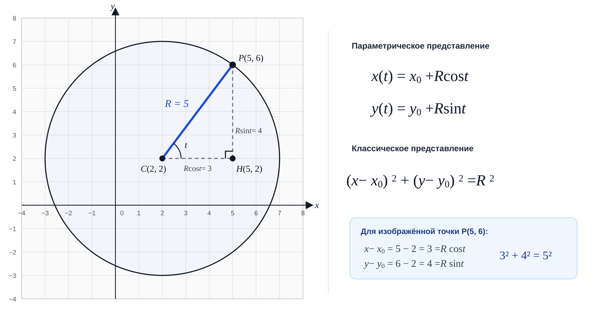
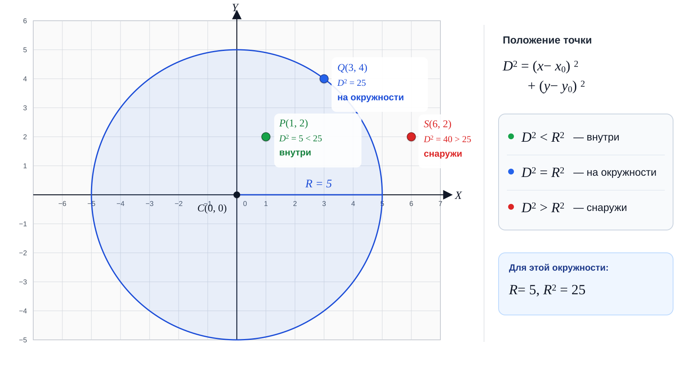
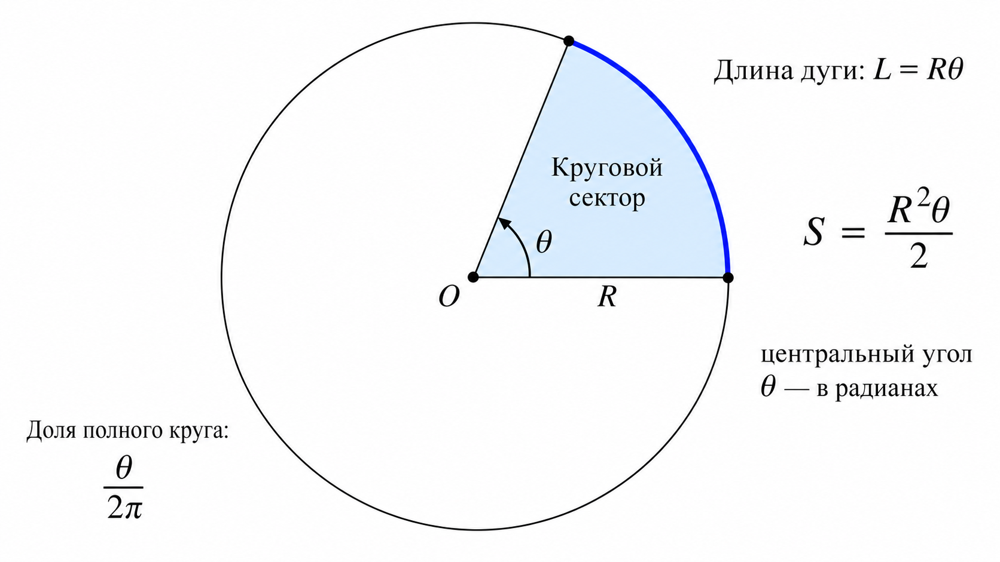
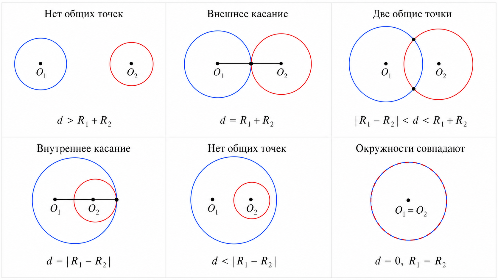
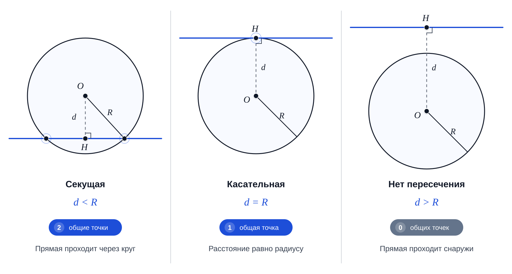

## Глава 3. Окружность и её свойства

В предыдущих главах мы строили наш геометрический мир исключительно из прямых линий и отрезков. Но реальные олимпиадные задачи редко ограничиваются только ими. Рано или поздно на сцену выходят кривые, и самая главная из них — **окружность**. 

Окружность таит в себе множество подводных камней: в отличие от прямых, работа с ней часто провоцирует переход к вещественным числам, извлечению корней и тригонометрии. Однако, как мы убедимся в этой главе, большинство проверок на пересечения и принадлежность можно и нужно выполнять в целых числах, сохраняя абсолютную точность.

## 3.1. Уравнения окружности и её построение

По определению, **окружность** — это множество всех точек плоскости, находящихся на одном и том же расстоянии от заданной точки. Эта точка называется **центром окружности**, а расстояние — её **радиусом**.

Обозначим центр через

$$C(x_0,y_0)$$

а радиус — через $R$. Тогда произвольная точка $P(x,y)$ лежит на окружности в том и только в том случае, если расстояние $CP$ равно $R$.

> [!NOTE]
> Не следует путать окружность и круг. **Окружность** состоит только из точек границы, для которых расстояние до центра равно $R$. **Круг** содержит также все внутренние точки, расстояние от которых до центра не превосходит $R$.

### Классическое уравнение окружности

По формуле расстояния между двумя точками

$$CP=\sqrt{(x-x_0)^2+(y-y_0)^2}$$

Условие $CP=R$ можно записать так:

$$\sqrt{(x-x_0)^2+(y-y_0)^2}=R$$

Поскольку обе части равенства неотрицательны, возведём их в квадрат:

$$\boxed{(x-x_0)^2+(y-y_0)^2=R^2}$$

Это и есть **классическое уравнение окружности** с центром $(x_0,y_0)$ и радиусом $R$.

Например, окружность с центром $C=(2,-1)$ и радиусом $5$ задаётся уравнением

$$(x-2)^2+(y+1)^2=25$$

Проверим точку $P=(5,3)$:

$$(5-2)^2+(3+1)^2=3^2+4^2=25$$

Полученное значение равно $R^2$, следовательно, точка $P$ действительно лежит на окружности.

### Построение окружности по центру и точке

В олимпиадных задачах окружность нередко задаётся не радиусом, а центром $C(x_C,y_C)$ и некоторой точкой $P(x_P,y_P)$ на её границе. В этом случае радиус равен длине вектора $\vec{CP}$:

$$R=\sqrt{(x_P-x_C)^2+(y_P-y_C)^2}$$

Однако извлекать квадратный корень обычно не требуется. Гораздо удобнее сразу вычислить квадрат радиуса:

$$\boxed{R^2=(x_P-x_C)^2+(y_P-y_C)^2}$$

Если координаты $C$ и $P$ целые, то $R^2$ также является целым числом, даже когда сам радиус иррационален. Например, для точек $C=(0,0)$ и $P=(1,1)$ получаем

$$R^2=1^2+1^2=2,\qquad R=\sqrt2$$

Квадрат радиуса хранится точно, тогда как приближённое значение $\sqrt2$ уже содержит вещественную погрешность.

> [!IMPORTANT]
> **Храните квадрат радиуса, а не сам радиус**, если в задаче требуется только проверять принадлежность, пересечение или взаимное расположение объектов.
>
> Переходить от $R^2$ к $R$ с помощью квадратного корня следует лишь тогда, когда радиус или координаты точек действительно нужно вывести.

### Развёрнутое уравнение окружности

Раскроем скобки в классическом уравнении:

$$x^2-2x_0x+x_0^2+y^2-2y_0y+y_0^2=R^2$$

Перенесём всё в левую часть:

$$x^2+y^2-2x_0x-2y_0y+x_0^2+y_0^2-R^2=0$$

Таким образом, окружность можно записать в виде

$$\boxed{x^2+y^2+Dx+Ey+F=0}$$

где

$$D=-2x_0,\qquad E=-2y_0,\qquad F=x_0^2+y_0^2-R^2$$

Верно и обратное. Если дано уравнение

$$x^2+y^2+Dx+Ey+F=0$$

то центр и квадрат радиуса можно восстановить по формулам

$$x_0=-\frac D2,\qquad y_0=-\frac E2$$

$$R^2=\frac{D^2+E^2}{4}-F$$

Если полученное значение $R^2$ отрицательно, уравнение не задаёт ни одной вещественной точки. При $R^2=0$ окружность вырождается в единственную точку — свой центр.

> [!IMPORTANT]
> В развёрнутом уравнении окружности коэффициенты при $x^2$ и $y^2$ одинаковы, а слагаемого $xy$ нет. Произвольное квадратное уравнение от $x$ и $y$ может задавать эллипс, параболу, гиперболу или вырожденную фигуру, а не окружность.

### Параметрическое уравнение окружности

Классическое уравнение удобно для проверки принадлежности точки. Однако, если нужно **получить точку окружности по заданному углу**, используется параметрическая запись.

Проведём из центра вектор длины $R$, образующий угол $t$ с положительным направлением оси $X$. Его горизонтальная и вертикальная составляющие равны

$$R\cos (t)\qquad\text{и}\qquad R\sin (t)$$

Поэтому координаты конца вектора имеют вид

$$\boxed{x(t)=x_0+R\cos (t)}$$

$$\boxed{y(t)=y_0+R\sin (t)}$$

Параметр $t$ измеряется в **радианах**. Когда $t$ пробегает промежуток от $0$ до $2\pi$, точка совершает полный оборот вокруг центра:

* при $t=0$ получаем правую точку окружности $(x_0+R,y_0)$;
* при $t=\frac{\pi}{2}$ — верхнюю точку $(x_0,y_0+R)$;
* при $t=\pi$ — левую точку $(x_0-R,y_0)$;
* при $t=\frac{3\pi}{2}$ — нижнюю точку $(x_0,y_0-R)$.

Проверим, что параметрическая точка действительно удовлетворяет классическому уравнению:

$$x(t)-x_0=R\cos(t),\qquad y(t)-y_0=R\sin(t)$$

Следовательно,

$$(x(t)-x_0)^2+(y(t)-y_0)^2
=R^2\cos^2(t)+R^2\sin^2(t)$$

Вынесем $R^2$ за скобки и применим основное тригонометрическое тождество:

$$R^2(\cos^2(t)+\sin^2(t))=R^2$$

Таким образом, при любом значении $t$ полученная точка лежит на окружности.



Напишем программу, которая получает координаты центра $C$, координаты точки $P$ на окружности и угол $t$ в радианах. Сначала она точно вычисляет $R^2$, а затем использует вещественный радиус только для построения точки окружности, соответствующей углу $t$.

<details>
<summary><strong>C++: построение окружности</strong></summary>

```cpp
#include <bits/stdc++.h>
using namespace std;
void solve() {
    int64_t cx, cy, px, py; long double t;
    cin >> cx >> cy >> px >> py >> t;
    int64_t dx = px - cx, dy = py - cy;
    int64_t r2 = dx * dx + dy * dy;
    long double r = sqrtl(r2);
    long double x = cx + r * cosl(t);
    long double y = cy + r * sinl(t);
    cout << r2 << endl;
    cout << fixed << setprecision(6) << x << ' ' << y << endl;
}
main() {
    ios::sync_with_stdio(false);
    cin.tie(0);
    int tt; cin >> tt;
    while (tt --> 0) solve();
}
```

</details>

<details>
<summary><strong>Python3: построение окружности</strong></summary>

```python
import math

tt = int(input())
for _ in range(tt):
    cx, cy, px, py, t = input().split()
    cx = int(cx)
    cy = int(cy)
    px = int(px)
    py = int(py)
    t = float(t)

    dx = px - cx
    dy = py - cy
    r2 = dx * dx + dy * dy

    r = math.sqrt(r2)
    x = cx + r * math.cos(t)
    y = cy + r * math.sin(t)

    print(r2)
    print(f"{x:.6f} {y:.6f}")
```

</details>

Программа выводит квадрат радиуса, а на следующей строке — координаты точки окружности, соответствующей заданному углу.

<details>
<summary><strong>Пример ввода и вывода</strong></summary>

**Ввод**
```text
3
0 0 3 4 0
5 5 5 10 1.5707963267948966
-2 1 1 5 3.141592653589793
```

**Вывод**
```text
25
5.000000 0.000000
25
5.000000 10.000000
25
-7.000000 1.000000
```

Во всех трёх тестах квадрат радиуса равен $25$, поэтому $R=5$.

В первом тесте угол равен нулю, и программа получает правую точку окружности $(5,0)$. Во втором тесте угол равен $\frac{\pi}{2}$, поэтому получается верхняя точка $(5,10)$. В последнем тесте угол равен $\pi$, и относительно центра $(-2,1)$ мы перемещаемся на пять единиц влево, попадая в точку $(-7,1)$.

</details>

> [!WARNING]
> Точные вычисления в целых числах не защищают от переполнения. Если координаты по модулю не превосходят $10^9$, разность двух координат может достигать $2\cdot10^9$, а сумма квадратов — $8\cdot10^{18}$. Такое значение ещё помещается в `int64_t`, но при более широких ограничениях в C++ понадобится тип `__int128`.
>
> Параметрические координаты, напротив, вычисляются с помощью тригонометрических функций и потому являются приближёнными. Их нельзя без допуска сравнивать на точное равенство.

## 3.2. Положение точки относительно окружности

Классическое уравнение позволяет не только проверить, лежит ли точка на окружности, но и определить её положение относительно окружности.

Пусть дана окружность с центром

$$C(x_0,y_0)$$

и радиусом $R$, а также произвольная точка

$$P(x,y)$$

Вычислим квадрат расстояния между $C$ и $P$:

$$D^2=(x-x_0)^2+(y-y_0)^2$$

Теперь достаточно сравнить $D^2$ с квадратом радиуса $R^2$:

* если $D^2<R^2$, точка находится **строго внутри** окружности;
* если $D^2=R^2$, точка лежит **на окружности**;
* если $D^2>R^2$, точка находится **строго снаружи** окружности.

Иными словами,

$$
\begin{aligned}
D^2<R^2&\Longrightarrow P\text{ внутри},\\
D^2=R^2&\Longrightarrow P\text{ на окружности},\\
D^2>R^2&\Longrightarrow P\text{ снаружи}.
\end{aligned}
$$

Почему это работает? Квадратный корень является возрастающей функцией на неотрицательных числах. Поэтому сравнение расстояния $D$ с радиусом $R$ равносильно сравнению их квадратов:

$$D\lesseqqgtr R\quad\Longleftrightarrow\quad D^2\lesseqqgtr R^2$$

При этом извлекать корень не требуется, а значит, если исходные данные целые, вся проверка выполняется **точно в целых числах**.

> [!NOTE]
> Строго говоря, окружность — это только граница фигуры. Область вместе с её внутренними точками называется **кругом**. Поэтому математически точнее говорить, что точка находится внутри круга или на ограничивающей его окружности. Однако в условиях олимпиадных задач часто встречается привычная формулировка «внутри окружности».

Рассмотрим окружность с центром $C=(0,0)$ и радиусом $5$. Тогда $R^2=25$.

Для точки $P=(1,2)$ получаем

$$D^2=1^2+2^2=5<25$$

поэтому она находится внутри.

Для точки $Q=(3,4)$:

$$D^2=3^2+4^2=25$$

следовательно, она лежит на окружности.

Наконец, для точки $S=(6,2)$:

$$D^2=6^2+2^2=40>25$$

поэтому она находится снаружи.



> [!IMPORTANT]
> Для определения положения точки сам радиус не нужен — достаточно знать $R^2$. Поэтому окружность, построенную по центру и точке на границе, можно обрабатывать без единого вещественного вычисления:
>
> $$R^2=(x_P-x_0)^2+(y_P-y_0)^2$$
>
> После этого квадрат расстояния до любой другой точки сравнивается непосредственно с полученным значением.

### Вырожденный случай

Радиус окружности может быть равен нулю. Тогда

$$R^2=0$$

и классическое уравнение принимает вид

$$(x-x_0)^2+(y-y_0)^2=0$$

Сумма квадратов равна нулю только тогда, когда оба слагаемых равны нулю. Следовательно, такая окружность вырождается в единственную точку $(x_0,y_0)$.

Для вырожденной окружности алгоритм остаётся прежним:

* центр находится на окружности, поскольку $D^2=R^2=0$;
* любая другая точка находится снаружи;
* строго внутренних точек нет.

Таким образом, отдельно обрабатывать нулевой радиус не требуется.

Напишем программу, которая получает центр окружности, квадрат её радиуса и координаты проверяемой точки. Она выводит `INSIDE`, если точка находится строго внутри, `ON`, если она лежит на окружности, и `OUTSIDE`, если она находится снаружи.

<details>
<summary><strong>C++: положение точки относительно окружности</strong></summary>

```cpp
#include <bits/stdc++.h>
using namespace std;
void solve() {
    int64_t cx, cy, r2, x, y;
    cin >> cx >> cy >> r2 >> x >> y;
    int64_t dx = x - cx, dy = y - cy;
    int64_t d2 = dx * dx + dy * dy;
    if (d2 < r2) cout << "INSIDE" << endl;
    else if (d2 == r2) cout << "ON" << endl;
    else cout << "OUTSIDE" << endl;
}
main() {
    ios::sync_with_stdio(false);
    cin.tie(0);
    int tt; cin >> tt;
    while (tt --> 0) solve();
}
```

</details>

<details>
<summary><strong>Python3: положение точки относительно окружности</strong></summary>

```python
tt = int(input())
for _ in range(tt):
    cx, cy, r2, x, y = map(int, input().split())
    dx = x - cx
    dy = y - cy
    d2 = dx * dx + dy * dy
    if d2 < r2:
        print("INSIDE")
    elif d2 == r2:
        print("ON")
    else:
        print("OUTSIDE")
```

</details>

<details>
<summary><strong>Пример ввода и вывода</strong></summary>

**Ввод**
```text
5
0 0 25 1 2
0 0 25 3 4
0 0 25 6 2
2 -1 0 2 -1
2 -1 0 2 0
```

**Вывод**
```text
INSIDE
ON
OUTSIDE
ON
OUTSIDE
```

Первые три теста соответствуют разобранным выше точкам внутри окружности, на ней и снаружи.

В четвёртом и пятом тестах радиус равен нулю. Центр $(2,-1)$ является единственной точкой вырожденной окружности, поэтому он получает ответ `ON`, а соседняя точка $(2,0)$ — ответ `OUTSIDE`.

</details>

> [!WARNING]
> При целочисленных вычислениях необходимо следить за переполнением. Если координаты по модулю не превосходят $10^9$, разность двух координат может достигать $2\cdot10^9$, а сумма квадратов — $8\cdot10^{18}$. Это значение ещё помещается в `int64_t`, но при более широких ограничениях промежуточные вычисления в C++ следует выполнять в типе `__int128`.
>
> Если радиус передаётся в условии как $R$, а не как $R^2$, перед сравнением также нужно аккуратно вычислить его квадрат.

## 3.3. Площадь круга, длина окружности и круговой сектор

До сих пор мы определяли взаимное расположение геометрических объектов, сравнивая квадраты расстояний. Такие проверки удавалось выполнять точно в целых числах. Однако при вычислении площадей и длин дуг появляется число $\pi$, поэтому полностью избежать вещественной арифметики уже не получится.

Для начала уточним терминологию:

* **окружность** — граница, поэтому у неё есть длина;
* **круг** — область внутри окружности вместе с границей, поэтому у него есть площадь.

Для окружности радиуса $R$ её длина равна

$$\boxed{L=2\pi R}$$

а площадь ограниченного ею круга —

$$\boxed{S=\pi R^2}$$

> [!IMPORTANT]
> Выражение «площадь окружности» часто встречается в разговорной речи, но математически корректно говорить **площадь круга**. У самой окружности как у линии есть длина, но нет ненулевой площади.

### Радианы

Чтобы перейти от целого круга к его части, необходимо вспомнить, как измеряются углы.

В программировании тригонометрические функции обычно принимают углы в **радианах**, а не в градусах. Полный оборот соответствует

$$360^\circ=2\pi$$

половина оборота —

$$180^\circ=\pi$$

а четверть оборота —

$$90^\circ=\frac{\pi}{2}$$

Если угол $\alpha$ задан в градусах, перевести его в радианы можно по формуле

$$\boxed{\theta=\alpha\cdot\frac{\pi}{180}}$$

Обратное преобразование имеет вид

$$\boxed{\alpha=\theta\cdot\frac{180}{\pi}}$$

> [!WARNING]
> Одна из самых частых ошибок при работе с окружностями — передать в `sin` или `cos` угол в градусах. Например, для угла $90^\circ$ нельзя вычислять `sin(90)`: сначала необходимо получить $\frac{\pi}{2}$ радиан.

### Длина дуги

Возьмём две точки на окружности и соединим их с центром. Получившиеся радиусы ограничивают **дугу**, а угол между радиусами называется **центральным углом**.

Пусть величина центрального угла равна $\theta$ радиан, причём

$$0\leq\theta\leq2\pi$$

Дуга занимает такую же долю от полной окружности, какую угол $\theta$ составляет от полного оборота $2\pi$:

$$\frac{\theta}{2\pi}$$

Поэтому длина дуги равна

$$L_{\text{дуги}}=2\pi R\cdot\frac{\theta}{2\pi}$$

После сокращения получаем простую формулу:

$$\boxed{L_{\text{дуги}}=R\theta}$$

Эта формула особенно естественна, если вспомнить определение радианной меры: угол в один радиан высекает на окружности дугу, длина которой равна радиусу.

Например, при $R=6$ и $\theta=\frac{\pi}{3}$ длина дуги равна

$$L_{\text{дуги}}=6\cdot\frac{\pi}{3}=2\pi$$

### Площадь кругового сектора

**Круговой сектор** — это часть круга, ограниченная двумя радиусами и дугой между ними.

Как и дуга, сектор составляет долю $\frac{\theta}{2\pi}$ от полного круга. Следовательно, его площадь равна

$$S_{\text{сектора}}=\pi R^2\cdot\frac{\theta}{2\pi}$$

Сократив $\pi$, получаем

$$\boxed{S_{\text{сектора}}=\frac{R^2\theta}{2}}$$

Для того же радиуса $R=6$ и угла $\theta=\frac{\pi}{3}$:

$$S_{\text{сектора}}
=\frac{6^2}{2}\cdot\frac{\pi}{3}
=6\pi$$

Заметим, что обе формулы согласуются с крайними случаями:

* при $\theta=0$ длина дуги и площадь сектора равны нулю;
* при $\theta=2\pi$ получаем полную окружность и полный круг:

$$L_{\text{дуги}}=R\cdot2\pi=2\pi R$$

$$S_{\text{сектора}}=\frac{R^2\cdot2\pi}{2}=\pi R^2$$

> [!NOTE]
> Формулы
>
> $$L_{\text{дуги}}=R\theta,\qquad S_{\text{сектора}}=\frac{R^2\theta}{2}$$
>
> работают именно тогда, когда угол $\theta$ задан **в радианах**. Если угол дан в градусах, его нужно сначала перевести в радианы либо использовать долю $\frac{\alpha}{360^\circ}$ от полной длины или площади.



Напишем программу, которая получает радиус $R$ и центральный угол $\theta$ в радианах, а затем вычисляет площадь сектора и длину соответствующей дуги.

<details>
<summary><strong>C++: площадь сектора и длина дуги</strong></summary>

```cpp
#include <bits/stdc++.h>
using namespace std;
void solve() {
    long double r, theta;
    cin >> r >> theta;
    long double area = r * r * theta / 2;
    long double arcLen = r * theta;
    cout << fixed << setprecision(6) << area << ' ' << arcLen << endl;
}
main() {
    ios::sync_with_stdio(false);
    cin.tie(0);
    int tt; cin >> tt;
    while (tt --> 0) solve();
}
```

</details>

<details>
<summary><strong>Python3: площадь сектора и длина дуги</strong></summary>

```python
tt = int(input())
for _ in range(tt):
    r, theta = map(float, input().split())
    area = r * r * theta / 2
    arc_len = r * theta
    print(f"{area:.6f} {arc_len:.6f}")
```

</details>

Программа выводит сначала площадь сектора, а затем длину его дуги.

<details>
<summary><strong>Пример ввода и вывода</strong></summary>

**Ввод**
```text
4
10 3.141592653589793
5 1
6 1.047197551196598
3 0
```

**Вывод**
```text
157.079633 31.415927
12.500000 5.000000
18.849556 6.283185
0.000000 0.000000
```

В первом тесте угол равен $\pi$, поэтому сектор представляет собой половину круга радиуса $10$. Его площадь равна $50\pi$, а длина дуги — $10\pi$.

Во втором тесте угол равен одному радиану. Именно поэтому длина дуги совпадает с радиусом и равна $5$.

В третьем тесте $\theta=\frac{\pi}{3}$ и $R=6$. Как мы вычислили выше, площадь сектора равна $6\pi$, а длина дуги — $2\pi$.

В последнем тесте угол равен нулю, поэтому сектор вырождается, а обе вычисляемые величины равны нулю.

</details>

> [!WARNING]
> Значения $\pi$, площадей и длин дуг в общем случае нельзя представить точно с помощью двоичной вещественной арифметики. Поэтому ответы обычно выводят с фиксированным количеством знаков после запятой, а проверяющая система сравнивает их с допустимой погрешностью.
>
> Перед реализацией обязательно уточняйте, в каких единицах задан угол. Если в условии используются градусы, преобразуйте их в радианы:
>
> $$\theta=\alpha\cdot\frac{\pi}{180}$$

## 3.4. Пересечение двух окружностей

Рассмотрим две окружности с центрами $O_1$ и $O_2$ и радиусами $R_1$ и $R_2$. Количество их общих точек зависит только от трёх величин:

* расстояния $d$ между центрами;
* суммы радиусов $R_1+R_2$;
* модуля разности радиусов $|R_1-R_2|$.

Обозначим координаты центров через

$$O_1(x_1,y_1),\qquad O_2(x_2,y_2)$$

Тогда расстояние между ними равно

$$d=\sqrt{(x_2-x_1)^2+(y_2-y_1)^2}$$

Геометрически возможны несколько случаев.

### Окружности находятся снаружи друг друга

Если расстояние между центрами больше суммы радиусов,

$$d>R_1+R_2$$

окружности находятся слишком далеко друг от друга и не имеют общих точек.

Действительно, даже если двигаться от первого центра к второму, первая окружность закончится через $R_1$, а вторая начнётся только за $R_2$ до второго центра. Между ними останется ненулевой промежуток.

### Внешнее касание

Если

$$d=R_1+R_2$$

окружности касаются **внешним образом**. У них есть ровно одна общая точка, лежащая на отрезке между центрами.

### Пересечение в двух точках

Если выполняются строгие неравенства

$$|R_1-R_2|<d<R_1+R_2$$

окружности пересекаются ровно в двух точках.

В этом случае центры и любая точка пересечения образуют треугольник со сторонами $R_1$, $R_2$ и $d$. Строгие неравенства — это в точности неравенства треугольника, гарантирующие существование невырожденного треугольника.

### Внутреннее касание

Если

$$d=|R_1-R_2|$$

и окружности не совпадают, меньшая окружность касается большей изнутри. В этом случае у них также есть ровно одна общая точка.

### Одна окружность находится внутри другой

Если

$$d<|R_1-R_2|$$

меньшая окружность находится строго внутри большей, но их границы не соприкасаются. Следовательно, общих точек нет.

> [!IMPORTANT]
> Если один круг находится внутри другого, это ещё не означает, что соответствующие **окружности** пересекаются. Окружность состоит только из границы. При строгом неравенстве $d<|R_1-R_2|$ одна граница целиком находится внутри другой и не касается её.

### Совпадающие окружности

Отдельно необходимо рассмотреть случай

$$d=0,\qquad R_1=R_2$$

Центры и радиусы совпадают, поэтому обе записи задают одну и ту же окружность. Если общий радиус положителен, окружности имеют бесконечно много общих точек.

Этот случай обязательно нужно проверить **до** проверки касания. Иначе равенства

$$d=0=|R_1-R_2|$$

могут привести к ошибочному выводу о том, что совпадающие окружности касаются в одной точке.

Соберём все случаи вместе:

| Условие | Количество общих точек |
|---|---:|
| $d>R_1+R_2$ | $0$ |
| $d=R_1+R_2$ | $1$ |
| $\|R_1-R_2\|<d<R_1+R_2$ | $2$ |
| $d=\|R_1-R_2\|$, окружности не совпадают | $1$ |
| $d<\|R_1-R_2\|$ | $0$ |
| $d=0$ и $R_1=R_2>0$ | бесконечно много |



### Как избежать квадратного корня

Для определения количества общих точек само расстояние $d$ вычислять не обязательно. Как и раньше, удобнее работать с его квадратом:

$$d^2=(x_2-x_1)^2+(y_2-y_1)^2$$

Обозначим

$$S=R_1+R_2,\qquad D=|R_1-R_2|$$

Все эти величины неотрицательны, поэтому сравнения можно безопасно возвести в квадрат:

$$d\lesseqqgtr S\quad\Longleftrightarrow\quad d^2\lesseqqgtr S^2$$

$$d\lesseqqgtr D\quad\Longleftrightarrow\quad d^2\lesseqqgtr D^2$$

Следовательно, алгоритм будет сравнивать три целых числа:

$$d^2,\qquad (R_1+R_2)^2,\qquad (R_1-R_2)^2$$

Ни квадратный корень, ни вещественные числа для этого не нужны.

Порядок проверок важен:

1. Если центры и положительные радиусы совпадают, общих точек бесконечно много.
2. Если $d^2>(R_1+R_2)^2$ или $d^2<(R_1-R_2)^2$, общих точек нет.
3. Если $d^2=(R_1+R_2)^2$ или $d^2=(R_1-R_2)^2$, существует ровно одна общая точка.
4. В остальных случаях существуют ровно две общие точки.

> [!IMPORTANT]
> Возведение в квадрат сохраняет направление сравнений только потому, что расстояние и радиусы неотрицательны. В общем случае из сравнения произвольных чисел нельзя без дополнительных условий переходить к сравнению их квадратов.

### Нулевой радиус

Если разрешён радиус $R=0$, окружность вырождается в одну точку — свой центр.

Основной алгоритм продолжает работать почти без изменений:

* две совпадающие вырожденные окружности имеют одну общую точку;
* вырожденная окружность и обычная окружность имеют одну общую точку, если центр первой лежит на второй;
* в остальных случаях у них нет общих точек.

Поэтому случай $d=0$ и $R_1=R_2=0$ нельзя обозначать как бесконечное количество пересечений. Множество общих точек в нём состоит только из одного центра.

Напишем программу, которая выводит количество общих точек: `0`, `1`, `2` или `INFINITE`.

<details>
<summary><strong>C++: количество точек пересечения двух окружностей</strong></summary>

```cpp
#include <bits/stdc++.h>
using namespace std;
void solve() {
    int64_t x1, y1, r1, x2, y2, r2;
    cin >> x1 >> y1 >> r1 >> x2 >> y2 >> r2;
    __int128 dx = (__int128)x2 - x1;
    __int128 dy = (__int128)y2 - y1;
    __int128 d2 = dx * dx + dy * dy;
    __int128 sum = (__int128)r1 + r2;
    __int128 diff = (__int128)r1 - r2;
    if (diff < 0) diff = -diff;
    if (d2 == 0 && r1 == r2) {
        if (r1 == 0) cout << 1 << endl;
        else cout << "INFINITE" << endl;
    } else if (d2 > sum * sum || d2 < diff * diff) cout << 0 << endl;
    else if (d2 == sum * sum || d2 == diff * diff) cout << 1 << endl;
    else cout << 2 << endl;
}
main() {
    ios::sync_with_stdio(false);
    cin.tie(0);
    int tt; cin >> tt;
    while (tt --> 0) solve();
}
```

</details>

<details>
<summary><strong>Python3: количество точек пересечения двух окружностей</strong></summary>

```python
tt = int(input())
for _ in range(tt):
    x1, y1, r1, x2, y2, r2 = map(int, input().split())

    dx = x2 - x1
    dy = y2 - y1
    d2 = dx * dx + dy * dy
    sum_r = r1 + r2
    diff_r = abs(r1 - r2)

    if d2 == 0 and r1 == r2:
        if r1 == 0:
            print(1)
        else:
            print("INFINITE")
    elif d2 > sum_r * sum_r or d2 < diff_r * diff_r:
        print(0)
    elif d2 == sum_r * sum_r or d2 == diff_r * diff_r:
        print(1)
    else:
        print(2)
```

</details>

<details>
<summary><strong>Пример ввода и вывода</strong></summary>

**Ввод**
```text
7
0 0 5 11 0 5
0 0 5 10 0 5
0 0 5 6 0 5
0 0 5 3 0 2
0 0 5 1 0 2
0 0 5 0 0 5
2 3 0 2 3 0
```

**Вывод**
```text
0
1
2
1
0
INFINITE
1
```

В первом тесте расстояние между центрами равно $11$, а сумма радиусов — $10$, поэтому окружности не пересекаются.

Во втором тесте $d=R_1+R_2=10$: происходит внешнее касание.

В третьем тесте выполняется неравенство

$$|R_1-R_2|<d<R_1+R_2$$

поэтому окружности имеют две общие точки.

В четвёртом тесте $d=|R_1-R_2|=3$, что соответствует внутреннему касанию. В пятом тесте меньшая окружность находится строго внутри большей и не касается её.

В шестом тесте центры и положительные радиусы совпадают, поэтому общих точек бесконечно много. Последний тест содержит две совпадающие вырожденные окружности: обе состоят из одной и той же точки.

</details>

> [!WARNING]
> Даже отказ от вещественных чисел не защищает от целочисленного переполнения. Опасны не только квадраты разностей координат, но и выражение $(R_1+R_2)^2$: сумма может переполниться ещё до возведения в квадрат.
>
> В приведённой реализации C++ разности координат и радиусы преобразуются в `__int128` **до** выполнения арифметических операций. Необходимость такого типа всегда определяется ограничениями конкретной задачи.

## 3.5. Пересечение прямой и окружности

Рассмотрим прямую

$$Ax+By+C=0$$

и окружность с центром

$$O(x_0,y_0)$$

и радиусом $R$.

Чтобы определить количество их общих точек, достаточно найти кратчайшее расстояние $d$ от центра окружности до прямой. Из второй главы мы знаем формулу

$$d=\frac{|Ax_0+By_0+C|}{\sqrt{A^2+B^2}}$$

Дальнейшая геометрия зависит только от сравнения $d$ и $R$.

### Прямая не пересекает окружность

Если

$$d>R$$

все точки прямой находятся от центра дальше, чем точки окружности. Следовательно, прямая проходит снаружи и не имеет с окружностью общих точек.

### Прямая касается окружности

Если

$$d=R$$

кратчайшее расстояние от центра до прямой равно радиусу. Основание перпендикуляра, опущенного из центра на прямую, лежит на окружности.

В этом случае прямая имеет с окружностью ровно одну общую точку и называется **касательной**.

### Прямая пересекает окружность в двух точках

Если

$$d \lt R$$

прямая проходит через внутреннюю область круга. Входя в круг и выходя из него, она пересекает окружность в двух различных точках. Такая прямая называется **секущей**.

Итак,

| Условие | Положение прямой | Количество общих точек |
|---|---|---:|
| $d>R$ | проходит снаружи | $0$ |
| $d=R$ | касается окружности | $1$ |
| $d<R$ | пересекает окружность | $2$ |

> [!IMPORTANT]
> Мы сравниваем расстояние до прямой именно с **радиусом**, а не с диаметром. Кроме того, речь идёт о бесконечной прямой. Для луча или отрезка одной проверки расстояния недостаточно: найденные точки пересечения могут оказаться за пределами рассматриваемого объекта.



### Проверка без квадратного корня

Непосредственно вычислять расстояние $d$ неудобно: формула содержит модуль, квадратный корень и деление. Однако для определения количества точек пересечения само значение расстояния нам не требуется — достаточно сравнить его с радиусом.

Начнём с условия

$$\frac{|Ax_0+By_0+C|}{\sqrt{A^2+B^2}}\lesseqqgtr R$$

Знаменатель положителен, поскольку коэффициенты $A$ и $B$ не могут одновременно равняться нулю. Умножим обе части на него:

$$|Ax_0+By_0+C|\lesseqqgtr R\sqrt{A^2+B^2}$$

Обе части неотрицательны, поэтому их можно возвести в квадрат, не изменяя направление сравнения:

$$\boxed{(Ax_0+By_0+C)^2\lesseqqgtr R^2(A^2+B^2)}$$

Обозначим

$$L=(Ax_0+By_0+C)^2$$

$$Q=R^2(A^2+B^2)$$

Тогда:

* если $L>Q$, общих точек нет;
* если $L=Q$, прямая касается окружности;
* если $L<Q$, прямая пересекает окружность в двух точках.

Таким образом, при целочисленных исходных данных количество точек пересечения можно определить **точно**, не используя вещественные числа.

> [!NOTE]
> Модуль в исходной формуле исчезает после возведения в квадрат:
>
> $$|z|^2=z^2$$
>
> Поэтому отдельно вычислять абсолютное значение выражения $Ax_0+By_0+C$ не требуется.

### Если прямая задана двумя точками

На практике прямая часто задаётся двумя различными точками

$$A(x_1,y_1),\qquad B(x_2,y_2)$$

Её направляющий вектор равен

$$\vec v=(v_x,v_y)=(x_2-x_1,y_2-y_1)$$

Как мы выяснили во второй главе, коэффициенты общего уравнения можно выбрать следующим образом:

$$A=-v_y,\qquad B=v_x$$

$$C=v_yx_1-v_xy_1$$

После подстановки центра окружности $O(x_0,y_0)$ получаем

$$Ax_0+By_0+C
=-v_y(x_0-x_1)+v_x(y_0-y_1)$$

Правая часть совпадает с векторным произведением

$$\vec{AB}\times\vec{AO}$$

Кроме того,

$$A^2+B^2=v_x^2+v_y^2=|\vec{AB}|^2$$

Поэтому проверку можно записать без явного построения общего уравнения:

$$\boxed{(\vec{AB}\times\vec{AO})^2
\lesseqqgtr R^2|\vec{AB}|^2}$$

Эта форма особенно удобна в программе. Она использует уже знакомые операции над векторами и не требует отдельно хранить коэффициенты прямой.

> [!IMPORTANT]
> Значение $\vec{AB}\times\vec{AO}$ связано с площадью параллелограмма на векторах $\vec{AB}$ и $\vec{AO}$. Его модуль равен произведению длины основания $AB$ на высоту, то есть на расстояние от $O$ до прямой:
>
> $$|\vec{AB}\times\vec{AO}|=|\vec{AB}|\cdot d$$
>
> После возведения в квадрат сравнение с радиусом принимает именно полученную выше форму.

### Нулевой радиус

Если $R=0$, окружность вырождается в одну точку — свой центр.

В таком случае возможны только два результата:

* если центр лежит на прямой, существует одна общая точка;
* если центр не лежит на прямой, общих точек нет.

Обычное сравнение почти полностью обрабатывает этот случай. При $R=0$ правая часть равна нулю:

$$R^2(A^2+B^2)=0$$

Если левая часть также равна нулю, центр лежит на прямой и ответ равен $1$. Если левая часть положительна, ответ равен $0$. Результат $2$ для нулевого радиуса невозможен.

### Реализация

Пусть прямая задана двумя различными точками $A$ и $B$, а окружность — центром $O$ и радиусом $R$. Вычислим векторное произведение

$$v=\vec{AB}\times\vec{AO}$$

и квадрат длины направляющего вектора

$$l^2=|\vec{AB}|^2$$

После этого сравним

$$v^2\quad\text{и}\quad R^2l^2$$

<details>
<summary><strong>C++: количество точек пересечения прямой и окружности</strong></summary>

```cpp
#include <bits/stdc++.h>
using namespace std;
void solve() {
    int64_t x1, y1, x2, y2, cx, cy, r;
    cin >> x1 >> y1 >> x2 >> y2;
    cin >> cx >> cy >> r;
    __int128 vx = (__int128)x2 - x1;
    __int128 vy = (__int128)y2 - y1;
    __int128 wx = (__int128)cx - x1;
    __int128 wy = (__int128)cy - y1;
    __int128 cross = vx * wy - vy * wx;
    __int128 len2 = vx * vx + vy * vy;
    __int128 r2 = (__int128)r * r;
    __int128 left = cross * cross;
    __int128 right = r2 * len2;
    if (left > right) cout << 0 << endl;
    else if (left == right) cout << 1 << endl;
    else cout << 2 << endl;
}
main() {
    ios::sync_with_stdio(false);
    cin.tie(0);
    int tt; cin >> tt;
    while (tt --> 0) solve();
}
```

</details>

<details>
<summary><strong>Python3: количество точек пересечения прямой и окружности</strong></summary>

```python
tt = int(input())
for _ in range(tt):
    x1, y1, x2, y2 = map(int, input().split())
    cx, cy, r = map(int, input().split())

    vx = x2 - x1
    vy = y2 - y1
    wx = cx - x1
    wy = cy - y1

    cross = vx * wy - vy * wx
    len2 = vx * vx + vy * vy
    left = cross * cross
    right = r * r * len2

    if left > right:
        print(0)
    elif left == right:
        print(1)
    else:
        print(2)
```

</details>

<details>
<summary><strong>Пример ввода и вывода</strong></summary>

**Ввод**
```text
5
-5 0 5 0
0 0 5
-5 5 5 5
0 0 5
-5 6 5 6
0 0 5
0 -10 0 10
3 0 3
-2 1 4 1
0 1 0
```

**Вывод**
```text
2
1
0
1
1
```

В первом тесте прямая совпадает с осью $X$ и проходит через центр окружности. Расстояние от центра до прямой равно нулю, поэтому прямая пересекает окружность в двух точках.

Во втором тесте прямая $y=5$ находится от центра на расстоянии, равном радиусу. Она касается окружности в точке $(0,5)$.

В третьем тесте расстояние от центра до прямой $y=6$ больше радиуса, поэтому общих точек нет.

Четвёртый тест демонстрирует вертикальную касательную. Окружность имеет центр $(3,0)$ и радиус $3$, а прямая $x=0$ касается её в одной точке.

В последнем тесте радиус равен нулю. Вырожденная окружность состоит из точки $(0,1)$, которая лежит на прямой $y=1$, поэтому существует одна общая точка.

</details>

> [!WARNING]
> Точки $A$ и $B$ должны быть различными. Если $A=B$, направляющий вектор будет нулевым, а заданный объект окажется точкой, а не прямой. В этом случае выражение $A^2+B^2$ в формуле расстояния также станет равным нулю.
>
> Не забывайте и о переполнении. После вычисления векторного произведения результат возводится в квадрат, поэтому значения могут расти очень быстро. В приведённой реализации C++ промежуточные вычисления выполняются в типе `__int128`. Однако и этот тип не имеет неограниченной вместимости: перед решением задачи всегда оценивайте максимальные значения по ограничениям.

## 3.6. Итоги третьей главы

В этой главе мы перешли от прямых линий к первой важной кривой — окружности.

Сначала мы получили её классическое уравнение

$$(x-x_0)^2+(y-y_0)^2=R^2$$

и выяснили, почему в задачах с целыми координатами выгодно хранить именно **квадрат радиуса**. Это позволяет проверять принадлежность точки и её положение относительно окружности без извлечения квадратного корня.

Затем мы познакомились с параметрическим представлением

$$x(t)=x_0+R\cos (t),\qquad y(t)=y_0+R\sin (t)$$

Оно позволяет получать точки окружности по углу, хотя из-за тригонометрических функций требует вещественной арифметики.

Работая с длинами дуг и площадями секторов, мы получили формулы

$$L_{\text{дуги}}=R\theta$$

$$S_{\text{сектора}}=\frac{R^2\theta}{2}$$

и ещё раз убедились, что в программировании углы обычно измеряются в **радианах**.

Наконец, мы разобрали взаимное расположение двух окружностей и пересечение окружности с прямой. Главный приём в обоих случаях оказался одним и тем же: вместо расстояний следует сравнивать **квадраты расстояний**. Благодаря этому корни, деления и вещественная погрешность исчезают из проверок.

> [!IMPORTANT]
> Основной принцип этой главы можно сформулировать так:
>
> **если от геометрической задачи требуется только сравнение расстояний, не вычисляйте сами расстояния — сравнивайте их квадраты.**

При этом целочисленная арифметика требует не меньшей аккуратности, чем вещественная. Она избавляет от погрешности, но не защищает от переполнения. Поэтому перед выбором типа данных необходимо оценивать не только исходные координаты, но и значения после умножения и возведения в квадрат.

На этом изучение окружностей не заканчивается: в более сложных задачах встречаются общие хорды, касательные, точки пересечения и описанные окружности. Часть этих конструкций естественным образом связана с другими фигурами.

В следующей главе мы перейдём к **треугольникам, прямоугольникам и многоугольникам**. Уже изученные векторы, прямые, расстояния и окружности станут инструментами для вычисления площадей, проверки принадлежности точки фигуре и исследования её границ.