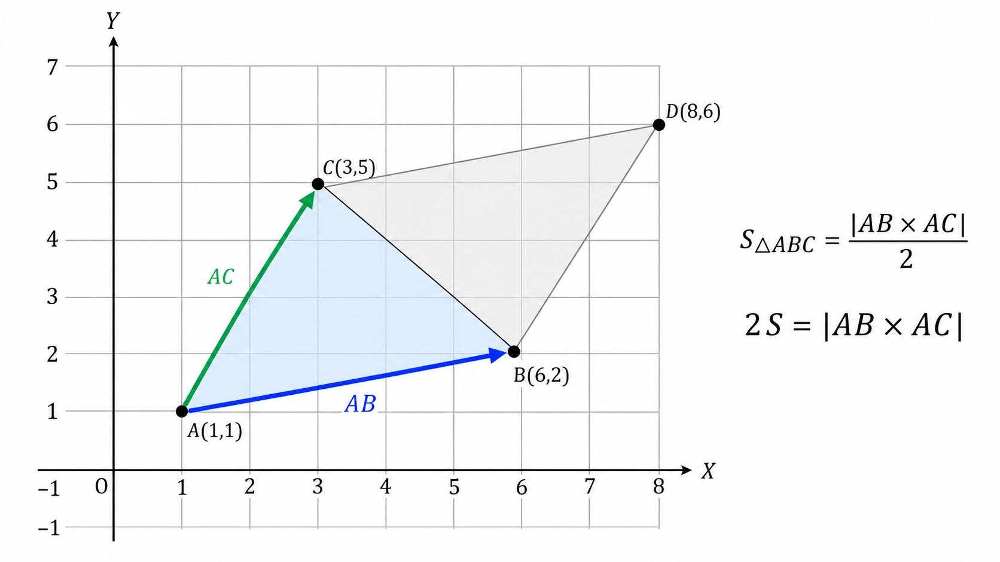
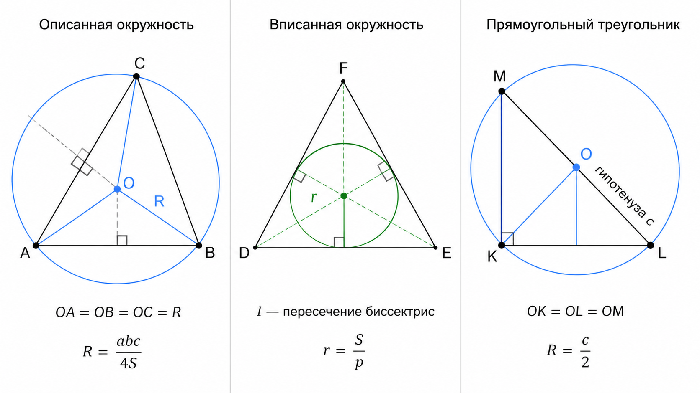
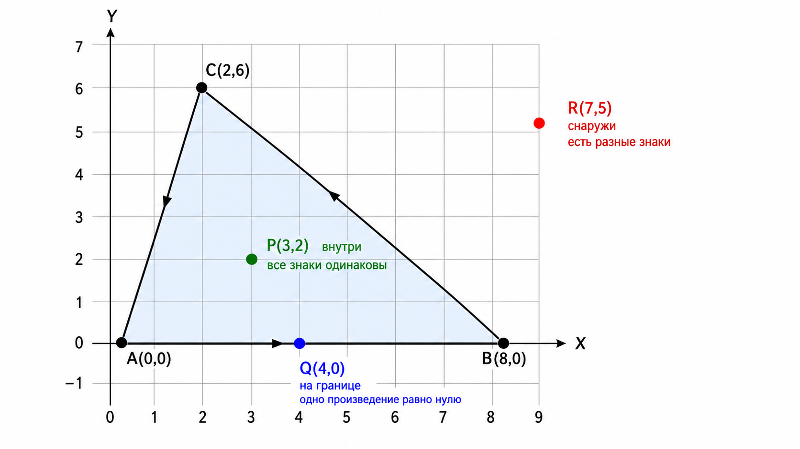
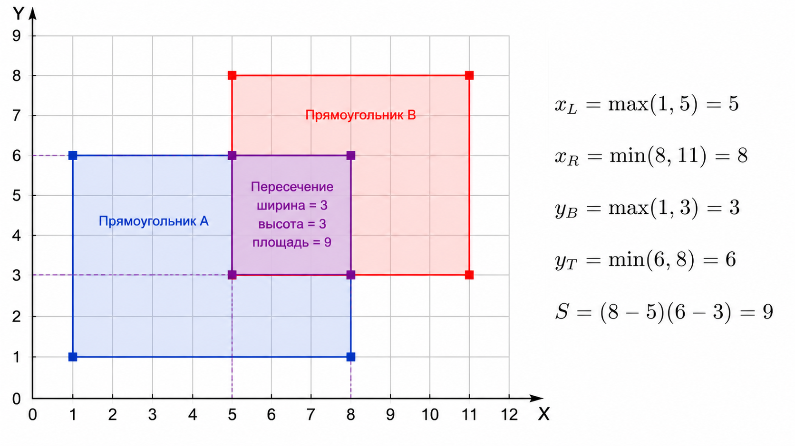
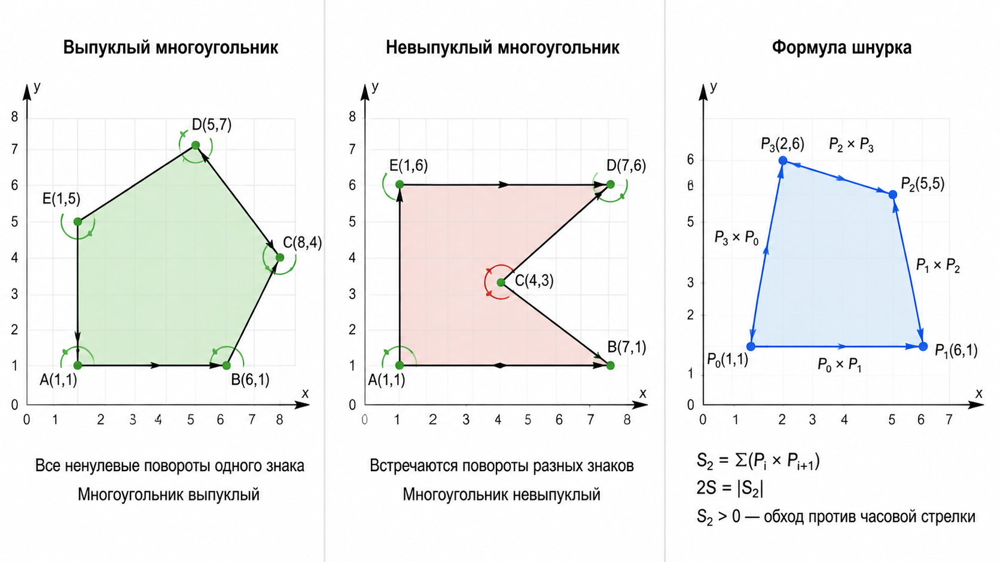
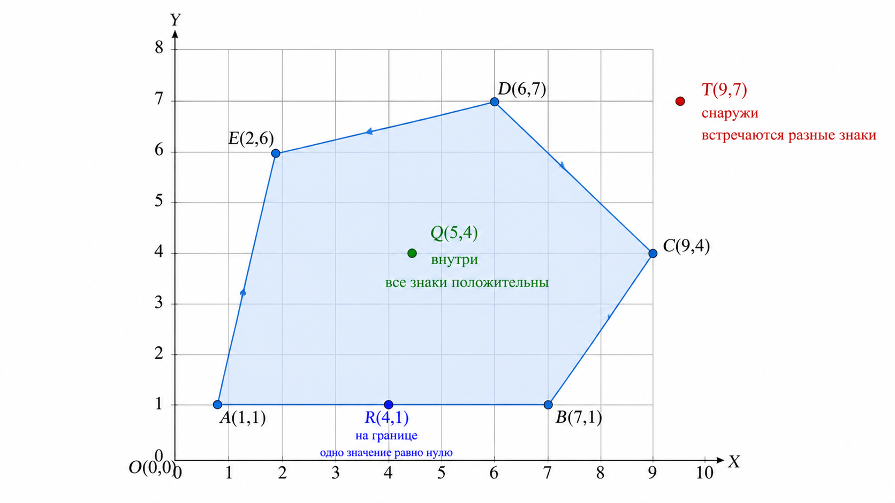

## Глава 4. Многоугольники: от треугольника до формулы шнурка

В предыдущих главах мы последовательно изучили основные строительные блоки вычислительной геометрии: точки, векторы, отрезки, прямые и окружности. Теперь пришло время объединить их в замкнутые фигуры — **многоугольники**.

Мы начнём с треугольника — простейшего невырожденного многоугольника. Затем разберём прямоугольники со сторонами, параллельными осям координат, а после этого перейдём к произвольным многоугольникам, их ориентации, площади и проверке принадлежности точки.

Главными инструментами снова станут уже знакомые операции:

* векторное произведение поможет вычислять площади и определять сторону поворота;
* сравнение целых чисел позволит обойтись без вещественной погрешности;
* циклический обход вершин свяжет отдельные рёбра в единую границу;
* формула шнурка обобщит формулу площади треугольника на произвольный простой многоугольник.

> [!NOTE]
> В этой главе важно различать **многоугольник** и ограниченную им область. В олимпиадных условиях словом «многоугольник» нередко называют сразу всю фигуру вместе с внутренностью. Если различие существенно для задачи, это обычно уточняется отдельно.

## 4.1. Существование и площадь треугольника

Треугольник задаётся тремя вершинами и соединяющими их сторонами. Если вершины не лежат на одной прямой, треугольник называется **невырожденным**. Если все три вершины коллинеарны, его площадь равна нулю, и такой треугольник называют **вырожденным**.

В задачах треугольник может быть задан двумя основными способами:

* длинами трёх сторон;
* координатами трёх вершин.

В первом случае обычно требуется проверить, существует ли невырожденный треугольник. Во втором — найти его площадь или определить, вырожден ли он.

### Неравенство треугольника

Пусть заданы три положительные длины:

$$a,\qquad b,\qquad c$$

Из них можно составить невырожденный треугольник тогда и только тогда, когда каждая сторона строго меньше суммы двух остальных:

$$a+b \gt c$$

$$a+c \gt b$$

$$b+c \gt a$$

Строгость здесь принципиальна. Если, например,

$$a+b=c$$

то две стороны полностью укладываются вдоль третьей. Замкнутая фигура имеет нулевую высоту и превращается в отрезок, поэтому треугольник является вырожденным.

Если же

$$a+b \lt c$$

двух меньших отрезков не хватает, чтобы соединить концы стороны длины $c$. Даже вырожденного треугольника построить нельзя.

> [!IMPORTANT]
> Для существования **невырожденного** треугольника нужны строгие неравенства. Замена `>` на `>=` ошибочно разрешит случай, в котором площадь равна нулю.

На первый взгляд необходимо проверить все три неравенства. Однако после сортировки сторон

$$a\le b\le c$$

достаточно проверить только

$$a+b \gt c$$

Действительно, два остальных неравенства выполняются автоматически:

$$a+c \gt b,\qquad b+c \gt a$$

поскольку все длины положительны, а $c$ является наибольшей стороной.

Например, из отрезков длины $3$, $4$ и $5$ можно составить треугольник:

$$3+4 \gt 5$$

Для длин $2$, $3$ и $5$ получаем равенство

$$2+3=5$$

поэтому треугольник вырожден. Наконец, для длин $1$, $2$ и $5$ выполняется

$$1+2 \lt 5$$

и замкнуть три отрезка невозможно.

> [!WARNING]
> Перед проверкой убедитесь, что длины сторон положительны. Нулевая или отрицательная длина не может быть стороной обычного треугольника.
>
> Кроме того, сумма двух длин может переполнить выбранный тип. Если стороны хранятся в `int64_t` и могут быть близки к его пределу, сравнение безопаснее записать в более широком типе, а не заменять его выражением `a > c - b` без анализа ограничений.

<details>
<summary><strong>C++: проверка существования треугольника</strong></summary>

```cpp
#include <bits/stdc++.h>
using namespace std;
void solve() {
    int64_t a, b, c; cin >> a >> b >> c;
    if (a > 0 && b > 0 && c > 0 && (__int128)a + b > c && (__int128)a + c > b && (__int128)b + c > a) cout << "YES" << endl;
    else cout << "NO" << endl;
}
main() {
    ios::sync_with_stdio(false);
    cin.tie(0);
    int tt; cin >> tt;
    while (tt --> 0) solve();
}
```

</details>

<details>
<summary><strong>Python3: проверка существования треугольника</strong></summary>

```python
tt = int(input())
for _ in range(tt):
    a, b, c = map(int, input().split())
    if a > 0 and b > 0 and c > 0 and a + b > c and a + c > b and b + c > a:
        print("YES")
    else:
        print("NO")
```

</details>

<details>
<summary><strong>Пример ввода и вывода</strong></summary>

**Ввод**
```text
4
3 4 5
2 3 5
1 2 5
7 7 7
```

**Вывод**
```text
YES
NO
NO
YES
```

В первом тесте существует прямоугольный треугольник со сторонами $3$, $4$ и $5$. Во втором тесте сумма двух меньших сторон равна третьей, поэтому треугольник вырожден. В третьем тесте отрезки невозможно замкнуть. Последний тест задаёт равносторонний треугольник.

</details>

### Площадь треугольника по координатам

Теперь пусть треугольник задан координатами вершин:

$$A(x_A,y_A),\qquad B(x_B,y_B),\qquad C(x_C,y_C)$$

Из точки $A$ проведём два вектора:

$$\vec{AB}=(x_B-x_A,y_B-y_A)$$

$$\vec{AC}=(x_C-x_A,y_C-y_A)$$

Модуль их векторного произведения равен площади параллелограмма, построенного на этих векторах:

$$\left|\vec{AB}\times\vec{AC}\right|$$

Диагональ делит такой параллелограмм на два равных треугольника. Следовательно, площадь треугольника $ABC$ равна

$$\boxed{S=\frac{\left|\vec{AB}\times\vec{AC}\right|}{2}}$$

В координатах эта формула принимает вид

$$\boxed{S=\frac{\left|(x_B-x_A)(y_C-y_A)-(y_B-y_A)(x_C-x_A)\right|}{2}}$$

Школьная формула Герона также позволяет найти площадь по трём сторонам, однако для координатной задачи она требует сначала вычислить длины сторон, затем полупериметр и квадратный корень. Векторное произведение даёт результат напрямую и при целых координатах сохраняет точность.

> [!IMPORTANT]
> В олимпиадных задачах часто требуется вывести **удвоенную площадь**
>
> $$\boxed{2S=\left|\vec{AB}\times\vec{AC}\right|}$$
>
> При целочисленных координатах значение $2S$ всегда целое. Сама площадь при этом может быть как целой, так и полуцелой, например $7.5$.

### Ориентированная площадь

Если не брать модуль, получим **удвоенную ориентированную площадь**:

$$S_2^{\mathrm{or}}=\vec{AB}\times\vec{AC}$$

Её знак показывает порядок расположения вершин:

* если $S_2^{\mathrm{or}} \gt 0$, точка $C$ находится слева от направленной прямой $AB$, а вершины $A,B,C$ идут против часовой стрелки;
* если $S_2^{\mathrm{or}} \lt 0$, точка $C$ находится справа от направленной прямой $AB$, а вершины идут по часовой стрелке;
* если $S_2^{\mathrm{or}}=0$, точки коллинеарны и треугольник вырожден.

Таким образом, одно векторное произведение одновременно позволяет:

1. проверить вырожденность треугольника;
2. определить ориентацию тройки точек;
3. найти удвоенную площадь.

Рассмотрим вершины

$$A=(0,0),\qquad B=(5,0),\qquad C=(0,5)$$

Тогда

$$\vec{AB}=(5,0),\qquad \vec{AC}=(0,5)$$

и

$$\vec{AB}\times\vec{AC}=5\cdot5-0\cdot0=25$$

Следовательно,

$$2S=25,\qquad S=\frac{25}{2}=12.5$$

Положительный знак также показывает, что вершины $A,B,C$ перечислены против часовой стрелки.



Напишем программу, которая по координатам трёх вершин выводит удвоенную площадь треугольника. Для этого достаточно вычислить модуль одного векторного произведения.

<details>
<summary><strong>C++: удвоенная площадь треугольника</strong></summary>

```cpp
#include <bits/stdc++.h>
using namespace std;
struct Point {
    int64_t x, y;
};
void solve() {
    Point a, b, c;
    cin >> a.x >> a.y >> b.x >> b.y >> c.x >> c.y;
    int64_t x1 = b.x - a.x, y1 = b.y - a.y;
    int64_t x2 = c.x - a.x, y2 = c.y - a.y;
    int64_t area2 = abs(x1 * y2 - y1 * x2);
    cout << area2 << endl;
}
main() {
    ios::sync_with_stdio(false);
    cin.tie(0);
    int tt; cin >> tt;
    while (tt --> 0) solve();
}
```

</details>

<details>
<summary><strong>Python3: удвоенная площадь треугольника</strong></summary>

```python
tt = int(input())
for _ in range(tt):
    ax, ay, bx, by, cx, cy = map(int, input().split())
    x1 = bx - ax
    y1 = by - ay
    x2 = cx - ax
    y2 = cy - ay
    area2 = abs(x1 * y2 - y1 * x2)
    print(area2)
```

</details>

<details>
<summary><strong>Пример ввода и вывода</strong></summary>

**Ввод**
```text
4
0 0 0 5 5 0
1 1 4 5 7 9
0 0 3 0 0 5
-2 -1 4 2 1 6
```

**Вывод**
```text
25
0
15
33
```

В первом тесте удвоенная площадь равна $25$, поэтому обычная площадь равна $12.5$.

Во втором тесте точки лежат на одной прямой. Векторное произведение равно нулю, а треугольник вырожден.

В третьем тесте получается прямоугольный треугольник с катетами $3$ и $5$, поэтому его площадь равна $7.5$, а удвоенная площадь — $15$.

В последнем тесте

$$\vec{AB}=(6,3),\qquad \vec{AC}=(3,7)$$

поэтому

$$2S=\left|6\cdot7-3\cdot3\right|=33$$

</details>

> [!WARNING]
> При координатах порядка $10^9$ разности координат могут достигать $2\cdot10^9$, а отдельные произведения — $4\cdot10^{18}$. Разность двух таких произведений может не поместиться в `int64_t`.
>
> Перед реализацией оценивайте ограничения задачи. Если диапазона `int64_t` недостаточно, вычисляйте векторное произведение в типе `__int128`.

## 4.2. Углы, окружности и прямоугольные треугольники

Площадь и ориентацию треугольника удобно находить с помощью векторного произведения. Однако в некоторых задачах требуется определить вид треугольника, вычислить его углы или построить связанную с ним окружность.

Обозначим стороны треугольника, лежащие напротив углов $\alpha$, $\beta$ и $\gamma$, через $a$, $b$ и $c$ соответственно.

### Теорема синусов

Для любого невырожденного треугольника выполняется **теорема синусов**:

$$\boxed{\frac{a}{\sin(\alpha)}=\frac{b}{\sin(\beta)}=\frac{c}{\sin(\gamma)}=2R}$$

Здесь $R$ — радиус окружности, описанной около треугольника.

Из этой формулы можно, например, выразить синус угла:

$$\sin(\alpha)=\frac{a}{2R}$$

или радиус описанной окружности:

$$R=\frac{a}{2\sin(\alpha)}$$

Теорема синусов связывает стороны, углы и описанную окружность, однако в программе применять её следует осторожно. Вычисление синусов и обратных тригонометрических функций требует вещественной арифметики.

Кроме того, по одному значению синуса нельзя однозначно восстановить угол на промежутке от $0$ до $\pi$: углы $\alpha$ и $\pi-\alpha$ имеют одинаковый синус.

> [!WARNING]
> Тригонометрические функции стандартных библиотек C++ и Python принимают углы в **радианах**. Если угол дан в градусах, его необходимо предварительно преобразовать:
>
> $$\alpha_{\text{рад}}=\alpha_{\text{град}}\cdot\frac{\pi}{180}$$

### Теорема косинусов

Для вычисления углов по трём сторонам обычно удобнее использовать **теорему косинусов**:

$$
c^2=a^2+b^2-2ab\cos(\gamma)
$$

Отсюда

$$\cos(\gamma)=\frac{a^2+b^2-c^2}{2ab}$$

и

$$\gamma=\arccos\left(\frac{a^2+b^2-c^2}{2ab}\right)$$

В программном коде из-за накопившейся погрешности вычисленное значение косинуса иногда оказывается немного меньше $-1$ или немного больше $1$. Перед вызовом функции $\arccos(x)$ его полезно ограничить промежутком $[-1,1]$:

```cpp
cosValue = max(-1.0L, min(1.0L, cosValue));
```

> [!IMPORTANT]
> Если требуется лишь определить, является угол острым, прямым или тупым, вычислять сам угол через $\arccos(x)$ не нужно. Это можно сделать точным сравнением квадратов сторон.

### Классификация треугольника по углам

Пусть стороны треугольника отсортированы так, что

$$a\le b\le c$$

Тогда угол $\gamma$, лежащий напротив наибольшей стороны $c$, является наибольшим углом треугольника. Из теоремы косинусов:

$$\cos(\gamma)=\frac{a^2+b^2-c^2}{2ab}$$

Поскольку стороны положительны, знаменатель $2ab$ положителен. Поэтому знак $\cos(\gamma)$ определяется знаком выражения

$$a^2+b^2-c^2$$

Возможны три случая:

* если $a^2+b^2 \gt c^2$, то $\cos(\gamma) \gt 0$, угол $\gamma$ острый и треугольник **остроугольный**;
* если $a^2+b^2=c^2$, то $\cos(\gamma)=0$, угол $\gamma$ прямой и треугольник **прямоугольный**;
* если $a^2+b^2 \lt c^2$, то $\cos(\gamma) \lt 0$, угол $\gamma$ тупой и треугольник **тупоугольный**.

Поскольку $\gamma$ — наибольший угол, по нему можно классифицировать весь треугольник.

| Сравнение | Вид треугольника |
|---|---|
| $a^2+b^2 \gt c^2$ | остроугольный |
| $a^2+b^2=c^2$ | прямоугольный |
| $a^2+b^2 \lt c^2$ | тупоугольный |

> [!IMPORTANT]
> Перед классификацией необходимо проверить, что стороны действительно образуют невырожденный треугольник. Например, числа $1$, $2$ и $5$ нельзя классифицировать как стороны тупоугольного треугольника: такого треугольника не существует.

### Описанная окружность

Около любого **невырожденного** треугольника можно описать единственную окружность, проходящую через все три его вершины.

Её центр называется **центром описанной окружности** и обычно обозначается буквой $O$. Он находится в точке пересечения серединных перпендикуляров к сторонам треугольника.

Серединный перпендикуляр к отрезку состоит из всех точек, равноудалённых от его концов. Поэтому точка пересечения серединных перпендикуляров равноудалена сразу от всех трёх вершин:

$$OA=OB=OC=R$$

Радиус описанной окружности можно выразить через длины сторон и площадь треугольника:

$$\boxed{R=\frac{abc}{4S}}$$

Эта формула следует из теоремы синусов и формулы площади

$$S=\frac{ab\sin(\gamma)}{2}$$

Действительно, из теоремы синусов

$$\sin(\gamma)=\frac{c}{2R}$$

Подставляя это значение в формулу площади, получаем

$$S=\frac{ab}{2}\cdot\frac{c}{2R}=\frac{abc}{4R}$$

откуда

$$R=\frac{abc}{4S}$$

> [!WARNING]
> Формула радиуса содержит деление на площадь. Для вырожденного треугольника $S=0$, описанной окружности конечного радиуса не существует, а деление невозможно.

Положение центра описанной окружности зависит от вида треугольника:

* у остроугольного треугольника центр находится внутри;
* у прямоугольного — на середине гипотенузы;
* у тупоугольного — снаружи.

### Вписанная окружность

В любой невырожденный треугольник можно вписать единственную окружность, касающуюся всех трёх его сторон.

Её центр называется **центром вписанной окружности** и обычно обозначается буквой $I$. Он находится в точке пересечения биссектрис углов треугольника.

Точка на биссектрисе угла равноудалена от обеих его сторон. Следовательно, точка пересечения трёх биссектрис находится на одинаковом расстоянии от всех сторон. Это расстояние и является радиусом вписанной окружности.

Обозначим полупериметр через

$$p=\frac{a+b+c}{2}$$

Если радиус вписанной окружности равен $r$, треугольник можно разбить на три треугольника с основаниями $a$, $b$, $c$ и общей высотой $r$. Поэтому

$$S=\frac{ar}{2}+\frac{br}{2}+\frac{cr}{2}$$

Вынесем $\frac{r}{2}$:

$$S=\frac{r(a+b+c)}{2}=pr$$

Следовательно,

$$\boxed{r=\frac{S}{p}}$$

В отличие от центра описанной окружности, центр вписанной окружности всегда находится строго внутри невырожденного треугольника.



### Прямоугольный треугольник

Треугольник называется **прямоугольным**, если один из его углов равен $90^\circ$.

Стороны, образующие прямой угол, называются **катетами**, а сторона, лежащая напротив прямого угла, — **гипотенузой**. Гипотенуза всегда является наибольшей стороной прямоугольного треугольника.

Если длины катетов равны $a$ и $b$, а длина гипотенузы равна $c$, выполняется теорема Пифагора:

$$\boxed{a^2+b^2=c^2}$$

Обратное утверждение также верно: если для положительных сторон невырожденного треугольника выполняется это равенство, треугольник является прямоугольным.

Для прямоугольного треугольника площадь особенно проста:

$$\boxed{S=\frac{ab}{2}}$$

поскольку один катет можно считать основанием, а другой — высотой.

Кроме того, центр описанной окружности прямоугольного треугольника лежит точно в середине гипотенузы. Поэтому радиус описанной окружности равен половине гипотенузы:

$$\boxed{R=\frac{c}{2}}$$

Это является следствием теоремы Фалеса: угол, опирающийся на диаметр окружности, является прямым. И наоборот, гипотенуза прямоугольного треугольника служит диаметром его описанной окружности.

### Проверка прямого угла по координатам

Если треугольник задан координатами, прямой угол можно проверить с помощью скалярного произведения.

Например, угол $BAC$ является прямым тогда и только тогда, когда векторы $\vec{AB}$ и $\vec{AC}$ перпендикулярны:

$$\boxed{\vec{AB}\cdot\vec{AC}=0}$$

В координатах:

$$(x_B-x_A)(x_C-x_A)+(y_B-y_A)(y_C-y_A)=0$$

Чтобы определить, является ли треугольник прямоугольным, можно проверить скалярные произведения во всех трёх вершинах. Другой способ — вычислить квадраты длин сторон, отсортировать их и проверить теорему Пифагора.

В следующей программе используется второй подход. Сначала проверяется существование невырожденного треугольника, а затем он классифицируется как остроугольный, прямоугольный или тупоугольный.

<details>
<summary><strong>C++: классификация треугольника по углам</strong></summary>

```cpp
#include <bits/stdc++.h>
using namespace std;
void solve() {
    int64_t a, b, c; cin >> a >> b >> c;
    array<int64_t,3> s = {a, b, c};
    sort(s.begin(), s.end());
    if (s[0] <= 0 || (__int128)s[0] + s[1] <= s[2]) {
        cout << "INVALID" << endl;
        return;
    }
    __int128 x = (__int128)s[0] * s[0] + (__int128)s[1] * s[1];
    __int128 y = (__int128)s[2] * s[2];
    if (x > y) cout << "ACUTE" << endl;
    else if (x == y) cout << "RIGHT" << endl;
    else cout << "OBTUSE" << endl;
}
main() {
    ios::sync_with_stdio(false);
    cin.tie(0);
    int tt; cin >> tt;
    while (tt --> 0) solve();
}
```

</details>

<details>
<summary><strong>Python3: классификация треугольника по углам</strong></summary>

```python
tt = int(input())
for _ in range(tt):
    sides = sorted(map(int, input().split()))
    a, b, c = sides

    if a <= 0 or a + b <= c:
        print("INVALID")
    elif a * a + b * b > c * c:
        print("ACUTE")
    elif a * a + b * b == c * c:
        print("RIGHT")
    else:
        print("OBTUSE")
```

</details>

<details>
<summary><strong>Пример ввода и вывода</strong></summary>

**Ввод**
```text
6
3 4 5
5 5 6
2 3 4
2 3 5
1 1 1
0 4 4
```

**Вывод**
```text
RIGHT
ACUTE
OBTUSE
INVALID
ACUTE
INVALID
```

В первом тесте выполняется равенство

$$3^2+4^2=5^2$$

поэтому треугольник прямоугольный.

Во втором тесте

$$5^2+5^2 \gt 6^2$$

следовательно, наибольший угол острый, а вместе с ним острыми являются и остальные углы.

В третьем тесте

$$2^2+3^2 \lt 4^2$$

поэтому треугольник тупоугольный.

В четвёртом тесте выполняется равенство $2+3=5$, поэтому треугольник вырожден и получает ответ `INVALID`. Последний набор также недопустим, поскольку одна из сторон имеет нулевую длину.

</details>

> [!WARNING]
> Квадраты сторон могут переполнить `int64_t`, даже если сами стороны в него помещаются. Например, при длинах порядка $10^{12}$ их квадраты имеют порядок $10^{24}$. Поэтому в реализации C++ стороны преобразуются в `__int128` до умножения.
>
> Для проверки вида треугольника не следует вычислять углы через $\arccos(x)$ и затем сравнивать их с $\frac{\pi}{2}$. Точное целочисленное сравнение квадратов сторон одновременно проще и надёжнее.

## 4.3. Принадлежность точки треугольнику

Рассмотрим невырожденный треугольник с вершинами $A$, $B$, $C$ и произвольную точку $P$. Требуется определить, где находится $P$:

* **строго внутри** треугольника;
* **на его границе**;
* **снаружи**.

Граница треугольника состоит из трёх отрезков $AB$, $BC$ и $CA$. Поэтому к граничным относятся как внутренние точки сторон, так и сами вершины.

Существует несколько способов решить эту задачу. Разберём два наиболее полезных: через сумму площадей и через полуплоскости.

### Способ 1. Сумма площадей

Соединим точку $P$ с вершинами треугольника. Получатся три треугольника:

$$PAB,\qquad PBC,\qquad PCA$$

Если точка $P$ находится внутри треугольника $ABC$ или на его границе, эти три треугольника полностью покрывают исходный треугольник и не выходят за его пределы. Поэтому

$$S_{PAB}+S_{PBC}+S_{PCA}=S_{ABC}$$

Если же точка находится снаружи, сумма площадей окажется больше:

$$S_{PAB}+S_{PBC}+S_{PCA} \gt S_{ABC}$$

Как и раньше, вычислять обычные площади необязательно. Умножим всё равенство на два и будем сравнивать модули векторных произведений:

$$\left|\vec{PA}\times\vec{PB}\right|+\left|\vec{PB}\times\vec{PC}\right|+\left|\vec{PC}\times\vec{PA}\right|=\left|\vec{AB}\times\vec{AC}\right|$$

Все величины остаются целыми, поэтому сравнение выполняется точно.

Чтобы отличить внутреннюю точку от граничной, после проверки равенства нужно дополнительно определить, лежит ли $P$ хотя бы на одной из сторон.

> [!NOTE]
> Метод суммы площадей прост и хорошо подходит для треугольника. Однако для многоугольника с большим количеством вершин обычно удобнее работать со сторонами и ориентациями, не вычисляя общую площадь.

### Способ 2. Пересечение полуплоскостей

Каждая сторона треугольника лежит на прямой, которая делит плоскость на две полуплоскости. Сам треугольник является пересечением трёх полуплоскостей, направленных внутрь фигуры.

Рассмотрим направленное ребро $AB$. Положение точки $P$ относительно прямой $AB$ определяется знаком векторного произведения

$$\operatorname{cross}(A,B,P)=\vec{AB}\times\vec{AP}$$

В координатах:

$$\operatorname{cross}(A,B,P)=(x_B-x_A)(y_P-y_A)-(y_B-y_A)(x_P-x_A)$$

Знак результата означает следующее:

* если $\operatorname{cross}(A,B,P) \gt 0$, точка $P$ находится слева от направленной прямой $AB$;
* если $\operatorname{cross}(A,B,P) \lt 0$, точка $P$ находится справа;
* если $\operatorname{cross}(A,B,P)=0$, точки $A$, $B$ и $P$ коллинеарны.

Теперь обойдём границу треугольника в порядке

$$A\to B\to C\to A$$

и вычислим

$$s_1=\operatorname{cross}(A,B,P)$$

$$s_2=\operatorname{cross}(B,C,P)$$

$$s_3=\operatorname{cross}(C,A,P)$$

Если вершины $A$, $B$, $C$ перечислены против часовой стрелки, внутренняя область находится слева от каждого направленного ребра. Поэтому для внутренней или граничной точки выполняется

$$s_1\ge0,\qquad s_2\ge0,\qquad s_3\ge0$$

При обходе по часовой стрелке внутренняя область находится справа, и все значения неположительны:

$$s_1\le0,\qquad s_2\le0,\qquad s_3\le0$$

Следовательно, порядок обхода можно вообще не определять заранее. Достаточно проверить, не появились ли среди трёх значений одновременно положительный и отрицательный знаки:

* если есть и положительные, и отрицательные значения, точка находится **снаружи**;
* если все три значения строго положительны или все строго отрицательны, точка находится **внутри**;
* если знаки не смешиваются, но хотя бы одно значение равно нулю, точка находится **на границе**.

Соберём это в таблицу:

| Знаки $s_1,s_2,s_3$ | Положение точки |
|---|---|
| все строго положительные или все строго отрицательные | внутри |
| знаки не смешиваются, но есть ноль | на границе |
| присутствуют и положительные, и отрицательные значения | снаружи |

> [!IMPORTANT]
> Этот метод не зависит от направления обхода треугольника. Вершины могут быть перечислены как по часовой стрелке, так и против неё. Важно лишь, чтобы они задавали невырожденный треугольник.

### Почему нулевое произведение означает границу

Равенство

$$\operatorname{cross}(A,B,P)=0$$

говорит только о том, что точка $P$ лежит на **прямой** $AB$. Само по себе оно ещё не гарантирует принадлежность отрезку $AB$: точка может находиться на продолжении стороны.

Однако при использовании всех трёх знаков одновременно эта проблема исчезает. Если треугольник невырожден и знаки не смешиваются, коллинеарная с одной из сторон точка не может лежать за её концом: там одно из двух остальных векторных произведений получило бы противоположный знак.

Если же принадлежность отдельному отрезку проверяется независимо, одной коллинеарности недостаточно. Необходимо дополнительно проверить координатные границы:

$$\min(x_A,x_B)\le x_P\le\max(x_A,x_B)$$

$$\min(y_A,y_B)\le y_P\le\max(y_A,y_B)$$

> [!WARNING]
> Описанная проверка знаков предполагает, что треугольник **невырожден**, то есть
>
> $$\operatorname{cross}(A,B,C)\ne0$$
>
> Если вершины коллинеарны, внутренней области у фигуры нет. Тогда задача превращается в проверку принадлежности точки объединению отрезков, и её следует рассматривать отдельно.

### Пример

Пусть

$$A=(0,0),\qquad B=(8,0),\qquad C=(2,6)$$

а проверяемая точка равна

$$P=(3,2)$$

Вершины треугольника перечислены против часовой стрелки. Вычислим три значения:

$$s_1=\operatorname{cross}(A,B,P)=8\cdot2-0\cdot3=16$$

$$s_2=\operatorname{cross}(B,C,P)=(-6)\cdot2-6\cdot(-5)=18$$

$$s_3=\operatorname{cross}(C,A,P)=(-2)\cdot(-4)-(-6)\cdot1=14$$

Все значения строго положительны, поэтому точка $P$ находится внутри треугольника.

Теперь рассмотрим точку

$$Q=(4,0)$$

Для неё

$$\operatorname{cross}(A,B,Q)=0$$

а два остальных значения положительны. Следовательно, $Q$ лежит на стороне $AB`.

Наконец, для точки

$$R=(7,5)$$

среди трёх векторных произведений появляются разные знаки, поэтому она находится снаружи.



### Реализация через векторные произведения

В программе вычислим три ориентированные площади:

$$s_1=\operatorname{cross}(A,B,P),\qquad s_2=\operatorname{cross}(B,C,P),\qquad s_3=\operatorname{cross}(C,A,P)$$

Затем запомним, встречается ли среди них положительное и отрицательное значение.

Если встречаются оба знака, точка находится снаружи. Иначе точка принадлежит треугольнику или его границе. Наличие нулевого значения позволяет отличить границу от внутренней области.

<details>
<summary><strong>C++: положение точки относительно треугольника</strong></summary>

```cpp
#include <bits/stdc++.h>
using namespace std;
struct Point {
    int64_t x, y;
};
__int128 cross(Point a, Point b, Point p) {
    return ((__int128)b.x - a.x) * (p.y - a.y) - ((__int128)b.y - a.y) * (p.x - a.x);
}
void solve() {
    Point a, b, c, p;
    cin >> a.x >> a.y >> b.x >> b.y >> c.x >> c.y >> p.x >> p.y;
    __int128 x = cross(a, b, p);
    __int128 y = cross(b, c, p);
    __int128 z = cross(c, a, p);
    bool pos = x > 0 || y > 0 || z > 0;
    bool neg = x < 0 || y < 0 || z < 0;
    if (pos && neg) cout << "OUTSIDE" << endl;
    else if (x == 0 || y == 0 || z == 0) cout << "BOUNDARY" << endl;
    else cout << "INSIDE" << endl;
}
main() {
    ios::sync_with_stdio(false);
    cin.tie(0);
    int tt; cin >> tt;
    while (tt --> 0) solve();
}
```

</details>

<details>
<summary><strong>Python3: положение точки относительно треугольника</strong></summary>

```python
def cross(a, b, p):
    return ((b[0] - a[0]) * (p[1] - a[1])
            - (b[1] - a[1]) * (p[0] - a[0]))

tt = int(input())
for _ in range(tt):
    ax, ay, bx, by, cx, cy, px, py = map(int, input().split())
    a = (ax, ay)
    b = (bx, by)
    c = (cx, cy)
    p = (px, py)

    x = cross(a, b, p)
    y = cross(b, c, p)
    z = cross(c, a, p)

    has_pos = x > 0 or y > 0 or z > 0
    has_neg = x < 0 or y < 0 or z < 0

    if has_pos and has_neg:
        print("OUTSIDE")
    elif x == 0 or y == 0 or z == 0:
        print("BOUNDARY")
    else:
        print("INSIDE")
```

</details>

Алгоритм выполняет постоянное количество операций, поэтому его временная сложность равна $O(1)$, а дополнительная память — $O(1)$.

<details>
<summary><strong>Пример ввода и вывода</strong></summary>

**Ввод**
```text
7
0 0 8 0 2 6 3 2
0 0 8 0 2 6 4 0
0 0 8 0 2 6 7 5
0 0 8 0 2 6 0 0
0 0 2 6 8 0 3 2
-4 -2 4 -2 0 4 0 0
-4 -2 4 -2 0 4 5 0
```

**Вывод**
```text
INSIDE
BOUNDARY
OUTSIDE
BOUNDARY
INSIDE
INSIDE
OUTSIDE
```

Первые три теста соответствуют точкам $P$, $Q$ и $R$ из примера. В четвёртом тесте проверяемая точка совпадает с вершиной $A$, поэтому она относится к границе.

Пятый тест задаёт тот же треугольник, но вершины перечислены по часовой стрелке. Результат не изменяется: точка по-прежнему находится внутри.

Последние два теста проверяют треугольник с отрицательными координатами.

</details>

> [!WARNING]
> Векторное произведение содержит произведения разностей координат. При координатах порядка $10^9$ отдельные произведения могут достигать $4\cdot10^{18}$, а их разность — выходить за диапазон `int64_t`. Поэтому в реализации C++ вычисления выполняются в типе `__int128`.
>
> Если по условию требуется считать границу частью треугольника, ответы `INSIDE` и `BOUNDARY` можно объединить в `YES`. Если нужна только строгая внутренняя область, ответ `YES` следует выдавать исключительно в случае `INSIDE`.

## 4.4. Прямоугольники и их пересечение

Прямоугольник — это четырёхугольник, все углы которого прямые. В общем случае его стороны могут быть повёрнуты относительно координатных осей, однако в олимпиадных задачах особенно часто встречаются **осепараллельные прямоугольники**: их горизонтальные стороны параллельны оси $X$, а вертикальные — оси $Y$.

Такой прямоугольник удобно описывать четырьмя границами:

$$x_{\min},\qquad x_{\max},\qquad y_{\min},\qquad y_{\max}$$

Точка $(x,y)$ принадлежит прямоугольнику вместе с его границей тогда и только тогда, когда

$$x_{\min}\le x\le x_{\max}$$

и

$$y_{\min}\le y\le y_{\max}$$

Ширина и высота прямоугольника равны

$$w=x_{\max}-x_{\min}$$

$$h=y_{\max}-y_{\min}$$

а его площадь вычисляется по формуле

$$S=wh$$

### Нормализация прямоугольника

Обычно во входных данных прямоугольник задаётся координатами двух противоположных вершин:

$$A(x_1,y_1),\qquad C(x_2,y_2)$$

При этом условие не всегда гарантирует, что первая точка является левой нижней, а вторая — правой верхней. Например, могут быть переданы левая верхняя и правая нижняя вершины или точки в обратном порядке.

Поэтому сначала необходимо **нормализовать** прямоугольник:

$$x_{\min}=\min(x_1,x_2)$$

$$x_{\max}=\max(x_1,x_2)$$

$$y_{\min}=\min(y_1,y_2)$$

$$y_{\max}=\max(y_1,y_2)$$

После нормализации дальнейшие вычисления больше не зависят от порядка, в котором были переданы две вершины.

> [!IMPORTANT]
> Не пытайтесь определить левую нижнюю вершину с помощью нескольких вложенных условий. Четыре операции `min` и `max` одновременно короче, понятнее и надёжнее.

### Пересечение двух прямоугольников

Пусть первый прямоугольник задаётся границами

$$[x_{\min}^{(1)},x_{\max}^{(1)}]\times[y_{\min}^{(1)},y_{\max}^{(1)}]$$

а второй —

$$[x_{\min}^{(2)},x_{\max}^{(2)}]\times[y_{\min}^{(2)},y_{\max}^{(2)}]$$

Здесь декартово произведение двух отрезков означает множество всех точек, координаты которых одновременно принадлежат соответствующим промежуткам.

Чтобы точка принадлежала обоим прямоугольникам, её координата $x$ должна входить в пересечение двух горизонтальных промежутков, а координата $y$ — в пересечение двух вертикальных.

Левая граница пересечения должна находиться правее обеих левых границ, поэтому

$$x_L=\max\left(x_{\min}^{(1)},x_{\min}^{(2)}\right)$$

Правая граница должна находиться левее обеих правых границ:

$$x_R=\min\left(x_{\max}^{(1)},x_{\max}^{(2)}\right)$$

Аналогично получаем вертикальные границы:

$$y_B=\max\left(y_{\min}^{(1)},y_{\min}^{(2)}\right)$$

$$y_T=\min\left(y_{\max}^{(1)},y_{\max}^{(2)}\right)$$

Таким образом, потенциальное пересечение задаётся границами

$$[x_L,x_R]\times[y_B,y_T]$$

Остаётся понять, является ли оно непустым и имеет ли положительную площадь.

### Пересечение положительной площади

Ширина и высота общей части равны

$$w=x_R-x_L$$

$$h=y_T-y_B$$

Пересечение имеет положительную площадь тогда и только тогда, когда

$$x_L \lt x_R$$

и

$$y_B \lt y_T$$

В этом случае площадь пересечения равна

$$\boxed{S_{\cap}=(x_R-x_L)(y_T-y_B)}$$

Если хотя бы одно из строгих неравенств не выполняется, площадь общей части равна нулю.

Формулу можно записать без отдельного ветвления:

$$\boxed{S_{\cap}=\max\left(0,x_R-x_L\right)\cdot\max\left(0,y_T-y_B\right)}$$

Она особенно удобна в программе: отрицательная длина пересечения по одной из осей заменяется нулём.

> [!IMPORTANT]
> Задача о **непустом пересечении** и задача о **положительной площади пересечения** — не одно и то же.
>
> Если прямоугольники касаются сторонами или вершинами, у них есть общие точки, но площадь пересечения равна нулю.

### Возможные случаи

После вычисления $x_L$, $x_R$, $y_B$ и $y_T$ возможны следующие ситуации.

#### Пересечение прямоугольником

Если

$$x_L \lt x_R\qquad\text{и}\qquad y_B \lt y_T$$

общая часть является прямоугольником положительной площади.

Один исходный прямоугольник может при этом полностью содержаться в другом. Формулы изменять не нужно: пересечением автоматически окажется меньший прямоугольник.

#### Касание по отрезку

Если ровно одна из длин пересечения равна нулю, а другая положительна, например

$$x_L=x_R\qquad\text{и}\qquad y_B \lt y_T$$

прямоугольники имеют общий вертикальный отрезок.

Аналогично, при

$$x_L \lt x_R\qquad\text{и}\qquad y_B=y_T$$

общей частью является горизонтальный отрезок.

В обоих случаях пересечение непусто, но его площадь равна нулю.

#### Касание в одной точке

Если

$$x_L=x_R \qquad\text{и}\qquad y_B=y_T$$

прямоугольники имеют ровно одну общую точку.

#### Пересечение отсутствует

Если

$$x_L \gt x_R$$

или

$$y_B \gt y_T$$

соответствующие проекции на одну из осей не пересекаются. Следовательно, у прямоугольников нет ни одной общей точки.

Соберём случаи в таблицу:

| Условие | Общая часть | Площадь |
|---|---|---:|
| $x_L \lt x_R$ и $y_B \lt y_T$ | прямоугольник | положительная |
| $x_L=x_R$ и $y_B \lt y_T$ | вертикальный отрезок | $0$ |
| $x_L \lt x_R$ и $y_B=y_T$ | горизонтальный отрезок | $0$ |
| $x_L=x_R$ и $y_B=y_T$ | точка | $0$ |
| $x_L \gt x_R$ или $y_B \gt y_T$ | пустое множество | $0$ |

> [!NOTE]
> Если требуется проверить наличие хотя бы одной общей точки, следует использовать нестрогие условия
>
> $$ x_L\le x_R \qquad\text{и}\qquad y_B\le y_T$$
>
> Если же требуется положительная площадь пересечения, нужны строгие условия
>
> $$x_L \lt x_R \qquad\text{и}\qquad y_B \lt y_T $$

### Почему задача сводится к двум одномерным пересечениям

Осепараллельный прямоугольник представляет собой декартово произведение двух отрезков: одного на оси $X$ и одного на оси $Y$.

Поэтому два прямоугольника пересекаются тогда и только тогда, когда одновременно пересекаются:

1. их проекции на ось $X$;
2. их проекции на ось $Y$.

Для одномерных отрезков

$$[l_1,r_1]\qquad\text{и}\qquad[l_2,r_2]$$

границы пересечения равны

$$l=\max(l_1,l_2)$$

$$r=\min(r_1,r_2)$$

Длина общей части равна

$$\max\left(0,r-l\right)$$

Применив эту формулу независимо к обеим координатам и перемножив полученные длины, мы получаем площадь пересечения прямоугольников.

Именно поэтому не требуется проверять, попадает ли какая-либо вершина одного прямоугольника внутрь другого. Более того, такой подход был бы ненадёжным: два вытянутых прямоугольника могут пересекаться крест-накрест, хотя ни одна их вершина не лежит внутри другого прямоугольника.



### Вырожденные прямоугольники

Если у исходного прямоугольника

$$x_{\min}=x_{\max}$$

или

$$y_{\min}=y_{\max}$$

его площадь равна нулю. В зависимости от координат он вырождается в отрезок или точку.

Во многих задачах гарантируется, что входные прямоугольники невырожденные. Если такой гарантии нет, необходимо внимательно читать, что именно считается прямоугольником и требуется ли учитывать общие граничные точки.

Формула площади пересечения с максимумом и нулём остаётся корректной и для вырожденных случаев: она просто вернёт нулевую площадь.

### Реализация

Напишем программу, которая получает по две противоположные вершины каждого прямоугольника и выводит площадь их пересечения.

Сначала нормализуем оба прямоугольника. Затем независимо вычислим пересечения их проекций на оси $X$ и $Y$:

$$w=\max\left(0,\min(x_{\max}^{(1)},x_{\max}^{(2)})-\max(x_{\min}^{(1)},x_{\min}^{(2)})\right)$$

$$h=\max\left(0,\min(y_{\max}^{(1)},y_{\max}^{(2)})-\max(y_{\min}^{(1)},y_{\min}^{(2)})\right)$$

Ответ равен произведению

$$S_{\cap}=wh$$

<details>
<summary><strong>C++: площадь пересечения прямоугольников</strong></summary>

```cpp
#include <bits/stdc++.h>
using namespace std;
void solve() {
    int64_t x1, y1, x2, y2, x3, y3, x4, y4;
    cin >> x1 >> y1 >> x2 >> y2;
    cin >> x3 >> y3 >> x4 >> y4;
    int64_t l1 = min(x1, x2), r1 = max(x1, x2);
    int64_t b1 = min(y1, y2), t1 = max(y1, y2);
    int64_t l2 = min(x3, x4), r2 = max(x3, x4);
    int64_t b2 = min(y3, y4), t2 = max(y3, y4);
    int64_t w = max<int64_t>(0, min(r1, r2) - max(l1, l2));
    int64_t h = max<int64_t>(0, min(t1, t2) - max(b1, b2));
    cout << w * h << endl;
}
main() {
    ios::sync_with_stdio(false);
    cin.tie(0);
    int tt; cin >> tt;
    while (tt --> 0) solve();
}
```

</details>

<details>
<summary><strong>Python3: площадь пересечения прямоугольников</strong></summary>

```python
tt = int(input())
for _ in range(tt):
    x1, y1, x2, y2 = map(int, input().split())
    x3, y3, x4, y4 = map(int, input().split())

    left1 = min(x1, x2)
    right1 = max(x1, x2)
    bottom1 = min(y1, y2)
    top1 = max(y1, y2)

    left2 = min(x3, x4)
    right2 = max(x3, x4)
    bottom2 = min(y3, y4)
    top2 = max(y3, y4)

    width = max(0, min(right1, right2) - max(left1, left2))
    height = max(0, min(top1, top2) - max(bottom1, bottom2))

    print(width * height)
```

</details>

Алгоритм выполняет постоянное количество арифметических операций, поэтому его временная сложность равна $O(1)$, а дополнительная память — $O(1)$.

<details>
<summary><strong>Пример ввода и вывода</strong></summary>

**Ввод**
```text
6
0 0 10 10
5 5 15 15
0 0 5 5
10 10 15 15
0 0 10 10
2 2 8 8
0 0 5 5
5 1 8 4
0 0 5 5
5 5 8 8
8 6 1 1
11 8 5 3
```

**Вывод**
```text
25
0
36
0
0
9
```

В первом тесте общая часть имеет размеры $5\times5$, поэтому её площадь равна $25$.

Во втором тесте прямоугольники расположены отдельно друг от друга. В третьем один прямоугольник полностью содержится в другом, и пересечением является меньший прямоугольник площадью $36$.

В четвёртом тесте прямоугольники касаются общей вертикальной стороной, а в пятом — одной вершиной. В обоих случаях пересечение непусто, но его площадь равна нулю.

Последний тест показывает, что порядок противоположных вершин во входных данных не имеет значения. После нормализации пересечение имеет границы $x=5$, $x=8$, $y=3$, $y=6$ и площадь $9$.

</details>

> [!WARNING]
> Даже если все координаты помещаются в `int`, площадь может потребовать `int64_t`, поскольку она является произведением ширины и высоты.
>
> При координатах, близких к границам `int64_t`, опасными становятся уже разности координат. Например, выражение $x_{\max}-x_{\min}$ может переполниться. В таком случае границы, длины и площадь необходимо вычислять в более широком типе.
>
> Приведённый алгоритм предназначен для прямоугольников, стороны которых параллельны координатным осям. Для повёрнутых прямоугольников пересечение может быть многоугольником, и требуется другой подход.

## 4.5. Многоугольники: выпуклость и формула шнурка

Многоугольник обычно задаётся списком вершин в порядке обхода границы. Обход может идти как по часовой стрелке, так и против неё — конкретное направление либо указывается в условии, либо определяется по знаку ориентированной площади. 

Выпуклый многоугольник обладает важным свойством: при обходе его границы все ненулевые повороты направлены в одну сторону. Для каждой тройки последовательных вершин вычислим

$$\left(P_{i+1}-P_i\right)\times\left(P_{i+2}-P_{i+1}\right)$$

Индексы берутся по модулю $n$. Если среди результатов встречаются и положительные, и отрицательные значения, многоугольник невыпуклый. Если все ненулевые значения имеют один знак, многоугольник выпуклый; нули соответствуют соседним коллинеарным рёбрам.

> [!WARNING]
> Эта проверка предполагает, что вершины перечислены в порядке обхода границы и многоугольник не имеет самопересечений. Для **строго выпуклого** многоугольника все векторные произведения должны быть ненулевыми и иметь один знак.

Одна из самых полезных формул вычислительной геометрии — **формула шнурка**, также известная как формула Гаусса. Она вычисляет площадь любого **простого многоугольника**, то есть многоугольника без самопересечений. Выпуклость при этом не требуется.

Пусть вершины $P_0,P_1,\ldots,P_{n-1}$ перечислены в порядке обхода границы, а $P_n=P_0$. Тогда удвоенная ориентированная площадь равна

$$S_2^{\mathrm{or}}=\sum_{i=0}^{n-1}\left(x_i y_{i+1}-x_{i+1}y_i\right)$$

Обычная удвоенная площадь получается взятием модуля:

$$\boxed{2S=\left|\sum_{i=0}^{n-1}\left(x_i y_{i+1}-x_{i+1}y_i\right)\right|}$$

Следовательно, сама площадь равна

$$S=\frac{\left|S_2^{\mathrm{or}}\right|}{2}$$

Каждое слагаемое является векторным произведением радиус-векторов соседних вершин:

$$x_i y_{i+1}-x_{i+1}y_i=P_i\times P_{i+1}$$

Последняя вершина обязательно соединяется с первой. В программе это удобно записать индексом $(i+1)\bmod n$.

> [!IMPORTANT]
> Для простого невырожденного многоугольника знак ориентированной площади определяет направление обхода:
>
> * если $S_2^{\mathrm{or}} \gt 0$, вершины перечислены **против часовой стрелки**;
> * если $S_2^{\mathrm{or}} \lt 0$, вершины перечислены **по часовой стрелке**;
> * если $S_2^{\mathrm{or}}=0$, ориентированная площадь равна нулю.
>
> Для самопересекающегося многоугольника формула вычисляет **алгебраическую площадь**: области с разной ориентацией могут компенсировать друг друга. Поэтому нулевая сумма сама по себе не доказывает ни вырожденность, ни отсутствие площади у нарисованной фигуры.



<details>
<summary><strong>C++: площадь и ориентация многоугольника</strong></summary>

```cpp
#include <bits/stdc++.h>
using namespace std;
struct Point {
    int64_t x, y;
};
__int128 cross(Point a, Point b) {
    return (__int128)a.x * b.y - (__int128)a.y * b.x;
}
void print128(__int128 x) {
    if (x == 0) {
        cout << 0;
        return;
    }
    string s;
    while (x > 0) {
        s += char('0' + x % 10);
        x /= 10;
    }
    reverse(s.begin(), s.end());
    cout << s;
}
void solve() {
    int n; cin >> n;
    vector<Point> p(n);
    for (int i = 0; i < n; i++) cin >> p[i].x >> p[i].y;
    __int128 sum = 0;
    for (int i = 0; i < n; i++) sum += cross(p[i], p[(i + 1) % n]);
    if (sum > 0) cout << "CCW ";
    else if (sum < 0) cout << "CW ";
    else cout << "ZERO ";
    if (sum < 0) sum = -sum;
    print128(sum);
    cout << endl;
}
main() {
    ios::sync_with_stdio(false);
    cin.tie(0);
    int tt; cin >> tt;
    while (tt --> 0) solve();
}
```

</details>

<details>
<summary><strong>Python3: площадь и ориентация многоугольника</strong></summary>

```python
class Point:
    def __init__(self, x, y):
        self.x = x
        self.y = y

def cross(a, b):
    return a.x * b.y - a.y * b.x

tt = int(input())
for _ in range(tt):
    n = int(input())
    p = []
    for _ in range(n):
        x, y = map(int, input().split())
        p.append(Point(x, y))
        
    total_sum = 0
    for i in range(n):
        # (i + 1) % n обеспечивает замыкание последней точки с первой
        total_sum += cross(p[i], p[(i + 1) % n])
        
    if total_sum > 0:
        print("CCW", end=' ')
    elif total_sum < 0:
        print("CW", end=' ')
    else:
        print("ZERO", end=' ')
        
    print(abs(total_sum))
```

</details>

<details>
<summary><strong>Пример ввода и вывода</strong></summary>

**Ввод**
```text
3
4
0 0
10 0
10 10
0 10
4
0 0
0 10
10 10
10 0
3
0 0
5 0
10 0
```

**Вывод**
```text
CCW 200
CW 200
ZERO 0
```

В первом тесте квадрат обошли против часовой стрелки, поэтому ориентированная площадь положительна. Во втором тесте тот же квадрат обойдён по часовой стрелке, и сумма меняет знак. Модуль в обоих случаях равен $200$, следовательно, площадь квадрата равна $100$.

В последнем тесте все вершины коллинеарны, поэтому ориентированная и обычная площади равны нулю.

</details>

> [!WARNING]
> Сумма в формуле шнурка содержит произведения координат. Даже если каждая координата помещается в `int64_t`, отдельное произведение или сумма по всем рёбрам может выйти за его диапазон. В реализации C++ промежуточные вычисления выполняются в типе `__int128`.
>
> Формула площади корректна для простого многоугольника независимо от его выпуклости. Для самопересекающегося контура она возвращает алгебраическую, а не обычную геометрическую площадь.

## 4.6. Принадлежность точки выпуклому многоугольнику

В пункте 4.3 мы определяли положение точки относительно треугольника с помощью знаков трёх векторных произведений. Тот же подход естественным образом обобщается на любой **выпуклый многоугольник**.

Пусть вершины выпуклого многоугольника

$$P_0,P_1,\ldots,P_{n-1}$$

перечислены в порядке обхода границы, а точку, положение которой требуется определить, обозначим через $Q$.

Как и для треугольника, возможны три результата:

* точка находится **строго внутри** многоугольника;
* точка лежит **на его границе**;
* точка находится **снаружи**.

### Выпуклый многоугольник как пересечение полуплоскостей

Каждое ребро многоугольника лежит на прямой, разделяющей плоскость на две полуплоскости. Благодаря выпуклости весь многоугольник находится с одной стороны от прямой, содержащей любое его ребро.

Если вершины перечислены против часовой стрелки, внутренняя область находится слева от каждого направленного ребра:

$$P_iP_{i+1}$$

Поэтому для точки внутри многоугольника или на его границе выполняется

$$\operatorname{cross}(P_i,P_{i+1},Q)\ge 0$$

для всех $i$.

Здесь

$$\operatorname{cross}(A,B,Q)=\vec{AB}\times\vec{AQ}$$

то есть

$$\operatorname{cross}(A,B,Q)=(x_B-x_A)(y_Q-y_A)-(y_B-y_A)(x_Q-x_A)$$

Если же вершины перечислены по часовой стрелке, внутренняя область находится справа от каждого ребра, поэтому все значения неположительны:

$$\operatorname{cross}(P_i,P_{i+1},Q)\le 0$$

Таким образом, заранее определять направление обхода необязательно. Достаточно проверить знаки всех векторных произведений:

* если встречаются и положительные, и отрицательные значения, точка находится **снаружи**;
* если все ненулевые значения имеют один знак и нулей нет, точка находится **строго внутри**;
* если знаки не смешиваются, но хотя бы одно значение равно нулю, точка лежит **на границе**.

Последнее ребро соединяет $P_{n-1}$ с $P_0$, поэтому следующую вершину удобно получать по индексу

$$P_{(i+1)\bmod n}$$

> [!IMPORTANT]
> Алгоритм не зависит от направления обхода. Вершины могут быть перечислены как по часовой стрелке, так и против неё, но обязательно должны идти последовательно вдоль границы.

### Почему выпуклость необходима

Для выпуклого многоугольника внутренняя область действительно является пересечением полуплоскостей, заданных его рёбрами. Поэтому условие одинаковых знаков является одновременно необходимым и достаточным.

Для невыпуклого многоугольника это уже неверно. Продолжение одного из его рёбер может разделить внутреннюю область фигуры на части, и точка внутри многоугольника окажется с «неправильной» стороны от некоторого ребра.

Следовательно, описанный алгоритм предназначен именно для **выпуклых** многоугольников.

> [!WARNING]
> Для произвольного простого многоугольника используются другие методы, например трассировка луча или вычисление числа обходов. Проверка одинаковых знаков векторных произведений для невыпуклой фигуры может вернуть неверный ответ.

### Граница многоугольника

Если

$$\operatorname{cross}(P_i,P_{i+1},Q)=0$$

точка $Q$ лежит на прямой, содержащей ребро $P_iP_{i+1}$. В общем случае одной коллинеарности недостаточно: точка может находиться на продолжении отрезка.

Для отдельной проверки принадлежности ребру пришлось бы дополнительно потребовать

$$\min(x_i,x_{i+1})\le x_Q\le\max(x_i,x_{i+1})$$

и

$$\min(y_i,y_{i+1})\le y_Q\le\max(y_i,y_{i+1})$$

Однако при полном обходе границы выпуклого невырожденного многоугольника дополнительная проверка не требуется. Если точка лежит на продолжении одного из рёбер за его концом, то относительно другого ребра она окажется с противоположной стороны. В результате среди векторных произведений появятся разные знаки, и точка будет правильно классифицирована как внешняя.

### Пример

Рассмотрим выпуклый пятиугольник с вершинами

$$A=(1,1),\quad B=(7,1),\quad C=(9,4),\quad D=(6,7),\quad E=(2,6)$$

Вершины перечислены против часовой стрелки. Поэтому точка внутри фигуры должна находиться слева от каждого направленного ребра:

$$AB,\quad BC,\quad CD,\quad DE,\quad EA$$

Для точки

$$Q=(5,4)$$

все пять векторных произведений положительны, следовательно, она находится строго внутри.

Точка

$$R=(4,1)$$

лежит на ребре $AB$. Для этого ребра векторное произведение равно нулю, а для остальных рёбер оно положительно. Следовательно, точка находится на границе.

Наконец, для точки

$$T=(9,7)$$

среди векторных произведений появляются разные знаки, поэтому она находится снаружи.



### Линейный алгоритм

Пройдём по всем рёбрам многоугольника и для каждого вычислим

$$v_i=\operatorname{cross}(P_i,P_{(i+1)\bmod n},Q)$$

Во время обхода запомним три признака:

* встретилось ли положительное значение;
* встретилось ли отрицательное значение;
* встретилось ли нулевое значение.

После обхода:

1. если есть и положительные, и отрицательные значения, выводим `OUTSIDE`;
2. иначе, если встретился ноль, выводим `BOUNDARY`;
3. иначе выводим `INSIDE`.

<details>
<summary><strong>C++: положение точки относительно выпуклого многоугольника</strong></summary>

```cpp
#include <bits/stdc++.h>
using namespace std;
struct Point {
    int64_t x, y;
};
__int128 cross(Point a, Point b, Point p) {
    return ((__int128)b.x - a.x) * (p.y - a.y) - ((__int128)b.y - a.y) * (p.x - a.x);
}
void solve() {
    int n; cin >> n;
    vector<Point> p(n);
    for (int i = 0; i < n; i++) cin >> p[i].x >> p[i].y;
    Point q; cin >> q.x >> q.y;
    bool pos = false, neg = false, zero = false;
    for (int i = 0; i < n; i++) {
        __int128 x = cross(p[i], p[(i + 1) % n], q);
        if (x > 0) pos = true;
        else if (x < 0) neg = true;
        else zero = true;
    }
    if (pos && neg) cout << "OUTSIDE" << endl;
    else if (zero) cout << "BOUNDARY" << endl;
    else cout << "INSIDE" << endl;
}
main() {
    ios::sync_with_stdio(false);
    cin.tie(0);
    int tt; cin >> tt;
    while (tt --> 0) solve();
}
```

</details>

<details>
<summary><strong>Python3: положение точки относительно выпуклого многоугольника</strong></summary>

```python
def cross(a, b, p):
    return ((b[0] - a[0]) * (p[1] - a[1])
            - (b[1] - a[1]) * (p[0] - a[0]))

tt = int(input())
for _ in range(tt):
    n = int(input())
    polygon = []
    for _ in range(n):
        x, y = map(int, input().split())
        polygon.append((x, y))

    q = tuple(map(int, input().split()))
    has_pos = False
    has_neg = False
    has_zero = False

    for i in range(n):
        value = cross(polygon[i], polygon[(i + 1) % n], q)
        if value > 0:
            has_pos = True
        elif value < 0:
            has_neg = True
        else:
            has_zero = True

    if has_pos and has_neg:
        print("OUTSIDE")
    elif has_zero:
        print("BOUNDARY")
    else:
        print("INSIDE")
```

</details>

Алгоритм проверяет каждое из $n$ рёбер ровно один раз. Поэтому его временная сложность равна

$$O(n)$$

а дополнительная память, не считая хранения самого многоугольника, —

$$O(1)$$

Если вершины уже доступны во входном потоке и не требуются после обработки, теоретически можно не хранить весь массив. Однако необходимо помнить первое ребро и замкнуть последнюю вершину с первой.

<details>
<summary><strong>Пример ввода и вывода</strong></summary>

**Ввод**
```text
7
5
1 1
7 1
9 4
6 7
2 6
5 4
5
1 1
7 1
9 4
6 7
2 6
4 1
5
1 1
7 1
9 4
6 7
2 6
9 7
4
0 0
10 0
10 10
0 10
10 5
4
0 0
0 10
10 10
10 0
5 5
4
0 0
10 0
10 10
0 10
15 5
5
0 0
4 0
8 0
8 5
0 5
4 0
```

**Вывод**
```text
INSIDE
BOUNDARY
OUTSIDE
BOUNDARY
INSIDE
OUTSIDE
BOUNDARY
```

Первые три теста соответствуют точкам $Q$, $R$ и $T$ из разобранного примера.

В четвёртом тесте точка лежит на правой стороне квадрата. Пятый тест задаёт квадрат по часовой стрелке, но направление обхода не влияет на результат.

В шестом тесте точка находится за пределами квадрата. Последний тест показывает, что дополнительные коллинеарные вершины на границе выпуклого многоугольника не мешают алгоритму правильно распознать граничную точку.

</details>

> [!WARNING]
> Алгоритм предполагает, что заданный многоугольник выпуклый, невырожденный и его вершины перечислены последовательно вдоль границы. Он не проверяет эти условия самостоятельно.
>
> При больших координатах векторное произведение может выйти за диапазон `int64_t`. Поэтому в реализации C++ разности и произведения вычисляются в типе `__int128`.

### Можно ли решить задачу быстрее

Линейного алгоритма достаточно для одного или нескольких запросов при умеренном размере многоугольника. Однако если многоугольник фиксирован, а точек очень много, сложность $O(n)$ на каждый запрос может оказаться слишком высокой.

Для выпуклого многоугольника существует алгоритм со сложностью

$$O(\log(n))$$

на запрос. Он фиксирует одну вершину, проверяет, попадает ли точка в угловой сектор между двумя крайними рёбрами, а затем двоичным поиском находит треугольник веера, в котором могла оказаться точка.

Такой подход требует более аккуратной обработки направления обхода и границы, поэтому его обычно изучают отдельно. Линейная проверка остаётся важной базовой техникой: она проста, надёжна и непосредственно продолжает идею полуплоскостей из задачи о треугольнике.

## 4.7. Итоги четвёртой главы

В этой главе мы перешли от отдельных геометрических объектов к замкнутым фигурам.

Сначала мы разобрали условия существования невырожденного треугольника и научились вычислять его площадь с помощью векторного произведения:

$$2S=\left|\vec{AB}\times\vec{AC}\right|$$

Та же операция позволила определять ориентацию тройки точек и проверять принадлежность точки треугольнику.

Затем мы связали стороны и углы треугольника с помощью теорем синусов и косинусов, рассмотрели описанную и вписанную окружности и получили точный способ классификации треугольника по сравнению квадратов его сторон.

Для осепараллельных прямоугольников пересечение двумерных фигур свелось к двум независимым пересечениям одномерных отрезков. Ширина и высота общей части вычисляются по одной схеме:

$$\max\left(0,\min(r_1,r_2)-\max(l_1,l_2)\right)$$

Наконец, формула шнурка позволила вычислять удвоенную площадь любого простого многоугольника:

$$2S=\left|\sum_{i=0}^{n-1}\left(x_i y_{i+1}-x_{i+1}y_i\right)\right|$$

А знак суммы без модуля показал направление обхода его границы.

Для выпуклых фигур особенно полезным оказался метод полуплоскостей. Точка принадлежит выпуклому многоугольнику тогда и только тогда, когда она находится с одной и той же стороны от всех направленных рёбер с учётом возможного попадания на границу.

> [!IMPORTANT]
> Основные идеи этой главы можно свести к нескольким правилам:
>
> * площадь и ориентацию удобно выражать через векторное произведение;
> * границу необходимо отличать от строгой внутренней области;
> * вершины многоугольника должны быть перечислены в порядке обхода;
> * алгоритмы для выпуклых фигур нельзя автоматически переносить на невыпуклые;
> * при целочисленных координатах следует сохранять точность, но всегда помнить о переполнении.

## Заключение

Мы последовательно построили базовый набор инструментов вычислительной геометрии: от точек и векторов до прямых, окружностей, треугольников и многоугольников.

Главной темой всей лекции была не коллекция отдельных формул, а общий подход к решению задач. Вместо вычисления углов часто достаточно определить знак скалярного или векторного произведения. Вместо расстояний можно сравнить их квадраты. Вместо громоздкого разбора геометрических случаев нередко удаётся перейти к пересечению промежутков или полуплоскостей.

При решении задач полезно придерживаться следующего порядка:

1. определить, какие геометрические свойства действительно нужны;
2. выбрать представление, позволяющее избежать лишних делений и корней;
3. отдельно продумать границу и вырожденные случаи;
4. оценить максимальные значения промежуточных выражений;
5. только после этого писать реализацию.

Целочисленная арифметика устраняет вещественную погрешность, но не делает программу автоматически безопасной. Векторные произведения, квадраты расстояний и суммы по рёбрам могут потребовать более широкого типа, чем исходные координаты.

В то же время вещественных вычислений не следует бояться там, где они действительно необходимы. Важно понимать, на каком этапе возникает приближение, не сравнивать вещественные результаты на точное равенство и учитывать допустимую погрешность.

Освоенные методы служат основой для более сложных тем: пересечения отрезков, построения выпуклой оболочки, поиска ближайших точек, вращающихся калиперов, отсечения многоугольников и многих других алгоритмов. Чем увереннее вы владеете базовыми операциями над векторами, тем меньше сложная геометрическая задача похожа на набор исключений и тем быстрее сводится к нескольким точным вычислениям.