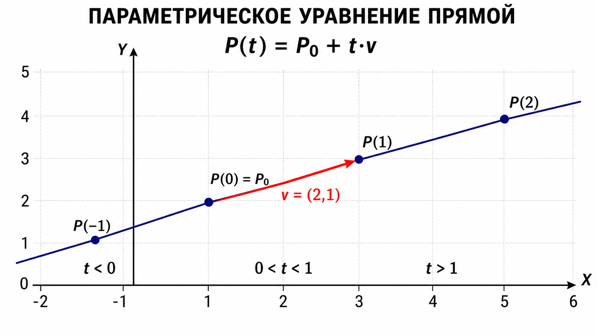
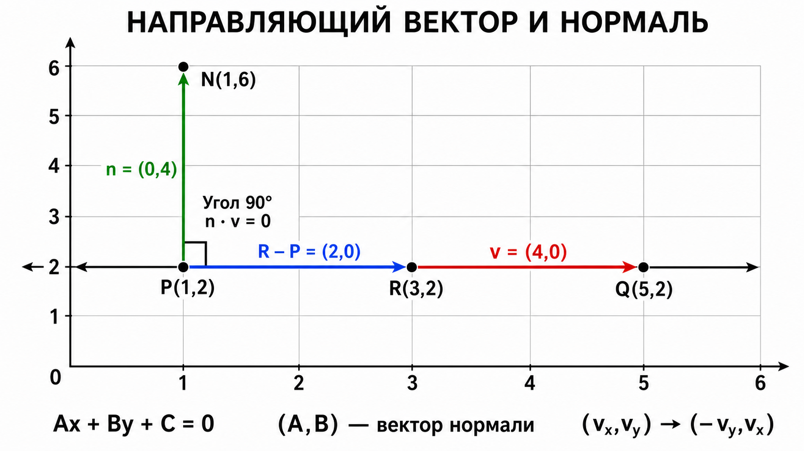
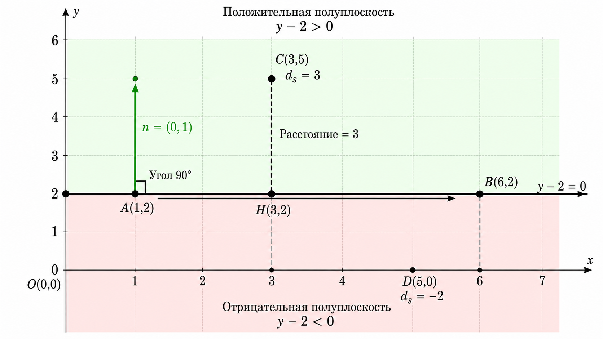
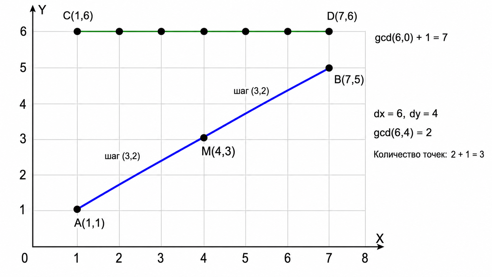
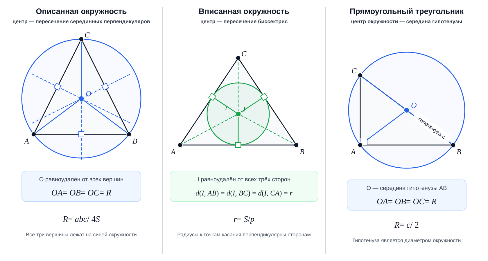
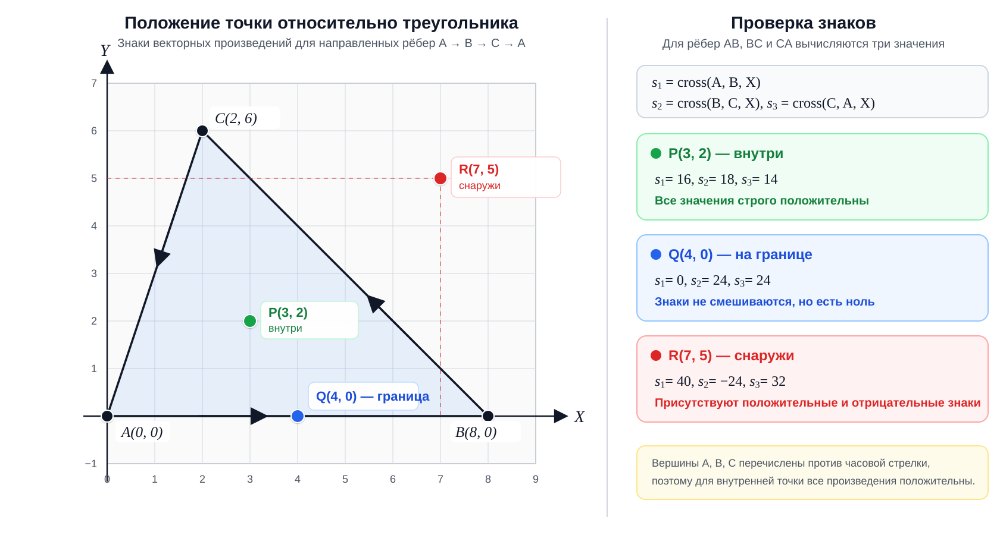
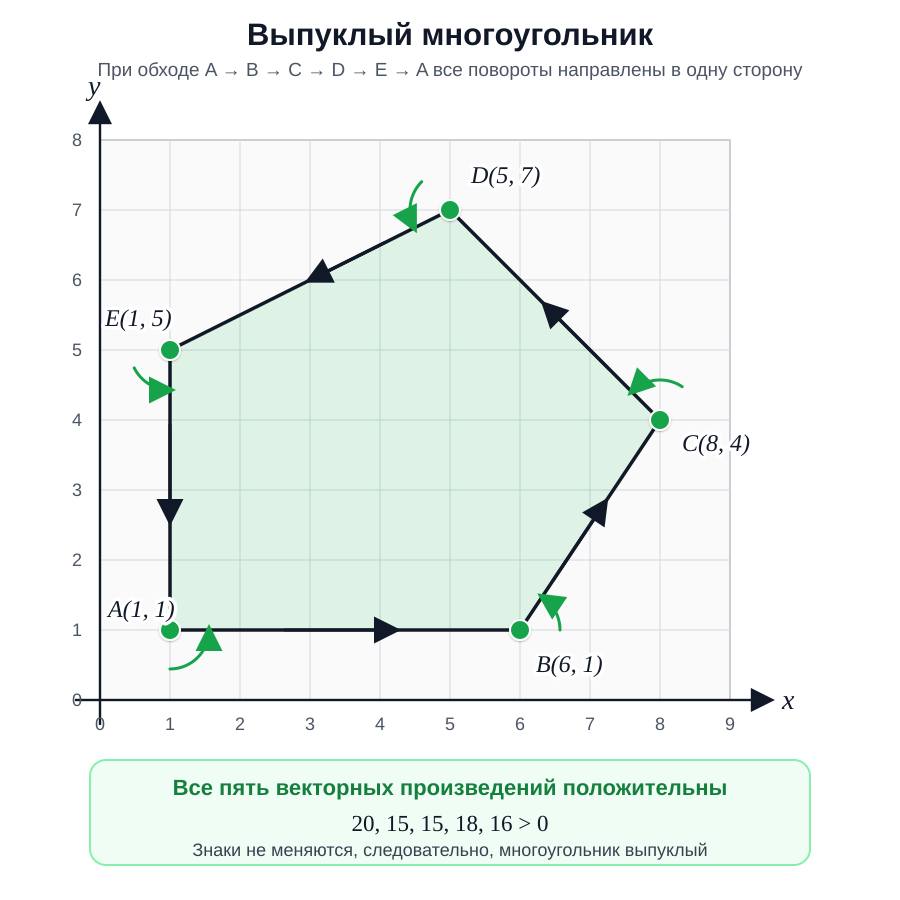
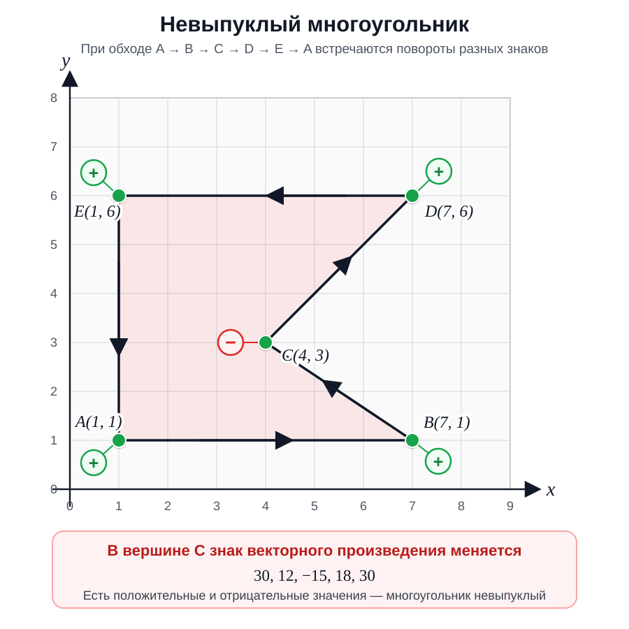
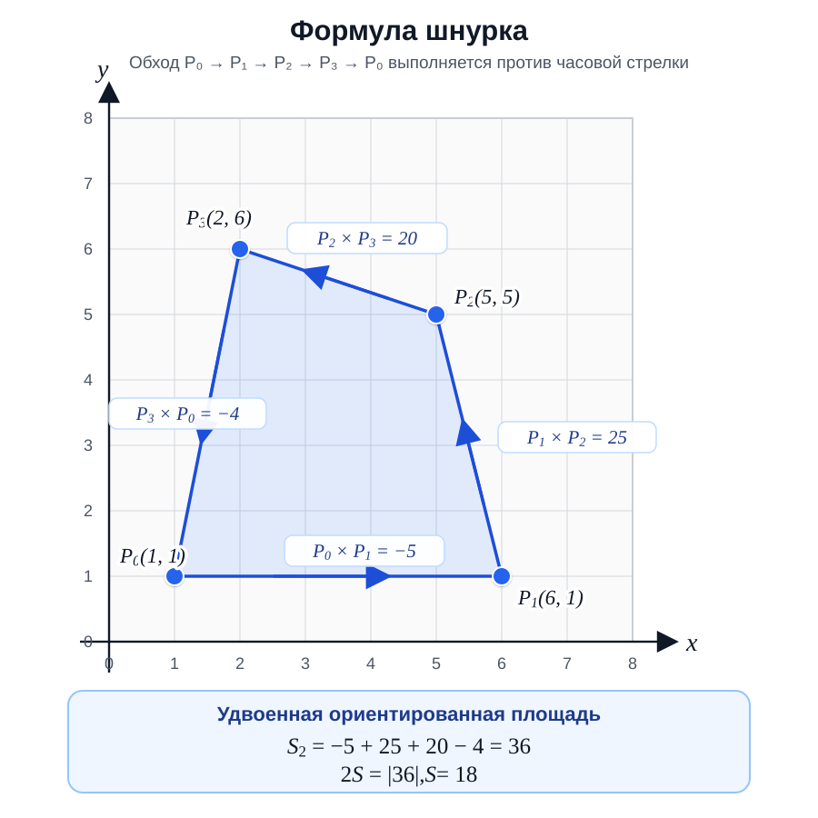
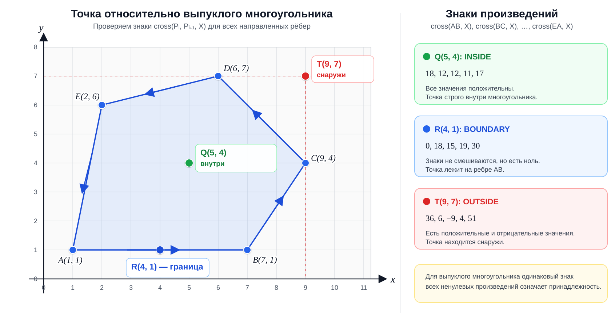

# Геометрия в олимпиадных задачах

## Глава 1. Базовые понятия и фундамент вычислительной геометрии

Вычислительная геометрия — это, пожалуй, самый контрастный раздел олимпиадного программирования. С одной стороны, её идеи интуитивно понятны, ведь все мы рисовали точки и линии на уроках математики. С другой стороны, именно геометрия славится коварными крайними случаями, потерей точности и зубодробительными багами, которые заставляют часами искать ошибку в, казалось бы, идеальном коде.

В этой главе мы заложим железобетонный фундамент. Мы забудем школьные формулы с синусами и уравнениями прямых $y = kx + b$, потому что в программировании они приносят больше вреда, чем пользы. Вместо этого мы научимся смотреть на плоскость через призму векторов и их произведений.

## 1.1. Точка и выбор системы координат

Всё начинается с **точки**. На двумерной плоскости точка — это просто пара чисел $(x, y)$. 

В школьной математике мы привыкли, что координаты могут быть любыми, включая сложные дроби. Однако в олимпиадных задачах координаты точек почти всегда задаются **целыми числами**. Обычно их значения по модулю ограничены разумными пределами: $10^4$, $10^6$ или $10^9$. Это не просто особенность формата ввода, а важнейшая подсказка к тому, как именно нужно писать код.

Отсюда вытекает первое и самое главное правило вычислительной геометрии: **если задачу можно решить в целых числах, её нужно решать в целых числах**. 

Переход к вещественным типам данных (`float`, `double`) таит в себе огромную опасность — погрешность вычислений. Компьютер не может абсолютно точно хранить бесконечные дроби, поэтому в мире программирования $0.1 + 0.2$ не всегда равно $0.3$. Использование деления, тригонометрии или извлечения корня там, где без этого можно обойтись, — верный путь к получению вердикта Wrong Answer на коварных тестах.

> [!WARNING]
> Никогда не сравнивайте два вещественных числа на точное равенство с помощью `==`. Из-за микроскопических погрешностей числа, которые математически равны, в памяти компьютера могут отличаться на миллиардные доли.


Но что делать, если специфика задачи — например, поиск центра описанной окружности или поворот на произвольный угол — всё же заставляет нас прибегнуть к вещественным числам? Тогда в игру вступает **эпсилон** ($\varepsilon$) — допустимая погрешность.

Одной только абсолютной погрешности недостаточно. Разница $10^{-7}$ огромна для чисел порядка $10^{-9}$, но совершенно незаметна для чисел порядка $10^9$. Поэтому обычно одновременно учитывают **абсолютную** и **относительную** погрешности:

$$|a-b| \leq \varepsilon \cdot \max(1, |a|, |b|)$$

Если оба числа близки к нулю, множитель $1$ превращает проверку в абсолютную. Если числа велики, допустимая погрешность растёт вместе с их масштабом и становится относительной. Значение $\varepsilon$ выбирают с учётом условия задачи; часто подходит $10^{-9}$, но это не универсальная магическая константа.

<details>
<summary><strong>C++: сравнение с абсолютной или относительной погрешностью</strong></summary>

```cpp
#include <bits/stdc++.h>
using namespace std;
const double eps = 1e-9;
bool isEqual(double a, double b) {
    return abs(a - b) <= eps * max({1.0, abs(a), abs(b)});
}
void solve() {
    double a, b; cin >> a >> b;
    if (isEqual(a, b)) cout << "YES" << endl;
    else cout << "NO" << endl;
}
main() {
    ios::sync_with_stdio(false);
    cin.tie(0);
    int tt; cin >> tt;
    while (tt --> 0) solve();
}
```

</details>

<details>
<summary><strong>Python3: сравнение с абсолютной или относительной погрешностью</strong></summary>

```python
eps = 1e-9

def is_equal(a, b):
    return abs(a - b) <= eps * max(1.0, abs(a), abs(b))

tt = int(input())
for _ in range(tt):
    a, b = map(float, input().split())
    print("YES" if is_equal(a, b) else "NO")
```

</details>

<details>
<summary><strong>Пример ввода и вывода</strong></summary>

**Ввод**
```text
5
0.1 0.10000000005
1000000000 1000000000.5
1000000000 1000000002
0 0.0000000005
0 0.000000002
```

**Вывод**
```text
YES
YES
NO
YES
NO
```

</details>

Но давайте вернёмся к целым числам, ведь именно они станут нашим главным и самым надёжным инструментом.

## 1.2. Векторы: больше, чем просто стрелочка

**Отрезок** — это часть прямой, соединяющая две точки. А вот **вектор** — это *направленный* отрезок. Он показывает, в каком направлении и на какое расстояние нужно переместиться.

Вектор задаётся двумя числами: смещением по оси $X$ и смещением по оси $Y$. Если вектор начинается в точке $A(x_1, y_1)$ и заканчивается в точке $B(x_2, y_2)$, то его координаты вычисляются элементарно: из координат конца вычитаем координаты начала.

$$\vec{AB} = (x_2 - x_1, y_2 - y_1)$$

Сама точка тоже может выступать вектором — так называемым *радиус-вектором*, который проведён из начала координат $(0, 0)$ в эту точку. Это позволяет нам складывать и вычитать точки так же, как векторы.


Вектор имеет **длину**. По теореме Пифагора длина вектора $\vec{v}(x, y)$ равна $\sqrt{x^2 + y^2}$. Если разделить координаты вектора на его длину, мы получим *единичный вектор* — вектор длины $1$, который указывает в том же направлении.

В коде точку и вектор удобно объединить в одну структуру.

<details>
<summary><strong>C++: структура точки/вектора</strong></summary>

```cpp
#include <bits/stdc++.h>
using namespace std;
struct Point {
    int64_t x, y;
};
Point operator+(Point a, Point b) {
    return {a.x + b.x, a.y + b.y};
}
Point operator-(Point a, Point b) {
    return {a.x - b.x, a.y - b.y};
}
void solve() {
    Point a, b; cin >> a.x >> a.y >> b.x >> b.y;
    Point v = b - a;
    cout << v.x << ' ' << v.y << endl;
}
main() {
    ios::sync_with_stdio(false);
    cin.tie(0);
    int tt; cin >> tt;
    while (tt --> 0) solve();
}
```

</details>

<details>
<summary><strong>Python3: класс точки/вектора</strong></summary>

```python
class Point:
    def __init__(self, x, y):
        self.x = x
        self.y = y

    def __add__(self, other):
        return Point(self.x + other.x, self.y + other.y)

    def __sub__(self, other):
        return Point(self.x - other.x, self.y - other.y)

tt = int(input())
for _ in range(tt):
    x1, y1, x2, y2 = map(int, input().split())
    a = Point(x1, y1)
    b = Point(x2, y2)
    v = b - a
    print(v.x, v.y)
```

</details>

<details>
<summary><strong>Пример ввода и вывода</strong></summary>

**Ввод**
```text
4
1 2 4 4
-3 5 2 -1
0 0 0 0
10 -4 -2 7
```

**Вывод**
```text
3 2
5 -6
0 0
-12 11
```

</details>

## 1.3. Фундаментальные операции: скалярное и векторное произведения

Это сердце олимпиадной геометрии. Забудьте про угловые коэффициенты прямых — два этих произведения заменят вам 90% школьных формул и избавят от деления на ноль.

### Скалярное произведение (Dot Product)

Скалярное произведение двух векторов $\vec{a}(x_1, y_1)$ и $\vec{b}(x_2, y_2)$ — это число, которое вычисляется по формуле:

$$\vec{a} \cdot \vec{b} = x_1 x_2 + y_1 y_2$$

**Геометрический смысл:** оно равно произведению длин векторов на косинус угла между ними ($|\vec{a}| |\vec{b}| \cos \alpha$). 

**Зачем оно нужно?** Скалярное произведение идеально подходит для определения *типа угла* между векторами:
* Если $\vec{a} \cdot \vec{b} > 0$, угол **острый** (косинус положителен).
* Если $\vec{a} \cdot \vec{b} < 0$, угол **тупой** (косинус отрицателен).
* Если $\vec{a} \cdot \vec{b} == 0$, векторы **перпендикулярны** (угол $90^\circ$).

### Векторное (косое) произведение (Cross Product)

В двумерном пространстве векторное произведение — это тоже число (строго говоря, проекция на ось Z), которое вычисляется так:

$$\vec{a} \times \vec{b} = x_1 y_2 - x_2 y_1$$

**Геометрический смысл:** его модуль равен **площади параллелограмма**, натянутого на эти два вектора. А само значение равно произведению длин на синус *ориентированного* угла между ними ($|\vec{a}| |\vec{b}| \sin \alpha$).


**Зачем оно нужно?** Это ваш главный инструмент для определения взаимного расположения объектов:
* Если $\vec{a} \times \vec{b} > 0$, вектор $\vec{b}$ находится **слева** от вектора $\vec{a}$ (поворот против часовой стрелки).
* Если $\vec{a} \times \vec{b} < 0$, вектор $\vec{b}$ находится **справа** от вектора $\vec{a}$ (поворот по часовой стрелке).
* Если $\vec{a} \times \vec{b} == 0$, векторы **коллинеарны** (лежат на одной прямой или параллельны).

> [!IMPORTANT]
> Обратите внимание: проверка на коллинеарность через векторное произведение работает абсолютно точно в целых числах! Нам не нужно делить координаты и сравнивать дроби.

Обе операции удобно оформить отдельными функциями. Для координат порядка $10^9$ произведения уже могут достигать порядка $10^{18}$, поэтому результат необходимо хранить в `int64_t`.

Следующая программа для каждой пары векторов выводит сначала их скалярное произведение, а затем векторное. По первому числу можно определить тип угла, а по второму — направление поворота от первого вектора ко второму.

<details>
<summary><strong>C++: скалярное и векторное произведения</strong></summary>

```cpp
#include <bits/stdc++.h>
using namespace std;
struct Point {
    int64_t x, y;
};
int64_t dot(Point a, Point b) {
    return a.x * b.x + a.y * b.y;
}
int64_t cross(Point a, Point b) {
    return a.x * b.y - a.y * b.x;
}
void solve() {
    Point a, b; cin >> a.x >> a.y >> b.x >> b.y;
    cout << dot(a, b) << ' ' << cross(a, b) << endl;
}
main() {
    ios::sync_with_stdio(false);
    cin.tie(0);
    int tt; cin >> tt;
    while (tt --> 0) solve();
}
```

</details>

<details>
<summary><strong>Python3: скалярное и векторное произведения</strong></summary>

```python
class Point:
    def __init__(self, x, y):
        self.x = x
        self.y = y

def dot(a, b):
    return a.x * b.x + a.y * b.y

def cross(a, b):
    return a.x * b.y - a.y * b.x

tt = int(input())
for _ in range(tt):
    x1, y1, x2, y2 = map(int, input().split())
    a = Point(x1, y1)
    b = Point(x2, y2)
    print(dot(a, b), cross(a, b))
```

</details>

<details>
<summary><strong>Пример ввода и вывода</strong></summary>

**Ввод**
```text
4
1 0 0 1
1 0 0 -1
2 3 4 6
1 2 -3 4
```

**Вывод**
```text
0 1
0 -1
26 0
5 10
```

</details>

В первом тесте векторы перпендикулярны, а поворот от первого ко второму идёт против часовой стрелки. Во втором тесте угол также прямой, но поворот идёт по часовой стрелке. В третьем тесте векторы коллинеарны и направлены в одну сторону. Последний тест показывает, что скалярное и векторное произведения одновременно могут быть положительными.

## 1.4. Угол между векторами и магия atan2

Иногда в задаче требуется не только определить направление поворота, но и вычислить сам угол между векторами. Школьный инстинкт подсказывает формулу через косинус:

$$\alpha=\arccos\left(\frac{\vec a\cdot\vec b}{|\vec a||\vec b|}\right)$$

В олимпиадном коде этот путь опасен. Из-за погрешности результат деления может оказаться равным, например, `1.0000000000000002`, хотя математически он не превосходит единицы. Функция `acos` получит аргумент вне своей области определения и вернёт `NaN`. Кроме того, косинус не позволяет отличить угол $\alpha$ от угла $-\alpha$, а значит, информация о направлении поворота потеряется.

Гораздо надёжнее использовать функцию `atan2(y, x)`. Она учитывает знаки обоих аргументов и возвращает угол в диапазоне от $-\pi$ до $\pi$.

Ориентированный угол от вектора $\vec a$ к вектору $\vec b$ можно найти непосредственно:

$$\alpha=\text{atan2}(\vec a\times\vec b,\vec a\cdot\vec b)$$

Векторное произведение играет роль синуса, скалярное — косинуса, а `atan2` самостоятельно определяет нужную четверть. Положительный результат означает поворот против часовой стрелки, отрицательный — по часовой.

Есть альтернативный способ, через разность двух углов, но...

> [!WARNING]
> Мир розовых пони заканчивается, когда мы начинаем отдельно работать с полярными углами векторов. Нельзя просто так взять и вычислить разность двух результатов `atan2` и сразу вывести её: один угол может находиться около $\pi$, а другой — около $-\pi$. Тогда вместо маленького поворота программа получит разность почти в $2\pi$.
>
> Если в задаче нужны именно полярные направления, сначала вычислите
> 
> $$\alpha=\text{atan2}(y_2,x_2)-\text{atan2}(y_1,x_1)$$,
> 
> а затем прибавляйте или вычитайте $2\pi$, пока результат не попадёт в диапазон $[-\pi,\pi]$.
>
> Обратите внимание на порядок аргументов: сначала передаётся координата $y$, затем координата $x$. Запись `atan2(x, y)` неверна.

Сама формула $\text{atan2}(\vec a\times\vec b,\vec a\cdot\vec b)$ также корректна и сразу возвращает нормализованный ориентированный угол. Однако при целочисленных координатах необходимо следить, чтобы вычисление произведений не вызвало переполнение. В следующем примере показан универсальный вариант через разность полярных углов.

Число $\pi$ не следует записывать вручную как `3.14159`. В C++ его можно вычислить как `acosl(-1.0L)` и сохранить в константе типа `long double`. В Python используется тот же математический приём: `math.acos(-1.0)`.

Оба заданных вектора должны быть ненулевыми: направление нулевого вектора геометрически не определено.

<details>
<summary><strong>C++: ориентированный угол между направлениями</strong></summary>

```cpp
#include <bits/stdc++.h>
using namespace std;
const long double pi = acosl(-1.0L);
long double normAngle(long double a) {
    while (a > pi) a -= 2 * pi;
    while (a < -pi) a += 2 * pi;
    return a;
}
void solve() {
    long double x1, y1, x2, y2;
    cin >> x1 >> y1 >> x2 >> y2;
    long double a = atan2l(y2, x2) - atan2l(y1, x1);
    cout << fixed << setprecision(12) << normAngle(a) << endl;
}
main() {
    ios::sync_with_stdio(false);
    cin.tie(0);
    int tt; cin >> tt;
    while (tt --> 0) solve();
}
```

</details>

<details>
<summary><strong>Python3: ориентированный угол между направлениями</strong></summary>

```python
import math

pi = math.acos(-1.0)

def norm_angle(a):
    while a > pi:
        a -= 2 * pi
    while a < -pi:
        a += 2 * pi
    return a

tt = int(input())
for _ in range(tt):
    x1, y1, x2, y2 = map(float, input().split())
    angle = math.atan2(y2, x2) - math.atan2(y1, x1)
    print(f"{norm_angle(angle):.12f}")
```

</details>

<details>
<summary><strong>Пример ввода и вывода</strong></summary>

**Ввод**
```text
4
1 0 0 1
-1 0 0 -1
-1 0 0 1
0 1 1 0
```

**Вывод**
```text
1.570796326795
1.570796326795
-1.570796326795
-1.570796326795
```

</details>

Во втором тесте особенно хорошо видно, зачем нужна нормализация. Полярный угол первого вектора равен $\pi$, а второго — $-\frac{\pi}{2}$. Их обычная разность равна $-\frac{3\pi}{2}$, но после прибавления $2\pi$ мы получаем правильный кратчайший поворот $\frac{\pi}{2}$ против часовой стрелки.


## 1.5. Принадлежность точки отрезку

Давайте применим наши новые знания на практике. Классическая задача: даны координаты отрезка $AB$ и точки $P$. Нужно определить, лежит ли точка $P$ на отрезке $AB$. И сделать это нужно исключительно в целых числах.

Разделим задачу на два логических шага:
1. **Лежит ли точка на прямой $AB$?** Для этого векторы $\vec{AP}$ и $\vec{AB}$ должны быть коллинеарны. Как мы уже знаем, их векторное произведение должно быть равно нулю.
2. **Лежит ли точка внутри границ отрезка?** Точка может лежать на прямой, но за пределами самого отрезка. Чтобы отсечь этот случай, достаточно проверить, что проекция точки $P$ на оси $X$ и $Y$ попадает в диапазон между проекциями точек $A$ и $B$. Это называется проверкой попадания в *ограничивающий прямоугольник* (Bounding Box).


Объединив эти два условия, мы получаем элегантный алгоритм без деления и вещественных вычислений. Он корректно обрабатывает горизонтальные и вертикальные отрезки, их концы и даже вырожденный отрезок, у которого $A=B$.

> [!WARNING]
> Целочисленные вычисления не имеют погрешности, но всё ещё могут переполниться. Если координаты по модулю достигают $10^9$, разности координат могут достигать $2\cdot10^9$, а их произведения — $4\cdot10^{18}$. Поэтому для координат и результата векторного произведения здесь используется `int64_t`. Для более широких ограничений может понадобиться тип `__int128`.

<details>
<summary><strong>C++: точка на отрезке</strong></summary>

```cpp
#include <bits/stdc++.h>
using namespace std;
struct Point {
    int64_t x, y;
};
Point operator-(Point a, Point b) {
    return {a.x - b.x, a.y - b.y};
}
int64_t cross(Point a, Point b) {
    return a.x * b.y - a.y * b.x;
}
bool onSegment(Point a, Point b, Point p) {
    if (cross(p - a, b - a) != 0) return false;
    bool inX = min(a.x, b.x) <= p.x && p.x <= max(a.x, b.x);
    bool inY = min(a.y, b.y) <= p.y && p.y <= max(a.y, b.y);
    return inX && inY;
}
void solve() {
    Point a, b, p;
    cin >> a.x >> a.y >> b.x >> b.y >> p.x >> p.y;
    if (onSegment(a, b, p)) cout << "YES" << endl;
    else cout << "NO" << endl;
}
main() {
    ios::sync_with_stdio(false);
    cin.tie(0);
    int tt; cin >> tt;
    while (tt --> 0) solve();
}
```

</details>

<details>
<summary><strong>Python3: точка на отрезке</strong></summary>

```python
class Point:
    def __init__(self, x, y):
        self.x = x
        self.y = y

    def __sub__(self, other):
        return Point(self.x - other.x, self.y - other.y)

def cross(a, b):
    return a.x * b.y - a.y * b.x

def on_segment(a, b, p):
    if cross(p - a, b - a) != 0:
        return False
    in_x = min(a.x, b.x) <= p.x <= max(a.x, b.x)
    in_y = min(a.y, b.y) <= p.y <= max(a.y, b.y)
    return in_x and in_y

tt = int(input())
for _ in range(tt):
    x1, y1, x2, y2, px, py = map(int, input().split())
    a = Point(x1, y1)
    b = Point(x2, y2)
    p = Point(px, py)
    print("YES" if on_segment(a, b, p) else "NO")
```

</details>

<details>
<summary><strong>Пример ввода и вывода</strong></summary>

**Ввод**
```text
7
0 0 4 4 2 2
0 0 4 4 5 5
-2 3 4 3 1 3
2 -1 2 5 2 5
0 0 4 4 2 3
1 1 1 1 1 1
1 1 1 1 1 2
```

**Вывод**
```text
YES
NO
YES
YES
NO
YES
NO
```

</details>

В первом тесте точка лежит внутри диагонального отрезка, а во втором — на той же прямой, но за его пределами. Третий и четвёртый тесты проверяют горизонтальный и вертикальный отрезки. В пятом тесте точка находится внутри ограничивающего прямоугольника, но не лежит на прямой $AB$. Последние два теста показывают поведение вырожденного отрезка: ему принадлежит только его единственная точка.

В этой главе мы заложили основу: научились мыслить векторами, избегать вещественных чисел и использовать мощь скалярного и векторного произведений.

## Глава 2. Прямая линия и системы уравнений

В первой главе мы работали с отрезками и векторами. Но геометрия не ограничивается конечными объектами. Очень часто нам нужно работать с **прямыми** — бесконечными линиями, проходящими через заданные точки. 

В школьной программе прямую обычно задают уравнением $y = kx + b$. В олимпиадном программировании про это уравнение лучше забыть навсегда. Хоть мы уже забыли о нём в первой главе, но сейчас мы ещё раз его вспомнили, поэтому придётся забыть и во второй раз. Оно не способно описать вертикальную прямую (так как коэффициент $k$ устремляется в бесконечность) и заставляет нас делить числа, порождая погрешности. 

В этой главе мы разберём два самых мощных и безопасных способа задать прямую: параметрическое и общее уравнения.

## 2.1. Параметрическое уравнение прямой

Самый интуитивный способ задать прямую — это выбрать на ней стартовую точку $P_0$ и указать направление, в котором эта прямая идёт. Направление задаётся направляющим вектором $\vec{v}$.

Если мы находимся в точке $P_0$ и начнём двигаться вдоль вектора $\vec{v}$, мы будем оставаться на прямой. Мы можем пройти один вектор $\vec{v}$, половину вектора или даже пойти в обратную сторону (умножив вектор на отрицательное число). 

Так рождается **параметрическое уравнение прямой**:

$$P(t)=P_0+t\vec v$$

Здесь $P(t)$ — точка на прямой, $P_0$ — фиксированная стартовая точка, $\vec v$ — ненулевой направляющий вектор, а $t$ — вещественный параметр.

Изменяя $t$, мы перемещаемся вдоль прямой:

* при $t=0$ получаем стартовую точку $P_0$;
* при $t>0$ движемся в направлении вектора $\vec v$;
* при $t<0$ движемся в противоположном направлении;
* чем больше модуль $t$, тем дальше точка находится от $P_0$.

Запись $t\vec v$ означает умножение обеих координат вектора на число $t$. Если $P_0=(x_0,y_0)$, а $\vec v=(v_x,v_y)$, параметрическое уравнение можно записать отдельно для каждой координаты:

$$x(t)=x_0+tv_x,\qquad y(t)=y_0+tv_y$$

> [!IMPORTANT]
> Направляющий вектор обязательно должен быть ненулевым. Если $\vec v=(0,0)$, формула задаёт не прямую, а единственную точку $P_0$.



Если прямая задана двумя различными точками $A$ и $B$, в качестве стартовой точки можно взять $A$, а в качестве направляющего вектора — $\vec{AB}=B-A$. Тогда

$$P(t)=A+t(B-A)$$

При $t=0$ мы находимся в точке $A$, при $t=1$ — в точке $B$, а при $t=0.5$ — ровно посередине между ними. Значения $0<t<1$ задают внутренние точки отрезка $AB$, а значения $t<0$ и $t>1$ выводят нас за его пределы.

> [!WARNING]
> Точки $A$ и $B$ должны быть различными. Если $A=B$, направляющий вектор $B-A$ окажется нулевым и прямую по этим двум точкам определить будет невозможно.

<details>
<summary><strong>C++: точка на прямой по параметру</strong></summary>

```cpp
#include <bits/stdc++.h>
using namespace std;
struct Point {
    double x, y;
};
void solve() {
    Point a, b; double t;
    cin >> a.x >> a.y >> b.x >> b.y >> t;
    Point p = {a.x + (b.x - a.x) * t, a.y + (b.y - a.y) * t};
    cout << fixed << setprecision(6) << p.x << ' ' << p.y << endl;
}
main() {
    ios::sync_with_stdio(false);
    cin.tie(0);
    int tt; cin >> tt;
    while (tt --> 0) solve();
}
```

</details>

<details>
<summary><strong>Python3: точка на прямой по параметру</strong></summary>

```python
class Point:
    def __init__(self, x, y):
        self.x = x
        self.y = y

tt = int(input())
for _ in range(tt):
    x1, y1, x2, y2, t = map(float, input().split())
    a = Point(x1, y1)
    b = Point(x2, y2)
    p = Point(
        a.x + (b.x - a.x) * t,
        a.y + (b.y - a.y) * t
    )
    print(f"{p.x:.6f} {p.y:.6f}")
```

</details>

<details>
<summary><strong>Пример ввода и вывода</strong></summary>

**Ввод**
```text
5
0 0 10 10 0
0 0 10 10 1
0 0 10 10 0.5
1 2 4 6 2
5 5 5 10 -1
```

**Вывод**
```text
0.000000 0.000000
10.000000 10.000000
5.000000 5.000000
7.000000 10.000000
5.000000 0.000000
```

Первые три теста демонстрируют значения $t=0$, $t=1$ и $t=0.5$. В четвёртом тесте значение $t=2$ выводит точку за конец отрезка в направлении от $A$ к $B$. В последнем тесте отрицательный параметр заставляет нас двигаться от $A$ в направлении, противоположном вектору $\vec{AB}$.

</details>

## 2.2. Общее уравнение прямой и вектор нормали

Параметрическое уравнение отлично подходит для генерации точек, но проверять с его помощью принадлежность точки прямой неудобно. Для таких задач используется **общее уравнение прямой**:

$$Ax+By+C=0$$

Числа $A$, $B$ и $C$ — коэффициенты прямой. При этом хотя бы один из коэффициентов $A$ и $B$ должен быть ненулевым.

Важно понимать, что одна и та же прямая может иметь несколько эквивалентных уравнений. Если одновременно умножить $A$, $B$ и $C$ на любое ненулевое число, множество точек прямой не изменится. Например, уравнения $x-y=0$ и $-3x+3y=0$ задают одну и ту же прямую.

Пусть прямая проходит через две различные точки $P(x_1,y_1)$ и $Q(x_2,y_2)$. Её направляющий вектор равен

$$\vec v=Q-P=(x_2-x_1,\ y_2-y_1)=(v_x,v_y)$$

Любая прямая имеет **вектор нормали** $\vec n$ — ненулевой вектор, перпендикулярный её направлению. Чтобы получить такой вектор из $\vec v$, достаточно поменять координаты местами и изменить знак одной из них:

$$\vec n=(-v_y,v_x)$$



Теперь возьмём произвольную точку $R(x,y)$. Она лежит на прямой тогда и только тогда, когда вектор $R-P$ перпендикулярен нормали. Следовательно, их скалярное произведение равно нулю:

$$\vec n\cdot(R-P)=0$$

Подставим координаты:

$$-v_y(x-x_1)+v_x(y-y_1)=0$$

Раскроем скобки:

$$-v_yx+v_xy+(v_yx_1-v_xy_1)=0$$

Сравнивая полученное выражение с общим уравнением $Ax+By+C=0$, находим коэффициенты:

* $A=-v_y$;
* $B=v_x$;
* $C=v_yx_1-v_xy_1$.

> [!IMPORTANT]
> Вектор $(A,B)$ является нормалью к прямой. Поэтому коэффициенты общего уравнения — не случайный набор чисел: они непосредственно задают направление, перпендикулярное прямой.

> [!WARNING]
> Точки $P$ и $Q$ должны быть различными. Если $P=Q$, то $\vec v=(0,0)$ и программа получит $A=B=C=0$. Равенство $0=0$ выполняется для всей плоскости и не задаёт конкретную прямую.

<details>
<summary><strong>C++: построение общего уравнения прямой</strong></summary>

```cpp
#include <bits/stdc++.h>
using namespace std;
struct Point {
    int64_t x, y;
};
void solve() {
    Point p, q; cin >> p.x >> p.y >> q.x >> q.y;
    int64_t vx = q.x - p.x;
    int64_t vy = q.y - p.y;
    int64_t a = -vy;
    int64_t b = vx;
    int64_t c = vy * p.x - vx * p.y;
    cout << a << ' ' << b << ' ' << c << endl;
}
main() {
    ios::sync_with_stdio(false);
    cin.tie(0);
    int tt; cin >> tt;
    while (tt --> 0) solve();
}
```

</details>

<details>
<summary><strong>Python3: построение общего уравнения прямой</strong></summary>

```python
tt = int(input())
for _ in range(tt):
    x1, y1, x2, y2 = map(int, input().split())
    vx = x2 - x1
    vy = y2 - y1
    a = -vy
    b = vx
    c = vy * x1 - vx * y1
    print(a, b, c)
```

</details>

<details>
<summary><strong>Пример ввода и вывода</strong></summary>

**Ввод**
```text
4
1 1 4 4
0 2 5 2
2 -1 2 5
-1 3 3 1
```

**Вывод**
```text
-3 3 0
0 5 -10
-6 0 12
2 4 -10
```

В первом тесте получается уравнение $-3x+3y=0$, то есть прямая $y=x$. Во втором тесте уравнение $5y-10=0$ задаёт горизонтальную прямую $y=2$. В третьем тесте уравнение $-6x+12=0$ задаёт вертикальную прямую $x=2$. В последнем тесте получается уравнение $2x+4y-10=0$, и обе исходные точки ему удовлетворяют.

Коэффициенты не обязаны быть сокращены. Например, $-6x+12=0$ и $-x+2=0$ задают одну и ту же прямую.

</details>

> [!WARNING]
> Отсутствие вещественной погрешности не защищает от целочисленного переполнения. Коэффициент $C$ содержит произведения координат. При координатах порядка $10^9$ для него уже требуется `int64_t`. Если ограничения существенно больше, промежуточные вычисления необходимо выполнять в более широком типе, например `__int128` в C++.

## 2.3. Расстояние до прямой и полуплоскости

Общее уравнение $Ax+By+C=0$ умеет не только проверять принадлежность точки прямой. Оно также позволяет определить расстояние до прямой и понять, в какой полуплоскости находится точка.

Вспомним, что вектор $(A,B)$ является нормалью к прямой. Его длина равна

$$\sqrt{A^2+B^2}$$

Для произвольной точки $P(x,y)$ вычислим значение

$$Ax+By+C$$

Если оно равно нулю, точка лежит на прямой. В противном случае модуль этого выражения показывает, насколько далеко точка смещена в направлении нормали, но его величина зависит от длины вектора $(A,B)$. Поэтому для получения настоящего расстояния необходимо разделить результат на длину нормали.

**Ориентированное расстояние** от точки $P(x,y)$ до прямой равно

$$d_s=\frac{Ax+By+C}{\sqrt{A^2+B^2}}$$

Оно может быть положительным, отрицательным или равным нулю. Обычное, неотрицательное расстояние получается взятием модуля:

$$d=\frac{|Ax+By+C|}{\sqrt{A^2+B^2}}$$

Таким образом:

* если $Ax+By+C>0$, точка находится в полуплоскости, куда направлена нормаль $(A,B)$;
* если $Ax+By+C<0$, точка находится в противоположной полуплоскости;
* если $Ax+By+C=0$, точка лежит на прямой.

> [!IMPORTANT]
> Говорить, что положительное значение всегда означает положение «над прямой», неверно. Для вертикальной или наклонной прямой понятия «выше» и «ниже» вообще могут вводить в заблуждение. Положительной называется сторона, в которую направлен вектор нормали $(A,B)$.

Знак ориентированного расстояния зависит от выбранного направления нормали. Уравнения $Ax+By+C=0$ и $-Ax-By-C=0$ задают одну и ту же прямую, но положительная и отрицательная полуплоскости у них меняются местами. Обычное расстояние при этом остаётся прежним.

Если коэффициенты получены по направлению от точки $A$ к точке $B$ с помощью нормали $(-v_y,v_x)$, то положительная полуплоскость находится **слева** от направленной прямой $AB$, а отрицательная — справа.

> [!IMPORTANT]
> Если нужно узнать только сторону прямой, делить на $\sqrt{A^2+B^2}$ не требуется. Знаменатель всегда положителен, поэтому он не влияет на знак. Благодаря этому принадлежность полуплоскости можно проверять точно в целых числах.

> [!WARNING]
> Коэффициенты $A$ и $B$ не могут одновременно равняться нулю. Выражение $0x+0y+C=0$ не задаёт обычную прямую, а деление на $\sqrt{A^2+B^2}$ в таком случае невозможно.

<details>
<summary><strong>C++: расстояние от точки до прямой</strong></summary>

```cpp
#include <bits/stdc++.h>
using namespace std;
void solve() {
    long double a, b, c, x, y;
    cin >> a >> b >> c >> x >> y;
    long double sd = (a * x + b * y + c) / sqrtl(a * a + b * b);
    cout << fixed << setprecision(6) << sd << ' ' << abs(sd) << endl;
}
main() {
    ios::sync_with_stdio(false);
    cin.tie(0);
    int tt; cin >> tt;
    while (tt --> 0) solve();
}
```

</details>

<details>
<summary><strong>Python3: расстояние от точки до прямой</strong></summary>

```python
import math

tt = int(input())
for _ in range(tt):
    a, b, c, x, y = map(float, input().split())
    sd = (a * x + b * y + c) / math.sqrt(a * a + b * b)
    print(f"{sd:.6f} {abs(sd):.6f}")
```

</details>

Программа выводит два числа: сначала ориентированное расстояние, а затем обычное неотрицательное расстояние.

<details>
<summary><strong>Пример ввода и вывода</strong></summary>

**Ввод**
```text
4
0 1 -2 3 5
1 0 -2 -1 4
3 4 -10 2 1
0 2 -4 7 -1
```

**Вывод**
```text
3.000000 3.000000
-3.000000 3.000000
0.000000 0.000000
-3.000000 3.000000
```

В первом тесте задана прямая $y=2$, а точка $(3,5)$ находится от неё на расстоянии $3$. Во втором тесте прямая имеет вид $x=2$, а точка $(-1,4)$ находится в отрицательной полуплоскости. В третьем тесте точка $(2,1)$ лежит непосредственно на прямой $3x+4y-10=0$.

Последний тест показывает, что умножение всех коэффициентов на одно положительное число не меняет расстояние: уравнения $y-2=0$ и $2y-4=0$ задают одну и ту же прямую.

</details>

**Задача 1.** Дана направленная прямая, проходящая через различные точки $A$ и $B$, а также точки $C$ и $D$. Определите, лежат ли $C$ и $D$ строго по одну сторону от прямой $AB$. Выведите `YES` или `NO`.

Можно построить коэффициенты общего уравнения и подставить в него обе точки. Но существует ещё более короткая запись через векторное произведение. Для произвольной точки $P$ вычислим

$$\text{side}(P)=\vec{AB}\times\vec{AP}$$

Знак результата описывает положение точки относительно направления от $A$ к $B$:

* если $\text{side}(P)>0$, точка находится слева от направленной прямой $AB$;
* если $\text{side}(P)<0$, точка находится справа;
* если $\text{side}(P)=0$, точка лежит на прямой.

Это та же самая проверка, что и вычисление $Ax+By+C$ для коэффициентов из пункта 2.2:

$$\vec{AB}\times\vec{AP}=-v_y(x_P-x_A)+v_x(y_P-y_A)$$

Точки $C$ и $D$ лежат строго по одну сторону тогда и только тогда, когда оба значения положительны или оба отрицательны. Если хотя бы одно из них равно нулю, ответом будет `NO`, потому что точка на прямой не принадлежит ни одной из двух открытых полуплоскостей.

> [!WARNING]
> Здесь рассматривается именно **строгое** нахождение по одну сторону. В других задачах точки на прямой могут разрешаться, поэтому всегда внимательно читайте условие.
>
> Также предполагается, что $A\ne B$. Через две совпадающие точки невозможно однозначно провести прямую.



<details>
<summary><strong>C++: точки по одну сторону от прямой</strong></summary>

```cpp
#include <bits/stdc++.h>
using namespace std;
struct Point {
    int64_t x, y;
};
int64_t side(Point a, Point b, Point p) {
    return (b.x - a.x) * (p.y - a.y) - (b.y - a.y) * (p.x - a.x);
}
void solve() {
    Point a, b, c, d;
    cin >> a.x >> a.y >> b.x >> b.y;
    cin >> c.x >> c.y >> d.x >> d.y;
    int64_t x = side(a, b, c);
    int64_t y = side(a, b, d);
    if (x > 0 && y > 0 || x < 0 && y < 0) cout << "YES" << endl;
    else cout << "NO" << endl;
}
main() {
    ios::sync_with_stdio(false);
    cin.tie(0);
    int tt; cin >> tt;
    while (tt --> 0) solve();
}
```

</details>

<details>
<summary><strong>Python3: точки по одну сторону от прямой</strong></summary>

```python
class Point:
    def __init__(self, x, y):
        self.x = x
        self.y = y

def side(a, b, p):
    return ((b.x - a.x) * (p.y - a.y)
            - (b.y - a.y) * (p.x - a.x))

tt = int(input())
for _ in range(tt):
    ax, ay, bx, by = map(int, input().split())
    cx, cy, dx, dy = map(int, input().split())
    a = Point(ax, ay)
    b = Point(bx, by)
    c = Point(cx, cy)
    d = Point(dx, dy)
    x = side(a, b, c)
    y = side(a, b, d)
    print("YES" if x > 0 and y > 0 or x < 0 and y < 0 else "NO")
```

</details>

<details>
<summary><strong>Пример ввода и вывода</strong></summary>

**Ввод**
```text
5
0 0 10 0
5 5 8 2
0 0 10 0
5 5 5 -5
0 0 10 10
2 2 5 0
0 0 0 10
-2 3 -1 8
0 0 0 10
-2 3 1 8
```

**Вывод**
```text
YES
NO
NO
YES
NO
```

В первом тесте обе точки находятся выше горизонтальной прямой. Во втором тесте они лежат по разные стороны от неё. В третьем тесте точка $C=(2,2)$ лежит непосредственно на прямой $y=x$, поэтому ответом является `NO`.

Четвёртый и пятый тесты проверяют вертикальную прямую. В четвёртом тесте обе точки находятся слева от неё, а в пятом — по разные стороны.

</details>

> [!WARNING]
> Вычисления в целых числах избавляют от погрешности, но не от переполнения. Если координаты по модулю не превосходят $10^9$, разности координат могут достигать $2\cdot10^9$, а отдельные произведения — $4\cdot10^{18}$. Всегда оценивайте максимальное значение выражения по ограничениям задачи. При более широких ограничениях в C++ может понадобиться `__int128`.

## 2.4. Количество целочисленных точек на отрезке

До сих пор мы рассматривали прямые и отрезки как непрерывные геометрические объекты. Однако во многих задачах нас интересуют только **целочисленные точки** — точки, обе координаты которых являются целыми числами.

Пусть даны две целочисленные точки

$$A(x_1,y_1),\qquad B(x_2,y_2)$$

и требуется определить, сколько целочисленных точек лежит на отрезке $AB$, включая его концы.

Обозначим абсолютные разности координат:

$$dx=|x_2-x_1|,\qquad dy=|y_2-y_1|$$

Тогда количество целочисленных точек на отрезке равно

$$\boxed{\gcd(dx,dy)+1}$$

где $\gcd$ — наибольший общий делитель.

Например, рассмотрим точки $A=(1,1)$ и $B=(7,5)$. Для них

$$dx=|7-1|=6,\qquad dy=|5-1|=4$$

Следовательно,

$$\gcd(6,4)=2$$

и на отрезке находятся

$$2+1=3$$

целочисленные точки:

$$(1,1),\qquad (4,3),\qquad (7,5)$$



Разберёмся, почему появляется именно наибольший общий делитель. Пусть

$$\Delta x=x_2-x_1,\qquad \Delta y=y_2-y_1$$

и

$$g=\gcd(|\Delta x|,|\Delta y|)$$

Обе разности координат делятся на $g$, поэтому вектор $\vec{AB}$ можно представить в виде

$$\vec{AB}=g\left(\frac{\Delta x}{g},\frac{\Delta y}{g}\right)$$

Вектор

$$\left(\frac{\Delta x}{g},\frac{\Delta y}{g}\right)$$

называют **примитивным направляющим вектором**. Его координаты взаимно просты: у них уже нет общего делителя, большего единицы. Следовательно, это минимальный целочисленный шаг вдоль прямой от одной целочисленной точки к следующей.

Начиная с точки $A$, будем делать такие шаги:

$$P_k=A+k\left(\frac{\Delta x}{g},\frac{\Delta y}{g}\right)$$

Чтобы оставаться на отрезке, параметр $k$ должен принимать значения

$$k=0,1,2,\ldots,g$$

Таким образом, получаются точки

$$P_0,P_1,\ldots,P_g$$

Их ровно $g+1$: одна точка соответствует каждому из $g+1$ целых значений параметра.

Почему между соседними точками $P_k$ и $P_{k+1}$ не может скрываться ещё одна целочисленная точка? Если бы такой меньший целочисленный шаг существовал, координаты примитивного вектора имели бы дополнительный общий делитель. Но мы уже разделили $\Delta x$ и $\Delta y$ на их наибольший общий делитель, поэтому дальнейшее одновременное сокращение невозможно.

> [!IMPORTANT]
> Формула считает **обе границы отрезка**. Поэтому к значению $\gcd(dx,dy)$ прибавляется единица:
>
> $$\text{количество всех точек}=\gcd(dx,dy)+1$$
>
> Если нужны только внутренние целочисленные точки, не включая $A$ и $B$, их количество равно
>
> $$\gcd(dx,dy)-1$$

Формула естественным образом работает для горизонтальных и вертикальных отрезков.

Если отрезок горизонтальный, то $dy=0$. Поскольку $\gcd(dx,0)=dx$, получаем $dx+1$ точек. Например, на отрезке от $(2,5)$ до $(6,5)$ находятся пять точек:

$$(2,5),(3,5),(4,5),(5,5),(6,5)$$

Аналогично, для вертикального отрезка $dx=0$, поэтому ответ равен $dy+1$.

Наконец, если $A=B$, отрезок вырождается в одну точку. В стандартных функциях C++ и Python выполняется $\gcd(0,0)=0$, поэтому та же формула даёт правильный ответ:

$$\gcd(0,0)+1=1$$

<details>
<summary><strong>C++: количество целочисленных точек на отрезке</strong></summary>

```cpp
#include <bits/stdc++.h>
using namespace std;
void solve() {
    int64_t x1, y1, x2, y2;
    cin >> x1 >> y1 >> x2 >> y2;
    int64_t dx = abs(x2 - x1);
    int64_t dy = abs(y2 - y1);
    cout << gcd(dx, dy) + 1 << endl;
}
main() {
    ios::sync_with_stdio(false);
    cin.tie(0);
    int tt; cin >> tt;
    while (tt --> 0) solve();
}
```

</details>

<details>
<summary><strong>Python3: количество целочисленных точек на отрезке</strong></summary>

```python
import math
tt = int(input())
for _ in range(tt):
    x1, y1, x2, y2 = map(int, input().split())
    dx = abs(x2 - x1)
    dy = abs(y2 - y1)
    print(math.gcd(dx, dy) + 1)
```

</details>

<details>
<summary><strong>Пример ввода и вывода</strong></summary>

**Ввод**
```text
5
1 1 7 5
2 5 6 5
3 -2 3 4
0 0 5 2
4 7 4 7
```

**Вывод**
```text
3
5
7
2
1
```

В первом тесте $\gcd(6,4)=2$, поэтому на отрезке находятся три целочисленные точки: два конца и одна внутренняя точка.

Во втором и третьем тестах рассматриваются горизонтальный и вертикальный отрезки. В четвёртом тесте $\gcd(5,2)=1$, поэтому целочисленными являются только концы отрезка. Последний тест содержит вырожденный отрезок, состоящий из одной точки.

</details>

> [!NOTE]
> Евклидова длина отрезка здесь не играет непосредственной роли. Отрезки одинаковой длины могут содержать разное количество целочисленных точек: всё определяется тем, на какое число можно одновременно разделить изменения обеих координат.
>
> Эта формула особенно часто встречается в задачах на подсчёт точек на границе многоугольника. Для каждого ребра сначала вычисляют $\gcd(|dx|,|dy|)$, а затем суммируют полученные значения. При таком способе вершины не приходится отдельно учитывать дважды.

## 2.5. Пересечение двух прямых и метод Крамера

**Задача 2.** Даны две прямые: первая проходит через различные точки $A$ и $B$, а вторая — через различные точки $C$ и $D$. Если прямые пересекаются в одной точке, нужно вывести `YES` и её координаты. Если прямые совпадают, нужно вывести `YES` и координаты точки $A$. Если прямые параллельны и не совпадают, нужно вывести `NO`.

Запишем общие уравнения двух прямых:

$$A_1x+B_1y+C_1=0$$

$$A_2x+B_2y+C_2=0$$

Точка пересечения должна одновременно удовлетворять обоим уравнениям. Перенесём свободные члены в правую часть и получим систему:

$$A_1x+B_1y=-C_1$$

$$A_2x+B_2y=-C_2$$

Решить её можно **методом Крамера**. Сначала вычислим главный определитель системы:

$$\Delta=A_1B_2-A_2B_1$$

Затем вычислим определитель для координаты $x$, заменив первый столбец коэффициентов правыми частями:

$$\Delta_x=(-C_1)B_2-(-C_2)B_1$$

Для координаты $y$ заменим правыми частями второй столбец:

$$\Delta_y=A_1(-C_2)-A_2(-C_1)$$

Теперь возможны три случая.

### Случай 1. Прямые пересекаются в одной точке

Если $\Delta\ne0$, система имеет единственное решение:

$$x=\frac{\Delta_x}{\Delta},\qquad y=\frac{\Delta_y}{\Delta}$$

До этого момента все вычисления можно выполнять точно в целых числах. Вещественное деление понадобится только при получении координат ответа.

### Случай 2. Прямые параллельны и не совпадают

Если $\Delta=0$, векторы нормалей $(A_1,B_1)$ и $(A_2,B_2)$ коллинеарны. Следовательно, прямые либо параллельны, либо совпадают.

Чтобы различить эти ситуации, достаточно проверить, лежит ли любая точка первой прямой на второй. Например, подставим точку $A(x_A,y_A)$ в уравнение второй прямой:

$$A_2x_A+B_2y_A+C_2$$

Если результат не равен нулю, прямые параллельны и не имеют общих точек.

### Случай 3. Прямые совпадают

Если $\Delta=0$ и одновременно выполняется равенство

$$A_2x_A+B_2y_A+C_2=0$$

то точка $A$ лежит на второй прямой. Поскольку направления прямых уже параллельны, этого достаточно, чтобы заключить: прямые совпадают и имеют бесконечно много общих точек.

По условию задачи в этом случае можно вывести любую точку совпавших прямых. Мы выведем точку $A$.

> [!IMPORTANT]
> Метод Крамера позволяет сохранить точность до последнего шага. Параллельность и совпадение прямых определяются точными целочисленными сравнениями, а деление выполняется только при вычислении координат единственной точки пересечения.

> [!WARNING]
> Для обеих прямых должны быть заданы две различные точки: $A\ne B$ и $C\ne D$. Если концы одной пары совпадают, эта пара задаёт точку, а не прямую, и приведённый алгоритм к ней неприменим.

> [!WARNING]
> В этой задаче `int64_t` может оказаться недостаточно даже при координатах порядка $10^9$. Коэффициент $C$ уже имеет порядок $10^{18}$, а определители $\Delta_x$ и $\Delta_y$ содержат произведения коэффициентов и могут достигать порядка $10^{28}$. Поэтому в реализации на C++ промежуточные вычисления выполняются в типе `__int128`.

<details>
<summary><strong>C++: пересечение двух прямых</strong></summary>

```cpp
#include <bits/stdc++.h>
using namespace std;
struct Point {
    int64_t x, y;
};
struct Line {
    __int128 a, b, c;
};
Line makeLine(Point p, Point q) {
    __int128 vx = (__int128)q.x - p.x;
    __int128 vy = (__int128)q.y - p.y;
    return {-vy, vx, vy * p.x - vx * p.y};
}
void solve() {
    Point a, b, c, d;
    cin >> a.x >> a.y >> b.x >> b.y;
    cin >> c.x >> c.y >> d.x >> d.y;
    Line p = makeLine(a, b);
    Line q = makeLine(c, d);
    __int128 det = p.a * q.b - q.a * p.b;
    __int128 detX = (-p.c) * q.b - (-q.c) * p.b;
    __int128 detY = p.a * (-q.c) - q.a * (-p.c);
    if (det == 0) {
        if (q.a * a.x + q.b * a.y + q.c == 0) {
            cout << "YES" << endl;
            cout << fixed << setprecision(6) << (long double)a.x << ' ' << (long double)a.y << endl;
        } else cout << "NO" << endl;
    } else {
        long double x = (long double)detX / (long double)det;
        long double y = (long double)detY / (long double)det;
        if (detX == 0) x = 0;
        if (detY == 0) y = 0;
        cout << "YES" << endl;
        cout << fixed << setprecision(6) << x << ' ' << y << endl;
    }
}
main() {
    ios::sync_with_stdio(false);
    cin.tie(0);
    int tt; cin >> tt;
    while (tt --> 0) solve();
}
```

</details>

<details>
<summary><strong>Python3: пересечение двух прямых</strong></summary>

```python
def make_line(x1, y1, x2, y2):
    vx = x2 - x1
    vy = y2 - y1
    return -vy, vx, vy * x1 - vx * y1

tt = int(input())
for _ in range(tt):
    ax, ay, bx, by = map(int, input().split())
    cx, cy, dx, dy = map(int, input().split())

    a1, b1, c1 = make_line(ax, ay, bx, by)
    a2, b2, c2 = make_line(cx, cy, dx, dy)

    det = a1 * b2 - a2 * b1
    det_x = (-c1) * b2 - (-c2) * b1
    det_y = a1 * (-c2) - a2 * (-c1)

    if det == 0:
        if a2 * ax + b2 * ay + c2 == 0:
            print("YES")
            print(f"{float(ax):.6f} {float(ay):.6f}")
        else:
            print("NO")
    else:
        x = det_x / det
        y = det_y / det
        if det_x == 0:
            x = 0.0
        if det_y == 0:
            y = 0.0
        print("YES")
        print(f"{x:.6f} {y:.6f}")
```

</details>

<details>
<summary><strong>Пример ввода и вывода</strong></summary>

**Ввод**
```text
5
0 0 10 10
0 10 10 0
1 1 2 2
3 3 4 4
0 0 1 0
0 1 1 1
2 -1 2 5
-1 2 5 2
0 0 3 3
0 2 3 0
```

**Вывод**
```text
YES
5.000000 5.000000
YES
1.000000 1.000000
NO
YES
2.000000 2.000000
YES
1.200000 1.200000
```

В первом тесте две диагонали квадрата пересекаются в точке $(5,5)$.

Во втором тесте обе пары точек задают одну прямую $y=x$. Общих точек бесконечно много, поэтому программа выводит точку $A=(1,1)$.

В третьем тесте прямые $y=0$ и $y=1$ параллельны и не совпадают.

Четвёртый тест показывает, что алгоритм одинаково хорошо работает с вертикальными и горизонтальными прямыми: $x=2$ и $y=2$ пересекаются в точке $(2,2)$.

В последнем тесте координаты точки пересечения не являются целыми. Прямые пересекаются в точке $(1.2,1.2)$.

</details>

## 2.6. Итоги второй главы

Мы научились работать с бесконечными прямыми, избегая деления на ноль и потери точности. Параметрическое уравнение $P(t) = P_0 + \vec{v} \cdot t$ идеально подходит для движения по прямой и генерации точек. Общее уравнение $Ax + By + C = 0$ незаменимо, когда нужно разделить плоскость на две части или найти точку пересечения.

Метод Крамера — это ваш универсальный ключ к решению любых систем линейных уравнений $2 \times 2$ в олимпиадной геометрии. Он позволяет отложить вещественное деление на самый последний момент, сохраняя абсолютную точность промежуточных вычислений.

## Глава 3. Окружность и её свойства

В предыдущих главах мы строили наш геометрический мир исключительно из прямых линий и отрезков. Но реальные олимпиадные задачи редко ограничиваются только ими. Рано или поздно на сцену выходят кривые, и самая главная из них — **окружность**. 

Окружность таит в себе множество подводных камней: в отличие от прямых, работа с ней часто провоцирует переход к вещественным числам, извлечению корней и тригонометрии. Однако, как мы убедимся в этой главе, большинство проверок на пересечения и принадлежность можно и нужно выполнять в целых числах, сохраняя абсолютную точность.

## 3.1. Уравнения окружности и её построение

По определению, **окружность** — это множество всех точек плоскости, находящихся на одном и том же расстоянии от заданной точки. Эта точка называется **центром окружности**, а расстояние — её **радиусом**.

Обозначим центр через

$$C(x_0,y_0)$$

а радиус — через $R$. Тогда произвольная точка $P(x,y)$ лежит на окружности в том и только в том случае, если расстояние $CP$ равно $R$.

> [!NOTE]
> Не следует путать окружность и круг. **Окружность** состоит только из точек границы, для которых расстояние до центра равно $R$. **Круг** содержит также все внутренние точки, расстояние от которых до центра не превосходит $R$.

### Классическое уравнение окружности

По формуле расстояния между двумя точками

$$CP=\sqrt{(x-x_0)^2+(y-y_0)^2}$$

Условие $CP=R$ можно записать так:

$$\sqrt{(x-x_0)^2+(y-y_0)^2}=R$$

Поскольку обе части равенства неотрицательны, возведём их в квадрат:

$$\boxed{(x-x_0)^2+(y-y_0)^2=R^2}$$

Это и есть **классическое уравнение окружности** с центром $(x_0,y_0)$ и радиусом $R$.

Например, окружность с центром $C=(2,-1)$ и радиусом $5$ задаётся уравнением

$$(x-2)^2+(y+1)^2=25$$

Проверим точку $P=(5,3)$:

$$(5-2)^2+(3+1)^2=3^2+4^2=25$$

Полученное значение равно $R^2$, следовательно, точка $P$ действительно лежит на окружности.

### Построение окружности по центру и точке

В олимпиадных задачах окружность нередко задаётся не радиусом, а центром $C(x_C,y_C)$ и некоторой точкой $P(x_P,y_P)$ на её границе. В этом случае радиус равен длине вектора $\vec{CP}$:

$$R=\sqrt{(x_P-x_C)^2+(y_P-y_C)^2}$$

Однако извлекать квадратный корень обычно не требуется. Гораздо удобнее сразу вычислить квадрат радиуса:

$$\boxed{R^2=(x_P-x_C)^2+(y_P-y_C)^2}$$

Если координаты $C$ и $P$ целые, то $R^2$ также является целым числом, даже когда сам радиус иррационален. Например, для точек $C=(0,0)$ и $P=(1,1)$ получаем

$$R^2=1^2+1^2=2,\qquad R=\sqrt2$$

Квадрат радиуса хранится точно, тогда как приближённое значение $\sqrt2$ уже содержит вещественную погрешность.

> [!IMPORTANT]
> **Храните квадрат радиуса, а не сам радиус**, если в задаче требуется только проверять принадлежность, пересечение или взаимное расположение объектов.
>
> Переходить от $R^2$ к $R$ с помощью квадратного корня следует лишь тогда, когда радиус или координаты точек действительно нужно вывести.

### Развёрнутое уравнение окружности

Раскроем скобки в классическом уравнении:

$$x^2-2x_0x+x_0^2+y^2-2y_0y+y_0^2=R^2$$

Перенесём всё в левую часть:

$$x^2+y^2-2x_0x-2y_0y+x_0^2+y_0^2-R^2=0$$

Таким образом, окружность можно записать в виде

$$\boxed{x^2+y^2+Dx+Ey+F=0}$$

где

$$D=-2x_0,\qquad E=-2y_0,\qquad F=x_0^2+y_0^2-R^2$$

Верно и обратное. Если дано уравнение

$$x^2+y^2+Dx+Ey+F=0$$

то центр и квадрат радиуса можно восстановить по формулам

$$x_0=-\frac D2,\qquad y_0=-\frac E2$$

$$R^2=\frac{D^2+E^2}{4}-F$$

Если полученное значение $R^2$ отрицательно, уравнение не задаёт ни одной вещественной точки. При $R^2=0$ окружность вырождается в единственную точку — свой центр.

> [!IMPORTANT]
> В развёрнутом уравнении окружности коэффициенты при $x^2$ и $y^2$ одинаковы, а слагаемого $xy$ нет. Произвольное квадратное уравнение от $x$ и $y$ может задавать эллипс, параболу, гиперболу или вырожденную фигуру, а не окружность.

### Параметрическое уравнение окружности

Классическое уравнение удобно для проверки принадлежности точки. Однако, если нужно **получить точку окружности по заданному углу**, используется параметрическая запись.

Проведём из центра вектор длины $R$, образующий угол $t$ с положительным направлением оси $X$. Его горизонтальная и вертикальная составляющие равны

$$R\cos (t)\qquad\text{и}\qquad R\sin (t)$$

Поэтому координаты конца вектора имеют вид

$$\boxed{x(t)=x_0+R\cos (t)}$$

$$\boxed{y(t)=y_0+R\sin (t)}$$

Параметр $t$ измеряется в **радианах**. Когда $t$ пробегает промежуток от $0$ до $2\pi$, точка совершает полный оборот вокруг центра:

* при $t=0$ получаем правую точку окружности $(x_0+R,y_0)$;
* при $t=\frac{\pi}{2}$ — верхнюю точку $(x_0,y_0+R)$;
* при $t=\pi$ — левую точку $(x_0-R,y_0)$;
* при $t=\frac{3\pi}{2}$ — нижнюю точку $(x_0,y_0-R)$.

Проверим, что параметрическая точка действительно удовлетворяет классическому уравнению:

$$x(t)-x_0=R\cos(t),\qquad y(t)-y_0=R\sin(t)$$

Следовательно,

$$(x(t)-x_0)^2+(y(t)-y_0)^2
=R^2\cos^2(t)+R^2\sin^2(t)$$

Вынесем $R^2$ за скобки и применим основное тригонометрическое тождество:

$$R^2(\cos^2(t)+\sin^2(t))=R^2$$

Таким образом, при любом значении $t$ полученная точка лежит на окружности.


Напишем программу, которая получает координаты центра $C$, координаты точки $P$ на окружности и угол $t$ в радианах. Сначала она точно вычисляет $R^2$, а затем использует вещественный радиус только для построения точки окружности, соответствующей углу $t$.

<details>
<summary><strong>C++: построение окружности</strong></summary>

```cpp
#include <bits/stdc++.h>
using namespace std;
void solve() {
    int64_t cx, cy, px, py; long double t;
    cin >> cx >> cy >> px >> py >> t;
    int64_t dx = px - cx, dy = py - cy;
    int64_t r2 = dx * dx + dy * dy;
    long double r = sqrtl(r2);
    long double x = cx + r * cosl(t);
    long double y = cy + r * sinl(t);
    cout << r2 << endl;
    cout << fixed << setprecision(6) << x << ' ' << y << endl;
}
main() {
    ios::sync_with_stdio(false);
    cin.tie(0);
    int tt; cin >> tt;
    while (tt --> 0) solve();
}
```

</details>

<details>
<summary><strong>Python3: построение окружности</strong></summary>

```python
import math

tt = int(input())
for _ in range(tt):
    cx, cy, px, py, t = input().split()
    cx = int(cx)
    cy = int(cy)
    px = int(px)
    py = int(py)
    t = float(t)

    dx = px - cx
    dy = py - cy
    r2 = dx * dx + dy * dy

    r = math.sqrt(r2)
    x = cx + r * math.cos(t)
    y = cy + r * math.sin(t)

    print(r2)
    print(f"{x:.6f} {y:.6f}")
```

</details>

Программа выводит квадрат радиуса, а на следующей строке — координаты точки окружности, соответствующей заданному углу.

<details>
<summary><strong>Пример ввода и вывода</strong></summary>

**Ввод**
```text
3
0 0 3 4 0
5 5 5 10 1.5707963267948966
-2 1 1 5 3.141592653589793
```

**Вывод**
```text
25
5.000000 0.000000
25
5.000000 10.000000
25
-7.000000 1.000000
```

Во всех трёх тестах квадрат радиуса равен $25$, поэтому $R=5$.

В первом тесте угол равен нулю, и программа получает правую точку окружности $(5,0)$. Во втором тесте угол равен $\frac{\pi}{2}$, поэтому получается верхняя точка $(5,10)$. В последнем тесте угол равен $\pi$, и относительно центра $(-2,1)$ мы перемещаемся на пять единиц влево, попадая в точку $(-7,1)$.

</details>

> [!WARNING]
> Точные вычисления в целых числах не защищают от переполнения. Если координаты по модулю не превосходят $10^9$, разность двух координат может достигать $2\cdot10^9$, а сумма квадратов — $8\cdot10^{18}$. Такое значение ещё помещается в `int64_t`, но при более широких ограничениях в C++ понадобится тип `__int128`.
>
> Параметрические координаты, напротив, вычисляются с помощью тригонометрических функций и потому являются приближёнными. Их нельзя без допуска сравнивать на точное равенство.

## 3.2. Положение точки относительно окружности

Классическое уравнение позволяет не только проверить, лежит ли точка на окружности, но и определить её положение относительно окружности.

Пусть дана окружность с центром

$$C(x_0,y_0)$$

и радиусом $R$, а также произвольная точка

$$P(x,y)$$

Вычислим квадрат расстояния между $C$ и $P$:

$$D^2=(x-x_0)^2+(y-y_0)^2$$

Теперь достаточно сравнить $D^2$ с квадратом радиуса $R^2$:

* если $D^2<R^2$, точка находится **строго внутри** окружности;
* если $D^2=R^2$, точка лежит **на окружности**;
* если $D^2>R^2$, точка находится **строго снаружи** окружности.

Иными словами,

$$
\begin{aligned}
D^2<R^2&\Longrightarrow P\text{ внутри},\\
D^2=R^2&\Longrightarrow P\text{ на окружности},\\
D^2>R^2&\Longrightarrow P\text{ снаружи}.
\end{aligned}
$$

Почему это работает? Квадратный корень является возрастающей функцией на неотрицательных числах. Поэтому сравнение расстояния $D$ с радиусом $R$ равносильно сравнению их квадратов:

$$D\lesseqqgtr R\quad\Longleftrightarrow\quad D^2\lesseqqgtr R^2$$

При этом извлекать корень не требуется, а значит, если исходные данные целые, вся проверка выполняется **точно в целых числах**.

> [!NOTE]
> Строго говоря, окружность — это только граница фигуры. Область вместе с её внутренними точками называется **кругом**. Поэтому математически точнее говорить, что точка находится внутри круга или на ограничивающей его окружности. Однако в условиях олимпиадных задач часто встречается привычная формулировка «внутри окружности».

Рассмотрим окружность с центром $C=(0,0)$ и радиусом $5$. Тогда $R^2=25$.

Для точки $P=(1,2)$ получаем

$$D^2=1^2+2^2=5<25$$

поэтому она находится внутри.

Для точки $Q=(3,4)$:

$$D^2=3^2+4^2=25$$

следовательно, она лежит на окружности.

Наконец, для точки $S=(6,2)$:

$$D^2=6^2+2^2=40>25$$

поэтому она находится снаружи.


> [!IMPORTANT]
> Для определения положения точки сам радиус не нужен — достаточно знать $R^2$. Поэтому окружность, построенную по центру и точке на границе, можно обрабатывать без единого вещественного вычисления:
>
> $$R^2=(x_P-x_0)^2+(y_P-y_0)^2$$
>
> После этого квадрат расстояния до любой другой точки сравнивается непосредственно с полученным значением.

### Вырожденный случай

Радиус окружности может быть равен нулю. Тогда

$$R^2=0$$

и классическое уравнение принимает вид

$$(x-x_0)^2+(y-y_0)^2=0$$

Сумма квадратов равна нулю только тогда, когда оба слагаемых равны нулю. Следовательно, такая окружность вырождается в единственную точку $(x_0,y_0)$.

Для вырожденной окружности алгоритм остаётся прежним:

* центр находится на окружности, поскольку $D^2=R^2=0$;
* любая другая точка находится снаружи;
* строго внутренних точек нет.

Таким образом, отдельно обрабатывать нулевой радиус не требуется.

Напишем программу, которая получает центр окружности, квадрат её радиуса и координаты проверяемой точки. Она выводит `INSIDE`, если точка находится строго внутри, `ON`, если она лежит на окружности, и `OUTSIDE`, если она находится снаружи.

<details>
<summary><strong>C++: положение точки относительно окружности</strong></summary>

```cpp
#include <bits/stdc++.h>
using namespace std;
void solve() {
    int64_t cx, cy, r2, x, y;
    cin >> cx >> cy >> r2 >> x >> y;
    int64_t dx = x - cx, dy = y - cy;
    int64_t d2 = dx * dx + dy * dy;
    if (d2 < r2) cout << "INSIDE" << endl;
    else if (d2 == r2) cout << "ON" << endl;
    else cout << "OUTSIDE" << endl;
}
main() {
    ios::sync_with_stdio(false);
    cin.tie(0);
    int tt; cin >> tt;
    while (tt --> 0) solve();
}
```

</details>

<details>
<summary><strong>Python3: положение точки относительно окружности</strong></summary>

```python
tt = int(input())
for _ in range(tt):
    cx, cy, r2, x, y = map(int, input().split())
    dx = x - cx
    dy = y - cy
    d2 = dx * dx + dy * dy
    if d2 < r2:
        print("INSIDE")
    elif d2 == r2:
        print("ON")
    else:
        print("OUTSIDE")
```

</details>

<details>
<summary><strong>Пример ввода и вывода</strong></summary>

**Ввод**
```text
5
0 0 25 1 2
0 0 25 3 4
0 0 25 6 2
2 -1 0 2 -1
2 -1 0 2 0
```

**Вывод**
```text
INSIDE
ON
OUTSIDE
ON
OUTSIDE
```

Первые три теста соответствуют разобранным выше точкам внутри окружности, на ней и снаружи.

В четвёртом и пятом тестах радиус равен нулю. Центр $(2,-1)$ является единственной точкой вырожденной окружности, поэтому он получает ответ `ON`, а соседняя точка $(2,0)$ — ответ `OUTSIDE`.

</details>

> [!WARNING]
> При целочисленных вычислениях необходимо следить за переполнением. Если координаты по модулю не превосходят $10^9$, разность двух координат может достигать $2\cdot10^9$, а сумма квадратов — $8\cdot10^{18}$. Это значение ещё помещается в `int64_t`, но при более широких ограничениях промежуточные вычисления в C++ следует выполнять в типе `__int128`.
>
> Если радиус передаётся в условии как $R$, а не как $R^2$, перед сравнением также нужно аккуратно вычислить его квадрат.

## 3.3. Площадь круга, длина окружности и круговой сектор

До сих пор мы определяли взаимное расположение геометрических объектов, сравнивая квадраты расстояний. Такие проверки удавалось выполнять точно в целых числах. Однако при вычислении площадей и длин дуг появляется число $\pi$, поэтому полностью избежать вещественной арифметики уже не получится.

Для начала уточним терминологию:

* **окружность** — граница, поэтому у неё есть длина;
* **круг** — область внутри окружности вместе с границей, поэтому у него есть площадь.

Для окружности радиуса $R$ её длина равна

$$\boxed{L=2\pi R}$$

а площадь ограниченного ею круга —

$$\boxed{S=\pi R^2}$$

> [!IMPORTANT]
> Выражение «площадь окружности» часто встречается в разговорной речи, но математически корректно говорить **площадь круга**. У самой окружности как у линии есть длина, но нет ненулевой площади.

### Радианы

Чтобы перейти от целого круга к его части, необходимо вспомнить, как измеряются углы.

В программировании тригонометрические функции обычно принимают углы в **радианах**, а не в градусах. Полный оборот соответствует

$$360^\circ=2\pi$$

половина оборота —

$$180^\circ=\pi$$

а четверть оборота —

$$90^\circ=\frac{\pi}{2}$$

Если угол $\alpha$ задан в градусах, перевести его в радианы можно по формуле

$$\boxed{\theta=\alpha\cdot\frac{\pi}{180}}$$

Обратное преобразование имеет вид

$$\boxed{\alpha=\theta\cdot\frac{180}{\pi}}$$

> [!WARNING]
> Одна из самых частых ошибок при работе с окружностями — передать в `sin` или `cos` угол в градусах. Например, для угла $90^\circ$ нельзя вычислять `sin(90)`: сначала необходимо получить $\frac{\pi}{2}$ радиан.

### Длина дуги

Возьмём две точки на окружности и соединим их с центром. Получившиеся радиусы ограничивают **дугу**, а угол между радиусами называется **центральным углом**.

Пусть величина центрального угла равна $\theta$ радиан, причём

$$0\leq\theta\leq2\pi$$

Дуга занимает такую же долю от полной окружности, какую угол $\theta$ составляет от полного оборота $2\pi$:

$$\frac{\theta}{2\pi}$$

Поэтому длина дуги равна

$$L_{\text{дуги}}=2\pi R\cdot\frac{\theta}{2\pi}$$

После сокращения получаем простую формулу:

$$\boxed{L_{\text{дуги}}=R\theta}$$

Эта формула особенно естественна, если вспомнить определение радианной меры: угол в один радиан высекает на окружности дугу, длина которой равна радиусу.

Например, при $R=6$ и $\theta=\frac{\pi}{3}$ длина дуги равна

$$L_{\text{дуги}}=6\cdot\frac{\pi}{3}=2\pi$$

### Площадь кругового сектора

**Круговой сектор** — это часть круга, ограниченная двумя радиусами и дугой между ними.

Как и дуга, сектор составляет долю $\frac{\theta}{2\pi}$ от полного круга. Следовательно, его площадь равна

$$S_{\text{сектора}}=\pi R^2\cdot\frac{\theta}{2\pi}$$

Сократив $\pi$, получаем

$$\boxed{S_{\text{сектора}}=\frac{R^2\theta}{2}}$$

Для того же радиуса $R=6$ и угла $\theta=\frac{\pi}{3}$:

$$S_{\text{сектора}}
=\frac{6^2}{2}\cdot\frac{\pi}{3}
=6\pi$$

Заметим, что обе формулы согласуются с крайними случаями:

* при $\theta=0$ длина дуги и площадь сектора равны нулю;
* при $\theta=2\pi$ получаем полную окружность и полный круг:

$$L_{\text{дуги}}=R\cdot2\pi=2\pi R$$

$$S_{\text{сектора}}=\frac{R^2\cdot2\pi}{2}=\pi R^2$$

> [!NOTE]
> Формулы
>
> $$L_{\text{дуги}}=R\theta,\qquad S_{\text{сектора}}=\frac{R^2\theta}{2}$$
>
> работают именно тогда, когда угол $\theta$ задан **в радианах**. Если угол дан в градусах, его нужно сначала перевести в радианы либо использовать долю $\frac{\alpha}{360^\circ}$ от полной длины или площади.


Напишем программу, которая получает радиус $R$ и центральный угол $\theta$ в радианах, а затем вычисляет площадь сектора и длину соответствующей дуги.

<details>
<summary><strong>C++: площадь сектора и длина дуги</strong></summary>

```cpp
#include <bits/stdc++.h>
using namespace std;
void solve() {
    long double r, theta;
    cin >> r >> theta;
    long double area = r * r * theta / 2;
    long double arcLen = r * theta;
    cout << fixed << setprecision(6) << area << ' ' << arcLen << endl;
}
main() {
    ios::sync_with_stdio(false);
    cin.tie(0);
    int tt; cin >> tt;
    while (tt --> 0) solve();
}
```

</details>

<details>
<summary><strong>Python3: площадь сектора и длина дуги</strong></summary>

```python
tt = int(input())
for _ in range(tt):
    r, theta = map(float, input().split())
    area = r * r * theta / 2
    arc_len = r * theta
    print(f"{area:.6f} {arc_len:.6f}")
```

</details>

Программа выводит сначала площадь сектора, а затем длину его дуги.

<details>
<summary><strong>Пример ввода и вывода</strong></summary>

**Ввод**
```text
4
10 3.141592653589793
5 1
6 1.047197551196598
3 0
```

**Вывод**
```text
157.079633 31.415927
12.500000 5.000000
18.849556 6.283185
0.000000 0.000000
```

В первом тесте угол равен $\pi$, поэтому сектор представляет собой половину круга радиуса $10$. Его площадь равна $50\pi$, а длина дуги — $10\pi$.

Во втором тесте угол равен одному радиану. Именно поэтому длина дуги совпадает с радиусом и равна $5$.

В третьем тесте $\theta=\frac{\pi}{3}$ и $R=6$. Как мы вычислили выше, площадь сектора равна $6\pi$, а длина дуги — $2\pi$.

В последнем тесте угол равен нулю, поэтому сектор вырождается, а обе вычисляемые величины равны нулю.

</details>

> [!WARNING]
> Значения $\pi$, площадей и длин дуг в общем случае нельзя представить точно с помощью двоичной вещественной арифметики. Поэтому ответы обычно выводят с фиксированным количеством знаков после запятой, а проверяющая система сравнивает их с допустимой погрешностью.
>
> Перед реализацией обязательно уточняйте, в каких единицах задан угол. Если в условии используются градусы, преобразуйте их в радианы:
>
> $$\theta=\alpha\cdot\frac{\pi}{180}$$

## 3.4. Пересечение двух окружностей

Рассмотрим две окружности с центрами $O_1$ и $O_2$ и радиусами $R_1$ и $R_2$. Количество их общих точек зависит только от трёх величин:

* расстояния $d$ между центрами;
* суммы радиусов $R_1+R_2$;
* модуля разности радиусов $|R_1-R_2|$.

Обозначим координаты центров через

$$O_1(x_1,y_1),\qquad O_2(x_2,y_2)$$

Тогда расстояние между ними равно

$$d=\sqrt{(x_2-x_1)^2+(y_2-y_1)^2}$$

Геометрически возможны несколько случаев.

### Окружности находятся снаружи друг друга

Если расстояние между центрами больше суммы радиусов,

$$d>R_1+R_2$$

окружности находятся слишком далеко друг от друга и не имеют общих точек.

Действительно, даже если двигаться от первого центра к второму, первая окружность закончится через $R_1$, а вторая начнётся только за $R_2$ до второго центра. Между ними останется ненулевой промежуток.

### Внешнее касание

Если

$$d=R_1+R_2$$

окружности касаются **внешним образом**. У них есть ровно одна общая точка, лежащая на отрезке между центрами.

### Пересечение в двух точках

Если выполняются строгие неравенства

$$|R_1-R_2|<d<R_1+R_2$$

окружности пересекаются ровно в двух точках.

В этом случае центры и любая точка пересечения образуют треугольник со сторонами $R_1$, $R_2$ и $d$. Строгие неравенства — это в точности неравенства треугольника, гарантирующие существование невырожденного треугольника.

### Внутреннее касание

Если

$$d=|R_1-R_2|$$

и окружности не совпадают, меньшая окружность касается большей изнутри. В этом случае у них также есть ровно одна общая точка.

### Одна окружность находится внутри другой

Если

$$d<|R_1-R_2|$$

меньшая окружность находится строго внутри большей, но их границы не соприкасаются. Следовательно, общих точек нет.

> [!IMPORTANT]
> Если один круг находится внутри другого, это ещё не означает, что соответствующие **окружности** пересекаются. Окружность состоит только из границы. При строгом неравенстве $d<|R_1-R_2|$ одна граница целиком находится внутри другой и не касается её.

### Совпадающие окружности

Отдельно необходимо рассмотреть случай

$$d=0,\qquad R_1=R_2$$

Центры и радиусы совпадают, поэтому обе записи задают одну и ту же окружность. Если общий радиус положителен, окружности имеют бесконечно много общих точек.

Этот случай обязательно нужно проверить **до** проверки касания. Иначе равенства

$$d=0=|R_1-R_2|$$

могут привести к ошибочному выводу о том, что совпадающие окружности касаются в одной точке.

Соберём все случаи вместе:

| Условие | Количество общих точек |
|---|---:|
| $d>R_1+R_2$ | $0$ |
| $d=R_1+R_2$ | $1$ |
| $\|R_1-R_2\|<d<R_1+R_2$ | $2$ |
| $d=\|R_1-R_2\|$, окружности не совпадают | $1$ |
| $d<\|R_1-R_2\|$ | $0$ |
| $d=0$ и $R_1=R_2>0$ | бесконечно много |


### Как избежать квадратного корня

Для определения количества общих точек само расстояние $d$ вычислять не обязательно. Как и раньше, удобнее работать с его квадратом:

$$d^2=(x_2-x_1)^2+(y_2-y_1)^2$$

Обозначим

$$S=R_1+R_2,\qquad D=|R_1-R_2|$$

Все эти величины неотрицательны, поэтому сравнения можно безопасно возвести в квадрат:

$$d\lesseqqgtr S\quad\Longleftrightarrow\quad d^2\lesseqqgtr S^2$$

$$d\lesseqqgtr D\quad\Longleftrightarrow\quad d^2\lesseqqgtr D^2$$

Следовательно, алгоритм будет сравнивать три целых числа:

$$d^2,\qquad (R_1+R_2)^2,\qquad (R_1-R_2)^2$$

Ни квадратный корень, ни вещественные числа для этого не нужны.

Порядок проверок важен:

1. Если центры и положительные радиусы совпадают, общих точек бесконечно много.
2. Если $d^2>(R_1+R_2)^2$ или $d^2<(R_1-R_2)^2$, общих точек нет.
3. Если $d^2=(R_1+R_2)^2$ или $d^2=(R_1-R_2)^2$, существует ровно одна общая точка.
4. В остальных случаях существуют ровно две общие точки.

> [!IMPORTANT]
> Возведение в квадрат сохраняет направление сравнений только потому, что расстояние и радиусы неотрицательны. В общем случае из сравнения произвольных чисел нельзя без дополнительных условий переходить к сравнению их квадратов.

### Нулевой радиус

Если разрешён радиус $R=0$, окружность вырождается в одну точку — свой центр.

Основной алгоритм продолжает работать почти без изменений:

* две совпадающие вырожденные окружности имеют одну общую точку;
* вырожденная окружность и обычная окружность имеют одну общую точку, если центр первой лежит на второй;
* в остальных случаях у них нет общих точек.

Поэтому случай $d=0$ и $R_1=R_2=0$ нельзя обозначать как бесконечное количество пересечений. Множество общих точек в нём состоит только из одного центра.

Напишем программу, которая выводит количество общих точек: `0`, `1`, `2` или `INFINITE`.

<details>
<summary><strong>C++: количество точек пересечения двух окружностей</strong></summary>

```cpp
#include <bits/stdc++.h>
using namespace std;
void solve() {
    int64_t x1, y1, r1, x2, y2, r2;
    cin >> x1 >> y1 >> r1 >> x2 >> y2 >> r2;
    __int128 dx = (__int128)x2 - x1;
    __int128 dy = (__int128)y2 - y1;
    __int128 d2 = dx * dx + dy * dy;
    __int128 sum = (__int128)r1 + r2;
    __int128 diff = (__int128)r1 - r2;
    if (diff < 0) diff = -diff;
    if (d2 == 0 && r1 == r2) {
        if (r1 == 0) cout << 1 << endl;
        else cout << "INFINITE" << endl;
    } else if (d2 > sum * sum || d2 < diff * diff) cout << 0 << endl;
    else if (d2 == sum * sum || d2 == diff * diff) cout << 1 << endl;
    else cout << 2 << endl;
}
main() {
    ios::sync_with_stdio(false);
    cin.tie(0);
    int tt; cin >> tt;
    while (tt --> 0) solve();
}
```

</details>

<details>
<summary><strong>Python3: количество точек пересечения двух окружностей</strong></summary>

```python
tt = int(input())
for _ in range(tt):
    x1, y1, r1, x2, y2, r2 = map(int, input().split())

    dx = x2 - x1
    dy = y2 - y1
    d2 = dx * dx + dy * dy
    sum_r = r1 + r2
    diff_r = abs(r1 - r2)

    if d2 == 0 and r1 == r2:
        if r1 == 0:
            print(1)
        else:
            print("INFINITE")
    elif d2 > sum_r * sum_r or d2 < diff_r * diff_r:
        print(0)
    elif d2 == sum_r * sum_r or d2 == diff_r * diff_r:
        print(1)
    else:
        print(2)
```

</details>

<details>
<summary><strong>Пример ввода и вывода</strong></summary>

**Ввод**
```text
7
0 0 5 11 0 5
0 0 5 10 0 5
0 0 5 6 0 5
0 0 5 3 0 2
0 0 5 1 0 2
0 0 5 0 0 5
2 3 0 2 3 0
```

**Вывод**
```text
0
1
2
1
0
INFINITE
1
```

В первом тесте расстояние между центрами равно $11$, а сумма радиусов — $10$, поэтому окружности не пересекаются.

Во втором тесте $d=R_1+R_2=10$: происходит внешнее касание.

В третьем тесте выполняется неравенство

$$|R_1-R_2|<d<R_1+R_2$$

поэтому окружности имеют две общие точки.

В четвёртом тесте $d=|R_1-R_2|=3$, что соответствует внутреннему касанию. В пятом тесте меньшая окружность находится строго внутри большей и не касается её.

В шестом тесте центры и положительные радиусы совпадают, поэтому общих точек бесконечно много. Последний тест содержит две совпадающие вырожденные окружности: обе состоят из одной и той же точки.

</details>

> [!WARNING]
> Даже отказ от вещественных чисел не защищает от целочисленного переполнения. Опасны не только квадраты разностей координат, но и выражение $(R_1+R_2)^2$: сумма может переполниться ещё до возведения в квадрат.
>
> В приведённой реализации C++ разности координат и радиусы преобразуются в `__int128` **до** выполнения арифметических операций. Необходимость такого типа всегда определяется ограничениями конкретной задачи.

## 3.5. Пересечение прямой и окружности

Рассмотрим прямую

$$Ax+By+C=0$$

и окружность с центром

$$O(x_0,y_0)$$

и радиусом $R$.

Чтобы определить количество их общих точек, достаточно найти кратчайшее расстояние $d$ от центра окружности до прямой. Из второй главы мы знаем формулу

$$d=\frac{|Ax_0+By_0+C|}{\sqrt{A^2+B^2}}$$

Дальнейшая геометрия зависит только от сравнения $d$ и $R$.

### Прямая не пересекает окружность

Если

$$d>R$$

все точки прямой находятся от центра дальше, чем точки окружности. Следовательно, прямая проходит снаружи и не имеет с окружностью общих точек.

### Прямая касается окружности

Если

$$d=R$$

кратчайшее расстояние от центра до прямой равно радиусу. Основание перпендикуляра, опущенного из центра на прямую, лежит на окружности.

В этом случае прямая имеет с окружностью ровно одну общую точку и называется **касательной**.

### Прямая пересекает окружность в двух точках

Если

$$d \lt R$$

прямая проходит через внутреннюю область круга. Входя в круг и выходя из него, она пересекает окружность в двух различных точках. Такая прямая называется **секущей**.

Итак,

| Условие | Положение прямой | Количество общих точек |
|---|---|---:|
| $d>R$ | проходит снаружи | $0$ |
| $d=R$ | касается окружности | $1$ |
| $d<R$ | пересекает окружность | $2$ |

> [!IMPORTANT]
> Мы сравниваем расстояние до прямой именно с **радиусом**, а не с диаметром. Кроме того, речь идёт о бесконечной прямой. Для луча или отрезка одной проверки расстояния недостаточно: найденные точки пересечения могут оказаться за пределами рассматриваемого объекта.


### Проверка без квадратного корня

Непосредственно вычислять расстояние $d$ неудобно: формула содержит модуль, квадратный корень и деление. Однако для определения количества точек пересечения само значение расстояния нам не требуется — достаточно сравнить его с радиусом.

Начнём с условия

$$\frac{|Ax_0+By_0+C|}{\sqrt{A^2+B^2}}\lesseqqgtr R$$

Знаменатель положителен, поскольку коэффициенты $A$ и $B$ не могут одновременно равняться нулю. Умножим обе части на него:

$$|Ax_0+By_0+C|\lesseqqgtr R\sqrt{A^2+B^2}$$

Обе части неотрицательны, поэтому их можно возвести в квадрат, не изменяя направление сравнения:

$$\boxed{(Ax_0+By_0+C)^2\lesseqqgtr R^2(A^2+B^2)}$$

Обозначим

$$L=(Ax_0+By_0+C)^2$$

$$Q=R^2(A^2+B^2)$$

Тогда:

* если $L>Q$, общих точек нет;
* если $L=Q$, прямая касается окружности;
* если $L<Q$, прямая пересекает окружность в двух точках.

Таким образом, при целочисленных исходных данных количество точек пересечения можно определить **точно**, не используя вещественные числа.

> [!NOTE]
> Модуль в исходной формуле исчезает после возведения в квадрат:
>
> $$|z|^2=z^2$$
>
> Поэтому отдельно вычислять абсолютное значение выражения $Ax_0+By_0+C$ не требуется.

### Если прямая задана двумя точками

На практике прямая часто задаётся двумя различными точками

$$A(x_1,y_1),\qquad B(x_2,y_2)$$

Её направляющий вектор равен

$$\vec v=(v_x,v_y)=(x_2-x_1,y_2-y_1)$$

Как мы выяснили во второй главе, коэффициенты общего уравнения можно выбрать следующим образом:

$$A=-v_y,\qquad B=v_x$$

$$C=v_yx_1-v_xy_1$$

После подстановки центра окружности $O(x_0,y_0)$ получаем

$$Ax_0+By_0+C
=-v_y(x_0-x_1)+v_x(y_0-y_1)$$

Правая часть совпадает с векторным произведением

$$\vec{AB}\times\vec{AO}$$

Кроме того,

$$A^2+B^2=v_x^2+v_y^2=|\vec{AB}|^2$$

Поэтому проверку можно записать без явного построения общего уравнения:

$$\boxed{(\vec{AB}\times\vec{AO})^2
\lesseqqgtr R^2|\vec{AB}|^2}$$

Эта форма особенно удобна в программе. Она использует уже знакомые операции над векторами и не требует отдельно хранить коэффициенты прямой.

> [!IMPORTANT]
> Значение $\vec{AB}\times\vec{AO}$ связано с площадью параллелограмма на векторах $\vec{AB}$ и $\vec{AO}$. Его модуль равен произведению длины основания $AB$ на высоту, то есть на расстояние от $O$ до прямой:
>
> $$|\vec{AB}\times\vec{AO}|=|\vec{AB}|\cdot d$$
>
> После возведения в квадрат сравнение с радиусом принимает именно полученную выше форму.

### Нулевой радиус

Если $R=0$, окружность вырождается в одну точку — свой центр.

В таком случае возможны только два результата:

* если центр лежит на прямой, существует одна общая точка;
* если центр не лежит на прямой, общих точек нет.

Обычное сравнение почти полностью обрабатывает этот случай. При $R=0$ правая часть равна нулю:

$$R^2(A^2+B^2)=0$$

Если левая часть также равна нулю, центр лежит на прямой и ответ равен $1$. Если левая часть положительна, ответ равен $0$. Результат $2$ для нулевого радиуса невозможен.

### Реализация

Пусть прямая задана двумя различными точками $A$ и $B$, а окружность — центром $O$ и радиусом $R$. Вычислим векторное произведение

$$v=\vec{AB}\times\vec{AO}$$

и квадрат длины направляющего вектора

$$l^2=|\vec{AB}|^2$$

После этого сравним

$$v^2\quad\text{и}\quad R^2l^2$$

<details>
<summary><strong>C++: количество точек пересечения прямой и окружности</strong></summary>

```cpp
#include <bits/stdc++.h>
using namespace std;
void solve() {
    int64_t x1, y1, x2, y2, cx, cy, r;
    cin >> x1 >> y1 >> x2 >> y2;
    cin >> cx >> cy >> r;
    __int128 vx = (__int128)x2 - x1;
    __int128 vy = (__int128)y2 - y1;
    __int128 wx = (__int128)cx - x1;
    __int128 wy = (__int128)cy - y1;
    __int128 cross = vx * wy - vy * wx;
    __int128 len2 = vx * vx + vy * vy;
    __int128 r2 = (__int128)r * r;
    __int128 left = cross * cross;
    __int128 right = r2 * len2;
    if (left > right) cout << 0 << endl;
    else if (left == right) cout << 1 << endl;
    else cout << 2 << endl;
}
main() {
    ios::sync_with_stdio(false);
    cin.tie(0);
    int tt; cin >> tt;
    while (tt --> 0) solve();
}
```

</details>

<details>
<summary><strong>Python3: количество точек пересечения прямой и окружности</strong></summary>

```python
tt = int(input())
for _ in range(tt):
    x1, y1, x2, y2 = map(int, input().split())
    cx, cy, r = map(int, input().split())

    vx = x2 - x1
    vy = y2 - y1
    wx = cx - x1
    wy = cy - y1

    cross = vx * wy - vy * wx
    len2 = vx * vx + vy * vy
    left = cross * cross
    right = r * r * len2

    if left > right:
        print(0)
    elif left == right:
        print(1)
    else:
        print(2)
```

</details>

<details>
<summary><strong>Пример ввода и вывода</strong></summary>

**Ввод**
```text
5
-5 0 5 0
0 0 5
-5 5 5 5
0 0 5
-5 6 5 6
0 0 5
0 -10 0 10
3 0 3
-2 1 4 1
0 1 0
```

**Вывод**
```text
2
1
0
1
1
```

В первом тесте прямая совпадает с осью $X$ и проходит через центр окружности. Расстояние от центра до прямой равно нулю, поэтому прямая пересекает окружность в двух точках.

Во втором тесте прямая $y=5$ находится от центра на расстоянии, равном радиусу. Она касается окружности в точке $(0,5)$.

В третьем тесте расстояние от центра до прямой $y=6$ больше радиуса, поэтому общих точек нет.

Четвёртый тест демонстрирует вертикальную касательную. Окружность имеет центр $(3,0)$ и радиус $3$, а прямая $x=0$ касается её в одной точке.

В последнем тесте радиус равен нулю. Вырожденная окружность состоит из точки $(0,1)$, которая лежит на прямой $y=1$, поэтому существует одна общая точка.

</details>

> [!WARNING]
> Точки $A$ и $B$ должны быть различными. Если $A=B$, направляющий вектор будет нулевым, а заданный объект окажется точкой, а не прямой. В этом случае выражение $A^2+B^2$ в формуле расстояния также станет равным нулю.
>
> Не забывайте и о переполнении. После вычисления векторного произведения результат возводится в квадрат, поэтому значения могут расти очень быстро. В приведённой реализации C++ промежуточные вычисления выполняются в типе `__int128`. Однако и этот тип не имеет неограниченной вместимости: перед решением задачи всегда оценивайте максимальные значения по ограничениям.

## 3.6. Итоги третьей главы

В этой главе мы перешли от прямых линий к первой важной кривой — окружности.

Сначала мы получили её классическое уравнение

$$(x-x_0)^2+(y-y_0)^2=R^2$$

и выяснили, почему в задачах с целыми координатами выгодно хранить именно **квадрат радиуса**. Это позволяет проверять принадлежность точки и её положение относительно окружности без извлечения квадратного корня.

Затем мы познакомились с параметрическим представлением

$$x(t)=x_0+R\cos (t),\qquad y(t)=y_0+R\sin (t)$$

Оно позволяет получать точки окружности по углу, хотя из-за тригонометрических функций требует вещественной арифметики.

Работая с длинами дуг и площадями секторов, мы получили формулы

$$L_{\text{дуги}}=R\theta$$

$$S_{\text{сектора}}=\frac{R^2\theta}{2}$$

и ещё раз убедились, что в программировании углы обычно измеряются в **радианах**.

Наконец, мы разобрали взаимное расположение двух окружностей и пересечение окружности с прямой. Главный приём в обоих случаях оказался одним и тем же: вместо расстояний следует сравнивать **квадраты расстояний**. Благодаря этому корни, деления и вещественная погрешность исчезают из проверок.

> [!IMPORTANT]
> Основной принцип этой главы можно сформулировать так:
>
> **если от геометрической задачи требуется только сравнение расстояний, не вычисляйте сами расстояния — сравнивайте их квадраты.**

При этом целочисленная арифметика требует не меньшей аккуратности, чем вещественная. Она избавляет от погрешности, но не защищает от переполнения. Поэтому перед выбором типа данных необходимо оценивать не только исходные координаты, но и значения после умножения и возведения в квадрат.

На этом изучение окружностей не заканчивается: в более сложных задачах встречаются общие хорды, касательные, точки пересечения и описанные окружности. Часть этих конструкций естественным образом связана с другими фигурами.

В следующей главе мы перейдём к **треугольникам, прямоугольникам и многоугольникам**. Уже изученные векторы, прямые, расстояния и окружности станут инструментами для вычисления площадей, проверки принадлежности точки фигуре и исследования её границ.

## Глава 4. Многоугольники: от треугольника до формулы шнурка

В предыдущих главах мы последовательно изучили основные строительные блоки вычислительной геометрии: точки, векторы, отрезки, прямые и окружности. Теперь пришло время объединить их в замкнутые фигуры — **многоугольники**.

Мы начнём с треугольника — простейшего невырожденного многоугольника. Затем разберём прямоугольники со сторонами, параллельными осям координат, а после этого перейдём к произвольным многоугольникам, их ориентации, площади и проверке принадлежности точки.

Главными инструментами снова станут уже знакомые операции:

* векторное произведение поможет вычислять площади и определять сторону поворота;
* сравнение целых чисел позволит обойтись без вещественной погрешности;
* циклический обход вершин свяжет отдельные рёбра в единую границу;
* формула шнурка обобщит формулу площади треугольника на произвольный простой многоугольник.

> [!NOTE]
> В этой главе важно различать **многоугольник** и ограниченную им область. В олимпиадных условиях словом «многоугольник» нередко называют сразу всю фигуру вместе с внутренностью. Если различие существенно для задачи, это обычно уточняется отдельно.

## 4.1. Существование и площадь треугольника

Треугольник задаётся тремя вершинами и соединяющими их сторонами. Если вершины не лежат на одной прямой, треугольник называется **невырожденным**. Если все три вершины коллинеарны, его площадь равна нулю, и такой треугольник называют **вырожденным**.

В задачах треугольник может быть задан двумя основными способами:

* длинами трёх сторон;
* координатами трёх вершин.

В первом случае обычно требуется проверить, существует ли невырожденный треугольник. Во втором — найти его площадь или определить, вырожден ли он.

### Неравенство треугольника

Пусть заданы три положительные длины: $a, b, c$. Из них можно составить невырожденный треугольник тогда и только тогда, когда каждая сторона строго меньше суммы двух остальных:

$$a+b \gt c$$

$$a+c \gt b$$

$$b+c \gt a$$

Строгость здесь принципиальна. Если, например, $a+b=c$, то две стороны полностью укладываются вдоль третьей. Замкнутая фигура имеет нулевую высоту и превращается в отрезок, поэтому треугольник является вырожденным.

Если же $a+b \lt c$, то двух меньших отрезков не хватает, чтобы соединить концы стороны длины $c$. Даже вырожденного треугольника построить нельзя.

> [!IMPORTANT]
> Для существования **невырожденного** треугольника нужны строгие неравенства. Замена `>` на `>=` ошибочно разрешит случай, в котором площадь равна нулю.

На первый взгляд необходимо проверить все три неравенства. Однако после сортировки сторон $a\le b\le c$ достаточно проверить только $a+b \gt c$.

Действительно, два остальных неравенства выполняются автоматически:

$$a+c \gt b,\qquad b+c \gt a$$

поскольку все длины положительны, а $c$ является наибольшей стороной.

Например, из отрезков длины $3$, $4$ и $5$ можно составить треугольник: $3+4 \gt 5$. Для длин $2$, $3$ и $5$ получаем равенство $2+3=5$, поэтому треугольник вырожден. Наконец, для длин $1$, $2$ и $5$ выполняется $1+2 \lt 5$.

и замкнуть три отрезка невозможно.

> [!WARNING]
> Перед проверкой убедитесь, что длины сторон положительны. Нулевая или отрицательная длина не может быть стороной обычного треугольника.

<details>
<summary><strong>C++: проверка существования треугольника</strong></summary>

```cpp
#include <bits/stdc++.h>
using namespace std;
void solve() {
    int64_t a, b, c; cin >> a >> b >> c;
    if (a > 0 && b > 0 && c > 0 && a + b > c && a + c > b && b + c > a)
        cout << "YES" << endl;
    else cout << "NO" << endl;
}
main() {
    ios::sync_with_stdio(false);
    cin.tie(0);
    int tt; cin >> tt;
    while (tt --> 0) solve();
}
```

</details>

<details>
<summary><strong>Python3: проверка существования треугольника</strong></summary>

```python
tt = int(input())
for _ in range(tt):
    a, b, c = map(int, input().split())
    if a > 0 and b > 0 and c > 0 and a + b > c and a + c > b and b + c > a:
        print("YES")
    else:
        print("NO")
```

</details>

<details>
<summary><strong>Пример ввода и вывода</strong></summary>

**Ввод**
```text
4
3 4 5
2 3 5
1 2 5
7 7 7
```

**Вывод**
```text
YES
NO
NO
YES
```

В первом тесте существует прямоугольный треугольник со сторонами $3$, $4$ и $5$. Во втором тесте сумма двух меньших сторон равна третьей, поэтому треугольник вырожден. В третьем тесте отрезки невозможно замкнуть. Последний тест задаёт равносторонний треугольник.

</details>

### Площадь треугольника по координатам

Теперь пусть треугольник задан координатами вершин:

$$A(x_A,y_A),\qquad B(x_B,y_B),\qquad C(x_C,y_C)$$

Из точки $A$ проведём два вектора:

$$\vec{AB}=(x_B-x_A,y_B-y_A)$$

$$\vec{AC}=(x_C-x_A,y_C-y_A)$$

Модуль их векторного произведения равен площади параллелограмма, построенного на этих векторах:

$$\left|\vec{AB}\times\vec{AC}\right|$$

Диагональ делит такой параллелограмм на два равных треугольника. Следовательно, площадь треугольника $ABC$ равна

$$\boxed{S=\frac{\left|\vec{AB}\times\vec{AC}\right|}{2}}$$

В координатах эта формула принимает вид

$$\boxed{S=\frac{\left|(x_B-x_A)(y_C-y_A)-(y_B-y_A)(x_C-x_A)\right|}{2}}$$

Школьная формула Герона также позволяет найти площадь по трём сторонам, однако для координатной задачи она требует сначала вычислить длины сторон, затем полупериметр и квадратный корень. Векторное произведение даёт результат напрямую и при целых координатах сохраняет точность.

> [!IMPORTANT]
> В олимпиадных задачах часто требуется вывести **удвоенную площадь**
>
> $$\boxed{2S=\left|\vec{AB}\times\vec{AC}\right|}$$
>
> При целочисленных координатах значение $2S$ всегда целое. Сама площадь при этом может быть как целой, так и полуцелой, например $7.5$.

### Ориентированная площадь

Если не брать модуль, получим **удвоенную ориентированную площадь**:

$$S_2^{\mathrm{or}}=\vec{AB}\times\vec{AC}$$

Её знак показывает порядок расположения вершин:

* если $S_2^{\mathrm{or}} \gt 0$, точка $C$ находится слева от направленной прямой $AB$, а вершины $A,B,C$ идут против часовой стрелки;
* если $S_2^{\mathrm{or}} \lt 0$, точка $C$ находится справа от направленной прямой $AB$, а вершины идут по часовой стрелке;
* если $S_2^{\mathrm{or}}=0$, точки коллинеарны и треугольник вырожден.

Таким образом, одно векторное произведение одновременно позволяет:

1. проверить вырожденность треугольника;
2. определить ориентацию тройки точек;
3. найти удвоенную площадь.

Рассмотрим вершины $A=(0,0), B=(5,0), C=(0,5)$. Тогда $\vec{AB}=(5,0),\vec{AC}=(0,5)$ и $\vec{AB}\times\vec{AC}=5\cdot5-0\cdot0=25$. Следовательно, $2S=25, S=\frac{25}{2}=12.5$. Положительный знак также показывает, что вершины $A,B,C$ перечислены против часовой стрелки.


Напишем программу, которая по координатам трёх вершин выводит удвоенную площадь треугольника. Для этого достаточно вычислить модуль одного векторного произведения.

<details>
<summary><strong>C++: удвоенная площадь треугольника</strong></summary>

```cpp
#include <bits/stdc++.h>
using namespace std;
struct Point {
    int64_t x, y;
};
void solve() {
    Point a, b, c;
    cin >> a.x >> a.y >> b.x >> b.y >> c.x >> c.y;
    int64_t x1 = b.x - a.x, y1 = b.y - a.y;
    int64_t x2 = c.x - a.x, y2 = c.y - a.y;
    int64_t area2 = abs(x1 * y2 - y1 * x2);
    cout << area2 << endl;
}
main() {
    ios::sync_with_stdio(false);
    cin.tie(0);
    int tt; cin >> tt;
    while (tt --> 0) solve();
}
```

</details>

<details>
<summary><strong>Python3: удвоенная площадь треугольника</strong></summary>

```python
tt = int(input())
for _ in range(tt):
    ax, ay, bx, by, cx, cy = map(int, input().split())
    x1 = bx - ax
    y1 = by - ay
    x2 = cx - ax
    y2 = cy - ay
    area2 = abs(x1 * y2 - y1 * x2)
    print(area2)
```

</details>

<details>
<summary><strong>Пример ввода и вывода</strong></summary>

**Ввод**
```text
4
0 0 0 5 5 0
1 1 4 5 7 9
0 0 3 0 0 5
-2 -1 4 2 1 6
```

**Вывод**
```text
25
0
15
33
```

В первом тесте удвоенная площадь равна $25$, поэтому обычная площадь равна $12.5$.

Во втором тесте точки лежат на одной прямой. Векторное произведение равно нулю, а треугольник вырожден.

В третьем тесте получается прямоугольный треугольник с катетами $3$ и $5$, поэтому его площадь равна $7.5$, а удвоенная площадь — $15$.

В последнем тесте $\vec{AB}=(6,3), \vec{AC}=(3,7)$, поэтому $2S=\left|6\cdot7-3\cdot3\right|=33$.

</details>

## 4.2. Углы, окружности и прямоугольные треугольники

Площадь и ориентацию треугольника удобно находить с помощью векторного произведения. Однако в некоторых задачах требуется определить вид треугольника, вычислить его углы или построить связанную с ним окружность.

Обозначим стороны треугольника, лежащие напротив углов $\alpha$, $\beta$ и $\gamma$, через $a$, $b$ и $c$ соответственно.

### Теорема синусов

Для любого невырожденного треугольника выполняется **теорема синусов**:

$$\boxed{\frac{a}{\sin(\alpha)}=\frac{b}{\sin(\beta)}=\frac{c}{\sin(\gamma)}=2R}$$

Здесь $R$ — радиус окружности, описанной около треугольника.

Из этой формулы можно, например, выразить синус угла:

$$\sin(\alpha)=\frac{a}{2R}$$

или радиус описанной окружности:

$$R=\frac{a}{2\sin(\alpha)}$$

Теорема синусов связывает стороны, углы и описанную окружность, однако в программе применять её следует осторожно. Вычисление синусов и обратных тригонометрических функций требует вещественной арифметики.

Кроме того, по одному значению синуса нельзя однозначно восстановить угол на промежутке от $0$ до $\pi$: углы $\alpha$ и $\pi-\alpha$ имеют одинаковый синус.

> [!WARNING]
> Тригонометрические функции стандартных библиотек C++ и Python принимают углы в **радианах**. Если угол дан в градусах, его необходимо предварительно преобразовать:
>
> $$\alpha_{\text{рад}}=\alpha_{\text{град}}\cdot\frac{\pi}{180}$$

### Теорема косинусов

Для вычисления углов по трём сторонам обычно удобнее использовать **теорему косинусов**:

$$
c^2=a^2+b^2-2ab\cos(\gamma)
$$

Отсюда

$$\cos(\gamma)=\frac{a^2+b^2-c^2}{2ab}$$

и

$$\gamma=\arccos\left(\frac{a^2+b^2-c^2}{2ab}\right)$$

В программном коде из-за накопившейся погрешности вычисленное значение косинуса иногда оказывается немного меньше $-1$ или немного больше $1$. Перед вызовом функции $\arccos(x)$ его полезно ограничить промежутком $[-1,1]$:

```cpp
cosValue = max(-1.0L, min(1.0L, cosValue));
```

> [!IMPORTANT]
> Если требуется лишь определить, является угол острым, прямым или тупым, вычислять сам угол через $\arccos(x)$ не нужно. Это можно сделать точным сравнением квадратов сторон.

### Классификация треугольника по углам

Пусть стороны треугольника отсортированы так, что

$$a\le b\le c$$

Тогда угол $\gamma$, лежащий напротив наибольшей стороны $c$, является наибольшим углом треугольника. Из теоремы косинусов:

$$\cos(\gamma)=\frac{a^2+b^2-c^2}{2ab}$$

Поскольку стороны положительны, знаменатель $2ab$ положителен. Поэтому знак $\cos(\gamma)$ определяется знаком выражения

$$a^2+b^2-c^2$$

Возможны три случая:

* если $a^2+b^2 \gt c^2$, то $\cos(\gamma) \gt 0$, угол $\gamma$ острый и треугольник **остроугольный**;
* если $a^2+b^2=c^2$, то $\cos(\gamma)=0$, угол $\gamma$ прямой и треугольник **прямоугольный**;
* если $a^2+b^2 \lt c^2$, то $\cos(\gamma) \lt 0$, угол $\gamma$ тупой и треугольник **тупоугольный**.

Поскольку $\gamma$ — наибольший угол, по нему можно классифицировать весь треугольник.

| Сравнение | Вид треугольника |
|---|---|
| $a^2+b^2 \gt c^2$ | остроугольный |
| $a^2+b^2=c^2$ | прямоугольный |
| $a^2+b^2 \lt c^2$ | тупоугольный |

> [!IMPORTANT]
> Перед классификацией необходимо проверить, что стороны действительно образуют невырожденный треугольник. Например, числа $1$, $2$ и $5$ нельзя классифицировать как стороны тупоугольного треугольника: такого треугольника не существует.

### Описанная окружность

Около любого **невырожденного** треугольника можно описать единственную окружность, проходящую через все три его вершины.

Её центр называется **центром описанной окружности** и обычно обозначается буквой $O$. Он находится в точке пересечения серединных перпендикуляров к сторонам треугольника.

Серединный перпендикуляр к отрезку состоит из всех точек, равноудалённых от его концов. Поэтому точка пересечения серединных перпендикуляров равноудалена сразу от всех трёх вершин:

$$OA=OB=OC=R$$

Радиус описанной окружности можно выразить через длины сторон и площадь треугольника:

$$\boxed{R=\frac{abc}{4S}}$$

Эта формула следует из теоремы синусов и формулы площади

$$S=\frac{ab\sin(\gamma)}{2}$$

Действительно, из теоремы синусов

$$\sin(\gamma)=\frac{c}{2R}$$

Подставляя это значение в формулу площади, получаем

$$S=\frac{ab}{2}\cdot\frac{c}{2R}=\frac{abc}{4R}$$

откуда

$$R=\frac{abc}{4S}$$

> [!WARNING]
> Формула радиуса содержит деление на площадь. Для вырожденного треугольника $S=0$, описанной окружности конечного радиуса не существует, а деление невозможно.

Положение центра описанной окружности зависит от вида треугольника:

* у остроугольного треугольника центр находится внутри;
* у прямоугольного — на середине гипотенузы;
* у тупоугольного — снаружи.

### Вписанная окружность

В любой невырожденный треугольник можно вписать единственную окружность, касающуюся всех трёх его сторон.

Её центр называется **центром вписанной окружности** и обычно обозначается буквой $I$. Он находится в точке пересечения биссектрис углов треугольника.

Точка на биссектрисе угла равноудалена от обеих его сторон. Следовательно, точка пересечения трёх биссектрис находится на одинаковом расстоянии от всех сторон. Это расстояние и является радиусом вписанной окружности.

Обозначим полупериметр через

$$p=\frac{a+b+c}{2}$$

Если радиус вписанной окружности равен $r$, треугольник можно разбить на три треугольника с основаниями $a$, $b$, $c$ и общей высотой $r$. Поэтому

$$S=\frac{ar}{2}+\frac{br}{2}+\frac{cr}{2}$$

Вынесем $\frac{r}{2}$:

$$S=\frac{r(a+b+c)}{2}=pr$$

Следовательно,

$$\boxed{r=\frac{S}{p}}$$

В отличие от центра описанной окружности, центр вписанной окружности всегда находится строго внутри невырожденного треугольника.



### Прямоугольный треугольник

Треугольник называется **прямоугольным**, если один из его углов равен $90^\circ$.

Стороны, образующие прямой угол, называются **катетами**, а сторона, лежащая напротив прямого угла, — **гипотенузой**. Гипотенуза всегда является наибольшей стороной прямоугольного треугольника.

Если длины катетов равны $a$ и $b$, а длина гипотенузы равна $c$, выполняется теорема Пифагора:

$$\boxed{a^2+b^2=c^2}$$

Обратное утверждение также верно: если для положительных сторон невырожденного треугольника выполняется это равенство, треугольник является прямоугольным.

Для прямоугольного треугольника площадь особенно проста:

$$\boxed{S=\frac{ab}{2}}$$

поскольку один катет можно считать основанием, а другой — высотой.

Кроме того, центр описанной окружности прямоугольного треугольника лежит точно в середине гипотенузы. Поэтому радиус описанной окружности равен половине гипотенузы:

$$\boxed{R=\frac{c}{2}}$$

Это является следствием теоремы Фалеса: угол, опирающийся на диаметр окружности, является прямым. И наоборот, гипотенуза прямоугольного треугольника служит диаметром его описанной окружности.

### Проверка прямого угла по координатам

Если треугольник задан координатами, прямой угол можно проверить с помощью скалярного произведения.

Например, угол $BAC$ является прямым тогда и только тогда, когда векторы $\vec{AB}$ и $\vec{AC}$ перпендикулярны:

$$\boxed{\vec{AB}\cdot\vec{AC}=0}$$

В координатах:

$$(x_B-x_A)(x_C-x_A)+(y_B-y_A)(y_C-y_A)=0$$

Чтобы определить, является ли треугольник прямоугольным, можно проверить скалярные произведения во всех трёх вершинах. Другой способ — вычислить квадраты длин сторон, отсортировать их и проверить теорему Пифагора.

В следующей программе используется второй подход. Сначала проверяется существование невырожденного треугольника, а затем он классифицируется как остроугольный, прямоугольный или тупоугольный.

<details>
<summary><strong>C++: классификация треугольника по углам</strong></summary>

```cpp
#include <bits/stdc++.h>
using namespace std;
void solve() {
    int64_t a, b, c; cin >> a >> b >> c;
    array<int64_t,3> s = {a, b, c};
    sort(s.begin(), s.end());
    if (s[0] <= 0 || (__int128)s[0] + s[1] <= s[2]) {
        cout << "INVALID" << endl;
        return;
    }
    __int128 x = (__int128)s[0] * s[0] + (__int128)s[1] * s[1];
    __int128 y = (__int128)s[2] * s[2];
    if (x > y) cout << "ACUTE" << endl;
    else if (x == y) cout << "RIGHT" << endl;
    else cout << "OBTUSE" << endl;
}
main() {
    ios::sync_with_stdio(false);
    cin.tie(0);
    int tt; cin >> tt;
    while (tt --> 0) solve();
}
```

</details>

<details>
<summary><strong>Python3: классификация треугольника по углам</strong></summary>

```python
tt = int(input())
for _ in range(tt):
    sides = sorted(map(int, input().split()))
    a, b, c = sides

    if a <= 0 or a + b <= c:
        print("INVALID")
    elif a * a + b * b > c * c:
        print("ACUTE")
    elif a * a + b * b == c * c:
        print("RIGHT")
    else:
        print("OBTUSE")
```

</details>

<details>
<summary><strong>Пример ввода и вывода</strong></summary>

**Ввод**
```text
6
3 4 5
5 5 6
2 3 4
2 3 5
1 1 1
0 4 4
```

**Вывод**
```text
RIGHT
ACUTE
OBTUSE
INVALID
ACUTE
INVALID
```

В первом тесте выполняется равенство

$$3^2+4^2=5^2$$

поэтому треугольник прямоугольный.

Во втором тесте

$$5^2+5^2 \gt 6^2$$

следовательно, наибольший угол острый, а вместе с ним острыми являются и остальные углы.

В третьем тесте

$$2^2+3^2 \lt 4^2$$

поэтому треугольник тупоугольный.

В четвёртом тесте выполняется равенство $2+3=5$, поэтому треугольник вырожден и получает ответ `INVALID`. Последний набор также недопустим, поскольку одна из сторон имеет нулевую длину.

</details>

> [!WARNING]
> Квадраты сторон могут переполнить `int64_t`, даже если сами стороны в него помещаются. Например, при длинах порядка $10^{12}$ их квадраты имеют порядок $10^{24}$. Поэтому в реализации C++ стороны преобразуются в `__int128` до умножения.
>
> Для проверки вида треугольника не следует вычислять углы через $\arccos(x)$ и затем сравнивать их с $\frac{\pi}{2}$. Точное целочисленное сравнение квадратов сторон одновременно проще и надёжнее.

## 4.3. Принадлежность точки треугольнику

Рассмотрим невырожденный треугольник с вершинами $A$, $B$, $C$ и произвольную точку $P$. Требуется определить, где находится $P$:

* **строго внутри** треугольника;
* **на его границе**;
* **снаружи**.

Граница треугольника состоит из трёх отрезков $AB$, $BC$ и $CA$. Поэтому к граничным относятся как внутренние точки сторон, так и сами вершины.

Существует несколько способов решить эту задачу. Разберём два наиболее полезных: через сумму площадей и через полуплоскости.

### Способ 1. Сумма площадей

Соединим точку $P$ с вершинами треугольника. Получатся три треугольника:

$$PAB,\qquad PBC,\qquad PCA$$

Если точка $P$ находится внутри треугольника $ABC$ или на его границе, эти три треугольника полностью покрывают исходный треугольник и не выходят за его пределы. Поэтому

$$S_{PAB}+S_{PBC}+S_{PCA}=S_{ABC}$$

Если же точка находится снаружи, сумма площадей окажется больше:

$$S_{PAB}+S_{PBC}+S_{PCA} \gt S_{ABC}$$

Как и раньше, вычислять обычные площади необязательно. Умножим всё равенство на два и будем сравнивать модули векторных произведений:

$$\left|\vec{PA}\times\vec{PB}\right|+\left|\vec{PB}\times\vec{PC}\right|+\left|\vec{PC}\times\vec{PA}\right|=\left|\vec{AB}\times\vec{AC}\right|$$

Все величины остаются целыми, поэтому сравнение выполняется точно.

Чтобы отличить внутреннюю точку от граничной, после проверки равенства нужно дополнительно определить, лежит ли $P$ хотя бы на одной из сторон.

> [!NOTE]
> Метод суммы площадей прост и хорошо подходит для треугольника. Однако для многоугольника с большим количеством вершин обычно удобнее работать со сторонами и ориентациями, не вычисляя общую площадь.

### Способ 2. Пересечение полуплоскостей

Каждая сторона треугольника лежит на прямой, которая делит плоскость на две полуплоскости. Сам треугольник является пересечением трёх полуплоскостей, направленных внутрь фигуры.

Рассмотрим направленное ребро $AB$. Положение точки $P$ относительно прямой $AB$ определяется знаком векторного произведения

$$\text{cross}(A,B,P)=\vec{AB}\times\vec{AP}$$

В координатах:

$$\text{cross}(A,B,P)=(x_B-x_A)(y_P-y_A)-(y_B-y_A)(x_P-x_A)$$

Знак результата означает следующее:

* если $\text{cross}(A,B,P) \gt 0$, точка $P$ находится слева от направленной прямой $AB$;
* если $\text{cross}(A,B,P) \lt 0$, точка $P$ находится справа;
* если $\text{cross}(A,B,P)=0$, точки $A$, $B$ и $P$ коллинеарны.

Теперь обойдём границу треугольника в порядке

$$A\to B\to C\to A$$

и вычислим

$$s_1=\text{cross}(A,B,P)$$

$$s_2=\text{cross}(B,C,P)$$

$$s_3=\text{cross}(C,A,P)$$

Если вершины $A$, $B$, $C$ перечислены против часовой стрелки, внутренняя область находится слева от каждого направленного ребра. Поэтому для внутренней или граничной точки выполняется

$$s_1\ge0,\qquad s_2\ge0,\qquad s_3\ge0$$

При обходе по часовой стрелке внутренняя область находится справа, и все значения неположительны:

$$s_1\le0,\qquad s_2\le0,\qquad s_3\le0$$

Следовательно, порядок обхода можно вообще не определять заранее. Достаточно проверить, не появились ли среди трёх значений одновременно положительный и отрицательный знаки:

* если есть и положительные, и отрицательные значения, точка находится **снаружи**;
* если все три значения строго положительны или все строго отрицательны, точка находится **внутри**;
* если знаки не смешиваются, но хотя бы одно значение равно нулю, точка находится **на границе**.

Соберём это в таблицу:

| Знаки $s_1,s_2,s_3$ | Положение точки |
|---|---|
| все строго положительные или все строго отрицательные | внутри |
| знаки не смешиваются, но есть ноль | на границе |
| присутствуют и положительные, и отрицательные значения | снаружи |

> [!IMPORTANT]
> Этот метод не зависит от направления обхода треугольника. Вершины могут быть перечислены как по часовой стрелке, так и против неё. Важно лишь, чтобы они задавали невырожденный треугольник.

### Почему нулевое произведение означает границу

Равенство

$$\text{cross}(A,B,P)=0$$

говорит только о том, что точка $P$ лежит на **прямой** $AB$. Само по себе оно ещё не гарантирует принадлежность отрезку $AB$: точка может находиться на продолжении стороны.

Однако при использовании всех трёх знаков одновременно эта проблема исчезает. Если треугольник невырожден и знаки не смешиваются, коллинеарная с одной из сторон точка не может лежать за её концом: там одно из двух остальных векторных произведений получило бы противоположный знак.

Если же принадлежность отдельному отрезку проверяется независимо, одной коллинеарности недостаточно. Необходимо дополнительно проверить координатные границы:

$$\min(x_A,x_B)\le x_P\le\max(x_A,x_B)$$

$$\min(y_A,y_B)\le y_P\le\max(y_A,y_B)$$

> [!WARNING]
> Описанная проверка знаков предполагает, что треугольник **невырожден**, то есть
>
> $$\text{cross}(A,B,C)\ne0$$
>
> Если вершины коллинеарны, внутренней области у фигуры нет. Тогда задача превращается в проверку принадлежности точки объединению отрезков, и её следует рассматривать отдельно.

### Пример

Пусть $A=(0,0),\qquad B=(8,0),\qquad C=(2,6)$, а проверяемая точка равна $P=(3,2)$. Вершины треугольника перечислены против часовой стрелки. Вычислим три значения:

$$s_1=\text{cross}(A,B,P)=8\cdot2-0\cdot3=16$$

$$s_2=\text{cross}(B,C,P)=(-6)\cdot2-6\cdot(-5)=18$$

$$s_3=\text{cross}(C,A,P)=(-2)\cdot(-4)-(-6)\cdot1=14$$

Все значения строго положительны, поэтому точка $P$ находится внутри треугольника.

Теперь рассмотрим точку $Q=(4,0)$. Для неё $\text{cross}(A,B,Q)=0$, а два остальных значения положительны. Следовательно, $Q$ лежит на стороне $AB`.

Наконец, для точки $R=(7,5)$ среди трёх векторных произведений появляются разные знаки, поэтому она находится снаружи.



### Реализация через векторные произведения

В программе вычислим три ориентированные площади:

$$s_1=\text{cross}(A,B,P),\qquad s_2=\text{cross}(B,C,P),\qquad s_3=\text{cross}(C,A,P)$$

Затем запомним, встречается ли среди них положительное и отрицательное значение.

Если встречаются оба знака, точка находится снаружи. Иначе точка принадлежит треугольнику или его границе. Наличие нулевого значения позволяет отличить границу от внутренней области.

<details>
<summary><strong>C++: положение точки относительно треугольника</strong></summary>

```cpp
#include <bits/stdc++.h>
using namespace std;
struct Point {
    int64_t x, y;
};
__int128 cross(Point a, Point b, Point p) {
    return ((__int128)b.x - a.x) * (p.y - a.y) - ((__int128)b.y - a.y) * (p.x - a.x);
}
void solve() {
    Point a, b, c, p;
    cin >> a.x >> a.y >> b.x >> b.y >> c.x >> c.y >> p.x >> p.y;
    __int128 x = cross(a, b, p);
    __int128 y = cross(b, c, p);
    __int128 z = cross(c, a, p);
    bool pos = x > 0 || y > 0 || z > 0;
    bool neg = x < 0 || y < 0 || z < 0;
    if (pos && neg) cout << "OUTSIDE" << endl;
    else if (x == 0 || y == 0 || z == 0) cout << "BOUNDARY" << endl;
    else cout << "INSIDE" << endl;
}
main() {
    ios::sync_with_stdio(false);
    cin.tie(0);
    int tt; cin >> tt;
    while (tt --> 0) solve();
}
```

</details>

<details>
<summary><strong>Python3: положение точки относительно треугольника</strong></summary>

```python
def cross(a, b, p):
    return ((b[0] - a[0]) * (p[1] - a[1])
            - (b[1] - a[1]) * (p[0] - a[0]))

tt = int(input())
for _ in range(tt):
    ax, ay, bx, by, cx, cy, px, py = map(int, input().split())
    a = (ax, ay)
    b = (bx, by)
    c = (cx, cy)
    p = (px, py)

    x = cross(a, b, p)
    y = cross(b, c, p)
    z = cross(c, a, p)

    has_pos = x > 0 or y > 0 or z > 0
    has_neg = x < 0 or y < 0 or z < 0

    if has_pos and has_neg:
        print("OUTSIDE")
    elif x == 0 or y == 0 or z == 0:
        print("BOUNDARY")
    else:
        print("INSIDE")
```

</details>

Алгоритм выполняет постоянное количество операций, поэтому его временная сложность равна $O(1)$, а дополнительная память — $O(1)$.

<details>
<summary><strong>Пример ввода и вывода</strong></summary>

**Ввод**
```text
7
0 0 8 0 2 6 3 2
0 0 8 0 2 6 4 0
0 0 8 0 2 6 7 5
0 0 8 0 2 6 0 0
0 0 2 6 8 0 3 2
-4 -2 4 -2 0 4 0 0
-4 -2 4 -2 0 4 5 0
```

**Вывод**
```text
INSIDE
BOUNDARY
OUTSIDE
BOUNDARY
INSIDE
INSIDE
OUTSIDE
```

Первые три теста соответствуют точкам $P$, $Q$ и $R$ из примера. В четвёртом тесте проверяемая точка совпадает с вершиной $A$, поэтому она относится к границе.

Пятый тест задаёт тот же треугольник, но вершины перечислены по часовой стрелке. Результат не изменяется: точка по-прежнему находится внутри.

Последние два теста проверяют треугольник с отрицательными координатами.

</details>

> [!WARNING]
> Векторное произведение содержит произведения разностей координат. При координатах порядка $10^9$ отдельные произведения могут достигать $4\cdot10^{18}$, а их разность — выходить за диапазон `int64_t`. Поэтому в реализации C++ вычисления выполняются в типе `__int128`.
>
> Если по условию требуется считать границу частью треугольника, ответы `INSIDE` и `BOUNDARY` можно объединить в `YES`. Если нужна только строгая внутренняя область, ответ `YES` следует выдавать исключительно в случае `INSIDE`.

## 4.4. Прямоугольники и их пересечение

Прямоугольник — это четырёхугольник, все углы которого прямые. В общем случае его стороны могут быть повёрнуты относительно координатных осей, однако в олимпиадных задачах особенно часто встречаются **осепараллельные прямоугольники**: их горизонтальные стороны параллельны оси $X$, а вертикальные — оси $Y$.

Такой прямоугольник удобно описывать четырьмя границами:

$$x_{\min},\qquad x_{\max},\qquad y_{\min},\qquad y_{\max}$$

Точка $(x,y)$ принадлежит прямоугольнику вместе с его границей тогда и только тогда, когда

$$x_{\min}\le x\le x_{\max}$$

и

$$y_{\min}\le y\le y_{\max}$$

Ширина и высота прямоугольника равны

$$w=x_{\max}-x_{\min}$$

$$h=y_{\max}-y_{\min}$$

а его площадь вычисляется по формуле

$$S=wh$$

### Нормализация прямоугольника

Обычно во входных данных прямоугольник задаётся координатами двух противоположных вершин:

$$A(x_1,y_1),\qquad C(x_2,y_2)$$

При этом условие не всегда гарантирует, что первая точка является левой нижней, а вторая — правой верхней. Например, могут быть переданы левая верхняя и правая нижняя вершины или точки в обратном порядке.

Поэтому сначала необходимо **нормализовать** прямоугольник:

$$x_{\min}=\min(x_1,x_2)$$

$$x_{\max}=\max(x_1,x_2)$$

$$y_{\min}=\min(y_1,y_2)$$

$$y_{\max}=\max(y_1,y_2)$$

После нормализации дальнейшие вычисления больше не зависят от порядка, в котором были переданы две вершины.

> [!IMPORTANT]
> Не пытайтесь определить левую нижнюю вершину с помощью нескольких вложенных условий. Четыре операции `min` и `max` одновременно короче, понятнее и надёжнее.

### Пересечение двух прямоугольников

Пусть первый прямоугольник задаётся границами

$$[x_{\min}^{(1)},x_{\max}^{(1)}]\times[y_{\min}^{(1)},y_{\max}^{(1)}]$$

а второй —

$$[x_{\min}^{(2)},x_{\max}^{(2)}]\times[y_{\min}^{(2)},y_{\max}^{(2)}]$$

Здесь декартово произведение двух отрезков означает множество всех точек, координаты которых одновременно принадлежат соответствующим промежуткам.

Чтобы точка принадлежала обоим прямоугольникам, её координата $x$ должна входить в пересечение двух горизонтальных промежутков, а координата $y$ — в пересечение двух вертикальных.

Левая граница пересечения должна находиться правее обеих левых границ, поэтому

$$x_L=\max\left(x_{\min}^{(1)},x_{\min}^{(2)}\right)$$

Правая граница должна находиться левее обеих правых границ:

$$x_R=\min\left(x_{\max}^{(1)},x_{\max}^{(2)}\right)$$

Аналогично получаем вертикальные границы:

$$y_B=\max\left(y_{\min}^{(1)},y_{\min}^{(2)}\right)$$

$$y_T=\min\left(y_{\max}^{(1)},y_{\max}^{(2)}\right)$$

Таким образом, потенциальное пересечение задаётся границами

$$[x_L,x_R]\times[y_B,y_T]$$

Остаётся понять, является ли оно непустым и имеет ли положительную площадь.

### Пересечение положительной площади

Ширина и высота общей части равны

$$w=x_R-x_L$$

$$h=y_T-y_B$$

Пересечение имеет положительную площадь тогда и только тогда, когда

$$x_L \lt x_R$$

и

$$y_B \lt y_T$$

В этом случае площадь пересечения равна

$$\boxed{S_{\cap}=(x_R-x_L)(y_T-y_B)}$$

Если хотя бы одно из строгих неравенств не выполняется, площадь общей части равна нулю.

Формулу можно записать без отдельного ветвления:

$$\boxed{S_{\cap}=\max\left(0,x_R-x_L\right)\cdot\max\left(0,y_T-y_B\right)}$$

Она особенно удобна в программе: отрицательная длина пересечения по одной из осей заменяется нулём.

> [!IMPORTANT]
> Задача о **непустом пересечении** и задача о **положительной площади пересечения** — не одно и то же.
>
> Если прямоугольники касаются сторонами или вершинами, у них есть общие точки, но площадь пересечения равна нулю.

### Возможные случаи

После вычисления $x_L$, $x_R$, $y_B$ и $y_T$ возможны следующие ситуации.

#### Пересечение прямоугольником

Если

$$x_L \lt x_R\qquad\text{и}\qquad y_B \lt y_T$$

общая часть является прямоугольником положительной площади.

Один исходный прямоугольник может при этом полностью содержаться в другом. Формулы изменять не нужно: пересечением автоматически окажется меньший прямоугольник.

#### Касание по отрезку

Если ровно одна из длин пересечения равна нулю, а другая положительна, например

$$x_L=x_R\qquad\text{и}\qquad y_B \lt y_T$$

прямоугольники имеют общий вертикальный отрезок.

Аналогично, при

$$x_L \lt x_R\qquad\text{и}\qquad y_B=y_T$$

общей частью является горизонтальный отрезок.

В обоих случаях пересечение непусто, но его площадь равна нулю.

#### Касание в одной точке

Если

$$x_L=x_R \qquad\text{и}\qquad y_B=y_T$$

прямоугольники имеют ровно одну общую точку.

#### Пересечение отсутствует

Если

$$x_L \gt x_R$$

или

$$y_B \gt y_T$$

соответствующие проекции на одну из осей не пересекаются. Следовательно, у прямоугольников нет ни одной общей точки.

Соберём случаи в таблицу:

| Условие | Общая часть | Площадь |
|---|---|---:|
| $x_L \lt x_R$ и $y_B \lt y_T$ | прямоугольник | положительная |
| $x_L=x_R$ и $y_B \lt y_T$ | вертикальный отрезок | $0$ |
| $x_L \lt x_R$ и $y_B=y_T$ | горизонтальный отрезок | $0$ |
| $x_L=x_R$ и $y_B=y_T$ | точка | $0$ |
| $x_L \gt x_R$ или $y_B \gt y_T$ | пустое множество | $0$ |

> [!NOTE]
> Если требуется проверить наличие хотя бы одной общей точки, следует использовать нестрогие условия
>
> $$ x_L\le x_R \qquad\text{и}\qquad y_B\le y_T$$
>
> Если же требуется положительная площадь пересечения, нужны строгие условия
>
> $$x_L \lt x_R \qquad\text{и}\qquad y_B \lt y_T $$

### Почему задача сводится к двум одномерным пересечениям

Осепараллельный прямоугольник представляет собой декартово произведение двух отрезков: одного на оси $X$ и одного на оси $Y$.

Поэтому два прямоугольника пересекаются тогда и только тогда, когда одновременно пересекаются:

1. их проекции на ось $X$;
2. их проекции на ось $Y$.

Для одномерных отрезков

$$[l_1,r_1]\qquad\text{и}\qquad[l_2,r_2]$$

границы пересечения равны

$$l=\max(l_1,l_2)$$

$$r=\min(r_1,r_2)$$

Длина общей части равна

$$\max\left(0,r-l\right)$$

Применив эту формулу независимо к обеим координатам и перемножив полученные длины, мы получаем площадь пересечения прямоугольников.

Именно поэтому не требуется проверять, попадает ли какая-либо вершина одного прямоугольника внутрь другого. Более того, такой подход был бы ненадёжным: два вытянутых прямоугольника могут пересекаться крест-накрест, хотя ни одна их вершина не лежит внутри другого прямоугольника.


### Вырожденные прямоугольники

Если у исходного прямоугольника

$$x_{\min}=x_{\max}$$

или

$$y_{\min}=y_{\max}$$

его площадь равна нулю. В зависимости от координат он вырождается в отрезок или точку.

Во многих задачах гарантируется, что входные прямоугольники невырожденные. Если такой гарантии нет, необходимо внимательно читать, что именно считается прямоугольником и требуется ли учитывать общие граничные точки.

Формула площади пересечения с максимумом и нулём остаётся корректной и для вырожденных случаев: она просто вернёт нулевую площадь.

### Реализация

Напишем программу, которая получает по две противоположные вершины каждого прямоугольника и выводит площадь их пересечения.

Сначала нормализуем оба прямоугольника. Затем независимо вычислим пересечения их проекций на оси $X$ и $Y$:

$$w=\max\left(0,\min(x_{\max}^{(1)},x_{\max}^{(2)})-\max(x_{\min}^{(1)},x_{\min}^{(2)})\right)$$

$$h=\max\left(0,\min(y_{\max}^{(1)},y_{\max}^{(2)})-\max(y_{\min}^{(1)},y_{\min}^{(2)})\right)$$

Ответ равен произведению

$$S_{\cap}=wh$$

<details>
<summary><strong>C++: площадь пересечения прямоугольников</strong></summary>

```cpp
#include <bits/stdc++.h>
using namespace std;
void solve() {
    int64_t x1, y1, x2, y2, x3, y3, x4, y4;
    cin >> x1 >> y1 >> x2 >> y2;
    cin >> x3 >> y3 >> x4 >> y4;
    int64_t l1 = min(x1, x2), r1 = max(x1, x2);
    int64_t b1 = min(y1, y2), t1 = max(y1, y2);
    int64_t l2 = min(x3, x4), r2 = max(x3, x4);
    int64_t b2 = min(y3, y4), t2 = max(y3, y4);
    int64_t w = max<int64_t>(0, min(r1, r2) - max(l1, l2));
    int64_t h = max<int64_t>(0, min(t1, t2) - max(b1, b2));
    cout << w * h << endl;
}
main() {
    ios::sync_with_stdio(false);
    cin.tie(0);
    int tt; cin >> tt;
    while (tt --> 0) solve();
}
```

</details>

<details>
<summary><strong>Python3: площадь пересечения прямоугольников</strong></summary>

```python
tt = int(input())
for _ in range(tt):
    x1, y1, x2, y2 = map(int, input().split())
    x3, y3, x4, y4 = map(int, input().split())

    left1 = min(x1, x2)
    right1 = max(x1, x2)
    bottom1 = min(y1, y2)
    top1 = max(y1, y2)

    left2 = min(x3, x4)
    right2 = max(x3, x4)
    bottom2 = min(y3, y4)
    top2 = max(y3, y4)

    width = max(0, min(right1, right2) - max(left1, left2))
    height = max(0, min(top1, top2) - max(bottom1, bottom2))

    print(width * height)
```

</details>

Алгоритм выполняет постоянное количество арифметических операций, поэтому его временная сложность равна $O(1)$, а дополнительная память — $O(1)$.

<details>
<summary><strong>Пример ввода и вывода</strong></summary>

**Ввод**
```text
6
0 0 10 10
5 5 15 15
0 0 5 5
10 10 15 15
0 0 10 10
2 2 8 8
0 0 5 5
5 1 8 4
0 0 5 5
5 5 8 8
8 6 1 1
11 8 5 3
```

**Вывод**
```text
25
0
36
0
0
9
```

В первом тесте общая часть имеет размеры $5\times5$, поэтому её площадь равна $25$.

Во втором тесте прямоугольники расположены отдельно друг от друга. В третьем один прямоугольник полностью содержится в другом, и пересечением является меньший прямоугольник площадью $36$.

В четвёртом тесте прямоугольники касаются общей вертикальной стороной, а в пятом — одной вершиной. В обоих случаях пересечение непусто, но его площадь равна нулю.

Последний тест показывает, что порядок противоположных вершин во входных данных не имеет значения. После нормализации пересечение имеет границы $x=5$, $x=8$, $y=3$, $y=6$ и площадь $9$.

</details>

> [!WARNING]
> Даже если все координаты помещаются в `int`, площадь может потребовать `int64_t`, поскольку она является произведением ширины и высоты.
>
> При координатах, близких к границам `int64_t`, опасными становятся уже разности координат. Например, выражение $x_{\max}-x_{\min}$ может переполниться. В таком случае границы, длины и площадь необходимо вычислять в более широком типе.
>
> Приведённый алгоритм предназначен для прямоугольников, стороны которых параллельны координатным осям. Для повёрнутых прямоугольников пересечение может быть многоугольником, и требуется другой подход.

## 4.5. Многоугольники: выпуклость и формула шнурка

Многоугольник обычно задаётся списком вершин в порядке обхода границы. Обход может идти как по часовой стрелке, так и против неё — конкретное направление либо указывается в условии, либо определяется по знаку ориентированной площади. 

Выпуклый многоугольник обладает важным свойством: при обходе его границы все ненулевые повороты направлены в одну сторону. Для каждой тройки последовательных вершин вычислим

$$\left(P_{i+1}-P_i\right)\times\left(P_{i+2}-P_{i+1}\right)$$

Индексы берутся по модулю $n$. Если среди результатов встречаются и положительные, и отрицательные значения, многоугольник невыпуклый. Если все ненулевые значения имеют один знак, многоугольник выпуклый; нули соответствуют соседним коллинеарным рёбрам.

> [!WARNING]
> Эта проверка предполагает, что вершины перечислены в порядке обхода границы и многоугольник не имеет самопересечений. Для **строго выпуклого** многоугольника все векторные произведения должны быть ненулевыми и иметь один знак.

Одна из самых полезных формул вычислительной геометрии — **формула шнурка**, также известная как формула Гаусса. Она вычисляет площадь любого **простого многоугольника**, то есть многоугольника без самопересечений. Выпуклость при этом не требуется.

Пусть вершины $P_0,P_1,\ldots,P_{n-1}$ перечислены в порядке обхода границы, а $P_n=P_0$. Тогда удвоенная ориентированная площадь равна

$$S_2^{\mathrm{or}}=\sum_{i=0}^{n-1}\left(x_i y_{i+1}-x_{i+1}y_i\right)$$

Обычная удвоенная площадь получается взятием модуля:

$$\boxed{2S=\left|\sum_{i=0}^{n-1}\left(x_i y_{i+1}-x_{i+1}y_i\right)\right|}$$

Следовательно, сама площадь равна

$$S=\frac{\left|S_2^{\mathrm{or}}\right|}{2}$$

Каждое слагаемое является векторным произведением радиус-векторов соседних вершин:

$$x_i y_{i+1}-x_{i+1}y_i=P_i\times P_{i+1}$$

Последняя вершина обязательно соединяется с первой. В программе это удобно записать индексом $(i+1)\bmod n$.

> [!IMPORTANT]
> Для простого невырожденного многоугольника знак ориентированной площади определяет направление обхода:
>
> * если $S_2^{\mathrm{or}} \gt 0$, вершины перечислены **против часовой стрелки**;
> * если $S_2^{\mathrm{or}} \lt 0$, вершины перечислены **по часовой стрелке**;
> * если $S_2^{\mathrm{or}}=0$, ориентированная площадь равна нулю.
>
> Для самопересекающегося многоугольника формула вычисляет **алгебраическую площадь**: области с разной ориентацией могут компенсировать друг друга. Поэтому нулевая сумма сама по себе не доказывает ни вырожденность, ни отсутствие площади у нарисованной фигуры.







<details>
<summary><strong>C++: площадь и ориентация многоугольника</strong></summary>

```cpp
#include <bits/stdc++.h>
using namespace std;
struct Point {
    int64_t x, y;
};
__int128 cross(Point a, Point b) {
    return (__int128)a.x * b.y - (__int128)a.y * b.x;
}
void print128(__int128 x) {
    if (x == 0) {
        cout << 0;
        return;
    }
    string s;
    while (x > 0) {
        s += char('0' + x % 10);
        x /= 10;
    }
    reverse(s.begin(), s.end());
    cout << s;
}
void solve() {
    int n; cin >> n;
    vector<Point> p(n);
    for (int i = 0; i < n; i++) cin >> p[i].x >> p[i].y;
    __int128 sum = 0;
    for (int i = 0; i < n; i++) sum += cross(p[i], p[(i + 1) % n]);
    if (sum > 0) cout << "CCW ";
    else if (sum < 0) cout << "CW ";
    else cout << "ZERO ";
    if (sum < 0) sum = -sum;
    print128(sum);
    cout << endl;
}
main() {
    ios::sync_with_stdio(false);
    cin.tie(0);
    int tt; cin >> tt;
    while (tt --> 0) solve();
}
```

</details>

<details>
<summary><strong>Python3: площадь и ориентация многоугольника</strong></summary>

```python
class Point:
    def __init__(self, x, y):
        self.x = x
        self.y = y

def cross(a, b):
    return a.x * b.y - a.y * b.x

tt = int(input())
for _ in range(tt):
    n = int(input())
    p = []
    for _ in range(n):
        x, y = map(int, input().split())
        p.append(Point(x, y))
        
    total_sum = 0
    for i in range(n):
        # (i + 1) % n обеспечивает замыкание последней точки с первой
        total_sum += cross(p[i], p[(i + 1) % n])
        
    if total_sum > 0:
        print("CCW", end=' ')
    elif total_sum < 0:
        print("CW", end=' ')
    else:
        print("ZERO", end=' ')
        
    print(abs(total_sum))
```

</details>

<details>
<summary><strong>Пример ввода и вывода</strong></summary>

**Ввод**
```text
3
4
0 0
10 0
10 10
0 10
4
0 0
0 10
10 10
10 0
3
0 0
5 0
10 0
```

**Вывод**
```text
CCW 200
CW 200
ZERO 0
```

В первом тесте квадрат обошли против часовой стрелки, поэтому ориентированная площадь положительна. Во втором тесте тот же квадрат обойдён по часовой стрелке, и сумма меняет знак. Модуль в обоих случаях равен $200$, следовательно, площадь квадрата равна $100$.

В последнем тесте все вершины коллинеарны, поэтому ориентированная и обычная площади равны нулю.

</details>

> [!WARNING]
> Сумма в формуле шнурка содержит произведения координат. Даже если каждая координата помещается в `int64_t`, отдельное произведение или сумма по всем рёбрам может выйти за его диапазон. В реализации C++ промежуточные вычисления выполняются в типе `__int128`.
>
> Формула площади корректна для простого многоугольника независимо от его выпуклости. Для самопересекающегося контура она возвращает алгебраическую, а не обычную геометрическую площадь.

## 4.6. Принадлежность точки выпуклому многоугольнику

В пункте 4.3 мы определяли положение точки относительно треугольника с помощью знаков трёх векторных произведений. Тот же подход естественным образом обобщается на любой **выпуклый многоугольник**.

Пусть вершины выпуклого многоугольника

$$P_0,P_1,\ldots,P_{n-1}$$

перечислены в порядке обхода границы, а точку, положение которой требуется определить, обозначим через $Q$.

Как и для треугольника, возможны три результата:

* точка находится **строго внутри** многоугольника;
* точка лежит **на его границе**;
* точка находится **снаружи**.

### Выпуклый многоугольник как пересечение полуплоскостей

Каждое ребро многоугольника лежит на прямой, разделяющей плоскость на две полуплоскости. Благодаря выпуклости весь многоугольник находится с одной стороны от прямой, содержащей любое его ребро.

Если вершины перечислены против часовой стрелки, внутренняя область находится слева от каждого направленного ребра:

$$P_iP_{i+1}$$

Поэтому для точки внутри многоугольника или на его границе выполняется

$$\text{cross}(P_i,P_{i+1},Q)\ge 0$$

для всех $i$.

Здесь

$$\text{cross}(A,B,Q)=\vec{AB}\times\vec{AQ}$$

то есть

$$\text{cross}(A,B,Q)=(x_B-x_A)(y_Q-y_A)-(y_B-y_A)(x_Q-x_A)$$

Если же вершины перечислены по часовой стрелке, внутренняя область находится справа от каждого ребра, поэтому все значения неположительны:

$$\text{cross}(P_i,P_{i+1},Q)\le 0$$

Таким образом, заранее определять направление обхода необязательно. Достаточно проверить знаки всех векторных произведений:

* если встречаются и положительные, и отрицательные значения, точка находится **снаружи**;
* если все ненулевые значения имеют один знак и нулей нет, точка находится **строго внутри**;
* если знаки не смешиваются, но хотя бы одно значение равно нулю, точка лежит **на границе**.

Последнее ребро соединяет $P_{n-1}$ с $P_0$, поэтому следующую вершину удобно получать по индексу

$$P_{(i+1)\bmod n}$$

> [!IMPORTANT]
> Алгоритм не зависит от направления обхода. Вершины могут быть перечислены как по часовой стрелке, так и против неё, но обязательно должны идти последовательно вдоль границы.

### Почему выпуклость необходима

Для выпуклого многоугольника внутренняя область действительно является пересечением полуплоскостей, заданных его рёбрами. Поэтому условие одинаковых знаков является одновременно необходимым и достаточным.

Для невыпуклого многоугольника это уже неверно. Продолжение одного из его рёбер может разделить внутреннюю область фигуры на части, и точка внутри многоугольника окажется с «неправильной» стороны от некоторого ребра.

Следовательно, описанный алгоритм предназначен именно для **выпуклых** многоугольников.

> [!WARNING]
> Для произвольного простого многоугольника используются другие методы, например трассировка луча или вычисление числа обходов. Проверка одинаковых знаков векторных произведений для невыпуклой фигуры может вернуть неверный ответ.

### Граница многоугольника

Если

$$\text{cross}(P_i,P_{i+1},Q)=0$$

точка $Q$ лежит на прямой, содержащей ребро $P_iP_{i+1}$. В общем случае одной коллинеарности недостаточно: точка может находиться на продолжении отрезка.

Для отдельной проверки принадлежности ребру пришлось бы дополнительно потребовать

$$\min(x_i,x_{i+1})\le x_Q\le\max(x_i,x_{i+1})$$

и

$$\min(y_i,y_{i+1})\le y_Q\le\max(y_i,y_{i+1})$$

Однако при полном обходе границы выпуклого невырожденного многоугольника дополнительная проверка не требуется. Если точка лежит на продолжении одного из рёбер за его концом, то относительно другого ребра она окажется с противоположной стороны. В результате среди векторных произведений появятся разные знаки, и точка будет правильно классифицирована как внешняя.

### Пример

Рассмотрим выпуклый пятиугольник с вершинами

$$A=(1,1),\quad B=(7,1),\quad C=(9,4),\quad D=(6,7),\quad E=(2,6)$$

Вершины перечислены против часовой стрелки. Поэтому точка внутри фигуры должна находиться слева от каждого направленного ребра:

$$AB,\quad BC,\quad CD,\quad DE,\quad EA$$

Для точки

$$Q=(5,4)$$

все пять векторных произведений положительны, следовательно, она находится строго внутри.

Точка

$$R=(4,1)$$

лежит на ребре $AB$. Для этого ребра векторное произведение равно нулю, а для остальных рёбер оно положительно. Следовательно, точка находится на границе.

Наконец, для точки

$$T=(9,7)$$

среди векторных произведений появляются разные знаки, поэтому она находится снаружи.



### Линейный алгоритм

Пройдём по всем рёбрам многоугольника и для каждого вычислим

$$v_i=\text{cross}(P_i,P_{(i+1)\bmod n},Q)$$

Во время обхода запомним три признака:

* встретилось ли положительное значение;
* встретилось ли отрицательное значение;
* встретилось ли нулевое значение.

После обхода:

1. если есть и положительные, и отрицательные значения, выводим `OUTSIDE`;
2. иначе, если встретился ноль, выводим `BOUNDARY`;
3. иначе выводим `INSIDE`.

<details>
<summary><strong>C++: положение точки относительно выпуклого многоугольника</strong></summary>

```cpp
#include <bits/stdc++.h>
using namespace std;
struct Point {
    int64_t x, y;
};
__int128 cross(Point a, Point b, Point p) {
    return ((__int128)b.x - a.x) * (p.y - a.y) - ((__int128)b.y - a.y) * (p.x - a.x);
}
void solve() {
    int n; cin >> n;
    vector<Point> p(n);
    for (int i = 0; i < n; i++) cin >> p[i].x >> p[i].y;
    Point q; cin >> q.x >> q.y;
    bool pos = false, neg = false, zero = false;
    for (int i = 0; i < n; i++) {
        __int128 x = cross(p[i], p[(i + 1) % n], q);
        if (x > 0) pos = true;
        else if (x < 0) neg = true;
        else zero = true;
    }
    if (pos && neg) cout << "OUTSIDE" << endl;
    else if (zero) cout << "BOUNDARY" << endl;
    else cout << "INSIDE" << endl;
}
main() {
    ios::sync_with_stdio(false);
    cin.tie(0);
    int tt; cin >> tt;
    while (tt --> 0) solve();
}
```

</details>

<details>
<summary><strong>Python3: положение точки относительно выпуклого многоугольника</strong></summary>

```python
def cross(a, b, p):
    return ((b[0] - a[0]) * (p[1] - a[1])
            - (b[1] - a[1]) * (p[0] - a[0]))

tt = int(input())
for _ in range(tt):
    n = int(input())
    polygon = []
    for _ in range(n):
        x, y = map(int, input().split())
        polygon.append((x, y))

    q = tuple(map(int, input().split()))
    has_pos = False
    has_neg = False
    has_zero = False

    for i in range(n):
        value = cross(polygon[i], polygon[(i + 1) % n], q)
        if value > 0:
            has_pos = True
        elif value < 0:
            has_neg = True
        else:
            has_zero = True

    if has_pos and has_neg:
        print("OUTSIDE")
    elif has_zero:
        print("BOUNDARY")
    else:
        print("INSIDE")
```

</details>

Алгоритм проверяет каждое из $n$ рёбер ровно один раз. Поэтому его временная сложность равна

$$O(n)$$

а дополнительная память, не считая хранения самого многоугольника, —

$$O(1)$$

Если вершины уже доступны во входном потоке и не требуются после обработки, теоретически можно не хранить весь массив. Однако необходимо помнить первое ребро и замкнуть последнюю вершину с первой.

<details>
<summary><strong>Пример ввода и вывода</strong></summary>

**Ввод**
```text
7
5
1 1
7 1
9 4
6 7
2 6
5 4
5
1 1
7 1
9 4
6 7
2 6
4 1
5
1 1
7 1
9 4
6 7
2 6
9 7
4
0 0
10 0
10 10
0 10
10 5
4
0 0
0 10
10 10
10 0
5 5
4
0 0
10 0
10 10
0 10
15 5
5
0 0
4 0
8 0
8 5
0 5
4 0
```

**Вывод**
```text
INSIDE
BOUNDARY
OUTSIDE
BOUNDARY
INSIDE
OUTSIDE
BOUNDARY
```

Первые три теста соответствуют точкам $Q$, $R$ и $T$ из разобранного примера.

В четвёртом тесте точка лежит на правой стороне квадрата. Пятый тест задаёт квадрат по часовой стрелке, но направление обхода не влияет на результат.

В шестом тесте точка находится за пределами квадрата. Последний тест показывает, что дополнительные коллинеарные вершины на границе выпуклого многоугольника не мешают алгоритму правильно распознать граничную точку.

</details>

> [!WARNING]
> Алгоритм предполагает, что заданный многоугольник выпуклый, невырожденный и его вершины перечислены последовательно вдоль границы. Он не проверяет эти условия самостоятельно.
>
> При больших координатах векторное произведение может выйти за диапазон `int64_t`. Поэтому в реализации C++ разности и произведения вычисляются в типе `__int128`.

### Можно ли решить задачу быстрее

Линейного алгоритма достаточно для одного или нескольких запросов при умеренном размере многоугольника. Однако если многоугольник фиксирован, а точек очень много, сложность $O(n)$ на каждый запрос может оказаться слишком высокой.

Для выпуклого многоугольника существует алгоритм со сложностью

$$O(\log(n))$$

на запрос. Он фиксирует одну вершину, проверяет, попадает ли точка в угловой сектор между двумя крайними рёбрами, а затем двоичным поиском находит треугольник веера, в котором могла оказаться точка.

Такой подход требует более аккуратной обработки направления обхода и границы, поэтому его обычно изучают отдельно. Линейная проверка остаётся важной базовой техникой: она проста, надёжна и непосредственно продолжает идею полуплоскостей из задачи о треугольнике.

## 4.7. Итоги четвёртой главы

В этой главе мы перешли от отдельных геометрических объектов к замкнутым фигурам.

Сначала мы разобрали условия существования невырожденного треугольника и научились вычислять его площадь с помощью векторного произведения:

$$2S=\left|\vec{AB}\times\vec{AC}\right|$$

Та же операция позволила определять ориентацию тройки точек и проверять принадлежность точки треугольнику.

Затем мы связали стороны и углы треугольника с помощью теорем синусов и косинусов, рассмотрели описанную и вписанную окружности и получили точный способ классификации треугольника по сравнению квадратов его сторон.

Для осепараллельных прямоугольников пересечение двумерных фигур свелось к двум независимым пересечениям одномерных отрезков. Ширина и высота общей части вычисляются по одной схеме:

$$\max\left(0,\min(r_1,r_2)-\max(l_1,l_2)\right)$$

Наконец, формула шнурка позволила вычислять удвоенную площадь любого простого многоугольника:

$$2S=\left|\sum_{i=0}^{n-1}\left(x_i y_{i+1}-x_{i+1}y_i\right)\right|$$

А знак суммы без модуля показал направление обхода его границы.

Для выпуклых фигур особенно полезным оказался метод полуплоскостей. Точка принадлежит выпуклому многоугольнику тогда и только тогда, когда она находится с одной и той же стороны от всех направленных рёбер с учётом возможного попадания на границу.

> [!IMPORTANT]
> Основные идеи этой главы можно свести к нескольким правилам:
>
> * площадь и ориентацию удобно выражать через векторное произведение;
> * границу необходимо отличать от строгой внутренней области;
> * вершины многоугольника должны быть перечислены в порядке обхода;
> * алгоритмы для выпуклых фигур нельзя автоматически переносить на невыпуклые;
> * при целочисленных координатах следует сохранять точность, но всегда помнить о переполнении.

## Заключение

Мы последовательно построили базовый набор инструментов вычислительной геометрии: от точек и векторов до прямых, окружностей, треугольников и многоугольников.

Главной темой всей лекции была не коллекция отдельных формул, а общий подход к решению задач. Вместо вычисления углов часто достаточно определить знак скалярного или векторного произведения. Вместо расстояний можно сравнить их квадраты. Вместо громоздкого разбора геометрических случаев нередко удаётся перейти к пересечению промежутков или полуплоскостей.

При решении задач полезно придерживаться следующего порядка:

1. определить, какие геометрические свойства действительно нужны;
2. выбрать представление, позволяющее избежать лишних делений и корней;
3. отдельно продумать границу и вырожденные случаи;
4. оценить максимальные значения промежуточных выражений;
5. только после этого писать реализацию.

Целочисленная арифметика устраняет вещественную погрешность, но не делает программу автоматически безопасной. Векторные произведения, квадраты расстояний и суммы по рёбрам могут потребовать более широкого типа, чем исходные координаты.

В то же время вещественных вычислений не следует бояться там, где они действительно необходимы. Важно понимать, на каком этапе возникает приближение, не сравнивать вещественные результаты на точное равенство и учитывать допустимую погрешность.

Освоенные методы служат основой для более сложных тем: пересечения отрезков, построения выпуклой оболочки, поиска ближайших точек, вращающихся калиперов, отсечения многоугольников и многих других алгоритмов. Чем увереннее вы владеете базовыми операциями над векторами, тем меньше сложная геометрическая задача похожа на набор исключений и тем быстрее сводится к нескольким точным вычислениям.