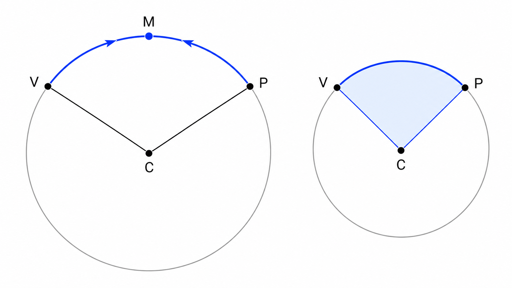
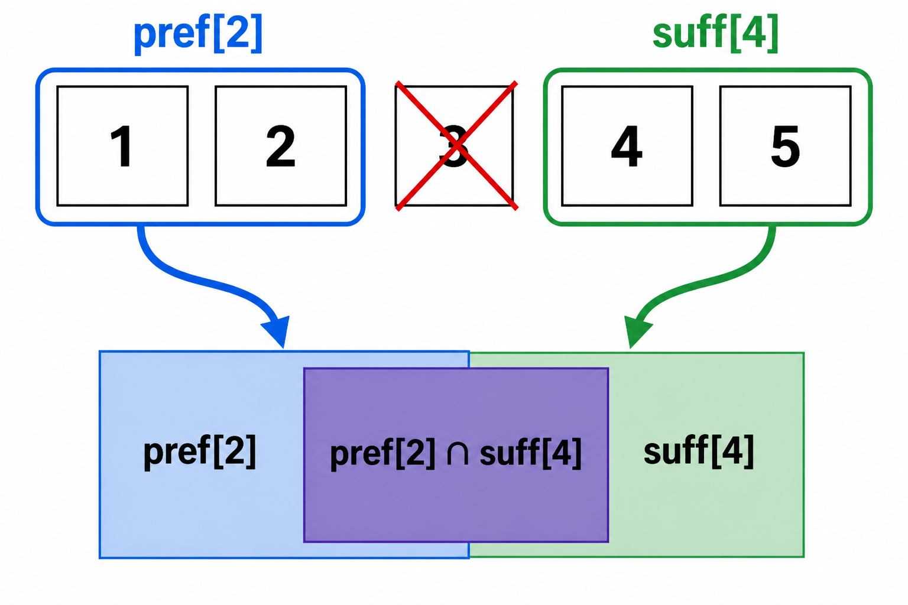
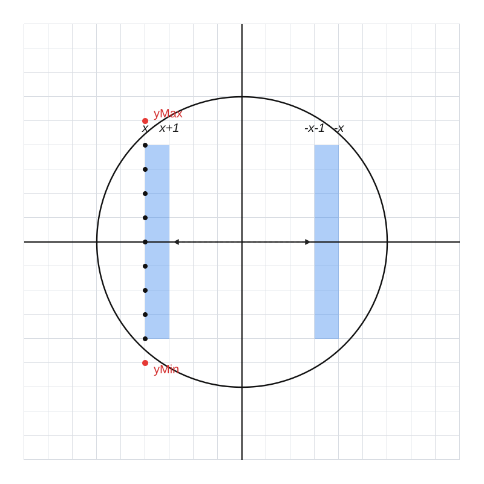
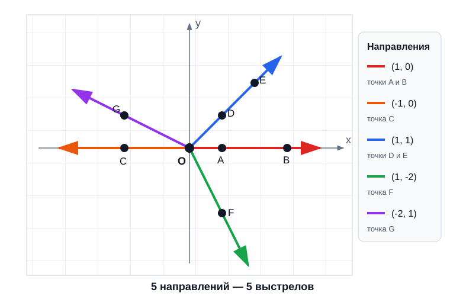

## A. Встреча на окружности

<details><summary><b>Идея</b></summary>

Друзья могут в любой момент выбирать направление движения, однако для минимального времени менять направление им не потребуется. Между двумя различными точками окружности существуют ровно две дуги. Если выбрать одну из них и двигаться навстречу друг другу, расстояние между друзьями вдоль этой дуги будет уменьшаться со скоростью $2$ метра в секунду, поскольку скорость каждого равна $1$.

Поэтому выгодно выбрать более короткую из двух дуг. Если её длина равна $L$, друзья встретятся через $t = \frac{L}{2}$.

Осталось найти длину кратчайшей дуги между заданными точками.



Чтобы работать с углами удобнее, сначала перенесём центр окружности в начало координат. Для этого вычтем координаты центра из координат обеих точек. Такой перенос не меняет ни радиус окружности, ни длины дуг.

После переноса полярные углы точек можно получить функцией `atan2`.

#### C++

```cpp
    // переносим окружность в начало координат:
    xv -= x0, yv -= y0;
    xp -= x0, yp -= y0;
    // считаем полярный угол для Васи и Пети:
    ld a1 = atan2l(yv, xv);
    ld a2 = atan2l(yp, xp);
```

#### Python

```python
    # переносим окружность в начало координат:
    xv -= x0
    yv -= y0
    xp -= x0
    yp -= y0
    # считаем полярный угол для Васи и Пети:
    a1 = math.atan2(yv, xv)
    a2 = math.atan2(yp, xp)
```

</details>

<details><summary><b>Наблюдения</b></summary>

Пусть полярные углы начальных точек равны $a_1$ и $a_2$. Функция `atan2` возвращает угол в диапазоне от $-\pi$ до $\pi$.

Сначала решение обеспечивает $a_1 \ge a_2$. Тогда разность $d = a_1 - a_2$ лежит в диапазоне от $0$ до $2\pi$ и задаёт величину одной из двух дуг в радианах. Вторая дуга дополняет первую до полной окружности, поэтому её угловая величина равна $2\pi-d$.

Следовательно, центральный угол, соответствующий кратчайшей дуге, равен $\min(d, 2\pi-d)$.

#### C++

```cpp
    // считаем минимальный угол между ними:
    if (a1 < a2) swap(a1, a2);
    ld minAngle = min(a1 - a2, a2 - a1 + 2 * pi);
```

#### Python

```python
    # считаем минимальный угол между ними:
    if a1 < a2:
        a1, a2 = a2, a1
    minAngle = min(a1 - a2, a2 - a1 + 2 * pi)
```

Выражение `a2 - a1 + 2 * pi` — это то же самое, что $2\pi-(a_1-a_2)$.

Если радиус окружности равен $R$, то длина дуги с центральным углом $\alpha$, измеренным в радианах, равна $R\alpha$. Поэтому длина кратчайшей дуги составляет $L = R \cdot \text{minAngle}$.

Радиус можно вычислить как расстояние от перенесённой точки Вани до начала координат:

$R = \sqrt{x_v^2+y_v^2}$

По условию обе точки лежат на одной окружности, поэтому использование любой из них даст один и тот же радиус.

</details>

<details><summary><b>Пример</b></summary>

В первом наборе данных центр окружности находится в точке $(0,0)$, а друзья стоят в точках $(1,0)$ и $(0,1)$.

Радиус окружности равен $1$, а меньший угол между радиусами равен $\pi/2$. Поэтому длина кратчайшей дуги равна

$L = 1 \cdot \frac{\pi}{2} = \frac{\pi}{2}$.

Друзья движутся навстречу друг другу с суммарной скоростью сближения $2$, значит, минимальное время равно

$t = \frac{L}{2} = \frac{\pi}{4}$.

Это приблизительно $0.785398163397448$.

Во втором наборе радиус равен $3$, а точки диаметрально противоположны. Обе соединяющие их дуги имеют угол $\pi$, поэтому длина кратчайшей дуги равна $3\pi$. Время встречи составляет

$t = \frac{3\pi}{2} \approx 4.712388980384690$.

</details>

<details><summary><b>Ответ</b></summary>

После нахождения минимального центрального угла вычисляется радиус, затем длина кратчайшей дуги делится на два.

#### C++

```cpp
    // находим ответ: делим длину дуги пополам, так как они двигаются навстречу друг другу
    ld R = hypot(xv, yv); // радиус окружности
    cout << R * minAngle / 2 << endl; // длина дуги
```

#### Python

```python
    # находим ответ: делим длину дуги пополам, так как они двигаются навстречу друг другу
    R = math.hypot(xv, yv) # радиус окружности
    print(f"{R * minAngle / 2:.12f}") # длина дуги
```

Формула итогового ответа имеет вид

$\text{answer} = \frac{R \cdot \text{minAngle}}{2}$.

Требуемая точность обеспечивается вещественными вычислениями и выводом достаточного количества знаков после запятой.

</details>

<details><summary><b>Корректность</b></summary>

Докажем, что алгоритм выводит минимальное возможное время встречи.

**Лемма 1.** Значение `minAngle` равно угловой величине кратчайшей дуги между начальными точками друзей.

После возможной перестановки углов выполняется $a_1 \ge a_2$. Поэтому одна из дуг имеет угловую величину $a_1-a_2$, а вторая — $2\pi-(a_1-a_2)$. Алгоритм выбирает минимум этих двух значений. Следовательно, `minAngle` соответствует кратчайшей дуге.

**Лемма 2.** Длина кратчайшей дуги равна $R \cdot \text{minAngle}$.

Длина дуги окружности радиуса $R$, опирающейся на центральный угол $\alpha$ радиан, равна $R\alpha$. По лемме 1 угол кратчайшей дуги равен `minAngle`, поэтому её длина равна $R \cdot \text{minAngle}$.

**Лемма 3.** Друзья не могут встретиться раньше чем через половину длины кратчайшей дуги.

Пусть длина этой дуги равна $L$. Скорость каждого друга равна $1$, поэтому расстояние между ними вдоль окружности может уменьшаться со скоростью не более $2$. Чтобы уменьшить начальное расстояние $L$ до нуля, требуется не менее $L/2$ секунд. Возможность менять направление не позволяет превысить эту скорость сближения.

**Лемма 4.** Друзья могут встретиться через $L/2$ секунд.

Оба друга могут выбрать кратчайшую дугу и двигаться по ней навстречу друг другу. В этом случае расстояние между ними уменьшается ровно на $2$ метра каждую секунду. Следовательно, через $L/2$ секунд их положения совпадут.

**Теорема.** Алгоритм выводит минимальное время встречи.

По леммам 1 и 2 алгоритм правильно находит длину кратчайшей дуги $L$. По лемме 3 встретиться раньше чем через $L/2$ невозможно, а по лемме 4 встреча через $L/2$ достижима. Алгоритм выводит именно это значение, поэтому его ответ оптимален.

</details>

<details><summary><b>Сложность</b></summary>

Для каждого набора выполняется постоянное число арифметических операций и вызовов математических функций.

Время работы одного набора составляет $O(1)$, а для всех наборов — $O(t)$.

Дополнительная память для одного набора составляет $O(1)$. При $t \le 10000$ алгоритм укладывается в ограничения.

</details>

<details><summary><b>Реализация на C++</b></summary>

#### C++

```cpp
#include <bits/stdc++.h>
using namespace std;
using ld = long double;
const ld pi = acosl(-1);
void solve() {
    // читаем данные:
    int x0, y0, xv, yv, xp, yp;
    cin >> x0 >> y0 >> xv >> yv >> xp >> yp;
    // переносим окружность в начало координат:
    xv -= x0, yv -= y0;
    xp -= x0, yp -= y0;
    // считаем полярный угол для Васи и Пети:
    ld a1 = atan2l(yv, xv);
    ld a2 = atan2l(yp, xp);
    // считаем минимальный угол между ними:
    if (a1 < a2) swap(a1, a2);
    ld minAngle = min(a1 - a2, a2 - a1 + 2 * pi);
    // находим ответ: делим длину дуги пополам, так как они двигаются навстречу друг другу
    ld R = hypot(xv, yv); // радиус окружности
    cout << R * minAngle / 2 << endl; // длина дуги
}
main() {
    cout << fixed << setprecision(12);
    ios::sync_with_stdio(false);
    cin.tie(0);
    int tt; cin >> tt;
    while (tt --> 0) solve();
}
```

</details>

<details><summary><b>Реализация на Python</b></summary>

#### Python

```python
import math
pi = math.acos(-1)
def solve():
    # читаем данные:
    x0, y0, xv, yv, xp, yp = map(int, input().split())
    # переносим окружность в начало координат:
    xv -= x0
    yv -= y0
    xp -= x0
    yp -= y0
    # считаем полярный угол для Васи и Пети:
    a1 = math.atan2(yv, xv)
    a2 = math.atan2(yp, xp)
    # считаем минимальный угол между ними:
    if a1 < a2:
        a1, a2 = a2, a1
    minAngle = min(a1 - a2, a2 - a1 + 2 * pi)
    # находим ответ: делим длину дуги пополам, так как они двигаются навстречу друг другу
    R = math.hypot(xv, yv) # радиус окружности
    print(f"{R * minAngle / 2:.12f}") # длина дуги
tt = int(input())
for _ in range(tt):
    solve()
```

</details>

## B. Один лишний прямоугольник

<details><summary><b>Идея</b></summary>

Сначала разберёмся, как выглядит пересечение нескольких прямоугольников, стороны которых параллельны координатным осям.

Чтобы точка принадлежала всем прямоугольникам одновременно, её координата $x$ должна быть не меньше каждой левой границы и не больше каждой правой границы. Поэтому границы общего пересечения равны:

- левая — максимум всех левых границ;
- нижняя — максимум всех нижних границ;
- правая — минимум всех правых границ;
- верхняя — минимум всех верхних границ.

Значит, пересечение двух прямоугольников также является прямоугольником и вычисляется независимо по четырём границам.

#### C++

```cpp
// пересечение двух прямоугольников:
Rect intersect(Rect a, Rect b) {
    return Rect(max(a.xMin, b.xMin), max(a.yMin, b.yMin),
                min(a.xMax, b.xMax), min(a.yMax, b.yMax));
}
```

#### Python

```python
# пересечение двух прямоугольников:
def intersect(a, b):
    return Rect(max(a.xMin, b.xMin), max(a.yMin, b.yMin),
                min(a.xMax, b.xMax), min(a.yMax, b.yMax))
```

Теперь попробуем перебрать прямоугольник, который будет удалён. Для каждого номера $i$ нужно найти пересечение всех прямоугольников, кроме $i$-го.

Если каждый раз пересекать оставшиеся $n-1$ прямоугольников заново, получится $O(n^2)$ операций. При $n$ до $200\,000$ такой подход не подходит.

Однако после удаления $i$-го прямоугольника остальные естественным образом распадаются на две части:

- прямоугольники с номерами от $1$ до $i-1$;
- прямоугольники с номерами от $i+1$ до $n$.

Если заранее знать пересечение каждого префикса и каждого суффикса, пересечение всех прямоугольников, кроме $i$-го, можно получить всего одной операцией:

$\text{intersect}(pref[i-1], suff[i+1])$.

Именно это позволяет проверить каждое возможное удаление за $O(1)$ после линейной предобработки.



</details>

<details><summary><b>Префиксные и суффиксные пересечения</b></summary>

Обозначим через `pref[i]` пересечение первых $i$ прямоугольников. Чтобы получить его, достаточно пересечь уже известное `pref[i-1]` с $i$-м прямоугольником.

В качестве `pref[0]` используется условный прямоугольник с границами от `-inf` до `+inf`. Он содержит любой прямоугольник из условия, поэтому пересечение с ним ничего не меняет. Благодаря этому первый прямоугольник обрабатывается той же формулой, что и все остальные.

#### C++

```cpp
    // Считаем пересечение прямоугольников на каждом префиксе:
    vector<Rect> pref(1+n+1, Rect(-inf,-inf,+inf,+inf));
    for (int i = 1; i <= n; i++)
        pref[i] = intersect(pref[i-1], Rect(x1[i], y1[i], x2[i], y2[i]));
```

#### Python

```python
    # считаем пересечение прямоугольников на каждом префиксе:
    pref = [Rect(-inf, -inf, +inf, +inf) for _ in range(1 + n + 1)]
    for i in range(1, n + 1):
        pref[i] = intersect(pref[i - 1], Rect(x1[i], y1[i], x2[i], y2[i]))
```

Аналогично определим `suff[i]` как пересечение прямоугольников с номерами от $i$ до $n$. Его удобно строить справа налево:

$suff[i] = intersect(suff[i+1], rect[i])$.

Значение `suff[n+1]` также является условным бесконечным прямоугольником. Оно понадобится, когда удаляется последний прямоугольник и справа от него ничего не остаётся.

#### C++

```cpp
    // Считаем пересечение прямоугольников на каждом суффиксе:
    vector<Rect> suff(1+n+1, Rect(-inf,-inf,+inf,+inf));
    for (int i = n; i >= 1; i--)
        suff[i] = intersect(suff[i+1], Rect(x1[i], y1[i], x2[i], y2[i]));
```

#### Python

```python
    # считаем пересечение прямоугольников на каждом суффиксе:
    suff = [Rect(-inf, -inf, +inf, +inf) for _ in range(1 + n + 1)]
    for i in range(n, 0, -1):
        suff[i] = intersect(suff[i + 1], Rect(x1[i], y1[i], x2[i], y2[i]))
```

Таким образом, для любого $i$ уже известны пересечения обеих частей, которые остаются после удаления $i$-го прямоугольника.

</details>

<details><summary><b>Площадь пересечения</b></summary>

У прямоугольника с границами `xMin`, `yMin`, `xMax`, `yMax` ширина и высота равны соответственно:

$xMax-xMin$ и $yMax-yMin$.

После пересечения может оказаться, что левая граница расположена правее правой или нижняя граница — выше верхней. Это означает, что пересечение пусто. Если границы совпали, пересечение выродилось в отрезок или точку. Во всех таких случаях по условию площадь должна быть равна нулю.

Поэтому ширина и высота ограничиваются снизу нулём.

#### C++

```cpp
    int64_t square() const {
        return int64_t(max(0, xMax-xMin))*max(0, yMax-yMin);
    }
```

#### Python

```python
    def square(self):
        return max(0, self.xMax - self.xMin) * max(0, self.yMax - self.yMin)
```

Координаты по модулю достигают $10^9$, поэтому длины сторон могут быть порядка $2 \cdot 10^9$, а площадь — порядка $4 \cdot 10^{18}$. В реализации на C++ для неё используется `int64_t`.

</details>

<details><summary><b>Выбор удаляемого прямоугольника</b></summary>

После построения массивов остаётся перебрать номер удаляемого прямоугольника.

Если удаляется прямоугольник $i$, то:

- `pref[i-1]` содержит пересечение всех прямоугольников слева от него;
- `suff[i+1]` содержит пересечение всех прямоугольников справа от него.

Их пересечение в точности совпадает с пересечением всех прямоугольников, кроме $i$-го.

#### C++

```cpp
    // Находим максимальную площадь пересечения всех прямоугольников, исключая i-й:
    int64_t bestS = -1, bestI = -1;
    for (int i = 1; i <= n; i++) {
        int64_t si = intersect(pref[i-1], suff[i+1]).square();
        if (bestS < si) bestS = si, bestI = i;
    }
    cout << bestI << ' ' << bestS << '\n';
```

#### Python

```python
    # находим максимальную площадь пересечения всех прямоугольников, исключая i-й:
    bestS, bestI = -1, -1
    for i in range(1, n + 1):
        si = intersect(pref[i - 1], suff[i + 1]).square()
        if bestS < si:
            bestS, bestI = si, i
    print(bestI, bestS)
```

Номера перебираются по возрастанию, а найденный ответ заменяется только при строго большей площади. Поэтому при равенстве площадей сохраняется первый, то есть наименьший подходящий номер.

Начальное значение площади равно $-1$, тогда как любая настоящая площадь неотрицательна. Следовательно, первый рассмотренный вариант обязательно станет текущим ответом.

</details>

<details><summary><b>Пример</b></summary>

В первом наборе данных заданы прямоугольники:

- первый: $[0,5] \times [0,5]$;
- второй: $[1,4] \times [1,4]$;
- третий: $[2,6] \times [0,3]$.

Проверим три возможных удаления.

Если удалить первый прямоугольник, останется пересечение второго и третьего:

$[2,4] \times [1,3]$,

его площадь равна $2 \cdot 2=4$.

Если удалить второй прямоугольник, пересечение первого и третьего равно:

$[2,5] \times [0,3]$,

его площадь равна $3 \cdot 3=9$.

Если удалить третий прямоугольник, пересечение первых двух равно:

$[1,4] \times [1,4]$,

его площадь также равна $9$.

Максимальная площадь достигается при удалении второго или третьего прямоугольника. Из-за требования выбрать наименьший номер ответом становится `2 9`.

</details>

<details><summary><b>Корректность</b></summary>

Докажем, что решение выбирает правильный прямоугольник и находит максимальную площадь.

**Лемма 1.** `pref[i]` является пересечением прямоугольников с номерами от $1$ до $i$.

Для $i=0$ значение `pref[0]` содержит любой допустимый прямоугольник и служит нейтральным элементом пересечения. Далее `pref[i]` получается пересечением `pref[i-1]` и $i$-го прямоугольника. Поэтому после каждого шага оно содержит пересечение ровно первых $i$ прямоугольников.

**Лемма 2.** `suff[i]` является пересечением прямоугольников с номерами от $i$ до $n$.

Значение `suff[n+1]` является нейтральным элементом. При движении справа налево `suff[i]` получается пересечением $i$-го прямоугольника с уже найденным пересечением прямоугольников от $i+1$ до $n$. Следовательно, утверждение выполняется для каждого $i$.

**Лемма 3.** Для каждого номера $i$ выражение `intersect(pref[i-1], suff[i+1])` даёт пересечение всех прямоугольников, кроме $i$-го.

По лемме 1 первый аргумент является пересечением прямоугольников от $1$ до $i-1$. По лемме 2 второй аргумент является пересечением прямоугольников от $i+1$ до $n$. Эти две группы вместе содержат все прямоугольники, кроме $i$-го. Значит, их пересечение и есть требуемый результат после удаления $i$-го прямоугольника.

**Теорема.** Алгоритм выводит наименьший номер прямоугольника, удаление которого даёт максимально возможную площадь.

Алгоритм перебирает каждый допустимый номер удаления. По лемме 3 для каждого номера вычисляется именно пересечение всех оставшихся прямоугольников, а затем его площадь. Следовательно, среди рассмотренных значений присутствуют площади всех возможных результатов.

Алгоритм сохраняет вариант с максимальной площадью. При равенстве текущий ответ не заменяется, поэтому благодаря перебору по возрастанию остаётся наименьший номер. Значит, выведенные номер и площадь удовлетворяют всем требованиям задачи.

</details>

<details><summary><b>Сложность</b></summary>

Построение префиксных пересечений занимает $O(n)$ времени, построение суффиксных — ещё $O(n)$, а перебор удаляемого прямоугольника — $O(n)$. Общая сложность одного набора данных составляет $O(n)$.

Массивы `pref` и `suff` хранят по одному прямоугольнику для каждой позиции, поэтому дополнительная память составляет $O(n)$.

Сумма $n$ по всем наборам не превосходит $200\,000$, следовательно, суммарное время работы составляет $O(\sum n)$.

</details>

<details><summary><b>Реализация на C++</b></summary>

#### C++

```cpp
#include <bits/stdc++.h>
using namespace std;
// структура данных для хранения прямоугольника:
struct Rect {
    int xMin, yMin, xMax, yMax;
    Rect(int x1, int y1, int x2, int y2)
        : xMin(x1), yMin(y1), xMax(x2), yMax(y2) {}
    int64_t square() const {
        return int64_t(max(0, xMax-xMin))*max(0, yMax-yMin);
    }
};
// пересечение двух прямоугольников:
Rect intersect(Rect a, Rect b) {
    return Rect(max(a.xMin, b.xMin), max(a.yMin, b.yMin),
                min(a.xMax, b.xMax), min(a.yMax, b.yMax));
}
// решение задачи:
const int inf = (int)1e9+7;
void solve() {
    // читаем прямоугольники:
    int n; cin >> n;
    vector<int> x1(1+n+1,-inf), y1(1+n+1,-inf),
                x2(1+n+1,+inf), y2(1+n+1,+inf);
    for (int i = 1; i <= n; i++) cin >> x1[i];
    for (int i = 1; i <= n; i++) cin >> y1[i];
    for (int i = 1; i <= n; i++) cin >> x2[i];
    for (int i = 1; i <= n; i++) cin >> y2[i];
    // Считаем пересечение прямоугольников на каждом префиксе:
    vector<Rect> pref(1+n+1, Rect(-inf,-inf,+inf,+inf));
    for (int i = 1; i <= n; i++)
        pref[i] = intersect(pref[i-1], Rect(x1[i], y1[i], x2[i], y2[i]));
    // Считаем пересечение прямоугольников на каждом суффиксе:
    vector<Rect> suff(1+n+1, Rect(-inf,-inf,+inf,+inf));
    for (int i = n; i >= 1; i--)
        suff[i] = intersect(suff[i+1], Rect(x1[i], y1[i], x2[i], y2[i]));
    // Находим максимальную площадь пересечения всех прямоугольников, исключая i-й:
    int64_t bestS = -1, bestI = -1;
    for (int i = 1; i <= n; i++) {
        int64_t si = intersect(pref[i-1], suff[i+1]).square();
        if (bestS < si) bestS = si, bestI = i;
    }
    cout << bestI << ' ' << bestS << '\n';
}   
main() {
    ios::sync_with_stdio(false);
    cin.tie(0);
    int tt; cin >> tt;
    while (tt --> 0) solve();
}
```

</details>

<details><summary><b>Реализация на Python</b></summary>

#### Python

```python
# структура данных для хранения прямоугольника:
class Rect:
    def __init__(self, x1, y1, x2, y2):
        self.xMin = x1
        self.yMin = y1
        self.xMax = x2
        self.yMax = y2
    def square(self):
        return max(0, self.xMax - self.xMin) * max(0, self.yMax - self.yMin)
# пересечение двух прямоугольников:
def intersect(a, b):
    return Rect(max(a.xMin, b.xMin), max(a.yMin, b.yMin),
                min(a.xMax, b.xMax), min(a.yMax, b.yMax))
# решение задачи:
inf = 10**9 + 7
def solve():
    # читаем прямоугольники:
    n = int(input())
    x1 = [-inf] + list(map(int, input().split())) + [-inf]
    y1 = [-inf] + list(map(int, input().split())) + [-inf]
    x2 = [+inf] + list(map(int, input().split())) + [+inf]
    y2 = [+inf] + list(map(int, input().split())) + [+inf]
    # считаем пересечение прямоугольников на каждом префиксе:
    pref = [Rect(-inf, -inf, +inf, +inf) for _ in range(1 + n + 1)]
    for i in range(1, n + 1):
        pref[i] = intersect(pref[i - 1], Rect(x1[i], y1[i], x2[i], y2[i]))
    # считаем пересечение прямоугольников на каждом суффиксе:
    suff = [Rect(-inf, -inf, +inf, +inf) for _ in range(1 + n + 1)]
    for i in range(n, 0, -1):
        suff[i] = intersect(suff[i + 1], Rect(x1[i], y1[i], x2[i], y2[i]))
    # находим максимальную площадь пересечения всех прямоугольников, исключая i-й:
    bestS, bestI = -1, -1
    for i in range(1, n + 1):
        si = intersect(pref[i - 1], suff[i + 1]).square()
        if bestS < si:
            bestS, bestI = si, i
    print(bestI, bestS)
tt = int(input())
for _ in range(tt):
    solve()
```

</details>

## C. Клетки под куполом

<details><summary><b>Идея</b></summary>

На первый взгляд положение круга относительно клетчатой плоскости может влиять на ответ. Однако координаты его центра целые. Если перенести всю картину на вектор $(-x_0,-y_0)$, центр окажется в точке $(0,0)$, а все линии сетки по-прежнему будут иметь целочисленные координаты. Значит, набор клеток относительно круга не изменится, поэтому координаты центра можно больше не учитывать.

#### C++

```cpp
    ll x0, y0, r;
    cin >> x0 >> y0 >> r;
    // переносим окружность в (0, 0), т.е. просто игнорируем координаты центра
```

#### Python

```python
    x0, y0, r = map(int, input().split())
    # переносим окружность в (0, 0), то есть просто игнорируем координаты центра
```

Теперь круг задаётся неравенством

$x^2+y^2 \le r^2$.

Перебирать все клетки внутри квадрата со стороной $2r$ слишком долго: их количество имеет порядок $r^2$. Вместо этого будем считать клетки по вертикальным столбцам.

Рассмотрим целое $x<0$ и столбец клеток между вертикальными прямыми $x$ и $x+1$. Поскольку весь столбец находится слева от центра, прямая с координатой $x$ удалена от центра сильнее, чем прямая $x+1$. Поэтому самые удалённые от центра вершины каждой клетки этого столбца лежат на его левой границе.

Значит, чтобы понять, какие клетки столбца целиком находятся в круге, достаточно определить целочисленные точки на прямой с абсциссой $x$, принадлежащие кругу.



</details>

<details><summary><b>Подсчёт клеток в одном столбце</b></summary>

Для фиксированного $x$ будем искать две ближайшие целочисленные точки вне круга:

- `yMax` — первую внешнюю точку при движении вверх от нуля;
- `yMin` — первую внешнюю точку при движении вниз от нуля.

Точка $(x,y)$ принадлежит кругу тогда и только тогда, когда выполняется $x^2+y^2 \le r^2$. Граница включена в круг, поэтому в проверке используется нестрогое неравенство.

После поиска внешних точек внутри круга находятся все целочисленные точки с ординатами от $\text{yMin}+1$ до $\text{yMax}-1$.

Клетка между уровнями $y$ и $y+1$ целиком помещается в круг, если обе соответствующие точки на дальней границе столбца находятся внутри. Поэтому допустимые нижние границы клеток идут от $\text{yMin}+1$ до $\text{yMax}-2$. Количество таких клеток равно

$\text{yMax}-\text{yMin}-2$.

Если места не хватает даже для одной клетки, берётся максимум с нулём.

Начальные значения указателей и ответа имеют следующий вид.

#### C++

```cpp
    ll yMax = 0, yMin = 0, answ = 0;
```

#### Python

```python
    yMax, yMin, answ = 0, 0, 0
```

</details>

<details><summary><b>Два указателя</b></summary>

Осталось понять, как быстро находить границы каждого следующего столбца.

Мы перебираем $x$ от $-r$ до $-1$. При таком движении столбцы приближаются к центру круга, поэтому допустимый вертикальный отрезок только расширяется. Следовательно, `yMax` может лишь увеличиваться, а `yMin` — уменьшаться. Нет необходимости начинать их поиск заново для каждого $x$: достаточно продолжать движение с границ, найденных для предыдущего столбца.

Для текущего $x$ верхний указатель увеличивается, пока точка остаётся внутри круга. После остановки `yMax` указывает на первую внешнюю точку сверху. Нижний указатель аналогично движется вниз и останавливается на первой внешней точке снизу.

#### C++

```cpp
    for (ll x = -r; x < 0; x++) {
        while (x*x+yMax*yMax <= r*r) yMax++;
        while (x*x+yMin*yMin <= r*r) yMin--;
        answ += max<ll>(0, yMax - yMin - 2);
    }
```

#### Python

```python
    for x in range(-r, 0):
        while x * x + yMax * yMax <= r * r:
            yMax += 1
        while x * x + yMin * yMin <= r * r:
            yMin -= 1
        answ += max(0, yMax - yMin - 2)
```

Таким способом подсчитываются все подходящие клетки в левой полуплоскости. Ни одна клетка не пересекает вертикальную ось внутри себя, поскольку ось $x=0$ является линией сетки. Каждой клетке слева соответствует ровно одна зеркальная клетка справа, поэтому полученное количество нужно удвоить.

</details>

<details><summary><b>Пример</b></summary>

Рассмотрим круг радиуса $2$.

Для $x=-2$ внутри круга лежит только точка $(-2,0)$. Одной точки недостаточно, чтобы между соседними горизонтальными линиями образовалась целая клетка, поэтому этот столбец ничего не добавляет.

Для $x=-1$ внутри круга находятся точки с ординатами $-1$, $0$ и $1$. Между ними помещаются две клетки: одна между уровнями $-1$ и $0$, другая — между $0$ и $1$.

Итак, в левой половине находятся две клетки. После отражения относительно оси $y$ получаем ещё две, поэтому ответ равен $4$.

</details>

<details><summary><b>Ответ</b></summary>

Переменная `answ` содержит число клеток в левой полуплоскости. Благодаря симметрии круга относительно вертикальной оси итоговый ответ равен `answ * 2`.

#### C++

```cpp
    cout << answ * 2 << "\n";
```

#### Python

```python
    print(answ * 2)
```

</details>

<details><summary><b>Корректность</b></summary>

Докажем, что алгоритм считает все клетки, целиком содержащиеся в круге, и не учитывает лишних.

**Лемма 1.** Перенос центра круга в начало координат не меняет ответ.

Координаты $x_0$ и $y_0$ целые, поэтому перенос на вектор $(-x_0,-y_0)$ переводит каждую линию исходной целочисленной сетки в другую линию той же сетки. Клетки взаимно однозначно переходят в клетки, а принадлежность их точек кругу сохраняется. Следовательно, число полностью содержащихся клеток не меняется.

**Лемма 2.** Для клетки левого столбца между прямыми $x$ и $x+1$ достаточно проверить две её вершины на прямой $x$.

Здесь $x<0$ и $x+1\le 0$, поэтому $|x|\ge |x+1|$. При одинаковой ординате точка на прямой $x$ находится от центра не ближе соответствующей точки на прямой $x+1$. Следовательно, наиболее удалённые от центра вершины клетки лежат на прямой $x$.

Если обе вершины на этой прямой принадлежат выпуклому кругу, то вся соединяющая их левая сторона принадлежит кругу. Соответствующие точки правой стороны находятся не дальше от центра, а весь прямоугольник является выпуклой оболочкой своих вершин. Значит, вся клетка содержится в круге. Обратное также очевидно: если клетка содержится целиком, обе её левые вершины принадлежат кругу.

**Лемма 3.** Для фиксированного $x$ алгоритм правильно находит количество подходящих клеток столбца.

После завершения первого цикла `yMax` является первой целочисленной ординатой сверху, для которой точка $(x,\text{yMax})$ находится вне круга. Аналогично `yMin` является первой внешней ординатой снизу. Поэтому внутренние целочисленные точки имеют ординаты от $\text{yMin}+1$ до $\text{yMax}-1$.

Каждая пара соседних внутренних точек задаёт ровно одну клетку, целиком содержащуюся в круге по лемме 2. Число таких пар равно $\text{yMax}-\text{yMin}-2$, а если их нет, алгоритм добавляет ноль. Следовательно, вклад столбца вычисляется правильно.

**Лемма 4.** Использование указателей не пропускает подходящие границы.

При увеличении $x$ от $-r$ до $-1$ значение $x^2$ не возрастает. Поэтому если точка с некоторой ординатой принадлежала кругу в предыдущем столбце, то она принадлежит ему и в текущем. Верхняя граница внутренних точек может только подниматься, а нижняя — только опускаться. Значит, продолжение поиска с прежних значений `yMax` и `yMin` корректно.

**Теорема.** Алгоритм выводит количество всех единичных клеток, целиком содержащихся в круге.

По лемме 3 алгоритм правильно считает подходящие клетки каждого столбца в левой полуплоскости. Перебираются все такие столбцы от $x=-r$ до $x=-1$, поэтому ни одна левая клетка не пропускается.

Круг симметричен относительно оси $y$, и эта ось является линией сетки. Поэтому каждой учтённой клетке слева соответствует ровно одна подходящая клетка справа, и наоборот. Удвоение подсчитанного значения даёт количество всех подходящих клеток.

</details>

<details><summary><b>Сложность</b></summary>

Цикл перебирает $r$ вертикальных столбцов. Указатель `yMax` за всё время только увеличивается, а `yMin` только уменьшается; каждый из них совершает $O(r)$ перемещений. Поэтому время работы одного набора данных составляет $O(r)$.

С учётом ограничения на сумму радиусов общее время равно $O(\sum r)$, где $\sum r\le 200\,000$.

Алгоритм использует $O(1)$ дополнительной памяти.

Квадраты координат и количество клеток могут не помещаться в 32-битный тип, поэтому в реализации на C++ используются 64-битные целые числа.

</details>

<details><summary><b>Реализация на C++</b></summary>

#### C++

```cpp
#include <bits/stdc++.h>
using namespace std;
using ll = long long;
void solve() {
    ll x0, y0, r;
    cin >> x0 >> y0 >> r;
    // переносим окружность в (0, 0), т.е. просто игнорируем координаты центра
    // далее идём вдоль левой полуплоскости и для каждого x находим границы столбца
    // [yMin+1, yMax-1], который целиком влезает в окружность. Прибавляем его высоту.
    // Используем два указателя, чтобы эффективно переходить от "x" к "(x-1)".
    ll yMax = 0, yMin = 0, answ = 0;
    for (ll x = -r; x < 0; x++) {
        while (x*x+yMax*yMax <= r*r) yMax++;
        while (x*x+yMin*yMin <= r*r) yMin--;
        answ += max<ll>(0, yMax - yMin - 2);
    }
    cout << answ * 2 << "\n";
}
main() {
    ios::sync_with_stdio(false);
    cin.tie(0);
    int tt; cin >> tt;
    while (tt --> 0) solve();
}
```

</details>

<details><summary><b>Реализация на Python</b></summary>

#### Python

```python
def solve():
    x0, y0, r = map(int, input().split())
    # переносим окружность в (0, 0), то есть просто игнорируем координаты центра
    # далее идём вдоль левой полуплоскости и для каждого x находим границы столбца
    # [yMin+1, yMax-1], который целиком влезает в окружность. Прибавляем его высоту.
    # используем два указателя, чтобы эффективно переходить от x к (x-1).
    yMax, yMin, answ = 0, 0, 0
    for x in range(-r, 0):
        while x * x + yMax * yMax <= r * r:
            yMax += 1
        while x * x + yMin * yMin <= r * r:
            yMin -= 1
        answ += max(0, yMax - yMin - 2)
    print(answ * 2)
tt = int(input())
for _ in range(tt):
    solve()
```

</details>

## D. Лазер Олега

<details><summary><b>Идея</b></summary>

Сначала зафиксируем точку, в которой находится Олег. Саму её он уничтожает ножом, поэтому остаётся понять, сколько выстрелов потребуется для остальных точек.

Один выстрел задаётся не прямой, а **направленным лучом**. Если несколько точек лежат на одном луче, ближайшая из них не мешает лазеру уничтожить остальные, поэтому все они уничтожаются одним выстрелом. Если же две точки видны из позиции Олега в разных направлениях, одним лучом попасть в обе невозможно.

Значит, для фиксированной позиции Олега минимальное количество выстрелов равно количеству различных направлений из неё в остальные точки.

Особенно важно, что противоположные направления считаются разными. Даже если две точки и Олег лежат на одной прямой, но точки находятся по разные стороны от него, потребуются два выстрела.



На схеме точки $A$ и $B$ находятся на одном луче из $O$, поэтому уничтожаются одним выстрелом. То же верно для точек $D$ и $E$. При этом лучи к $A$ и $C$ направлены в противоположные стороны, а значит, соответствуют разным выстрелам.

Теперь задача стала проще: нужно по очереди рассмотреть каждую заданную точку как позицию Олега, посчитать число различных направлений из неё и выбрать минимум.

</details>

<details><summary><b>Как сравнивать направления</b></summary>

Пусть Олег находится в точке $i$, а очередная цель — точка $j$. Направление к ней задаётся вектором

$(\Delta x,\Delta y)=(x_j-x_i,\ y_j-y_i)$.

Однако непосредственно складывать такие векторы в множество нельзя. Например, векторы $(1,2)$, $(2,4)$ и $(3,6)$ имеют разные координаты, но задают один и тот же луч.

Чтобы получить единое представление направления, разделим обе координаты на

$g=\gcd(|\Delta x|,|\Delta y|)$.

После этого вектор становится примитивным: его координаты больше нельзя одновременно сократить. Например,

$(2,4)\rightarrow(1,2)$,

$(3,6)\rightarrow(1,2)$.

Таким образом, все точки на одном луче дадут одну и ту же пару.

#### C++

```cpp
                // Вектор из точки (x[i], y[i]) в точку (x[j], y[j]):
                int dx = x[j] - x[i], dy = y[j] - y[i];
                // Нормализуем, сокращая на gcd:
                int g = gcd(abs(dx), abs(dy));
                dx /= g;
                dy /= g;
                // Вставляем в set:
                vectors.insert({dx, dy});
```

#### Python

```python
                # вектор из точки (x[i], y[i]) в точку (x[j], y[j]):
                dx, dy = x[j] - x[i], y[j] - y[i]
                # нормализуем, сокращая на НОД:
                g = math.gcd(abs(dx), abs(dy))
                dx //= g
                dy //= g
                # вставляем в set:
                vectors.add((dx, dy))
```

Знак дополнительно изменять нельзя. Векторы $(1,2)$ и $(-1,-2)$ лежат на одной прямой, но направлены в разные стороны, поэтому должны остаться разными.

Такой способ также корректно работает для вертикальных и горизонтальных направлений:

- все направленные вправо векторы превращаются в $(1,0)$;
- все направленные влево — в $(-1,0)$;
- направленные вверх — в $(0,1)$;
- направленные вниз — в $(0,-1)$.

Нулевого вектора не возникает, поскольку точка $j=i$ пропускается, а все заданные точки попарно различны.

</details>

<details><summary><b>Выбор точки</b></summary>

Для каждой возможной позиции $i$ создадим пустое множество нормализованных векторов. Затем переберём остальные точки и добавим в множество направление к каждой из них.

Одинаковые направления автоматически объединятся, поэтому размер множества будет равен минимальному количеству выстрелов из точки $i$.

#### C++

```cpp
    for (int i = 0; i < n; i++) {
        set<pair<int,int>> vectors;
        for (int j = 0; j < n; j++)
            if (i != j) {
                // Вектор из точки (x[i], y[i]) в точку (x[j], y[j]):
                int dx = x[j] - x[i], dy = y[j] - y[i];
                // Нормализуем, сокращая на gcd:
                int g = gcd(abs(dx), abs(dy));
                dx /= g;
                dy /= g;
                // Вставляем в set:
                vectors.insert({dx, dy});
            }
        answ = min(answ, make_pair((int)vectors.size(), i+1));
    }
```

#### Python

```python
    for i in range(n):
        vectors = set()
        for j in range(n):
            if i != j:
                # вектор из точки (x[i], y[i]) в точку (x[j], y[j]):
                dx, dy = x[j] - x[i], y[j] - y[i]
                # нормализуем, сокращая на НОД:
                g = math.gcd(abs(dx), abs(dy))
                dx //= g
                dy //= g
                # вставляем в set:
                vectors.add((dx, dy))
        answ = min(answ, (len(vectors), i + 1))
```

Нужно минимизировать сначала количество выстрелов, а при равенстве — номер точки. Поэтому удобно хранить ответ в виде пары

$(\text{число выстрелов},\text{номер точки})$.

Обычное сравнение пар сначала сравнивает первые компоненты, а затем вторые. Следовательно, минимум среди таких пар сразу учитывает оба требования задачи.

Начальное значение заведомо хуже любого допустимого ответа:

#### C++

```cpp
    const int inf = (int)1e9;
    auto answ = make_pair(inf, -1);
```

#### Python

```python
    inf = 10**9
    answ = (inf, -1)
```

</details>

<details><summary><b>Пример</b></summary>

В первом примере все четыре точки лежат на одной горизонтальной прямой и перечислены слева направо.

Если Олег встанет в первую точку, направления ко всем остальным точкам после нормализации будут одинаковыми:

$(1,0),\ (1,0),\ (1,0)$.

В множестве останется один вектор, поэтому потребуется один выстрел.

Если же встать во внутреннюю точку, часть целей окажется слева, а часть — справа. Тогда появятся два направления: $(-1,0)$ и $(1,0)$. Такой выбор хуже.

Следовательно, оптимальны крайние точки. Среди них выбирается точка с меньшим номером, поэтому ответ равен `1 1`.

Во втором примере точки образуют крест. Если встать в левую точку, направления к центру и правой точке совпадут, а к верхней и нижней точкам будут различными. Всего получится три направления, поэтому ответ равен `1 3`.

</details>

<details><summary><b>Ответ</b></summary>

В паре `answ` сначала хранится минимальное количество выстрелов, а затем номер выбранной точки. Для вывода компоненты распаковываются в обратном порядке.

#### C++

```cpp
    // выводим ответ:
    auto [count, index] = answ;
    cout << index << ' ' << count << '\n';
```

#### Python

```python
    # выводим ответ:
    count, index = answ
    print(index, count)
```

</details>

<details><summary><b>Корректность</b></summary>

Докажем, что алгоритм выбирает требуемую точку и находит минимальное количество выстрелов.

**Лемма 1.** Две цели можно уничтожить одним выстрелом из точки $i$ тогда и только тогда, когда их нормализованные направляющие векторы совпадают.

Если цели лежат на одном направленном луче, векторы к ним отличаются умножением на положительный коэффициент. Поскольку их координаты целые, после деления каждой пары координат на её наибольший общий делитель оба вектора превращаются в один и тот же примитивный вектор.

Обратно, если нормализованные векторы совпали, исходные векторы являются положительными целыми кратными одного примитивного вектора. Следовательно, обе цели лежат на одном луче из точки $i$ и уничтожаются одним выстрелом.

Противоположные лучи при этом не объединяются: их нормализованные векторы отличаются знаками.

**Лемма 2.** Для фиксированной точки $i$ размер множества `vectors` равен минимальному количеству выстрелов.

По лемме 1 все цели с одинаковым нормализованным вектором и только они лежат на одном луче. Одним выстрелом можно уничтожить каждую такую группу.

С другой стороны, цели из разных групп находятся на разных направленных лучах, поэтому один выстрел не может уничтожить точки из двух групп. Значит, требуется ровно по одному выстрелу на каждый элемент множества `vectors`.

**Теорема.** Алгоритм выводит наименьший номер точки, из которой требуется минимальное количество выстрелов.

Алгоритм рассматривает каждую заданную точку как возможную позицию Олега. По лемме 2 для каждой позиции он правильно вычисляет минимальное количество необходимых выстрелов.

Затем выбирается минимальная пара вида $(\text{количество выстрелов},\text{номер})$. Поэтому сначала минимизируется количество выстрелов, а среди позиций с одинаковым результатом выбирается наименьший номер. Следовательно, выведенный ответ удовлетворяет условию.

</details>

<details><summary><b>Сложность</b></summary>

Для каждой из $n$ возможных позиций перебираются остальные $n-1$ точек, поэтому выполняется $O(n^2)$ вычислений направлений.

В реализации на C++ направления хранятся в `set`, и одна вставка занимает $O(\log n)$. Поэтому время работы составляет $O(n^2\log n)$.

В реализации на Python используется хеш-множество. В среднем вставка занимает $O(1)$, поэтому без учёта стоимости вычисления НОД время составляет $O(n^2)$. Само вычисление НОД работает за логарифмическое время от величины координат.

В каждый момент хранится множество не более чем из $n-1$ направлений, поэтому дополнительная память составляет $O(n)$.

Так как сумма $n$ по всем наборам не превосходит $1500$, максимальное суммарное число рассматриваемых пар имеет порядок $1500^2$, что укладывается в ограничения.

</details>

<details><summary><b>Реализация на C++</b></summary>

#### C++

```cpp
#include <bits/stdc++.h>
using namespace std;
void solve() {
    // читаем данные:
    int n; cin >> n;
    vector<int> x(n), y(n);
    for (auto &it : x) cin >> it;
    for (auto &it : y) cin >> it;
    // переберём точку, в которую встанем: для неё ответом является количество уникальных
    // направляющих векторов из неё до других точек множества.
    const int inf = (int)1e9;
    auto answ = make_pair(inf, -1);
    for (int i = 0; i < n; i++) {
        set<pair<int,int>> vectors;
        for (int j = 0; j < n; j++)
            if (i != j) {
                // Вектор из точки (x[i], y[i]) в точку (x[j], y[j]):
                int dx = x[j] - x[i], dy = y[j] - y[i];
                // Нормализуем, сокращая на gcd:
                int g = gcd(abs(dx), abs(dy));
                dx /= g;
                dy /= g;
                // Вставляем в set:
                vectors.insert({dx, dy});
            }
        answ = min(answ, make_pair((int)vectors.size(), i+1));
    }
    // выводим ответ:
    auto [count, index] = answ;
    cout << index << ' ' << count << '\n';
}
main() {
    ios::sync_with_stdio(false);
    cin.tie(0);
    int tt; cin >> tt;
    while (tt --> 0) solve();
}
```

</details>

<details><summary><b>Реализация на Python</b></summary>

#### Python

```python
import math
def solve():
    # читаем данные:
    n = int(input())
    x = list(map(int, input().split()))
    y = list(map(int, input().split()))
    # переберём точку, в которую встанем: для неё ответом является количество уникальных
    # направляющих векторов из неё до других точек множества.
    inf = 10**9
    answ = (inf, -1)
    for i in range(n):
        vectors = set()
        for j in range(n):
            if i != j:
                # вектор из точки (x[i], y[i]) в точку (x[j], y[j]):
                dx, dy = x[j] - x[i], y[j] - y[i]
                # нормализуем, сокращая на НОД:
                g = math.gcd(abs(dx), abs(dy))
                dx //= g
                dy //= g
                # вставляем в set:
                vectors.add((dx, dy))
        answ = min(answ, (len(vectors), i + 1))
    # выводим ответ:
    count, index = answ
    print(index, count)
tt = int(input())
for _ in range(tt):
    solve()
```

</details>