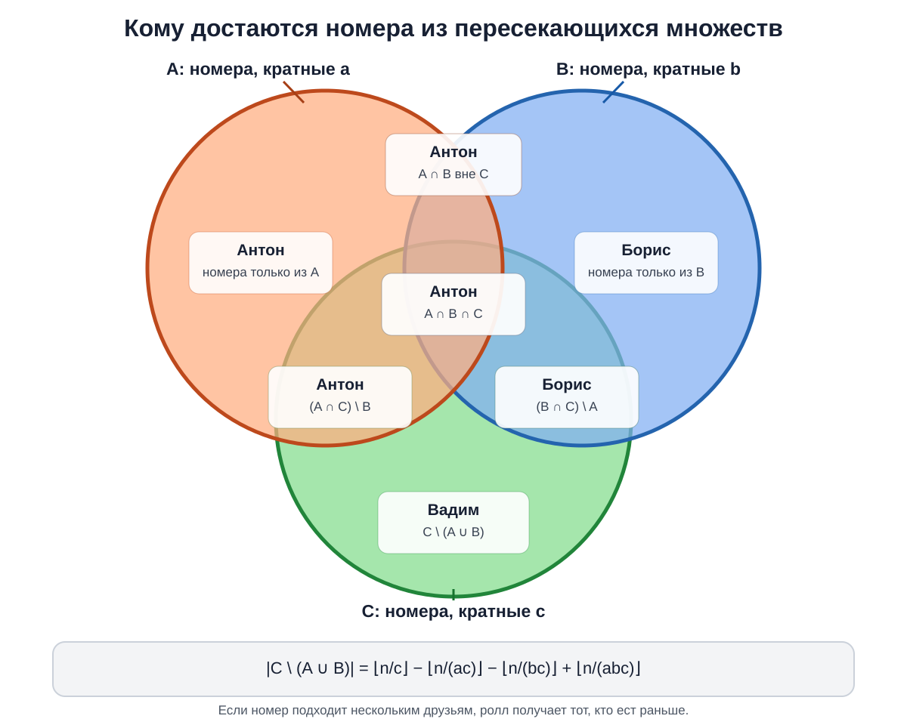
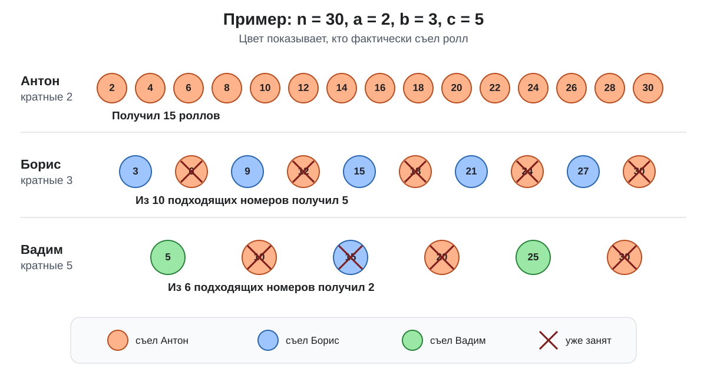
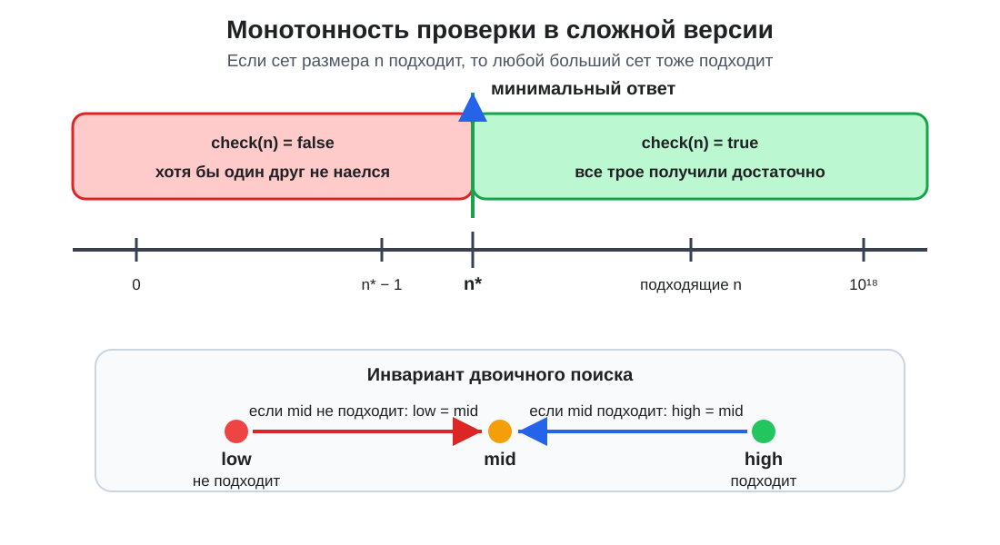
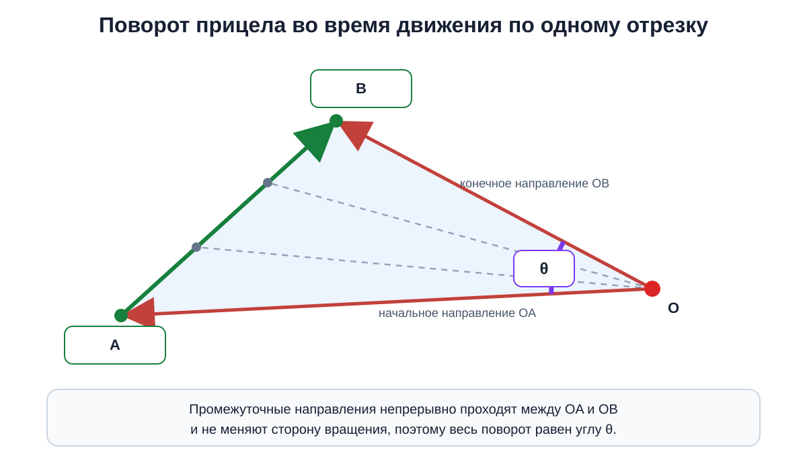
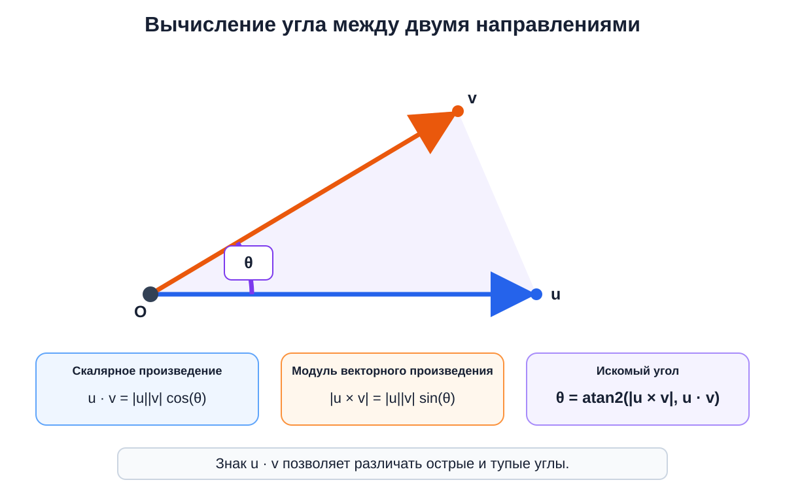
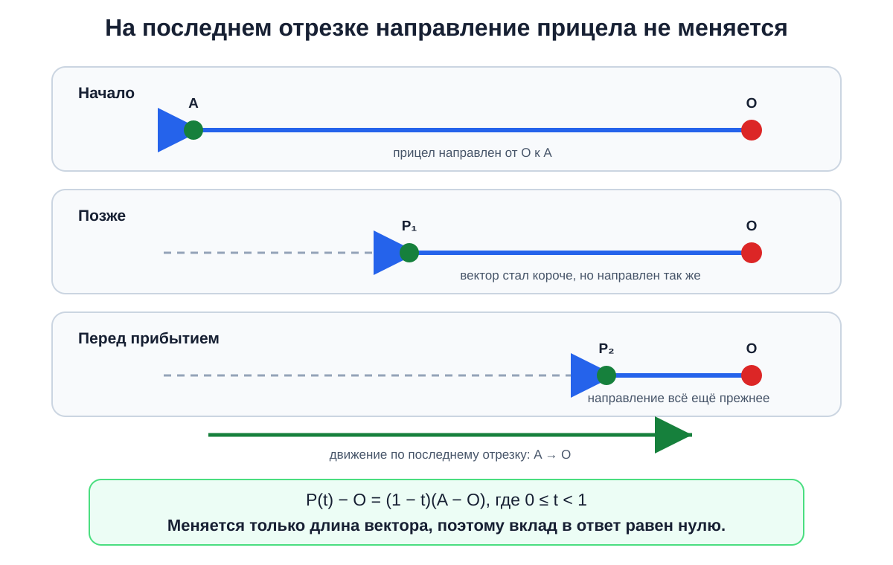

## A. Псевдокод Евклида

<details><summary><b>Основная идея</b></summary>

Количество итераций алгоритма Евклида максимально, когда остатки уменьшаются **настолько медленно, насколько это возможно**. Это происходит на соседних числах Фибоначчи: при делении каждого числа на предыдущее получается следующее число Фибоначчи.

Более того, если алгоритм выполняет $k$ операций, первое число пары не может быть меньше $F_{k+2}$. Поэтому для границы $r$ достаточно найти **наибольшее число Фибоначчи, не превосходящее $r$**, и вывести его вместе с предыдущим.

Для каждого запроса числа Фибоначчи последовательно строятся до достижения границы.

- Время: $O(\log(r))$ на запрос.
- Дополнительная память: $O(\log(r))$ на запрос.

</details>

<details><summary><b>Детальный разбор</b></summary>

Перебирать все допустимые пары невозможно: для одной границы существует порядка $r^2$ вариантов, а сама граница может достигать $10^{18}$. Поэтому нужно понять, **на каких числах алгоритм Евклида работает дольше всего**.

Рассмотрим последовательность чисел, возникающих в алгоритме:

$a=x_0,\quad b=x_1,\quad x_2,\quad x_3,\ldots$

Каждая итерация вычисляет очередной остаток. Поэтому для некоторого целого $q_i\ge 1$ выполняется

$x_{i-1}=q_i x_i+x_{i+1}$.

Положительные остатки строго уменьшаются. Чтобы итераций было как можно больше при ограничении на исходные числа, остатки должны уменьшаться **минимально возможным образом**. Для этого на всех промежуточных шагах нужно брать наименьшее допустимое частное, то есть $q_i=1$. Тогда

$x_{i-1}=x_i+x_{i+1}$.

Именно такое соотношение задаёт числа Фибоначчи в обратном порядке.

Осталось аккуратно получить нижнюю границу на исходные числа. Пусть алгоритм совершает $k$ операций. Последняя операция делит предпоследний положительный остаток на последний:

- последний ненулевой остаток не меньше $1$;
- предыдущий остаток не меньше $2$, поскольку он больше последнего и делится на него без остатка;
- каждый более ранний остаток не меньше суммы двух следующих.

Таким образом, минимально возможная последовательность с конца выглядит так:

$1,\ 2,\ 3,\ 5,\ 8,\ldots$

Следовательно, если алгоритм выполняет $k$ операций, то обязательно

$a\ge F_{k+2},\qquad b\ge F_{k+1}$,

где $F_1=F_2=1$.

Эта оценка **достигается** на соседних числах Фибоначчи. Например:

$F_m\bmod F_{m-1}=F_{m-2}$,

поскольку $F_m=F_{m-1}+F_{m-2}$. Поэтому алгоритм проходит по последовательности

$(F_m,F_{m-1})\to(F_{m-1},F_{m-2})\to\ldots\to(2,1)\to(1,0)$.

Значит, пара $(F_m,F_{m-1})$ требует ровно $m-2$ операций.

Теперь выберем максимальное $F_m\le r$. Пара $(F_m,F_{m-1})$ допустима и выполняет $m-2$ операций. Получить хотя бы на одну операцию больше невозможно: для этого первое число должно быть не меньше $F_{m+1}$, но по выбору $F_m$ имеем $F_{m+1}>r$.

Таким образом, достаточно:

1. начать с чисел $1,1$;
2. добавлять сумму двух последних чисел, пока она не превосходит $r$;
3. вывести два последних построенных числа.

Это рассматривает не все пары напрямую, но благодаря доказанной нижней границе гарантированно находит **оптимальную**. Другие оптимальные пары также могут существовать, однако условие разрешает вывести любую из них.

Количество чисел Фибоначчи до $r$ равно $O(\log(r))$, поскольку они растут экспоненциально. Поэтому временная и пространственная сложность для одного запроса составляет $O(\log(r))$.

</details>

<details><summary><b>Код на C++</b></summary>

```cpp
#include <bits/stdc++.h>
using namespace std;
void solve() {
    // читаем правую границу запроса:
    int64_t r; cin >> r;
    // считаем и складываем в вектор числа Фибоначчи <= r:
    // на соседних числах алгоритм Евклида делает максимум итераций
    vector<int64_t> fib = {1, 1};
    for (int i = 2; fib[i-2] + fib[i-1] <= r; i++)
        fib.push_back(fib[i-2] + fib[i-1]);
    // ответ: последнее и предпоследнее числа Фибоначчи:
    cout << *(fib.end()-1) << ' ' << *(fib.end()-2) << '\n';
}
main() {
    int tt = 1; cin >> tt;
    while (tt --> 0) solve();
}
```

</details>

<details><summary><b>Код на Python</b></summary>

```python
def solve(r):
    # считаем и складываем в список числа Фибоначчи <= r:
    # на соседних числах алгоритм Евклида делает максимум итераций
    fib = [1, 1]
    while fib[-2] + fib[-1] <= r:
        fib.append(fib[-2] + fib[-1])
    # ответ: последнее и предпоследнее числа Фибоначчи:
    print(fib[-1], fib[-2])
tt = int(input())
r = list(map(int, input().split()))
for i in range(tt):
    # читаем правую границу запроса:
    solve(r[i])
```

</details>

<details><summary><b>Разбор сложных фрагментов кода на C++</b></summary>

```cpp
vector<int64_t> fib = {1, 1};
for (int i = 2; fib[i-2] + fib[i-1] <= r; i++)
    fib.push_back(fib[i-2] + fib[i-1]);
```

Вектор хранит числа Фибоначчи, не превосходящие текущую границу. Перед добавлением очередного числа проверяется его допустимость, поэтому после завершения цикла последний элемент — **максимальное число Фибоначчи, не большее `r`**.

Тип `int64_t` необходим из-за ограничения $r\le 10^{18}$. Сумма, проверяемая в условии цикла, также вычисляется в `int64_t`.

```cpp
cout << *(fib.end()-1) << ' ' << *(fib.end()-2) << '\n';
```

`fib.end()` указывает на позицию после последнего элемента. Поэтому `*(fib.end()-1)` — последнее построенное число Фибоначчи, а `*(fib.end()-2)` — предыдущее. Они образуют соседнюю пару, на которой достигается максимальное количество операций.

```cpp
while (tt --> 0) solve();
```

Выражение разбирается как `tt-- > 0`: сначала текущее значение `tt` сравнивается с нулём, а затем уменьшается. Поэтому `solve()` вызывается ровно `tt` раз.

</details>

<details><summary><b>Разбор сложных фрагментов кода на Python</b></summary>

```python
fib = [1, 1]
while fib[-2] + fib[-1] <= r:
    fib.append(fib[-2] + fib[-1])
```

Отрицательные индексы обращаются к элементам с конца списка: `fib[-1]` — последний элемент, а `fib[-2]` — предпоследний. Их сумма является следующим числом Фибоначчи.

Условие цикла не позволяет добавить число, превышающее `r`. Поэтому после завершения цикла `fib[-1]` содержит **наибольшее допустимое число Фибоначчи**.

```python
print(fib[-1], fib[-2])
```

Выводятся два соседних числа Фибоначчи в невозрастающем порядке. Первое из них не превосходит `r`, а второе тем более находится в допустимом диапазоне. На этой паре алгоритм Евклида выполняет максимально возможное число итераций.

```python
r = list(map(int, input().split()))
for i in range(tt):
    # читаем правую границу запроса:
    solve(r[i])
```

Все границы запросов считываются из второй строки в список. Цикл передаёт каждую границу отдельно в `solve`, сохраняя исходный порядок запросов и, следовательно, строк ответа.

</details>

## B. Драгон рору

<details><summary><b>Основная идея</b></summary>

В простой версии нельзя независимо посчитать все номера, кратные выбранному простому числу: часть соответствующих роллов уже могла быть съедена раньше. Однако $a$, $b$ и $c$ — **различные простые числа**, поэтому количество общих кратных легко находится через произведения этих чисел.

- Антон получает $\lfloor n/a\rfloor$ роллов.
- Борис получает $\lfloor n/b\rfloor-\lfloor n/(ab)\rfloor$ роллов.
- Для Вадима используется **формула включений-исключений**:
  $\lfloor n/c\rfloor-\lfloor n/(ac)\rfloor-\lfloor n/(bc)\rfloor+\lfloor n/(abc)\rfloor$.

В сложной версии эти же формулы позволяют за $O(1)$ проверить, достаточно ли сета из $n$ роллов. Если некоторое $n$ подходит, то любое большее значение тоже подходит, поэтому минимальный ответ находится **двоичным поиском**.

Сложность:

- B1: $O(1)$ времени и $O(1)$ дополнительной памяти на тест;
- B2: $O(\log(10^{18}))$ времени и $O(1)$ дополнительной памяти на тест.

</details>

<details><summary><b>Детальный разбор</b></summary>

Начнём с простой версии. Количество чисел от $1$ до $n$, делящихся на некоторое положительное число $d$, равно

$\lfloor n/d\rfloor$.

Действительно, это числа $d,2d,3d,\ldots,\lfloor n/d\rfloor d$.

Однако просто применить эту формулу отдельно для $a$, $b$ и $c$ нельзя. Друзья едят роллы **по очереди**, и каждый следующий может взять только то, что осталось после предыдущих.

Антон ест первым, поэтому ему достаются все номера, кратные $a$:

$\lfloor n/a\rfloor$.

Борис рассматривает все $\lfloor n/b\rfloor$ номеров, кратных $b$. Среди них уже съедены те, которые одновременно делятся на $a$ и $b$.

Поскольку $a$ и $b$ — различные простые числа, они взаимно просты. Поэтому число делится одновременно на них тогда и только тогда, когда оно делится на $ab$. Таких номеров $\lfloor n/(ab)\rfloor$. Значит, Борис получит

$\lfloor n/b\rfloor-\lfloor n/(ab)\rfloor$.

С Вадимом ситуация немного сложнее. Изначально существует $\lfloor n/c\rfloor$ номеров, кратных $c$. Из них нужно исключить:

- номера, одновременно кратные $a$ и $c$;
- номера, одновременно кратные $b$ и $c$.

Их количества равны соответственно $\lfloor n/(ac)\rfloor$ и $\lfloor n/(bc)\rfloor$.

<p align="center">
  
</p>
<p align="center">
  <em>Рисунок 1. Круги обозначают номера, кратные a, b и c. Порядок друзей задаёт приоритет: Антон получает всё множество A, Борис — только B \ A, а Вадим — C \ (A ∪ B). Область A ∩ B ∩ C входит сразу в оба пересечения, вычитаемых из C, поэтому по формуле включений-исключений её необходимо добавить обратно.</em>
</p>

Однако номера, кратные сразу $a$, $b$ и $c$, попали в обе вычитаемые группы. Если просто вычесть обе группы, каждый такой номер будет вычтен дважды, хотя из исходного количества его нужно убрать только один раз. Поэтому по **формуле включений-исключений** пересечение следует добавить обратно:

$\lfloor n/c\rfloor-\lfloor n/(ac)\rfloor-\lfloor n/(bc)\rfloor+\lfloor n/(abc)\rfloor$.

<p align="center">
  
</p>
<p align="center">
  <em>Рисунок 2. При n = 30 Антон получает все 15 чётных роллов. Из 10 номеров, кратных 3, Борису остаются только 3, 9, 15, 21 и 27. Вадиму из чисел 5, 10, 15, 20, 25 и 30 достаются только 5 и 25: остальные роллы уже съели Антон или Борис.</em>
</p>

Так получаются все три ответа для B1. Формулы учитывают порядок друзей:

- Антон забирает все подходящие ему роллы;
- из вариантов Бориса исключаются роллы Антона;
- из вариантов Вадима исключаются роллы обоих предыдущих друзей.

В сложной версии значение $n$ заранее неизвестно. Требуется найти минимальный размер сета, при котором полученные по тем же формулам количества не меньше $x$, $y$ и $z$.

Перебирать $n$ по одному нельзя: ответ может достигать $10^{18}$. Но здесь возникает ключевое **монотонное свойство**. При увеличении сета старые роллы никуда не исчезают, а только добавляются новые. Следовательно, количество роллов, получаемых каждым другом, не уменьшается.

Поэтому возможные размеры сета имеют следующий вид:

- сначала идут значения, которых недостаточно;
- начиная с некоторого минимального ответа, все значения подходят.

<p align="center">
  
</p>
<p align="center">
  <em>Рисунок 3. До минимального ответа n* размеры сета не подходят, а начиная с n* подходят все. Двоичный поиск поддерживает инвариант: low — неподходящее значение, high — подходящее. Проверка середины позволяет заменить одну из границ на mid.</em>
</p>

Для заданного $n$ достаточно вычислить три количества:

$\lfloor n/a\rfloor$,

$\lfloor n/b\rfloor-\lfloor n/(ab)\rfloor$,

$\lfloor n/c\rfloor-\lfloor n/(bc)\rfloor-\lfloor n/(ac)\rfloor+\lfloor n/(abc)\rfloor$,

а затем проверить, достигли ли они соответственно $x$, $y$ и $z$.

Это даёт монотонный предикат:

- **ложь**, если хотя бы один друг не получает нужного количества;
- **истина**, если требований хватает для всех троих.

Минимальное истинное значение находится двоичным поиском на промежутке от $0$ до $10^{18}$. Левая граница заведомо не подходит, поскольку каждому требуется хотя бы один ролл. Правая граница подходит по гарантии условия.

На каждой итерации рассматривается середина:

- если она подходит, ответ не больше неё, поэтому сдвигается правая граница;
- если она не подходит, ответ строго больше неё, поэтому сдвигается левая граница.

Поддерживается инвариант: **левая граница не подходит, правая подходит**. Когда между ними не остаётся целых чисел, правая граница является минимальным допустимым размером сета.

Корректность обеих версий следует из двух фактов:

1. Формулы точно считают роллы каждого друга с учётом порядка и уже съеденных номеров.
2. В B2 двоичный поиск находит первое значение, для которого все три точных количества достигают требуемых границ.

В B1 выполняется постоянное число арифметических операций, поэтому сложность равна $O(1)$ по времени и памяти. В B2 одна проверка также работает за $O(1)$, а двоичный поиск выполняет $O(\log(10^{18}))$ проверок. Дополнительная память остаётся равной $O(1)$.

</details>

<details><summary><b>Код на C++</b></summary>

**B1. Простая версия**

```cpp
#include <bits/stdc++.h>
using namespace std;
using ll = long long;
void solve() {
    // читаем данные:
    ll n, a, b, c; cin >> n >> a >> b >> c;
    // первый ест столько, сколько чисел делятся на "a":
    ll na = n / a;
    // второй ест те числа, которые делятся на "b", кроме тех, которые уже были съедены первым:
    ll nb = n / b - n / (a * b);
    // третий аналогично, но вычитаем те, которые уже съели первый и второй
    // используем формулу включений-исключений
    ll nc = n / c - n / (b * c) - n / (a * c) + n / (a * b * c);
    // ответ:
    cout << na << ' ' << nb << ' ' << nc << '\n';
}
main() {
    int tt = 1; cin >> tt;
    while (tt --> 0) solve();
}
```

**B2. Сложная версия**

```cpp
#include <bits/stdc++.h>
using namespace std;
using ll = long long;
void solve() {
    // читаем данные:
    ll a, b, c, x, y, z;
    cin >> a >> b >> c >> x >> y >> z;
    // применим бинарный поиск по ответу: по размеру сета роллов
    // функция проверки заданного размера сета роллов:
    auto check = [&](ll n){
        ll na = n / a;
        if (na < x) return false; // первый не наелся
        ll nb = n / b - n / (a * b);
        if (nb < y) return false; // второй не наелся
        ll nc = n / c - n / (b * c) - n / (a * c) + n / (a * b * c);
        return (nc >= z); // наелся ли третий
    };
    // ищем ответ на полуинтервале (0, 10^{18}]:
    ll low = 0, high = (ll)1e18;
    while (high - low > 1) {
        ll mid = (low + high) / 2;
        if (check(mid)) high = mid;
        else low = mid;
    }
    cout << high << '\n';
}
main() {
    int tt = 1; cin >> tt;
    while (tt --> 0) solve();
}
```

</details>

<details><summary><b>Код на Python</b></summary>

**B1. Простая версия**

```python
def solve():
    # читаем данные:
    n, a, b, c = map(int, input().split())
    # первый ест столько, сколько чисел делится на "a":
    na = n // a
    # второй ест те числа, которые делятся на "b", кроме тех, которые уже были съедены первым:
    nb = n // b - n // (a * b)
    # третий аналогично, но вычитаем те, которые уже съели первый и второй
    # используем формулу включений-исключений
    nc = n // c - n // (b * c) - n // (a * c) + n // (a * b * c)
    # ответ:
    print(na, nb, nc)
tt = int(input())
for _ in range(tt):
    solve()
```

**B2. Сложная версия**

```python
def solve():
    # читаем данные:
    a, b, c, x, y, z = map(int, input().split())
    # применим бинарный поиск по ответу: по размеру сета роллов
    # функция проверки заданного размера сета роллов:
    def check(n):
        na = n // a
        if na < x:
            return False # первый не наелся
        nb = n // b - n // (a * b)
        if nb < y:
            return False # второй не наелся
        nc = n // c - n // (b * c) - n // (a * c) + n // (a * b * c)
        return nc >= z # наелся ли третий
    # ищем ответ на полуинтервале (0, 10^{18}]:
    low, high = 0, 10**18
    while high - low > 1:
        mid = (low + high) // 2
        if check(mid):
            high = mid
        else:
            low = mid
    print(high)
tt = int(input())
for _ in range(tt):
    solve()
```

</details>

<details><summary><b>Разбор сложных фрагментов кода на C++</b></summary>

**B1. Простая версия**

```cpp
ll nb = n / b - n / (a * b);
```

`n / b` считает все номера, кратные `b`. Поскольку `a` и `b` — различные простые числа, номера, кратные одновременно обоим числам, делятся на `a * b`. Они уже были заняты Антоном, поэтому их количество `n / (a * b)` вычитается.

```cpp
ll nc = n / c - n / (b * c) - n / (a * c) + n / (a * b * c);
```

Это формула включений-исключений. Из всех номеров, кратных `c`, убираются пересечения с кратными `a` и `b`. Номера, кратные сразу всем трём простым числам, были вычтены дважды, поэтому их количество добавляется обратно один раз.

Тип `ll` необходим не только для `n`, но и для произведений `a * b * c`, которые могут быть значительно больше диапазона типа `int`.

**B2. Сложная версия**

```cpp
auto check = [&](ll n){
    ll na = n / a;
    if (na < x) return false; // первый не наелся
    ll nb = n / b - n / (a * b);
    if (nb < y) return false; // второй не наелся
    ll nc = n / c - n / (b * c) - n / (a * c) + n / (a * b * c);
    return (nc >= z); // наелся ли третий
};
```

Лямбда проверяет, подходит ли фиксированный размер сета `n`. Захват `[&]` позволяет использовать прочитанные значения `a`, `b`, `c`, `x`, `y`, `z` по ссылке.

Досрочные возвраты сразу отвергают размер сета, если Антон или Борис не получают нужного количества. Если первые два требования выполнены, результат определяется сравнением количества роллов Вадима с `z`.

```cpp
ll low = 0, high = (ll)1e18;
while (high - low > 1) {
    ll mid = (low + high) / 2;
    if (check(mid)) high = mid;
    else low = mid;
}
```

На протяжении двоичного поиска `low` хранит неподходящее значение, а `high` — подходящее. Если `mid` удовлетворяет требованиям, минимальный ответ находится не правее него. Иначе ответ должен быть строго больше `mid`.

Цикл продолжается, пока между границами существует хотя бы одно целое число. После его завершения `high = low + 1`, поэтому `high` является первым подходящим значением.

```cpp
ll low = 0, high = (ll)1e18;
```

Приведение `(ll)1e18` переводит вещественный литерал к типу `ll`. Правая граница считается подходящей благодаря гарантии, что ответ не превосходит $10^{18}$.

</details>

<details><summary><b>Разбор сложных фрагментов кода на Python</b></summary>

**B1. Простая версия**

```python
nb = n // b - n // (a * b)
```

Оператор `//` выполняет целочисленное деление. Первое слагаемое считает все номера, кратные `b`, а второе — номера, кратные одновременно `a` и `b`. Последние уже были съедены Антоном и не могут достаться Борису.

```python
nc = n // c - n // (b * c) - n // (a * c) + n // (a * b * c)
```

Из всех кратных `c` исключаются номера, уже подходившие Антону или Борису. Пересечение этих двух исключаемых групп состоит из чисел, кратных `a * b * c`. Оно вычитается два раза, поэтому добавляется обратно.

**B2. Сложная версия**

```python
def check(n):
    na = n // a
    if na < x:
        return False # первый не наелся
    nb = n // b - n // (a * b)
    if nb < y:
        return False # второй не наелся
    nc = n // c - n // (b * c) - n // (a * c) + n // (a * b * c)
    return nc >= z # наелся ли третий
```

Функция возвращает `True` ровно тогда, когда сет размера `n` удовлетворяет требованиям всех троих. Количества вычисляются с учётом порядка, в котором друзья едят роллы.

Проверки Антона и Бориса завершают функцию досрочно, если соответствующее требование нарушено. Если они получили достаточно, остаётся проверить только условие Вадима.

```python
low, high = 0, 10**18
while high - low > 1:
    mid = (low + high) // 2
    if check(mid):
        high = mid
    else:
        low = mid
```

`low` всегда обозначает неподходящий размер сета, а `high` — подходящий. Монотонность проверки позволяет отбросить половину текущего промежутка:

- при `check(mid) == True` минимальный ответ не больше `mid`;
- при `check(mid) == False` ни одно значение до `mid` включительно не может быть ответом.

Python поддерживает целые числа произвольной длины, поэтому произведения `a * b * c` и вычисление середины не вызывают переполнения.

```python
print(high)
```

После завершения двоичного поиска между границами больше нет целых значений. Так как `low` не подходит, а `high` подходит, именно `high` является минимальным допустимым размером сета.

</details>

## C. Олег и лазерная указка

<details><summary><b>Основная идея</b></summary>

В каждый момент направление прицела задаётся вектором **от Олега к текущему положению**. Пока мы движемся по одному прямолинейному отрезку, этот вектор поворачивается в одну сторону, поэтому полный поворот на отрезке равен углу между направлениями на его концы.

Для каждого отрезка, кроме последнего, нужно найти угол между двумя векторами из точки Олега в соседние узлы ломаной. Он вычисляется устойчивой формулой через скалярное и векторное произведения:

$\theta=\text{atan2}(|\vec u\times\vec v|,\vec u\cdot\vec v)$.

На последнем отрезке прицел не поворачивается: все его точки лежат на одном луче, направленном от Олега к предпоследнему узлу.

Искомый ответ — сумма углов для первых $n$ отрезков.

- Время: $O(n)$ для одного набора данных.
- Дополнительная память: $O(n)$ из-за хранения координат.

</details>

<details><summary><b>Детальный разбор</b></summary>

Положение движущегося человека непрерывно меняется вдоль ломаной, поэтому напрямую отслеживать направление прицела в каждый момент невозможно: на каждом отрезке существует бесконечно много промежуточных положений. Нужно понять, можно ли описать весь поворот на прямолинейном участке только через его концы.

Обозначим положение Олега через $O=(R,0)$, а концы очередного отрезка ломаной — через $A$ и $B$. В начале движения по этому отрезку прицел направлен вдоль вектора $\overrightarrow{OA}$, а в конце — вдоль $\overrightarrow{OB}$.

Любая промежуточная точка отрезка имеет вид

$P(t)=(1-t)A+tB$, где $0\le t\le 1$.

Следовательно, направление из точки Олега задаётся вектором

$\overrightarrow{OP(t)}=(1-t)\overrightarrow{OA}+t\overrightarrow{OB}$.

Важно установить, что внутри одного отрезка направление не начинает поворачиваться то в одну, то в другую сторону. Для прямолинейного движения знак скорости изменения полярного угла определяется знаком векторного произведения между направлением на текущую точку и направлением движения. Это произведение постоянно вдоль всего отрезка:

$\overrightarrow{OP(t)}\times\overrightarrow{AB}=\overrightarrow{OA}\times\overrightarrow{AB}$.

Значит, его знак не меняется. Направление прицела на одном отрезке либо всё время поворачивается в одну сторону, либо вообще остаётся неизменным. Поэтому **суммарная абсолютная величина поворота на отрезке равна обычному меньшему углу между направлениями на его концы**.

<p align="center">
  
</p>
<p align="center">
  <em>Рисунок 1. При движении от A к B направление прицела непрерывно переходит от OA к OB. Внутри одного прямолинейного отрезка сторона вращения не меняется, поэтому полный абсолютный поворот равен углу θ между направлениями на концы отрезка.</em>
</p>

Все узлы, кроме конечного, имеют абсциссу меньше $R$. Поэтому соответствующие векторы из точки $O$ направлены в левую полуплоскость. Это исключает неоднозначный переход направления через границу полного оборота: угол между соседними направлениями можно брать в диапазоне от $0$ до $\pi$.

Осталось научиться находить угол между двумя векторами. Для векторов $\vec u$ и $\vec v$ выполняются соотношения:

- $\vec u\cdot\vec v=|\vec u||\vec v|\cos(\theta)$;
- $|\vec u\times\vec v|=|\vec u||\vec v|\sin(\theta)$.

Поэтому угол из диапазона $[0,\pi]$ можно вычислить как

$\theta=\text{atan2}(|\vec u\times\vec v|,\vec u\cdot\vec v)$.

<p align="center">
  
</p>
<p align="center">
  <em>Рисунок 2. Скалярное произведение содержит косинус угла, а модуль векторного произведения — его синус. Функция atan2 использует обе величины и возвращает правильный угол θ из диапазона от 0 до π, включая прямые и тупые углы.</em>
</p>

Абсолютное значение векторного произведения убирает направление поворота, поскольку по условию требуется сумма **абсолютных величин** углов. При этом знак скалярного произведения позволяет функции `atan2` правильно различать острые и тупые углы.

Для соседних узлов $A=(x_{i-1},y_{i-1})$ и $B=(x_i,y_i)$ используются векторы

$\vec u=B-O,\qquad \vec v=A-O$.

Порядок этих двух векторов не влияет на величину угла, так как векторное произведение берётся по модулю, а скалярное произведение симметрично.

Отдельно нужно рассмотреть **последний отрезок**, который соединяет предпоследний узел $A$ с самим Олегом. Любая его внутренняя точка представляется как

$P(t)=(1-t)A+tO,\qquad 0\le t<1$.

Тогда

$P(t)-O=(1-t)(A-O)$.

То есть вектор к движущемуся человеку отличается от исходного только положительным множителем. Его длина уменьшается, но направление остаётся неизменным. В самой конечной точке направление не определено, однако условие требует сохранить направление с последнего отрезка. Следовательно, последний отрезок добавляет к ответу **ноль**, и обрабатывать конечный узел не нужно.

<p align="center">
  
</p>
<p align="center">
  <em>Рисунок 3. На последнем отрезке человек приближается к Олегу вдоль одной прямой. Вектор из O в текущее положение становится короче, но остаётся положительным кратным вектора A − O. Поэтому направление прицела не меняется, а вклад последнего отрезка равен нулю.</em>
</p>

Итоговый алгоритм:

1. Зафиксировать точку Олега $O=(x_{n+1},y_{n+1})$.
2. Для каждого $i$ от $1$ до $n$ рассмотреть соседние узлы с индексами $i-1$ и $i$.
3. Построить векторы из $O$ к этим узлам.
4. Вычислить угол между векторами через `atan2` и прибавить его к ответу.
5. Вывести накопленную сумму.

Каждый из первых $n$ отрезков учитывается ровно один раз. Для каждого из них вычисляется точная полная величина поворота, а последний отрезок обоснованно даёт нулевой вклад. Поэтому сумма совпадает со всем углом, на который Олег поворачивал прицел.

Алгоритм выполняет $O(n)$ операций. Координаты хранятся в двух массивах размера $n+2$, поэтому дополнительная память составляет $O(n)$. Скалярные и векторные произведения вычисляются в 64-битном целом типе, а углы и их сумма — в типе двойной точности.

</details>

<details><summary><b>Код на C++</b></summary>

```cpp
#include <bits/stdc++.h>
using namespace std;
using ll = long long;
using ld = double; // используем "double", чтобы убедиться, что 64-битный тип заходит
// Структура данных для точки:
struct Pt {
    ll x, y;
    Pt operator-(const Pt &p) const {
        return {x - p.x, y - p.y};
    }
};
// скалярное произведение:
ll dot(Pt a, Pt b) {
    return a.x * b.x + a.y * b.y;
}
// векторное произведение:
ll cross(Pt a, Pt b) {
    return a.x * b.y - a.y * b.x;
}
// угол между двумя векторами:
ld angle(Pt a, Pt b) {
    return atan2(abs(cross(a,b)),dot(a,b));
}
// решение:
void solve() {
    // читаем данные:
    int n; cin >> n;
    vector<int> x(n+2), y(n+2);
    for (auto &it : x) cin >> it;
    for (auto &it : y) cin >> it;
    // положение Олега:
    Pt O = {x[n+1], y[n+1]};
    ld sum = 0;
    for (int i = 1; i <= n; i++) {
        // наше предыдущее положение:
        Pt A = {x[i-1], y[i-1]};
        // наше текущее положение:
        Pt B = {x[i], y[i]};
        // Олег поворачивает свой прицел в треугольнике OAB: было OA, стало OB.
        sum += angle(B - O, A - O);
    }
    // выводим ответ:
    cout << fixed << setprecision(12) << sum << '\n';
}
main() {
    int tt = 1; cin >> tt;
    while (tt --> 0) solve();
}
```

</details>

<details><summary><b>Код на Python</b></summary>

```python
from math import atan2
# В Python тип float имеет двойную точность
# Структура данных для точки:
class Pt:
    def __init__(self, x, y):
        self.x, self.y = x, y
    def __sub__(self, p):
        return Pt(self.x - p.x, self.y - p.y)
# скалярное произведение:
def dot(a, b):
    return a.x * b.x + a.y * b.y
# векторное произведение:
def cross(a, b):
    return a.x * b.y - a.y * b.x
# угол между двумя векторами:
def angle(a, b):
    return atan2(abs(cross(a,b)),dot(a,b))
# решение:
def solve():
    # читаем данные:
    n = int(input())
    x = list(map(int, input().split()))
    y = list(map(int, input().split()))
    # положение Олега:
    O = Pt(x[n+1], y[n+1])
    sum = 0
    for i in range(1, n+1):
        # наше предыдущее положение:
        A = Pt(x[i-1], y[i-1])
        # наше текущее положение:
        B = Pt(x[i], y[i])
        # Олег поворачивает свой прицел в треугольнике OAB: было OA, стало OB.
        sum += angle(B - O, A - O)
    # выводим ответ:
    print(f"{sum:.12f}")
tt = int(input())
for _ in range(tt):
    solve()
```

</details>

<details><summary><b>Разбор сложных фрагментов кода на C++</b></summary>

```cpp
struct Pt {
    ll x, y;
    Pt operator-(const Pt &p) const {
        return {x - p.x, y - p.y};
    }
};
```

Структура представляет точку или вектор двумя координатами. Вычитание `A - O` создаёт вектор, направленный из точки `O` в точку `A`. Квалификатор `const` после объявления оператора означает, что вычитание не изменяет левый операнд.

```cpp
ll dot(Pt a, Pt b) {
    return a.x * b.x + a.y * b.y;
}
// векторное произведение:
ll cross(Pt a, Pt b) {
    return a.x * b.y - a.y * b.x;
}
```

Скалярное произведение определяет косинус угла и, в частности, позволяет отличать острый угол от тупого. Векторное произведение в двумерном случае является числом; его модуль пропорционален синусу угла.

Для исходных ограничений промежуточные произведения требуют 64-битного целого типа `ll`.

```cpp
ld angle(Pt a, Pt b) {
    return atan2(abs(cross(a,b)),dot(a,b));
}
```

Функция `atan2` получает отдельно величины, пропорциональные синусу и косинусу угла. В отличие от деления одного произведения на другое, такая запись корректно обрабатывает прямые и тупые углы, а также случай нулевого скалярного произведения.

Модуль `cross(a,b)` означает, что возвращается не ориентированный поворот, а абсолютная величина угла из диапазона $[0,\pi]$.

```cpp
Pt O = {x[n+1], y[n+1]};
ld sum = 0;
for (int i = 1; i <= n; i++) {
    // наше предыдущее положение:
    Pt A = {x[i-1], y[i-1]};
    // наше текущее положение:
    Pt B = {x[i], y[i]};
    // Олег поворачивает свой прицел в треугольнике OAB: было OA, стало OB.
    sum += angle(B - O, A - O);
}
```

Цикл обрабатывает отрезки между узлами с индексами $i-1$ и $i$. Он заканчивается при `i == n`, поэтому последний отрезок от узла `n` к точке Олега с индексом `n+1` не рассматривается. На этом отрезке направление прицела постоянно, так что его вклад равен нулю.

Выражения `B - O` и `A - O` строят два направления прицела на концах текущего отрезка. Их угол и есть полный поворот на этом участке.

```cpp
cout << fixed << setprecision(12) << sum << '\n';
```

Манипулятор `fixed` включает вывод фиксированного количества знаков после десятичной точки, а `setprecision(12)` задаёт двенадцать таких знаков. Этого достаточно для требуемой погрешности $10^{-6}$.

</details>

<details><summary><b>Разбор сложных фрагментов кода на Python</b></summary>

```python
class Pt:
    def __init__(self, x, y):
        self.x, self.y = x, y
    def __sub__(self, p):
        return Pt(self.x - p.x, self.y - p.y)
```

Класс хранит координаты точки или вектора. Специальный метод `__sub__` определяет оператор вычитания: выражение `A - O` возвращает вектор из точки `O` в точку `A`.

```python
def dot(a, b):
    return a.x * b.x + a.y * b.y
# векторное произведение:
def cross(a, b):
    return a.x * b.y - a.y * b.x
```

Скалярное произведение связано с косинусом угла, а модуль двумерного векторного произведения — с его синусом. Целые числа Python имеют произвольную точность, поэтому при умножении координат переполнение невозможно.

```python
def angle(a, b):
    return atan2(abs(cross(a,b)),dot(a,b))
```

`atan2` по значениям, пропорциональным синусу и косинусу, возвращает угол с правильным учётом знака скалярного произведения. Благодаря `abs` первый аргумент неотрицателен, поэтому результат представляет абсолютную величину угла в диапазоне от $0$ до $\pi$.

```python
O = Pt(x[n+1], y[n+1])
sum = 0
for i in range(1, n+1):
    # наше предыдущее положение:
    A = Pt(x[i-1], y[i-1])
    # наше текущее положение:
    B = Pt(x[i], y[i])
    # Олег поворачивает свой прицел в треугольнике OAB: было OA, стало OB.
    sum += angle(B - O, A - O)
```

`range(1, n+1)` перебирает значения от $1$ до $n$ включительно. Следовательно, учитываются первые $n$ отрезков ломаной, а последний отрезок к самому Олегу пропускается, поскольку направление на нём не изменяется.

Для каждого обработанного отрезка из координат его концов строятся направления относительно Олега. Функция `angle` возвращает полный абсолютный поворот прицела на этом отрезке.

```python
print(f"{sum:.12f}")
```

Формат `.12f` выводит число с двенадцатью знаками после десятичной точки, обеспечивая достаточную точность ответа.

</details>