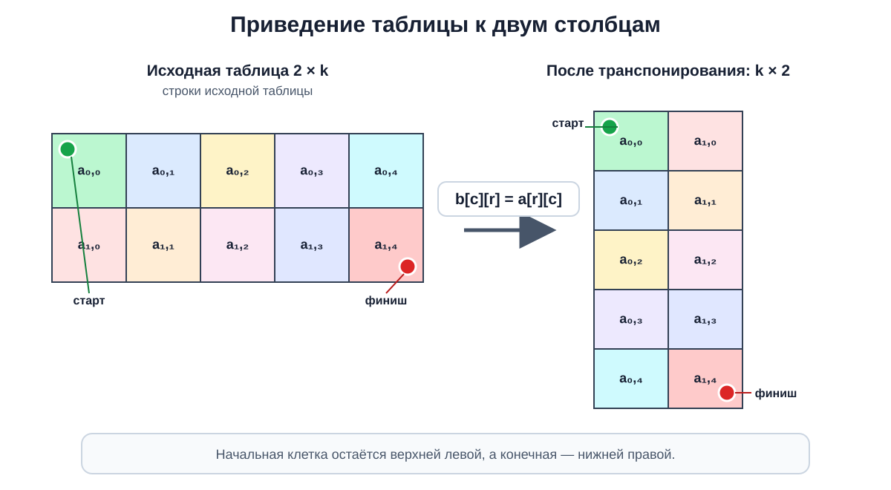
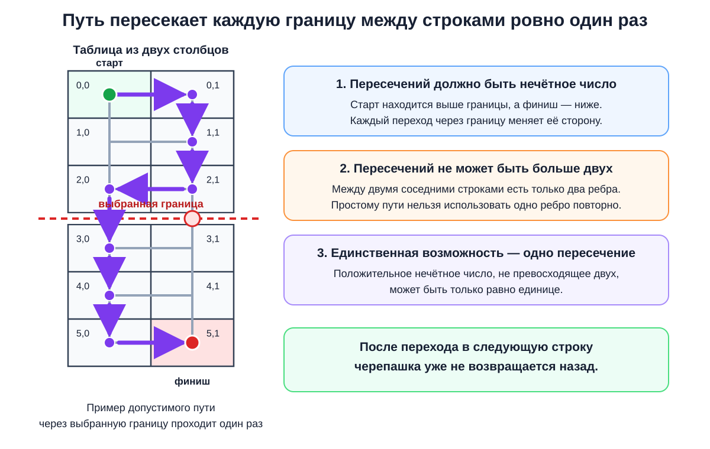
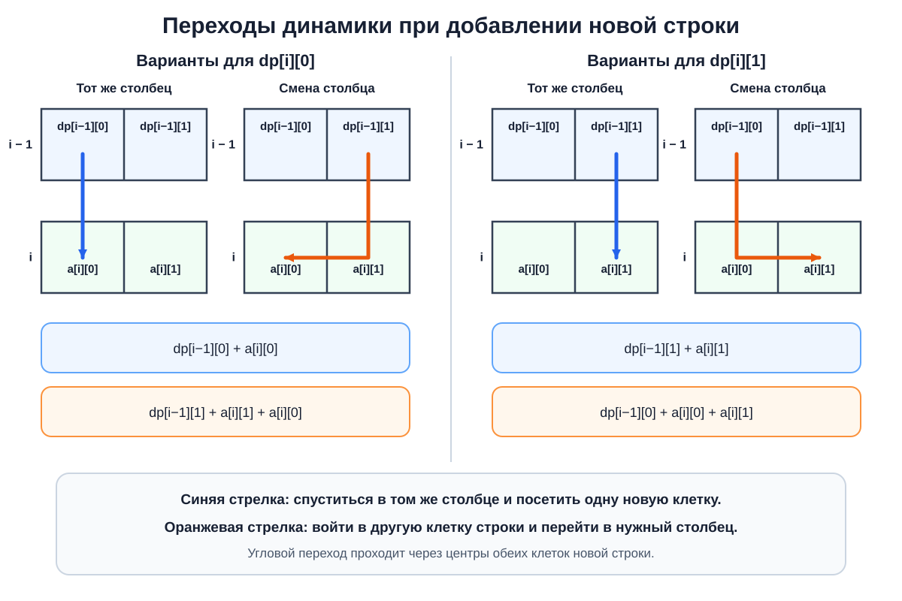

## A. Псевдокод Евклида

<details><summary><b>Основная идея</b></summary>

Количество итераций алгоритма Евклида максимально, когда остатки уменьшаются **настолько медленно, насколько это возможно**. Это происходит на соседних числах Фибоначчи: при делении каждого числа на предыдущее получается следующее число Фибоначчи.

Более того, если алгоритм выполняет $k$ операций, первое число пары не может быть меньше $F_{k+2}$. Поэтому для границы $r$ достаточно найти **наибольшее число Фибоначчи, не превосходящее $r$**, и вывести его вместе с предыдущим.

Для каждого запроса числа Фибоначчи последовательно строятся до достижения границы.

- Время: $O(\log(r))$ на запрос.
- Дополнительная память: $O(\log(r))$ на запрос.

</details>

<details><summary><b>Детальный разбор</b></summary>

Перебирать все допустимые пары невозможно: для одной границы существует порядка $r^2$ вариантов, а сама граница может достигать $10^{18}$. Поэтому нужно понять, **на каких числах алгоритм Евклида работает дольше всего**.

Рассмотрим последовательность чисел, возникающих в алгоритме:

$a=x_0,\quad b=x_1,\quad x_2,\quad x_3,\ldots$

Каждая итерация вычисляет очередной остаток. Поэтому для некоторого целого $q_i\ge 1$ выполняется

$x_{i-1}=q_i x_i+x_{i+1}$.

Положительные остатки строго уменьшаются. Чтобы итераций было как можно больше при ограничении на исходные числа, остатки должны уменьшаться **минимально возможным образом**. Для этого на всех промежуточных шагах нужно брать наименьшее допустимое частное, то есть $q_i=1$. Тогда

$x_{i-1}=x_i+x_{i+1}$.

Именно такое соотношение задаёт числа Фибоначчи в обратном порядке.

Осталось аккуратно получить нижнюю границу на исходные числа. Пусть алгоритм совершает $k$ операций. Последняя операция делит предпоследний положительный остаток на последний:

- последний ненулевой остаток не меньше $1$;
- предыдущий остаток не меньше $2$, поскольку он больше последнего и делится на него без остатка;
- каждый более ранний остаток не меньше суммы двух следующих.

Таким образом, минимально возможная последовательность с конца выглядит так:

$1,\ 2,\ 3,\ 5,\ 8,\ldots$

Следовательно, если алгоритм выполняет $k$ операций, то обязательно

$a\ge F_{k+2},\qquad b\ge F_{k+1}$,

где $F_1=F_2=1$.

Эта оценка **достигается** на соседних числах Фибоначчи. Например:

$F_m\bmod F_{m-1}=F_{m-2}$,

поскольку $F_m=F_{m-1}+F_{m-2}$. Поэтому алгоритм проходит по последовательности

$(F_m,F_{m-1})\to(F_{m-1},F_{m-2})\to\ldots\to(2,1)\to(1,0)$.

Значит, пара $(F_m,F_{m-1})$ требует ровно $m-2$ операций.

Теперь выберем максимальное $F_m\le r$. Пара $(F_m,F_{m-1})$ допустима и выполняет $m-2$ операций. Получить хотя бы на одну операцию больше невозможно: для этого первое число должно быть не меньше $F_{m+1}$, но по выбору $F_m$ имеем $F_{m+1}>r$.

Таким образом, достаточно:

1. начать с чисел $1,1$;
2. добавлять сумму двух последних чисел, пока она не превосходит $r$;
3. вывести два последних построенных числа.

Это рассматривает не все пары напрямую, но благодаря доказанной нижней границе гарантированно находит **оптимальную**. Другие оптимальные пары также могут существовать, однако условие разрешает вывести любую из них.

Количество чисел Фибоначчи до $r$ равно $O(\log(r))$, поскольку они растут экспоненциально. Поэтому временная и пространственная сложность для одного запроса составляет $O(\log(r))$.

</details>

<details><summary><b>Код на C++</b></summary>

```cpp
#include <bits/stdc++.h>
using namespace std;
void solve() {
    // читаем правую границу запроса:
    int64_t r; cin >> r;
    // считаем и складываем в вектор числа Фибоначчи <= r:
    // на соседних числах алгоритм Евклида делает максимум итераций
    vector<int64_t> fib = {1, 1};
    for (int i = 2; fib[i-2] + fib[i-1] <= r; i++)
        fib.push_back(fib[i-2] + fib[i-1]);
    // ответ: последнее и предпоследнее числа Фибоначчи:
    cout << *(fib.end()-1) << ' ' << *(fib.end()-2) << '\n';
}
main() {
    int tt = 1; cin >> tt;
    while (tt --> 0) solve();
}
```

</details>

<details><summary><b>Код на Python</b></summary>

```python
def solve(r):
    # считаем и складываем в список числа Фибоначчи <= r:
    # на соседних числах алгоритм Евклида делает максимум итераций
    fib = [1, 1]
    while fib[-2] + fib[-1] <= r:
        fib.append(fib[-2] + fib[-1])
    # ответ: последнее и предпоследнее числа Фибоначчи:
    print(fib[-1], fib[-2])
tt = int(input())
r = list(map(int, input().split()))
for i in range(tt):
    # читаем правую границу запроса:
    solve(r[i])
```

</details>

<details><summary><b>Разбор сложных фрагментов кода на C++</b></summary>

```cpp
vector<int64_t> fib = {1, 1};
for (int i = 2; fib[i-2] + fib[i-1] <= r; i++)
    fib.push_back(fib[i-2] + fib[i-1]);
```

Вектор хранит числа Фибоначчи, не превосходящие текущую границу. Перед добавлением очередного числа проверяется его допустимость, поэтому после завершения цикла последний элемент — **максимальное число Фибоначчи, не большее `r`**.

Тип `int64_t` необходим из-за ограничения $r\le 10^{18}$. Сумма, проверяемая в условии цикла, также вычисляется в `int64_t`.

```cpp
cout << *(fib.end()-1) << ' ' << *(fib.end()-2) << '\n';
```

`fib.end()` указывает на позицию после последнего элемента. Поэтому `*(fib.end()-1)` — последнее построенное число Фибоначчи, а `*(fib.end()-2)` — предыдущее. Они образуют соседнюю пару, на которой достигается максимальное количество операций.

```cpp
while (tt --> 0) solve();
```

Выражение разбирается как `tt-- > 0`: сначала текущее значение `tt` сравнивается с нулём, а затем уменьшается. Поэтому `solve()` вызывается ровно `tt` раз.

</details>

<details><summary><b>Разбор сложных фрагментов кода на Python</b></summary>

```python
fib = [1, 1]
while fib[-2] + fib[-1] <= r:
    fib.append(fib[-2] + fib[-1])
```

Отрицательные индексы обращаются к элементам с конца списка: `fib[-1]` — последний элемент, а `fib[-2]` — предпоследний. Их сумма является следующим числом Фибоначчи.

Условие цикла не позволяет добавить число, превышающее `r`. Поэтому после завершения цикла `fib[-1]` содержит **наибольшее допустимое число Фибоначчи**.

```python
print(fib[-1], fib[-2])
```

Выводятся два соседних числа Фибоначчи в невозрастающем порядке. Первое из них не превосходит `r`, а второе тем более находится в допустимом диапазоне. На этой паре алгоритм Евклида выполняет максимально возможное число итераций.

```python
r = list(map(int, input().split()))
for i in range(tt):
    # читаем правую границу запроса:
    solve(r[i])
```

Все границы запросов считываются из второй строки в список. Цикл передаёт каждую границу отдельно в `solve`, сохраняя исходный порядок запросов и, следовательно, строк ответа.

</details>

## B. Драгон рору

<details><summary><b>Основная идея</b></summary>

В простой версии нельзя независимо посчитать все номера, кратные выбранному простому числу: часть соответствующих роллов уже могла быть съедена раньше. Однако $a$, $b$ и $c$ — **различные простые числа**, поэтому количество общих кратных легко находится через произведения этих чисел.

- Антон получает $\lfloor n/a\rfloor$ роллов.
- Борис получает $\lfloor n/b\rfloor-\lfloor n/(ab)\rfloor$ роллов.
- Для Вадима используется **формула включений-исключений**:
  $\lfloor n/c\rfloor-\lfloor n/(ac)\rfloor-\lfloor n/(bc)\rfloor+\lfloor n/(abc)\rfloor$.

В сложной версии эти же формулы позволяют за $O(1)$ проверить, достаточно ли сета из $n$ роллов. Если некоторое $n$ подходит, то любое большее значение тоже подходит, поэтому минимальный ответ находится **двоичным поиском**.

Сложность:

- B1: $O(1)$ времени и $O(1)$ дополнительной памяти на тест;
- B2: $O(\log(10^{18}))$ времени и $O(1)$ дополнительной памяти на тест.

</details>

<details><summary><b>Детальный разбор</b></summary>

Начнём с простой версии. Количество чисел от $1$ до $n$, делящихся на некоторое положительное число $d$, равно

$\lfloor n/d\rfloor$.

Действительно, это числа $d,2d,3d,\ldots,\lfloor n/d\rfloor d$.

Однако просто применить эту формулу отдельно для $a$, $b$ и $c$ нельзя. Друзья едят роллы **по очереди**, и каждый следующий может взять только то, что осталось после предыдущих.

Антон ест первым, поэтому ему достаются все номера, кратные $a$:

$\lfloor n/a\rfloor$.

Борис рассматривает все $\lfloor n/b\rfloor$ номеров, кратных $b$. Среди них уже съедены те, которые одновременно делятся на $a$ и $b$.

Поскольку $a$ и $b$ — различные простые числа, они взаимно просты. Поэтому число делится одновременно на них тогда и только тогда, когда оно делится на $ab$. Таких номеров $\lfloor n/(ab)\rfloor$. Значит, Борис получит

$\lfloor n/b\rfloor-\lfloor n/(ab)\rfloor$.

С Вадимом ситуация немного сложнее. Изначально существует $\lfloor n/c\rfloor$ номеров, кратных $c$. Из них нужно исключить:

- номера, одновременно кратные $a$ и $c$;
- номера, одновременно кратные $b$ и $c$.

Их количества равны соответственно $\lfloor n/(ac)\rfloor$ и $\lfloor n/(bc)\rfloor$.

<p align="center">
  
</p>
<p align="center">
  <em>Рисунок 1. Круги обозначают номера, кратные a, b и c. Порядок друзей задаёт приоритет: Антон получает всё множество A, Борис — только B \ A, а Вадим — C \ (A ∪ B). Область A ∩ B ∩ C входит сразу в оба пересечения, вычитаемых из C, поэтому по формуле включений-исключений её необходимо добавить обратно.</em>
</p>

Однако номера, кратные сразу $a$, $b$ и $c$, попали в обе вычитаемые группы. Если просто вычесть обе группы, каждый такой номер будет вычтен дважды, хотя из исходного количества его нужно убрать только один раз. Поэтому по **формуле включений-исключений** пересечение следует добавить обратно:

$\lfloor n/c\rfloor-\lfloor n/(ac)\rfloor-\lfloor n/(bc)\rfloor+\lfloor n/(abc)\rfloor$.

<p align="center">
  
</p>
<p align="center">
  <em>Рисунок 2. При n = 30 Антон получает все 15 чётных роллов. Из 10 номеров, кратных 3, Борису остаются только 3, 9, 15, 21 и 27. Вадиму из чисел 5, 10, 15, 20, 25 и 30 достаются только 5 и 25: остальные роллы уже съели Антон или Борис.</em>
</p>

Так получаются все три ответа для B1. Формулы учитывают порядок друзей:

- Антон забирает все подходящие ему роллы;
- из вариантов Бориса исключаются роллы Антона;
- из вариантов Вадима исключаются роллы обоих предыдущих друзей.

В сложной версии значение $n$ заранее неизвестно. Требуется найти минимальный размер сета, при котором полученные по тем же формулам количества не меньше $x$, $y$ и $z$.

Перебирать $n$ по одному нельзя: ответ может достигать $10^{18}$. Но здесь возникает ключевое **монотонное свойство**. При увеличении сета старые роллы никуда не исчезают, а только добавляются новые. Следовательно, количество роллов, получаемых каждым другом, не уменьшается.

Поэтому возможные размеры сета имеют следующий вид:

- сначала идут значения, которых недостаточно;
- начиная с некоторого минимального ответа, все значения подходят.

<p align="center">
  
</p>
<p align="center">
  <em>Рисунок 3. До минимального ответа n* размеры сета не подходят, а начиная с n* подходят все. Двоичный поиск поддерживает инвариант: low — неподходящее значение, high — подходящее. Проверка середины позволяет заменить одну из границ на mid.</em>
</p>

Для заданного $n$ достаточно вычислить три количества:

$\lfloor n/a\rfloor$,

$\lfloor n/b\rfloor-\lfloor n/(ab)\rfloor$,

$\lfloor n/c\rfloor-\lfloor n/(bc)\rfloor-\lfloor n/(ac)\rfloor+\lfloor n/(abc)\rfloor$,

а затем проверить, достигли ли они соответственно $x$, $y$ и $z$.

Это даёт монотонный предикат:

- **ложь**, если хотя бы один друг не получает нужного количества;
- **истина**, если требований хватает для всех троих.

Минимальное истинное значение находится двоичным поиском на промежутке от $0$ до $10^{18}$. Левая граница заведомо не подходит, поскольку каждому требуется хотя бы один ролл. Правая граница подходит по гарантии условия.

На каждой итерации рассматривается середина:

- если она подходит, ответ не больше неё, поэтому сдвигается правая граница;
- если она не подходит, ответ строго больше неё, поэтому сдвигается левая граница.

Поддерживается инвариант: **левая граница не подходит, правая подходит**. Когда между ними не остаётся целых чисел, правая граница является минимальным допустимым размером сета.

Корректность обеих версий следует из двух фактов:

1. Формулы точно считают роллы каждого друга с учётом порядка и уже съеденных номеров.
2. В B2 двоичный поиск находит первое значение, для которого все три точных количества достигают требуемых границ.

В B1 выполняется постоянное число арифметических операций, поэтому сложность равна $O(1)$ по времени и памяти. В B2 одна проверка также работает за $O(1)$, а двоичный поиск выполняет $O(\log(10^{18}))$ проверок. Дополнительная память остаётся равной $O(1)$.

</details>

<details><summary><b>Код на C++</b></summary>

**B1. Простая версия**

```cpp
#include <bits/stdc++.h>
using namespace std;
using ll = long long;
void solve() {
    // читаем данные:
    ll n, a, b, c; cin >> n >> a >> b >> c;
    // первый ест столько, сколько чисел делятся на "a":
    ll na = n / a;
    // второй ест те числа, которые делятся на "b", кроме тех, которые уже были съедены первым:
    ll nb = n / b - n / (a * b);
    // третий аналогично, но вычитаем те, которые уже съели первый и второй
    // используем формулу включений-исключений
    ll nc = n / c - n / (b * c) - n / (a * c) + n / (a * b * c);
    // ответ:
    cout << na << ' ' << nb << ' ' << nc << '\n';
}
main() {
    int tt = 1; cin >> tt;
    while (tt --> 0) solve();
}
```

**B2. Сложная версия**

```cpp
#include <bits/stdc++.h>
using namespace std;
using ll = long long;
void solve() {
    // читаем данные:
    ll a, b, c, x, y, z;
    cin >> a >> b >> c >> x >> y >> z;
    // применим бинарный поиск по ответу: по размеру сета роллов
    // функция проверки заданного размера сета роллов:
    auto check = [&](ll n){
        ll na = n / a;
        if (na < x) return false; // первый не наелся
        ll nb = n / b - n / (a * b);
        if (nb < y) return false; // второй не наелся
        ll nc = n / c - n / (b * c) - n / (a * c) + n / (a * b * c);
        return (nc >= z); // наелся ли третий
    };
    // ищем ответ на полуинтервале (0, 10^{18}]:
    ll low = 0, high = (ll)1e18;
    while (high - low > 1) {
        ll mid = (low + high) / 2;
        if (check(mid)) high = mid;
        else low = mid;
    }
    cout << high << '\n';
}
main() {
    int tt = 1; cin >> tt;
    while (tt --> 0) solve();
}
```

</details>

<details><summary><b>Код на Python</b></summary>

**B1. Простая версия**

```python
def solve():
    # читаем данные:
    n, a, b, c = map(int, input().split())
    # первый ест столько, сколько чисел делится на "a":
    na = n // a
    # второй ест те числа, которые делятся на "b", кроме тех, которые уже были съедены первым:
    nb = n // b - n // (a * b)
    # третий аналогично, но вычитаем те, которые уже съели первый и второй
    # используем формулу включений-исключений
    nc = n // c - n // (b * c) - n // (a * c) + n // (a * b * c)
    # ответ:
    print(na, nb, nc)
tt = int(input())
for _ in range(tt):
    solve()
```

**B2. Сложная версия**

```python
def solve():
    # читаем данные:
    a, b, c, x, y, z = map(int, input().split())
    # применим бинарный поиск по ответу: по размеру сета роллов
    # функция проверки заданного размера сета роллов:
    def check(n):
        na = n // a
        if na < x:
            return False # первый не наелся
        nb = n // b - n // (a * b)
        if nb < y:
            return False # второй не наелся
        nc = n // c - n // (b * c) - n // (a * c) + n // (a * b * c)
        return nc >= z # наелся ли третий
    # ищем ответ на полуинтервале (0, 10^{18}]:
    low, high = 0, 10**18
    while high - low > 1:
        mid = (low + high) // 2
        if check(mid):
            high = mid
        else:
            low = mid
    print(high)
tt = int(input())
for _ in range(tt):
    solve()
```

</details>

<details><summary><b>Разбор сложных фрагментов кода на C++</b></summary>

**B1. Простая версия**

```cpp
ll nb = n / b - n / (a * b);
```

`n / b` считает все номера, кратные `b`. Поскольку `a` и `b` — различные простые числа, номера, кратные одновременно обоим числам, делятся на `a * b`. Они уже были заняты Антоном, поэтому их количество `n / (a * b)` вычитается.

```cpp
ll nc = n / c - n / (b * c) - n / (a * c) + n / (a * b * c);
```

Это формула включений-исключений. Из всех номеров, кратных `c`, убираются пересечения с кратными `a` и `b`. Номера, кратные сразу всем трём простым числам, были вычтены дважды, поэтому их количество добавляется обратно один раз.

Тип `ll` необходим не только для `n`, но и для произведений `a * b * c`, которые могут быть значительно больше диапазона типа `int`.

**B2. Сложная версия**

```cpp
auto check = [&](ll n){
    ll na = n / a;
    if (na < x) return false; // первый не наелся
    ll nb = n / b - n / (a * b);
    if (nb < y) return false; // второй не наелся
    ll nc = n / c - n / (b * c) - n / (a * c) + n / (a * b * c);
    return (nc >= z); // наелся ли третий
};
```

Лямбда проверяет, подходит ли фиксированный размер сета `n`. Захват `[&]` позволяет использовать прочитанные значения `a`, `b`, `c`, `x`, `y`, `z` по ссылке.

Досрочные возвраты сразу отвергают размер сета, если Антон или Борис не получают нужного количества. Если первые два требования выполнены, результат определяется сравнением количества роллов Вадима с `z`.

```cpp
ll low = 0, high = (ll)1e18;
while (high - low > 1) {
    ll mid = (low + high) / 2;
    if (check(mid)) high = mid;
    else low = mid;
}
```

На протяжении двоичного поиска `low` хранит неподходящее значение, а `high` — подходящее. Если `mid` удовлетворяет требованиям, минимальный ответ находится не правее него. Иначе ответ должен быть строго больше `mid`.

Цикл продолжается, пока между границами существует хотя бы одно целое число. После его завершения `high = low + 1`, поэтому `high` является первым подходящим значением.

```cpp
ll low = 0, high = (ll)1e18;
```

Приведение `(ll)1e18` переводит вещественный литерал к типу `ll`. Правая граница считается подходящей благодаря гарантии, что ответ не превосходит $10^{18}$.

</details>

<details><summary><b>Разбор сложных фрагментов кода на Python</b></summary>

**B1. Простая версия**

```python
nb = n // b - n // (a * b)
```

Оператор `//` выполняет целочисленное деление. Первое слагаемое считает все номера, кратные `b`, а второе — номера, кратные одновременно `a` и `b`. Последние уже были съедены Антоном и не могут достаться Борису.

```python
nc = n // c - n // (b * c) - n // (a * c) + n // (a * b * c)
```

Из всех кратных `c` исключаются номера, уже подходившие Антону или Борису. Пересечение этих двух исключаемых групп состоит из чисел, кратных `a * b * c`. Оно вычитается два раза, поэтому добавляется обратно.

**B2. Сложная версия**

```python
def check(n):
    na = n // a
    if na < x:
        return False # первый не наелся
    nb = n // b - n // (a * b)
    if nb < y:
        return False # второй не наелся
    nc = n // c - n // (b * c) - n // (a * c) + n // (a * b * c)
    return nc >= z # наелся ли третий
```

Функция возвращает `True` ровно тогда, когда сет размера `n` удовлетворяет требованиям всех троих. Количества вычисляются с учётом порядка, в котором друзья едят роллы.

Проверки Антона и Бориса завершают функцию досрочно, если соответствующее требование нарушено. Если они получили достаточно, остаётся проверить только условие Вадима.

```python
low, high = 0, 10**18
while high - low > 1:
    mid = (low + high) // 2
    if check(mid):
        high = mid
    else:
        low = mid
```

`low` всегда обозначает неподходящий размер сета, а `high` — подходящий. Монотонность проверки позволяет отбросить половину текущего промежутка:

- при `check(mid) == True` минимальный ответ не больше `mid`;
- при `check(mid) == False` ни одно значение до `mid` включительно не может быть ответом.

Python поддерживает целые числа произвольной длины, поэтому произведения `a * b * c` и вычисление середины не вызывают переполнения.

```python
print(high)
```

После завершения двоичного поиска между границами больше нет целых значений. Так как `low` не подходит, а `high` подходит, именно `high` является минимальным допустимым размером сета.

</details>

## C. Олег и лазерная указка

<details><summary><b>Основная идея</b></summary>

В каждый момент направление прицела задаётся вектором **от Олега к текущему положению**. Пока мы движемся по одному прямолинейному отрезку, этот вектор поворачивается в одну сторону, поэтому полный поворот на отрезке равен углу между направлениями, указывающими на его концы.

Для каждого отрезка, кроме последнего, нужно найти угол между двумя векторами из точки Олега в соседние узлы ломаной. Он вычисляется устойчивой формулой через скалярное и векторное произведения:

$\theta=\text{atan2}(|\vec u\times\vec v|,\vec u\cdot\vec v)$.

На последнем отрезке прицел не поворачивается: все его точки лежат на одном луче, направленном от Олега к предпоследнему узлу.

Искомый ответ — сумма углов для первых $n$ отрезков.

- Время: $O(n)$ для одного набора данных.
- Дополнительная память: $O(n)$ из-за хранения координат.

</details>

<details><summary><b>Детальный разбор</b></summary>

Положение движущегося человека непрерывно меняется вдоль ломаной, поэтому напрямую отслеживать направление прицела в каждый момент невозможно: на каждом отрезке существует бесконечно много промежуточных положений. Нужно понять, можно ли описать весь поворот на прямолинейном участке только через его концы.

Обозначим положение Олега через $O=(R,0)$, а концы очередного отрезка ломаной — через $A$ и $B$. В начале движения по этому отрезку прицел направлен вдоль вектора $\overrightarrow{OA}$, а в конце — вдоль $\overrightarrow{OB}$.

Любая промежуточная точка отрезка имеет вид

$P(t)=(1-t)A+tB$, где $0\le t\le 1$.

Следовательно, направление из точки Олега задаётся вектором

$\overrightarrow{OP(t)}=(1-t)\overrightarrow{OA}+t\overrightarrow{OB}$.

Важно установить, что внутри одного отрезка направление не начинает поворачиваться то в одну, то в другую сторону. Для прямолинейного движения знак скорости изменения полярного угла определяется знаком векторного произведения между направлением на текущую точку и направлением движения. Это произведение постоянно вдоль всего отрезка:

$\overrightarrow{OP(t)}\times\overrightarrow{AB}=\overrightarrow{OA}\times\overrightarrow{AB}$.

Значит, его знак не меняется. Направление прицела на одном отрезке либо всё время поворачивается в одну сторону, либо вообще остаётся неизменным. Поэтому **суммарная абсолютная величина поворота на отрезке равна обычному меньшему углу между направлениями на его концы**.

<p align="center">
  
</p>
<p align="center">
  <em>Рисунок 1. При движении от A к B направление прицела непрерывно переходит от OA к OB. Внутри одного прямолинейного отрезка сторона вращения не меняется, поэтому полный абсолютный поворот равен углу θ между направлениями на концы отрезка.</em>
</p>

Все узлы, кроме конечного, имеют абсциссу меньше $R$. Поэтому соответствующие векторы из точки $O$ направлены в левую полуплоскость. Это исключает неоднозначный переход направления через границу полного оборота: угол между соседними направлениями можно брать в диапазоне от $0$ до $\pi$.

Осталось научиться находить угол между двумя векторами. Для векторов $\vec u$ и $\vec v$ выполняются соотношения:

- $\vec u\cdot\vec v=|\vec u||\vec v|\cos(\theta)$;
- $|\vec u\times\vec v|=|\vec u||\vec v|\sin(\theta)$.

Поэтому угол из диапазона $[0,\pi]$ можно вычислить как

$\theta=\text{atan2}(|\vec u\times\vec v|,\vec u\cdot\vec v)$.

<p align="center">
  
</p>
<p align="center">
  <em>Рисунок 2. Скалярное произведение содержит косинус угла, а модуль векторного произведения — его синус. Функция atan2 использует обе величины и возвращает правильный угол θ из диапазона от 0 до π, включая прямые и тупые углы.</em>
</p>

Абсолютное значение векторного произведения убирает направление поворота, поскольку по условию требуется сумма **абсолютных величин** углов. При этом знак скалярного произведения позволяет функции `atan2` правильно различать острые и тупые углы.

Для соседних узлов $A=(x_{i-1},y_{i-1})$ и $B=(x_i,y_i)$ используются векторы

$\vec u=B-O,\qquad \vec v=A-O$.

Порядок этих двух векторов не влияет на величину угла, так как векторное произведение берётся по модулю, а скалярное произведение симметрично.

Отдельно нужно рассмотреть **последний отрезок**, который соединяет предпоследний узел $A$ с самим Олегом. Любая его внутренняя точка представляется как

$P(t)=(1-t)A+tO,\qquad 0\le t<1$.

Тогда

$P(t)-O=(1-t)(A-O)$.

То есть вектор к движущемуся человеку отличается от исходного только положительным множителем. Его длина уменьшается, но направление остаётся неизменным. В самой конечной точке направление не определено, однако условие требует сохранить направление с последнего отрезка. Следовательно, последний отрезок добавляет к ответу **ноль**, и обрабатывать конечный узел не нужно.

<p align="center">
  
</p>
<p align="center">
  <em>Рисунок 3. На последнем отрезке человек приближается к Олегу вдоль одной прямой. Вектор из O в текущее положение становится короче, но остаётся положительным кратным вектора A − O. Поэтому направление прицела не меняется, а вклад последнего отрезка равен нулю.</em>
</p>

Итоговый алгоритм:

1. Зафиксировать точку Олега $O=(x_{n+1},y_{n+1})$.
2. Для каждого $i$ от $1$ до $n$ рассмотреть соседние узлы с индексами $i-1$ и $i$.
3. Построить векторы из $O$ к этим узлам.
4. Вычислить угол между векторами через `atan2` и прибавить его к ответу.
5. Вывести накопленную сумму.

Каждый из первых $n$ отрезков учитывается ровно один раз. Для каждого из них вычисляется точная полная величина поворота, а последний отрезок обоснованно даёт нулевой вклад. Поэтому сумма совпадает со всем углом, на который Олег поворачивал прицел.

Алгоритм выполняет $O(n)$ операций. Координаты хранятся в двух массивах размера $n+2$, поэтому дополнительная память составляет $O(n)$. Скалярные и векторные произведения вычисляются в 64-битном целом типе, а углы и их сумма — в типе двойной точности.

</details>

<details><summary><b>Код на C++</b></summary>

```cpp
#include <bits/stdc++.h>
using namespace std;
using ll = long long;
using ld = double; // используем "double", чтобы убедиться, что 64-битный тип заходит
// Структура данных для точки:
struct Pt {
    ll x, y;
    Pt operator-(const Pt &p) const {
        return {x - p.x, y - p.y};
    }
};
// скалярное произведение:
ll dot(Pt a, Pt b) {
    return a.x * b.x + a.y * b.y;
}
// векторное произведение:
ll cross(Pt a, Pt b) {
    return a.x * b.y - a.y * b.x;
}
// угол между двумя векторами:
ld angle(Pt a, Pt b) {
    return atan2(abs(cross(a,b)),dot(a,b));
}
// решение:
void solve() {
    // читаем данные:
    int n; cin >> n;
    vector<int> x(n+2), y(n+2);
    for (auto &it : x) cin >> it;
    for (auto &it : y) cin >> it;
    // положение Олега:
    Pt O = {x[n+1], y[n+1]};
    ld sum = 0;
    for (int i = 1; i <= n; i++) {
        // наше предыдущее положение:
        Pt A = {x[i-1], y[i-1]};
        // наше текущее положение:
        Pt B = {x[i], y[i]};
        // Олег поворачивает свой прицел в треугольнике OAB: было OA, стало OB.
        sum += angle(B - O, A - O);
    }
    // выводим ответ:
    cout << fixed << setprecision(12) << sum << '\n';
}
main() {
    int tt = 1; cin >> tt;
    while (tt --> 0) solve();
}
```

</details>

<details><summary><b>Код на Python</b></summary>

```python
from math import atan2
# В Python тип float имеет двойную точность
# Структура данных для точки:
class Pt:
    def __init__(self, x, y):
        self.x, self.y = x, y
    def __sub__(self, p):
        return Pt(self.x - p.x, self.y - p.y)
# скалярное произведение:
def dot(a, b):
    return a.x * b.x + a.y * b.y
# векторное произведение:
def cross(a, b):
    return a.x * b.y - a.y * b.x
# угол между двумя векторами:
def angle(a, b):
    return atan2(abs(cross(a,b)),dot(a,b))
# решение:
def solve():
    # читаем данные:
    n = int(input())
    x = list(map(int, input().split()))
    y = list(map(int, input().split()))
    # положение Олега:
    O = Pt(x[n+1], y[n+1])
    sum = 0
    for i in range(1, n+1):
        # наше предыдущее положение:
        A = Pt(x[i-1], y[i-1])
        # наше текущее положение:
        B = Pt(x[i], y[i])
        # Олег поворачивает свой прицел в треугольнике OAB: было OA, стало OB.
        sum += angle(B - O, A - O)
    # выводим ответ:
    print(f"{sum:.12f}")
tt = int(input())
for _ in range(tt):
    solve()
```

</details>

<details><summary><b>Разбор сложных фрагментов кода на C++</b></summary>

```cpp
struct Pt {
    ll x, y;
    Pt operator-(const Pt &p) const {
        return {x - p.x, y - p.y};
    }
};
```

Структура представляет точку или вектор двумя координатами. Вычитание `A - O` создаёт вектор, направленный из точки `O` в точку `A`. Квалификатор `const` после объявления оператора означает, что вычитание не изменяет левый операнд.

```cpp
ll dot(Pt a, Pt b) {
    return a.x * b.x + a.y * b.y;
}
// векторное произведение:
ll cross(Pt a, Pt b) {
    return a.x * b.y - a.y * b.x;
}
```

Скалярное произведение определяет косинус угла и, в частности, позволяет отличать острый угол от тупого. Векторное произведение в двумерном случае является числом; его модуль пропорционален синусу угла.

Для исходных ограничений промежуточные произведения требуют 64-битного целого типа `ll`.

```cpp
ld angle(Pt a, Pt b) {
    return atan2(abs(cross(a,b)),dot(a,b));
}
```

Функция `atan2` получает отдельно величины, пропорциональные синусу и косинусу угла. В отличие от деления одного произведения на другое, такая запись корректно обрабатывает прямые и тупые углы, а также случай нулевого скалярного произведения.

Модуль `cross(a,b)` означает, что возвращается не ориентированный поворот, а абсолютная величина угла из диапазона $[0,\pi]$.

```cpp
Pt O = {x[n+1], y[n+1]};
ld sum = 0;
for (int i = 1; i <= n; i++) {
    // наше предыдущее положение:
    Pt A = {x[i-1], y[i-1]};
    // наше текущее положение:
    Pt B = {x[i], y[i]};
    // Олег поворачивает свой прицел в треугольнике OAB: было OA, стало OB.
    sum += angle(B - O, A - O);
}
```

Цикл обрабатывает отрезки между узлами с индексами $i-1$ и $i$. Он заканчивается при `i == n`, поэтому последний отрезок от узла `n` к точке Олега с индексом `n+1` не рассматривается. На этом отрезке направление прицела постоянно, так что его вклад равен нулю.

Выражения `B - O` и `A - O` строят два направления прицела на концах текущего отрезка. Их угол и есть полный поворот на этом участке.

```cpp
cout << fixed << setprecision(12) << sum << '\n';
```

Манипулятор `fixed` включает вывод фиксированного количества знаков после десятичной точки, а `setprecision(12)` задаёт двенадцать таких знаков. Этого достаточно для требуемой погрешности $10^{-6}$.

</details>

<details><summary><b>Разбор сложных фрагментов кода на Python</b></summary>

```python
class Pt:
    def __init__(self, x, y):
        self.x, self.y = x, y
    def __sub__(self, p):
        return Pt(self.x - p.x, self.y - p.y)
```

Класс хранит координаты точки или вектора. Специальный метод `__sub__` определяет оператор вычитания: выражение `A - O` возвращает вектор из точки `O` в точку `A`.

```python
def dot(a, b):
    return a.x * b.x + a.y * b.y
# векторное произведение:
def cross(a, b):
    return a.x * b.y - a.y * b.x
```

Скалярное произведение связано с косинусом угла, а модуль двумерного векторного произведения — с его синусом. Целые числа Python имеют произвольную точность, поэтому при умножении координат переполнение невозможно.

```python
def angle(a, b):
    return atan2(abs(cross(a,b)),dot(a,b))
```

`atan2` по значениям, пропорциональным синусу и косинусу, возвращает угол с правильным учётом знака скалярного произведения. Благодаря `abs` первый аргумент неотрицателен, поэтому результат представляет абсолютную величину угла в диапазоне от $0$ до $\pi$.

```python
O = Pt(x[n+1], y[n+1])
sum = 0
for i in range(1, n+1):
    # наше предыдущее положение:
    A = Pt(x[i-1], y[i-1])
    # наше текущее положение:
    B = Pt(x[i], y[i])
    # Олег поворачивает свой прицел в треугольнике OAB: было OA, стало OB.
    sum += angle(B - O, A - O)
```

`range(1, n+1)` перебирает значения от $1$ до $n$ включительно. Следовательно, учитываются первые $n$ отрезков ломаной, а последний отрезок к самому Олегу пропускается, поскольку направление на нём не изменяется.

Для каждого обработанного отрезка из координат его концов строятся направления относительно Олега. Функция `angle` возвращает полный абсолютный поворот прицела на этом отрезке.

```python
print(f"{sum:.12f}")
```

Формат `.12f` выводит число с двенадцатью знаками после десятичной точки, обеспечивая достаточную точность ответа.

</details>

## D. Черепашка 5.6 Sol Thinking

<details><summary><b>Основная идея</b></summary>

Так как одна из сторон таблицы равна двум, после возможного транспонирования её можно считать таблицей размера $n\times 2$.

Ключевое наблюдение: между строками $i$ и $i+1$ есть только **два ребра**. Любой путь из первой строки в последнюю должен пересечь такой разрез нечётное число раз, а простой путь может использовать каждое ребро не более одного раза. Значит, он пересекает каждый разрез ровно один раз и никогда не возвращается в уже пройденные строки.

В очередной строке черепашка может:

- посетить только клетку текущего столбца;
- посетить обе клетки и перейти в другой столбец.

Поэтому достаточно динамики, где $\text{dp}[i][c]$ — максимальная сумма пути из начальной клетки в клетку $(i,c)$, использующего только строки от $0$ до $i$.

Для каждого состояния есть два перехода: продолжить движение в том же столбце либо посетить обе клетки новой строки и поменять столбец.

- Время: $O(nm)$, то есть $O(n)$ после приведения таблицы к ширине $2$.
- Дополнительная память: $O(n)$.

</details>

<details><summary><b>Детальный разбор</b></summary>

В произвольной таблице возможность ходить во все четыре стороны делает задачу сложной: путь может возвращаться в ранее рассмотренные области, а решение для части таблицы трудно описать небольшим количеством параметров. Здесь ситуацию полностью меняет ограничение $\min(n,m)=2$.

Для единообразия удобно повернуть таблицу, если она состоит из двух строк. После этого всегда получается таблица с произвольным количеством строк и ровно **двумя столбцами**. Начальная клетка остаётся верхней левой, а конечная — нижней правой.

<p align="center">
  
</p>
<p align="center">
  <em>Рисунок 1. Если исходная таблица имеет две строки, транспонируем её: клетка с индексами (r, c) переходит в клетку (c, r). Значения и соседство клеток сохраняются, а старт и финиш по-прежнему находятся в верхнем левом и нижнем правом углах.</em>
</p>

Теперь рассмотрим границу между соседними строками $i$ и $i+1$. Пересечь её можно только по двум вертикальным рёбрам — по одному в каждом столбце.

Начало пути находится выше этой границы, а конец — ниже. Следовательно, путь обязан пересечь границу нечётное число раз: каждый переход вниз меняет сторону границы, а каждый переход вверх возвращает обратно.

При этом путь не может использовать одно ребро дважды, потому что тогда пришлось бы повторно посетить его вершины. Всего рёбер через границу только два, поэтому число пересечений не превосходит двух. Единственное положительное нечётное число, не превосходящее двух, — это один.

<p align="center">
  
</p>
<p align="center">
  <em>Рисунок 2. Старт и финиш находятся по разные стороны от любой границы между соседними строками, поэтому число её пересечений нечётно. Через границу проходят только два ребра, и простой путь не может использовать ни одно из них повторно. Следовательно, путь пересекает границу ровно один раз.</em>
</p>

Таким образом, **каждую границу между соседними строками путь пересекает ровно один раз**. Из этого следуют два важных свойства:

- после перехода в следующую строку черепашка уже не возвращается в предыдущую;
- путь можно строить последовательно сверху вниз.

Осталось понять, какие действия возможны внутри одной новой строки. В ней есть всего две клетки. Если черепашка вошла в строку по одному столбцу, она может:

1. посетить только эту клетку и продолжить движение вниз по тому же столбцу;
2. посетить эту клетку, перейти по горизонтальному ребру во вторую клетку и продолжить путь уже из другого столбца.

Других вариантов нет. Вернуться в предыдущие строки нельзя, а повторно переходить между двумя клетками текущей строки запрещает условие о неповторении клеток.

Это позволяет описать уже построенную часть пути только номером строки и столбцом, в котором она заканчивается. Определим:

$\text{dp}[i][c]$ — максимальная сумма чисел на пути из клетки $(0,0)$ в клетку $(i,c)$, который использует только строки от $0$ до $i$.

Для первой строки возможны два состояния:

- чтобы закончить в клетке $(0,0)$, достаточно взять стартовое число:
  $\text{dp}[0][0]=a_{0,0}$;
- чтобы закончить в клетке $(0,1)$, нужно пройти из стартовой клетки вправо:
  $\text{dp}[0][1]=a_{0,0}+a_{0,1}$.

Рассмотрим переход к строке $i>0$.

Чтобы закончить в её первом столбце, возможны два случая:

- ранее путь заканчивался в первом столбце, после чего черепашка спустилась в клетку $(i,0)$;
- ранее путь заканчивался во втором столбце, после чего черепашка спустилась в $(i,1)$ и перешла в $(i,0)$, собрав обе клетки новой строки.

Получаем:

$\text{dp}[i][0]=\max(\text{dp}[i-1][0]+a_{i,0},\ \text{dp}[i-1][1]+a_{i,1}+a_{i,0})$.

Симметрично, для второго столбца:

$\text{dp}[i][1]=\max(\text{dp}[i-1][1]+a_{i,1},\ \text{dp}[i-1][0]+a_{i,0}+a_{i,1})$.

<p align="center">
  
</p>
<p align="center">
  <em>Рисунок 3. Чтобы закончить в выбранном столбце строки i, можно либо спуститься из того же столбца и взять одну клетку, либо войти через другой столбец, посетить обе клетки новой строки и закончить в нужном столбце. Каждый вариант показан отдельно, а все переходы используют состояния строки i − 1.</em>
</p>

Важно, что переход со сменой столбца использует значение из **предыдущей строки**, а не уже обновлённое состояние текущей строки. Благодаря этому обе клетки новой строки добавляются ровно один раз.

Почему этих переходов достаточно? Любой допустимый путь пересекает каждую горизонтальную границу ровно один раз, поэтому приходит в строку $i$ из одного из двух столбцов строки $i-1$. Внутри новой строки он либо остаётся в этом столбце, либо единожды переходит в соседний. Оба случая присутствуют в формулах. Следовательно, динамика рассматривает все возможные простые пути.

Одновременно каждый переход динамики задаёт корректное продолжение пути: он добавляет новую строку, не возвращается в старые и не посещает ни одну клетку повторно. Поэтому состояния не содержат недопустимых маршрутов.

После возможного транспонирования конечная клетка находится в последней строке и втором столбце. Значит, ответ равен $\text{dp}[n-1][1]$.

Все числа могут быть отрицательными, поэтому недостижимые состояния нельзя инициализировать нулём: ноль мог бы оказаться выгоднее любого настоящего пути. Для них используется достаточно большое отрицательное значение. Максимальная абсолютная сумма не превосходит $2\cdot 10^5\cdot 10^9=2\cdot 10^{14}$, поэтому значение $-10^{18}$ безопасно обозначает недостижимость, а для сумм нужен 64-битный целый тип.

После приведения таблицы к ширине $2$ количество её строк равно $\max(n,m)$. Каждая строка обрабатывается за $O(1)$, поэтому время работы составляет $O(nm)$ для исходной таблицы, что при $\min(n,m)=2$ эквивалентно $O(\max(n,m))$. Массивы динамики и значений занимают $O(nm)$ памяти, то есть $O(\max(n,m))$ при ширине $2$.

</details>

<details><summary><b>Код на C++</b></summary>

```cpp
#include <bits/stdc++.h>
#include <cassert>
using namespace std;
using ll = long long;
const ll inf = (ll)1e18L;
void setmax(auto &x, const auto &y) { if (x < y) x = y; }
void solve() {
    // читаем данные. Для удобства сразу делаем так, чтобы количество столбцов было равно 2
    // для этого транспонируем матрицу при чтении, если это не так.
    int n, m; cin >> n >> m;
    vector a(max(n,m), vector(2, 0));
    if (n <= m) {
        assert(n == 2);
        for (int r = 0; r < n; r++)
            for (int c = 0; c < m; c++)
                cin >> a[c][r];
    } else {
        assert(m == 2);
        for (int r = 0; r < n; r++)
            for (int c = 0; c < m; c++)
                cin >> a[r][c];
    }
    // теперь считаем динамику: dp[r][c] - максимальная сумма на пути из (1,1) в (r,c)
    n = max(n, m);
    vector dp(n, vector(2, -inf));
    dp[0][0] = a[0][0]; // стартовое число
    dp[0][1] = a[0][0] + a[0][1]; // прямой переход вправо
    for (int i = 1; i < n; i++) {
        // переход в клетку (i, 0):
        setmax(dp[i][0], dp[i-1][0] + a[i][0]); // сверху
        setmax(dp[i][0], dp[i-1][1] + a[i][0] + a[i][1]); // справа
        // переход в клетку (i, 1):
        setmax(dp[i][1], dp[i-1][1] + a[i][1]); // сверху
        setmax(dp[i][1], dp[i-1][0] + a[i][0] + a[i][1]); // слева
    }
    // выводим ответ:
    cout << dp[n-1][1] << '\n';
}
main() {
    int tt = 1; cin >> tt;
    while (tt --> 0) solve();
}
```

</details>

<details><summary><b>Код на Python</b></summary>

```python
def solve():
    # читаем данные. Для удобства сразу делаем так, чтобы количество столбцов было равно 2
    # для этого транспонируем матрицу при чтении, если это не так.
    n, m = map(int, input().split())
    a = [[0, 0] for _ in range(max(n,m))]
    if n <= m:
        assert n == 2
        for r in range(n):
            row = list(map(int, input().split()))
            for c in range(m):
                a[c][r] = row[c]
    else:
        assert m == 2
        for r in range(n):
            a[r] = list(map(int, input().split()))
    # теперь считаем динамику: dp[r][c] - максимальная сумма на пути из (1,1) в (r,c)
    n = max(n, m)
    inf = 10**18
    dp = [[-inf, -inf] for _ in range(n)]
    dp[0][0] = a[0][0] # стартовое число
    dp[0][1] = a[0][0] + a[0][1] # прямой переход вправо
    for i in range(1, n):
        # переход в клетку (i, 0):
        dp[i][0] = max(dp[i][0], dp[i-1][0] + a[i][0]) # сверху
        dp[i][0] = max(dp[i][0], dp[i-1][1] + a[i][0] + a[i][1]) # справа
        # переход в клетку (i, 1):
        dp[i][1] = max(dp[i][1], dp[i-1][1] + a[i][1]) # сверху
        dp[i][1] = max(dp[i][1], dp[i-1][0] + a[i][0] + a[i][1]) # слева
    # выводим ответ:
    print(dp[n-1][1])
tt = int(input())
for _ in range(tt):
    solve()
```

</details>

<details><summary><b>Разбор сложных фрагментов кода на C++</b></summary>

```cpp
vector a(max(n,m), vector(2, 0));
if (n <= m) {
    assert(n == 2);
    for (int r = 0; r < n; r++)
        for (int c = 0; c < m; c++)
            cin >> a[c][r];
} else {
    assert(m == 2);
    for (int r = 0; r < n; r++)
        for (int c = 0; c < m; c++)
            cin >> a[r][c];
}
```

Массив `a` всегда создаётся в форме `max(n,m) × 2`. Если в исходной таблице две строки, координаты при чтении меняются местами: значение из исходной клетки `[r][c]` записывается в `a[c][r]`. Это является транспонированием.

Если столбцов уже два, значения записываются без изменения. В обоих случаях исходная клетка $(1,1)$ переходит в `a[0][0]`, а исходная конечная клетка — в `a[max(n,m)-1][1]`.

```cpp
const ll inf = (ll)1e18L;
void setmax(auto &x, const auto &y) { if (x < y) x = y; }
```

Значение `-inf` обозначает недостижимое состояние. Оно существенно меньше любой возможной суммы пути, в том числе когда все числа отрицательны.

Функция `setmax` обновляет первый аргумент, только если второй больше. Первый параметр принимается по ссылке, поэтому изменение сохраняется в соответствующей ячейке динамики.

```cpp
n = max(n, m);
vector dp(n, vector(2, -inf));
dp[0][0] = a[0][0]; // стартовое число
dp[0][1] = a[0][0] + a[0][1]; // прямой переход вправо
```

После транспонирования `n` переиспользуется как количество строк нормализованной таблицы.

В первой строке есть ровно два допустимых состояния. Путь в `dp[0][0]` состоит только из начальной клетки. Чтобы закончить в `dp[0][1]`, необходимо посетить обе клетки первой строки.

```cpp
setmax(dp[i][0], dp[i-1][0] + a[i][0]); // сверху
setmax(dp[i][0], dp[i-1][1] + a[i][0] + a[i][1]); // справа
```

Первый переход спускается в новую строку по столбцу `0` и посещает только `a[i][0]`.

Во втором случае путь входит в новую строку через столбец `1`, посещает `a[i][1]`, затем переходит в `a[i][0]`. Поэтому добавляются обе клетки строки, а путь заканчивается в столбце `0`.

```cpp
setmax(dp[i][1], dp[i-1][1] + a[i][1]); // сверху
setmax(dp[i][1], dp[i-1][0] + a[i][0] + a[i][1]); // слева
```

Это симметричные переходы для окончания пути в столбце `1`. Либо путь остаётся в этом столбце, либо входит через столбец `0` и пересекает новую строку по горизонтали.

Оба перехода используют только состояния строки `i-1`. Поэтому вычисление `dp[i][0]` не влияет на `dp[i][1]`, и клетки текущей строки нельзя случайно учесть повторно.

```cpp
cout << dp[n-1][1] << '\n';
```

После нормализации исходная конечная клетка имеет координаты `[n-1][1]`. Именно это состояние содержит максимальную сумму полного пути из одного угла таблицы в противоположный.

</details>

<details><summary><b>Разбор сложных фрагментов кода на Python</b></summary>

```python
a = [[0, 0] for _ in range(max(n,m))]
if n <= m:
    assert n == 2
    for r in range(n):
        row = list(map(int, input().split()))
        for c in range(m):
            a[c][r] = row[c]
else:
    assert m == 2
    for r in range(n):
        a[r] = list(map(int, input().split()))
```

Внутреннее представление всегда содержит две клетки в каждой строке. Если исходная таблица имеет две строки, при чтении выполняется транспонирование: исходная клетка `[r][c]` записывается как `a[c][r]`.

При двух исходных столбцах менять ориентацию не требуется. После обоих вариантов `a[0][0]` является начальной клеткой, а `a[max(n,m)-1][1]` — конечной.

```python
n = max(n, m)
inf = 10**18
dp = [[-inf, -inf] for _ in range(n)]
dp[0][0] = a[0][0] # стартовое число
dp[0][1] = a[0][0] + a[0][1] # прямой переход вправо
```

После нормализации `n` хранит длину таблицы. Все состояния сначала считаются недостижимыми и получают значение `-inf`. Это необходимо из-за отрицательных чисел в клетках: использование нуля создало бы несуществующий путь с завышенной суммой.

В первой строке можно остаться в начальной клетке либо сразу перейти во второй столбец, собрав значения обеих клеток.

```python
dp[i][0] = max(dp[i][0], dp[i-1][0] + a[i][0]) # сверху
dp[i][0] = max(dp[i][0], dp[i-1][1] + a[i][0] + a[i][1]) # справа
```

Первый вариант продолжает путь в столбце `0` и добавляет одну клетку новой строки. Второй входит в строку через столбец `1`, проходит по горизонтальному ребру и заканчивается в столбце `0`, поэтому добавляет обе клетки.

```python
dp[i][1] = max(dp[i][1], dp[i-1][1] + a[i][1]) # сверху
dp[i][1] = max(dp[i][1], dp[i-1][0] + a[i][0] + a[i][1]) # слева
```

Для окончания в столбце `1` возможны те же два типа пути: продолжение в прежнем столбце или смена столбца внутри новой строки.

Оба состояния текущей строки вычисляются из `dp[i-1]`. Это сохраняет смысл динамики и не допускает повторного использования клеток.

```python
print(dp[n-1][1])
```

В нормализованной таблице конечная клетка находится в последней строке и столбце `1`. Поэтому соответствующее состояние и является ответом.

</details>

## E. Количество подлых квадратов

<details><summary><b>Основная идея</b></summary>

Знак произведения не важен, потому что в определении рассматривается его модуль:

$|a_i\cdot a_j|=|a_i|\cdot|a_j|$.

Ненулевое число является полным квадратом тогда и только тогда, когда степени всех простых множителей в его разложении чётны. Поэтому каждому ненулевому элементу сопоставим его **квадратно-свободную часть** — произведение простых множителей, входящих в разложение в нечётных степенях.

Произведение двух ненулевых чисел является подлым квадратом **ровно тогда**, когда их квадратно-свободные части совпадают. Значит, достаточно последовательно факторизовать элементы и подсчитывать ранее встреченные значения с такой же квадратно-свободной частью.

Нули обрабатываются отдельно: произведение нуля с любым числом равно нулю и всегда подходит.

Различие версий заключается только в факторизации:

- **E1:** перебираются все возможные делители до квадратного корня;
- **E2:** заранее строится список простых чисел, и проверяются только они.

Сложность:

- E1: $O(n\sqrt A)$ времени в худшем случае;
- E2: $O(M\log(\log(M))+n\pi(\sqrt A)\log n)$ с учётом решета, перебора простых и операций со словарём, где $M=40000$;
- дополнительная память обеих версий: $O(n)$ без учёта общего списка простых.

**Необходимое количество SVG-иллюстраций: 3.**

</details>

<details><summary><b>Детальный разбор</b></summary>

Прямой перебор всех пар требует $O(n^2)$ операций. При $n=30000$ это почти $4.5\cdot 10^8$ пар для одного набора данных, поэтому необходимо научиться описывать каждый элемент так, чтобы совместимость двух элементов проверялась сравнением их характеристик.

Сначала заметим, что **знаки элементов не имеют значения**. По условию произведение подходит, если квадратным корнем обладает его абсолютная величина:

$\sqrt{|a_i a_j|}=\sqrt{|a_i|\cdot|a_j|}$.

Следовательно, перед дальнейшей обработкой можно заменить каждый элемент его модулем.

Рассмотрим ненулевое положительное число и разложим его на простые множители:

$x=p_1^{e_1}p_2^{e_2}\ldots p_k^{e_k}$.

Число является полным квадратом тогда и только тогда, когда **все показатели степеней чётны**. Действительно, если $e_s=2d_s$, то

$x=(p_1^{d_1}p_2^{d_2}\ldots p_k^{d_k})^2$.

Если же хотя бы одна степень нечётна, получить целый квадратный корень невозможно.

Поэтому в каждом числе важна не сама степень простого множителя, а только её чётность. Все множители, входящие в чётных степенях, можно удалить. Определим квадратно-свободную часть числа:

$\text{core}(x)=\prod_{(p^e\mid x,\ e\text{ нечётно})}p$.

Например:

- $12=2^2\cdot3$, поэтому $\text{core}(12)=3$;
- $75=3\cdot5^2$, поэтому $\text{core}(75)=3$;
- $18=2\cdot3^2$, поэтому $\text{core}(18)=2$;
- $36=2^2\cdot3^2$, поэтому $\text{core}(36)=1$.

Теперь рассмотрим два ненулевых числа $u$ и $v$. В произведении $uv$ степень любого простого $p$ равна сумме его степеней в этих числах. Эта сумма чётна в двух случаях:

- обе степени чётны;
- обе степени нечётны.

Иными словами, чётности степеней каждого простого множителя должны совпадать. Следовательно,

$|uv|\text{ является квадратом}\iff\text{core}(|u|)=\text{core}(|v|)$.

Например, у чисел $12$ и $75$ квадратно-свободная часть равна $3$, а их произведение действительно является квадратом:

$12\cdot75=900=30^2$.

Это наблюдение сводит задачу к **подсчёту пар одинаковых характеристик**. Будем просматривать массив слева направо. Для текущего ненулевого элемента вычислим его квадратно-свободную часть $x$. Если среди предыдущих элементов уже было $\text{cnt}[x]$ элементов с той же характеристикой, то текущий элемент образует ровно $\text{cnt}[x]$ новых подходящих пар. После этого количество элементов с характеристикой $x$ увеличивается на один.

Такой порядок подсчёта автоматически обеспечивает условие $i<j$: текущий элемент играет роль правого конца пары, а в словаре находятся только элементы с меньшими индексами. Каждая подходящая пара учитывается ровно в момент обработки своего правого конца.

Отдельного внимания требует **ноль**. Для любого целого $v$ выполняется

$|0\cdot v|=0=0^2$.

Поэтому ноль образует подходящую пару с каждым предыдущим элементом. Если текущий элемент с индексом $i$ равен нулю, перед ним находится ровно $i$ элементов при нумерации с нуля, и к ответу добавляется $i$.

Если текущий элемент ненулевой, он образует пару с каждым ранее встреченным нулём. Для этого отдельно хранится их количество $\text{nZeros}$ и добавляется к ответу.

Такой способ корректно считает и пары из двух нулей. Когда встречается очередной ноль, среди добавляемых $i$ пар присутствуют пары со всеми предыдущими нулями. Каждая из них учитывается только один раз.

Осталось вычислять квадратно-свободную часть. Для каждого проверяемого простого делителя $p$ число делится на него до тех пор, пока это возможно. Одновременно отслеживается чётность количества делений:

- после первого деления чётность становится нечётной;
- после второго — снова чётной;
- после третьего — нечётной и так далее.

Если итоговая степень нечётна, множитель $p$ включается в квадратно-свободную часть. Если степень чётна, он полностью исчезает из характеристики.

После перебора делителей в числе может остаться множитель больше единицы. Он обязательно прост. Если бы остаток был составным, в нём существовал бы простой делитель, не превосходящий его квадратного корня, и он был бы найден ранее. Оставшийся простой множитель входит в первой степени, поэтому также включается в квадратно-свободную часть.

В **простой версии** ограничение $|a_i|\le10^6$ позволяет последовательно проверять все целые числа $p$, пока $p^2\le a$. Даже составные кандидаты не нарушают корректность: к моменту их проверки все их простые делители уже удалены, поэтому оставшееся число на них не делится.

В **сложной версии** значения достигают $10^9$, поэтому лишние проверки составных делителей становятся слишком дорогими. Заранее решетом Эратосфена строятся простые числа до $40000$, что превышает $\sqrt{10^9}$. При факторизации каждого элемента перебираются только эти простые числа.

Проверку можно завершить, как только $p^2>a$, где `a` — ещё не разобранный остаток. В этот момент остаток либо равен единице, либо является одним простым множителем.

Корректность алгоритма следует из трёх утверждений:

1. Для ненулевого числа построенная характеристика содержит ровно те простые множители, степени которых нечётны.
2. Произведение двух ненулевых элементов является квадратом тогда и только тогда, когда их характеристики совпадают.
3. Все пары с нулём подходят и учитываются отдельно ровно один раз.

Следовательно, при обработке каждого элемента алгоритм добавляет все и только те допустимые пары, правым концом которых является этот элемент. После обработки всего массива получен точный ответ.

В E1 факторизация одного числа требует до $O(\sqrt A)$ проверок, поэтому общая временная сложность составляет $O(n\sqrt A)$. В E2 решето работает за $O(M\log(\log(M)))$, а для каждого элемента перебираются простые числа до его квадратного корня. Операции с `map` требуют $O(\log n)$ времени. Память словаря составляет $O(n)$, а в сложной версии дополнительно хранится список простых чисел до $M=40000$.

Максимальное количество пар равно $n(n-1)/2$. При $n\le30000$ оно помещается в тип `int`, который и используется в предоставленных реализациях.

</details>

<details><summary><b>Код на C++</b></summary>

**E1. Простая версия**

```cpp
// Идея решения: полный квадрат по факторизации можно определить как число, в разложении
// которого каждое простое число входит чётное число раз. Тогда существует целочисленный
// квадратный корень. Нам нужно лишь определять, является ли число полным квадратом или нет.
// Используем это и при факторизации сокращаем число на квадраты простых чисел, пока делится.
// В итоге у нас останутся только те простые числа, которые входят нечётное количество раз.
// После сокращения всех чисел, чтобы получить полный квадрат, нам нужно сделать так, чтобы
// все простые числа стали входить чётное число раз, а это значит, что мы должны умножить на
// такое число, в котором есть все эти простые числа и только они. Значит, нам нужно умножить
// на число, которое после сокращения в точности равно заданному. Задача сведена к подсчёту
// количества пар одинаковых элементов в массиве. Нули обрабатываем отдельно: их можем
// взять в пару с любым числом.
// Простая версия: факторизуем в лоб, за квадрат.
// Сложная: факторизуем, проверяя делимость только на заранее построенный список простых.
#include <bits/stdc++.h>
using namespace std;
void solve() {
    int n; cin >> n;
    map<int, int> cnt; // словарь хранит количество каждого числа после сокращения
    int answ = 0, nZeros = 0;
    for (int i = 0; i < n; i++) {
        // читаем число и заменяем его на неотрицательное:
        int a; cin >> a;
        if (a < 0)
            a = -a;
        // Ноль можно поставить в пару с любым числом:
        if (a == 0) {
            answ += i;
            nZeros++;
            continue;
        }
        // Факторизуем число, выкидывая на лету все квадраты простых:
        int x = 1;
        for (int p = 2; p * p <= a; p++)
            if (a % p == 0) {
                int odd = 0;
                while (a % p == 0) {
                    a /= p;
                    odd = 1 - odd;
                }
                // если степень нечётна, включаем число в произведение:
                if (odd) x *= p;
            }
        if (a > 1) // отдельно обрабатываем большое простое, большее корня:
            x *= a;
        // Теперь остались только те простые, которые входят нечётное количество раз
        // Чтобы получить полный квадрат, мы должны поставить это число в пару с таким же,
        // как оно, элементом либо с нулём до него:
        answ += cnt[x]++;
        answ += nZeros;
    }
    cout << answ << '\n';
}
main() {
    int tt = 1; cin >> tt;
    while (tt --> 0) solve();
}
```

**E2. Сложная версия**

```cpp
// Идея решения: полный квадрат по факторизации можно определить как число, в разложении
// которого каждое простое число входит чётное число раз. Тогда существует целочисленный
// квадратный корень. Нам нужно лишь определять, является ли число полным квадратом или нет.
// Используем это и при факторизации сокращаем число на квадраты простых чисел, пока делится.
// В итоге у нас останутся только те простые числа, которые входят нечётное количество раз.
// После сокращения всех чисел, чтобы получить полный квадрат, нам нужно сделать так, чтобы
// все простые числа стали входить чётное число раз, а это значит, что мы должны умножить на
// такое число, в котором есть все эти простые числа и только они. Значит, нам нужно умножить
// на число, которое после сокращения в точности равно заданному. Задача сведена к подсчёту
// количества пар одинаковых элементов в массиве. Нули обрабатываем отдельно: их можем
// взять в пару с любым числом.
// Простая версия: факторизуем в лоб, за квадрат.
// Сложная: факторизуем, проверяя делимость только на заранее построенный список простых.
#include <bits/stdc++.h>
using namespace std;
const auto primes = [](){
    // считаем список простых чисел до примерно корня из 10^9 через решето Эратосфена:
    const int NMAX = 40000;
    vector<bool> isPrime(NMAX+1, true);
    for (int x = 2; x * x <= NMAX; x++)
        if (isPrime[x])
            for (int y = x * x; y <= NMAX; y += x)
                isPrime[y] = false;
    vector<int> result;
    for (int x = 2; x <= NMAX; x++)
        if (isPrime[x])
            result.push_back(x);
    return result;
}();
// решение задачи:
void solve() {
    int n; cin >> n;
    map<int,int> cnt; // словарь хранит количество каждого числа после сокращения
    int answ = 0, nZeros = 0;
    for (int i = 0; i < n; i++) {
        // читаем число и заменяем его на неотрицательное:
        int a; cin >> a;
        if (a < 0)
            a = -a;
        // Ноль можно поставить в пару с любым числом:
        if (a == 0) {
            nZeros++;
            answ += i;
            continue;
        }
        // Факторизуем число, выкидывая все квадраты простых:
        int x = 1;
        for (int p : primes) { // итерируемся в цикле только по простым
            if (p * p > a) break;
            if (a % p == 0) {
                int odd = 0;
                while (a % p == 0) {
                    a /= p;
                    odd = 1 - odd;
                }
                // если степень нечётна, включаем число в произведение:
                if (odd) x *= p;
            }
        }
        if (a > 1) // отдельно обрабатываем большое простое, большее корня:
            x *= a;
        // Теперь остались только те простые, которые входят нечётное количество раз
        // Чтобы получить полный квадрат, мы должны поставить это число в пару с таким же,
        // как оно, элементом либо с нулём до него:
        answ += cnt[x]++;
        answ += nZeros;
    }
    cout << answ << '\n';
}
main() {
    int tt = 1; cin >> tt;
    while (tt --> 0) solve();
}
```

</details>

<details><summary><b>Код на Python</b></summary>

**E1. Простая версия**

```python
# Идея решения: полный квадрат по факторизации можно определить как число, в разложении
# которого каждое простое число входит чётное число раз. Тогда существует целочисленный
# квадратный корень. Нам нужно лишь определять, является ли число полным квадратом или нет.
# Используем это и при факторизации сокращаем число на квадраты простых чисел, пока делится.
# В итоге у нас останутся только те простые числа, которые входят нечётное количество раз.
# После сокращения всех чисел, чтобы получить полный квадрат, нам нужно сделать так, чтобы
# все простые числа стали входить чётное число раз, а это значит, что мы должны умножить на
# такое число, в котором есть все эти простые числа и только они. Значит, нам нужно умножить
# на число, которое после сокращения в точности равно заданному. Задача сведена к подсчёту
# количества пар одинаковых элементов в массиве. Нули обрабатываем отдельно: их можем
# взять в пару с любым числом.
# Простая версия: факторизуем в лоб, за квадрат.
# Сложная: факторизуем, проверяя делимость только на заранее построенный список простых.
from collections import defaultdict
def solve():
    n = int(input())
    cnt = defaultdict(int) # словарь хранит количество каждого числа после сокращения
    answ, nZeros = 0, 0
    arr = list(map(int, input().split()))
    for i in range(n):
        # читаем число и заменяем его на неотрицательное:
        a = arr[i]
        if a < 0:
            a = -a
        # Ноль можно поставить в пару с любым числом:
        if a == 0:
            answ += i
            nZeros += 1
            continue
        # Факторизуем число, выкидывая на лету все квадраты простых:
        x, p = 1, 2
        while p * p <= a:
            if a % p == 0:
                odd = 0
                while a % p == 0:
                    a //= p
                    odd = 1 - odd
                # если степень нечётна, включаем число в произведение:
                if odd:
                    x *= p
            p += 1
        if a > 1: # отдельно обрабатываем большое простое, большее корня:
            x *= a
        # Теперь остались только те простые, которые входят нечётное количество раз
        # Чтобы получить полный квадрат, мы должны поставить это число в пару с таким же,
        # как оно, элементом либо с нулём до него:
        answ += cnt[x]
        cnt[x] += 1
        answ += nZeros
    print(answ)
tt = int(input())
for _ in range(tt):
    solve()
```

**E2. Сложная версия**

```python
# Идея решения: полный квадрат по факторизации можно определить как число, в разложении
# которого каждое простое число входит чётное число раз. Тогда существует целочисленный
# квадратный корень. Нам нужно лишь определять, является ли число полным квадратом или нет.
# Используем это и при факторизации сокращаем число на квадраты простых чисел, пока делится.
# В итоге у нас останутся только те простые числа, которые входят нечётное количество раз.
# После сокращения всех чисел, чтобы получить полный квадрат, нам нужно сделать так, чтобы
# все простые числа стали входить чётное число раз, а это значит, что мы должны умножить на
# такое число, в котором есть все эти простые числа и только они. Значит, нам нужно умножить
# на число, которое после сокращения в точности равно заданному. Задача сведена к подсчёту
# количества пар одинаковых элементов в массиве. Нули обрабатываем отдельно: их можем
# взять в пару с любым числом.
# Простая версия: факторизуем в лоб, за квадрат.
# Сложная: факторизуем, проверяя делимость только на заранее построенный список простых.
from collections import defaultdict
# считаем список простых чисел до примерно корня из 10^9 через решето Эратосфена:
NMAX = 40000
isPrime = [True] * (NMAX+1)
x = 2
while x * x <= NMAX:
    if isPrime[x]:
        for y in range(x * x, NMAX+1, x):
            isPrime[y] = False
    x += 1
primes = []
for x in range(2, NMAX+1):
    if isPrime[x]:
        primes.append(x)
# решение задачи:
def solve():
    n = int(input())
    cnt = defaultdict(int) # словарь хранит количество каждого числа после сокращения
    answ, nZeros = 0, 0
    arr = list(map(int, input().split()))
    for i in range(n):
        # читаем число и заменяем его на неотрицательное:
        a = arr[i]
        if a < 0:
            a = -a
        # Ноль можно поставить в пару с любым числом:
        if a == 0:
            nZeros += 1
            answ += i
            continue
        # Факторизуем число, выкидывая все квадраты простых:
        x = 1
        for p in primes: # итерируемся в цикле только по простым
            if p * p > a:
                break
            if a % p == 0:
                odd = 0
                while a % p == 0:
                    a //= p
                    odd = 1 - odd
                # если степень нечётна, включаем число в произведение:
                if odd:
                    x *= p
        if a > 1: # отдельно обрабатываем большое простое, большее корня:
            x *= a
        # Теперь остались только те простые, которые входят нечётное количество раз
        # Чтобы получить полный квадрат, мы должны поставить это число в пару с таким же,
        # как оно, элементом либо с нулём до него:
        answ += cnt[x]
        cnt[x] += 1
        answ += nZeros
    print(answ)
tt = int(input())
for _ in range(tt):
    solve()
```

</details>

<details><summary><b>Разбор сложных фрагментов кода на C++</b></summary>

**Общие для обеих версий фрагменты**

```cpp
if (a < 0)
    a = -a;
```

Знак числа можно отбросить, поскольку в условии проверяется $|a_i\cdot a_j|$. Поэтому положительные и отрицательные числа с одинаковым модулем должны иметь одну и ту же характеристику.

```cpp
if (a == 0) {
    answ += i;
    nZeros++;
    continue;
}
```

При нумерации с нуля перед текущей позицией `i` находится ровно `i` элементов. Произведение нуля с каждым из них равно нулю, а ноль является подлым квадратом, поэтому все эти пары сразу добавляются к ответу.

После этого `nZeros` увеличивается. Благодаря `continue` ноль не отправляется на факторизацию и не попадает в `cnt`.

```cpp
int odd = 0;
while (a % p == 0) {
    a /= p;
    odd = 1 - odd;
}
// если степень нечётна, включаем число в произведение:
if (odd) x *= p;
```

Переменная `odd` хранит только **чётность степени** простого множителя `p`. При каждом делении она меняется между нулём и единицей.

Если число делилось на `p` нечётное количество раз, `p` включается в `x`. При чётной степени множитель не влияет на то, станет ли произведение полным квадратом, поэтому в `x` он не добавляется.

```cpp
if (a > 1) // отдельно обрабатываем большое простое, большее корня:
    x *= a;
```

После удаления всех найденных простых множителей оставшееся `a > 1` обязательно является простым. Оно входит в остаток в первой, то есть нечётной, степени, поэтому должно присутствовать в квадратно-свободной части.

```cpp
answ += cnt[x]++;
answ += nZeros;
```

Выражение `cnt[x]++` использует постфиксный инкремент: сначала к ответу прибавляется старое значение `cnt[x]`, а затем счётчик увеличивается.

Старое значение равно количеству предыдущих ненулевых элементов с той же квадратно-свободной частью. Каждый из них образует с текущим элементом подходящую пару. Дополнительно текущий ненулевой элемент образует пару с каждым из `nZeros` ранее встреченных нулей.

**E1. Простая версия**

```cpp
int x = 1;
for (int p = 2; p * p <= a; p++)
    if (a % p == 0) {
        int odd = 0;
        while (a % p == 0) {
            a /= p;
            odd = 1 - odd;
        }
        // если степень нечётна, включаем число в произведение:
        if (odd) x *= p;
    }
```

Перебираются все возможные делители от $2$ до квадратного корня из текущего остатка `a`. Граница цикла изменяется во время факторизации: после удаления множителей значение `a` уменьшается, поэтому ненужные проверки прекращаются раньше.

Перебирать составные `p` безопасно. Если все меньшие простые множители уже удалены, составной кандидат не сможет разделить текущий остаток. Переменная `x` в итоге становится произведением простых чисел с нечётными степенями.

**E2. Сложная версия**

```cpp
const auto primes = [](){
    // считаем список простых чисел до примерно корня из 10^9 через решето Эратосфена:
    const int NMAX = 40000;
    vector<bool> isPrime(NMAX+1, true);
    for (int x = 2; x * x <= NMAX; x++)
        if (isPrime[x])
            for (int y = x * x; y <= NMAX; y += x)
                isPrime[y] = false;
    vector<int> result;
    for (int x = 2; x <= NMAX; x++)
        if (isPrime[x])
            result.push_back(x);
    return result;
}();
```

Сразу при запуске программы вызывается лямбда, которая строит список простых чисел решетом Эратосфена. Результат сохраняется в глобальной константе `primes` и затем используется во всех наборах данных.

Для каждого простого `x` вычёркивание начинается с `x * x`: меньшие кратные уже были вычеркнуты меньшими простыми делителями. Граница `40000` больше $\sqrt{10^9}$, поэтому списка достаточно для факторизации любого допустимого элемента.

```cpp
for (int p : primes) { // итерируемся в цикле только по простым
    if (p * p > a) break;
    if (a % p == 0) {
        int odd = 0;
        while (a % p == 0) {
            a /= p;
            odd = 1 - odd;
        }
        // если степень нечётна, включаем число в произведение:
        if (odd) x *= p;
    }
}
```

В отличие от простой версии, здесь проверяются только простые кандидаты. Это существенно уменьшает количество операций для чисел до $10^9$.

Условие `p * p > a` относится к текущему остатку после уже выполненных делений. Если оно выполнено, остаток не может иметь двух простых множителей: иначе меньший из них не превосходил бы квадратного корня. Поэтому перебор можно завершить.

</details>

<details><summary><b>Разбор сложных фрагментов кода на Python</b></summary>

**Общие для обеих версий фрагменты**

```python
cnt = defaultdict(int) # словарь хранит количество каждого числа после сокращения
```

`defaultdict(int)` автоматически создаёт отсутствующее значение, равное нулю. Поэтому к `cnt[x]` можно обращаться без предварительной проверки наличия ключа.

Ключом является квадратно-свободная часть числа, а значением — количество ранее обработанных ненулевых элементов с такой частью.

```python
if a < 0:
    a = -a
```

Проверяется квадратность модуля произведения, поэтому знак исходного элемента не влияет на результат. После этого шага одинаково обрабатываются, например, $12$ и $-12$.

```python
if a == 0:
    answ += i
    nZeros += 1
    continue
```

До позиции `i` уже обработано ровно `i` элементов. Текущий ноль образует допустимую пару с каждым из них, поэтому к ответу добавляется `i`.

Затем увеличивается число встреченных нулей. Переход `continue` не позволяет факторизовать ноль: цикл деления для него не завершился бы.

```python
odd = 0
while a % p == 0:
    a //= p
    odd = 1 - odd
# если степень нечётна, включаем число в произведение:
if odd:
    x *= p
```

Каждое деление на `p` переключает `odd` между `0` и `1`. В результате сохраняется только чётность степени простого множителя.

Если степень нечётна, множитель входит в квадратно-свободную часть `x`. Если она чётна, все его вхождения образуют полный квадрат и не влияют на характеристику числа.

```python
if a > 1: # отдельно обрабатываем большое простое, большее корня:
    x *= a
```

После завершения перебора остаток больше единицы может быть только простым числом. Он ещё не был включён в характеристику и имеет нечётную степень, поэтому умножается на `x`.

```python
answ += cnt[x]
cnt[x] += 1
answ += nZeros
```

Сначала к ответу добавляется количество предыдущих ненулевых элементов с той же квадратно-свободной частью. Затем текущий элемент регистрируется в словаре.

Также добавляются все пары текущего ненулевого элемента с ранее встреченными нулями. Поскольку массив обрабатывается слева направо, каждая пара учитывается ровно один раз.

**E1. Простая версия**

```python
x, p = 1, 2
while p * p <= a:
    if a % p == 0:
        odd = 0
        while a % p == 0:
            a //= p
            odd = 1 - odd
        # если степень нечётна, включаем число в произведение:
        if odd:
            x *= p
    p += 1
```

Все возможные делители последовательно проверяются начиная с двух. После полного удаления делителя `p` значение `a` уменьшается, поэтому условие `p * p <= a` может перестать выполняться раньше исходного квадратного корня.

Хотя цикл посещает и составные числа, они уже не разделят остаток после удаления меньших простых множителей. Поэтому итоговое `x` содержит именно простые множители с нечётными степенями.

**E2. Сложная версия**

```python
NMAX = 40000
isPrime = [True] * (NMAX+1)
x = 2
while x * x <= NMAX:
    if isPrime[x]:
        for y in range(x * x, NMAX+1, x):
            isPrime[y] = False
    x += 1
```

Это решето Эратосфена. Для каждого ещё не вычеркнутого числа `x` все его кратные начиная с `x * x` помечаются как составные.

Значения `isPrime[0]` и `isPrime[1]` не используются при построении списка, поскольку дальнейший цикл начинается с двух.

```python
primes = []
for x in range(2, NMAX+1):
    if isPrime[x]:
        primes.append(x)
```

После работы решета в `primes` попадают только простые числа до `40000`. Список строится один раз и используется для всех наборов данных.

```python
for p in primes: # итерируемся в цикле только по простым
    if p * p > a:
        break
    if a % p == 0:
        odd = 0
        while a % p == 0:
            a //= p
            odd = 1 - odd
        # если степень нечётна, включаем число в произведение:
        if odd:
            x *= p
```

При факторизации проверяются только простые делители. Это и составляет основное отличие сложной версии от простой.

После удаления каждого множителя остаток `a` уменьшается. Как только квадрат очередного простого становится больше остатка, дальнейшие делители искать не требуется: оставшаяся часть либо равна единице, либо сама является простым числом.

</details>