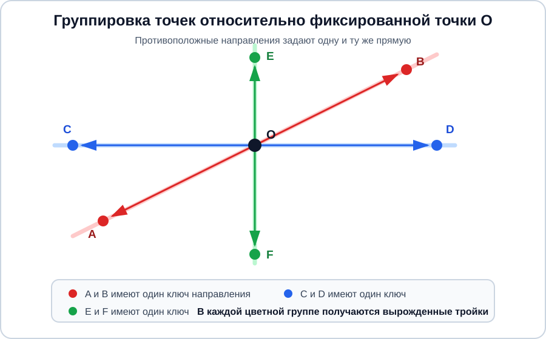
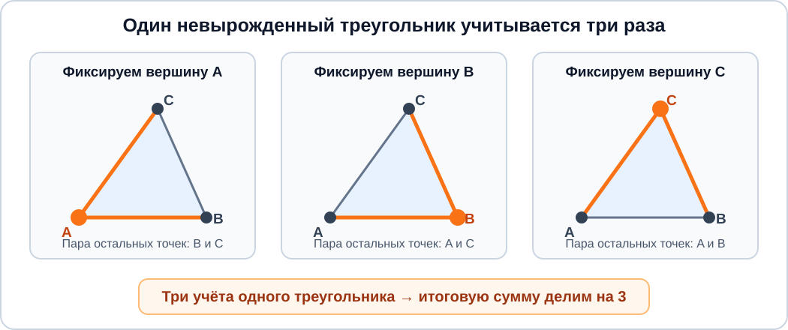

## A. Молчаливый ответ

<details><summary><b>Основная идея</b></summary>

Перебирать независимо оба числа нельзя: возможных пар слишком много. Ключевое наблюдение состоит в том, что для любых положительных целых чисел выполняется равенство

$a \cdot b = \gcd(a,b) \cdot \text{lcm}(a,b)$.

Значит, если известно $a$, то второе число определяется однозначно:

$b = \dfrac{g \cdot l}{a}$.

Остаётся перебрать все допустимые значения $a$. Подходящее $a$ обязательно делится на $g$ и является делителем $l$. Для каждого такого значения вычислим $b$, проверим ограничение $b \le 10^6$, а также заданные НОД и НОК.

Значения $a$ перебираются по возрастанию, поэтому найденные пары сразу расположены в нужном порядке.

Временная сложность — $O(10^6 \log 10^6)$ на один набор данных, дополнительная память — $O(k)$, где $k$ — количество подходящих пар.

</details>

<details><summary><b>Детальный разбор</b></summary>

Каждое из чисел $a$ и $b$ может принимать до $10^6$ значений. Если перебирать их независимо, получится до $10^{12}$ пар, что не укладывается в ограничение по времени. Поэтому нужно избавиться от перебора одного из чисел.

Для любых положительных целых $a$ и $b$ верна формула

$a \cdot b = \gcd(a,b) \cdot \text{lcm}(a,b)$.

По условию НОД должен быть равен $g$, а НОК — $l$. Следовательно, для любой подходящей пары

$a \cdot b = g \cdot l$.

Теперь достаточно выбрать значение $a$: единственное возможное значение второго числа имеет вид

$b = \dfrac{g \cdot l}{a}$.

Таким образом, вместо всех пар можно перебрать только $a$ от $1$ до $10^6$.

Сначала заметим ещё два обязательных свойства подходящего значения $a$:

- поскольку $\gcd(a,b)=g$, число $a$ должно делиться на $g$;
- поскольку $\text{lcm}(a,b)=l$, число $a$ должно быть делителем $l$.

Поэтому рассматривать имеет смысл только те значения, для которых одновременно выполняются условия $a \bmod g=0$ и $l \bmod a=0$. Второе условие заодно гарантирует, что при вычислении $g \cdot l / a$ деление будет целочисленным.

Для найденного значения $b$ нужно проверить ограничение $b \le 10^6$. После этого остаётся убедиться, что НОД пары действительно равен $g$, а НОК — $l$.

Такая проверка необходима: равенство $a \cdot b=g \cdot l$ задаёт только произведение НОД и НОК. Из него не следует, что сами НОД и НОК по отдельности совпадают с заданными значениями.

Итоговый алгоритм:

1. Перебрать все значения $a$ от $1$ до $10^6$.
2. Оставить только те значения, которые делятся на $g$ и являются делителями $l$.
3. Для каждого из них вычислить $b=g \cdot l/a$.
4. Проверить, что $b \le 10^6$, $\gcd(a,b)=g$ и $\text{lcm}(a,b)=l$.
5. Если все условия выполнены, добавить пару $(a,b)$ в ответ.

Пары не нужно сортировать отдельно: значения $a$ рассматриваются по возрастанию и добавляются в ответ в том же порядке.

Докажем корректность алгоритма.

Рассмотрим любую подходящую пару $(a,b)$. Число $a$ находится в пределах от $1$ до $10^6$, поэтому оно обязательно встретится при переборе. Так как НОД пары равен $g$, значение $a$ делится на $g$. Так как НОК пары равен $l$, значение $a$ делит $l$. Следовательно, оно пройдёт предварительные проверки. По формуле $a \cdot b=g \cdot l$ алгоритм вычислит именно то значение $b$, которое входит в рассматриваемую пару. Проверки границы, НОД и НОК также выполнятся. Значит, алгоритм найдёт каждую подходящую пару.

Теперь рассмотрим любую пару, добавленную в ответ. Для неё явно проверено, что $b \le 10^6$, а значение $a$ изначально перебиралось только в пределах от $1$ до $10^6$. Кроме того, её НОД равен $g$, а НОК равен $l$. Следовательно, каждая выведенная пара удовлетворяет всем требованиям задачи.

Таким образом, алгоритм выводит все подходящие пары и не добавляет лишних.

Цикл выполняет $10^6$ итераций на один набор данных. Вычисление НОД работает за $O(\log 10^6)$, поэтому общая временная сложность составляет $O(10^6 \log 10^6)$. Для хранения найденных пар требуется $O(k)$ дополнительной памяти.

</details>

<details><summary><b>Код на C++</b></summary>

```cpp
#include <bits/stdc++.h>
using namespace std;
using ll = long long;
void solve() {
    // читаем данные:
    ll g, l; cin >> g >> l;
    // перебираем все подходящие значения a, проверяя каждое:
    vector<pair<ll,ll>> answ;
    for (ll a = 1; a <= 1'000'000; a++)
        if (a % g == 0 && l % a == 0) {
            ll b = g * l / a; // используем a * b = НОК * НОД
            if (b <= 1'000'000 && gcd(a,b) == g && lcm(a,b) == l)
                answ.emplace_back(a, b);
        }
    // выводим ответ:
    cout << answ.size() << '\n';
    for (auto &[a, b] : answ)
        cout << a << ' ' << b << '\n';
}
main() {
    int tt; cin >> tt;
    while (tt --> 0) solve();
}
```

</details>

<details><summary><b>Код на Python</b></summary>

```python
from math import gcd, lcm
def solve():
    # читаем данные:
    g, l = map(int, input().split())
    # перебираем все подходящие значения a, проверяя каждое:
    answ = []
    for a in range(1, 1_000_001):
        if a % g == 0 and l % a == 0:
            b = g * l // a # используем a * b = НОК * НОД
            if b <= 1_000_000 and gcd(a, b) == g and lcm(a, b) == l:
                answ.append((a, b))
    # выводим ответ:
    print(len(answ))
    for a, b in answ:
        print(a, b)
tt = int(input())
for _ in range(tt):
    solve()
```

</details>

<details><summary><b>Разбор сложных фрагментов кода на C++</b></summary>

```cpp
for (ll a = 1; a <= 1'000'000; a++)
    if (a % g == 0 && l % a == 0) {
```

Перебираются все возможные значения первого числа. Условие `a % g == 0` проверяет, что $a$ кратно заданному НОД. Условие `l % a == 0` проверяет, что $a$ является делителем заданного НОК. Если хотя бы одно из этих условий не выполнено, ни одна пара с таким первым числом не подойдёт.

Поскольку значения `a` рассматриваются по возрастанию, найденные пары сразу сохраняются в требуемом порядке.

```cpp
ll b = g * l / a; // используем a * b = НОК * НОД
```

Второе число вычисляется по формуле $a \cdot b=g \cdot l$. Деление выполняется без остатка, потому что ранее уже проверено `l % a == 0`.

Тип `ll` необходим из-за ограничений: значение $l$ может достигать $10^{12}$, поэтому 32-битного целого типа недостаточно.

```cpp
if (b <= 1'000'000 && gcd(a,b) == g && lcm(a,b) == l)
    answ.emplace_back(a, b);
```

Сначала проверяется ограничение на второе число. Затем функции `gcd` и `lcm` подтверждают, что пара имеет именно заданные НОД и НОК. Проверки идут через `&&`, поэтому при слишком большом `b` остальные выражения уже не вычисляются.

Вызов `emplace_back(a, b)` добавляет в вектор пару с первым элементом `a` и вторым элементом `b`.

```cpp
for (auto &[a, b] : answ)
    cout << a << ' ' << b << '\n';
```

Конструкция `auto &[a, b]` разбирает очередной элемент вектора на две компоненты пары. Ссылка `&` позволяет обращаться к ним без копирования, хотя значения здесь используются только для вывода.

</details>

<details><summary><b>Разбор сложных фрагментов кода на Python</b></summary>

```python
for a in range(1, 1_000_001):
    if a % g == 0 and l % a == 0:
```

Правая граница `range` не включается, поэтому этот цикл перебирает все значения $a$ от $1$ до $10^6$ включительно.

Условие `a % g == 0` проверяет, что $a$ кратно заданному НОД, а условие `l % a == 0` — что $a$ делит заданный НОК. Только такие значения могут входить в подходящую пару.

Перебор идёт по возрастанию $a$, поэтому найденные пары уже расположены в нужном порядке.

```python
b = g * l // a # используем a * b = НОК * НОД
```

Второе число однозначно определяется формулой $a \cdot b=g \cdot l$. Оператор `//` выполняет целочисленное деление. Остатка не возникает, поскольку условие `l % a == 0` уже проверено.

Целые числа в Python не имеют фиксированной разрядности, поэтому произведение `g * l` не переполняется.

```python
if b <= 1_000_000 and gcd(a, b) == g and lcm(a, b) == l:
    answ.append((a, b))
```

Условие проверяет ограничение на $b$, а затем сравнивает НОД и НОК пары с заданными значениями. Выражения, соединённые оператором `and`, вычисляются слева направо. Если $b$ превышает допустимую границу, вызовы `gcd` и `lcm` не выполняются.

Пара добавляется в список только после того, как выполнены все требования задачи.

```python
for a, b in answ:
    print(a, b)
```

При обходе списка каждая пара сразу распаковывается в `a` и `b`. Дополнительная сортировка не требуется, поскольку пары добавлялись во время возрастающего перебора первого числа.

</details>

## B. Количество лестниц

<details><summary><b>Основная идея</b></summary>

У каждой лестницы есть **единственная вершина** — позиция, до которой значения строго возрастают, а после которой строго убывают. Если зафиксировать вершину, лестница распадается на две части:

- строго возрастающую подпоследовательность, которая заканчивается в вершине;
- строго убывающую подпоследовательность, которая начинается в вершине.

Для каждой позиции $i$ посчитаем:

- $dpL[i]$ — количество строго возрастающих подпоследовательностей, заканчивающихся в $i$;
- $dpR[i]$ — количество строго убывающих подпоследовательностей, начинающихся в $i$.

Любую левую часть можно независимо совместить с любой правой частью. Поэтому количество лестниц с вершиной в позиции $i$ равно

$dpL[i] \cdot dpR[i]$.

Сумма этих произведений по всем позициям и будет ответом.

**Временная сложность** — $O(n^2)$, **пространственная** — $O(n)$.

</details>

<details><summary><b>Детальный разбор</b></summary>

Перебирать все подпоследовательности напрямую невозможно: у массива длины $n$ есть $2^n-1$ непустых подпоследовательностей. При $n$ до $3000$ такой перебор не подходит.

Сначала заметим главное свойство лестницы. В ней существует позиция вершины $p$, для которой

$b_1<b_2<\ldots<b_p>b_{p+1}>\ldots>b_k$.

Поскольку все неравенства строгие, вершина является **единственным максимальным элементом этой лестницы**. Значит, одну лестницу нельзя отнести сразу к двум разным вершинам.

Если вершиной выбрана позиция $i$ исходного массива, то элементы лестницы до неё должны образовывать строго возрастающую подпоследовательность, заканчивающуюся в $i$. Элементы после неё должны образовывать строго убывающую подпоследовательность, начинающуюся в $i$.

Это позволяет считать две части независимо.

Обозначим через $dpL[i]$ количество строго возрастающих подпоследовательностей, последним элементом которых является $a_i$.

Подпоследовательность может состоять только из самого элемента $a_i$, поэтому изначально

$dpL[i]=1$.

Если перед $i$ находится позиция $j<i$ и выполняется $a_j<a_i$, то к любой возрастающей подпоследовательности, заканчивающейся в $j$, можно дописать элемент $a_i$. Получится возрастающая подпоследовательность, заканчивающаяся в $i$. Поэтому

$dpL[i]=1+\sum_{(j<i,a_j<a_i)}dpL[j]$.

Все полученные таким способом подпоследовательности различны: у них различается предпоследняя выбранная позиция либо набор позиций до неё.

Теперь симметрично рассмотрим правую часть. Пусть $dpR[i]$ — количество строго убывающих подпоследовательностей, которые начинаются с позиции $i$.

Подпоследовательность из одного элемента снова допустима, поэтому

$dpR[i]=1$.

Если $j>i$ и $a_j<a_i$, то после $a_i$ можно поставить любую убывающую подпоследовательность, начинающуюся в $j$. Отсюда получаем переход

$dpR[i]=1+\sum_{(j>i,a_j<a_i)}dpR[j]$.

Осталось объединить обе части. Зафиксируем вершину в позиции $i$:

- существует $dpL[i]$ способов выбрать возрастающую часть;
- существует $dpR[i]$ способов выбрать убывающую часть.

**Каждую левую часть можно совместить с каждой правой.** Все позиции левой части, кроме вершины, находятся левее $i$, а все позиции правой части, кроме вершины, — правее $i$. Поэтому выбранные части пересекаются только в общей вершине и вместе образуют корректную подпоследовательность.

Число лестниц с вершиной в позиции $i$ равно

$dpL[i]\cdot dpR[i]$.

Это произведение учитывает и граничные случаи:

- если возрастающая часть состоит только из вершины, получается строго убывающая подпоследовательность;
- если убывающая часть состоит только из вершины, получается строго возрастающая подпоследовательность;
- если обе части состоят только из вершины, получается одноэлементная подпоследовательность.

Таким образом, ответ вычисляется по формуле

$\sum_{i=0}^{n-1}dpL[i]\cdot dpR[i]$.

**Почему подсчёт корректен?**

Рассмотрим любую лестницу. У неё есть единственная вершина в некоторой позиции $i$. Часть до вершины является одной из подпоследовательностей, учтённых в $dpL[i]$, а часть после вершины — одной из подпоследовательностей, учтённых в $dpR[i]$. Следовательно, эта лестница будет посчитана в произведении $dpL[i]\cdot dpR[i]$.

Обратно, любая пара подпоследовательностей, выбранная из $dpL[i]$ и $dpR[i]$, образует лестницу: до $a_i$ значения строго возрастают, а после него строго убывают. Значит, в ответ не попадают неподходящие подпоследовательности.

Наконец, одна лестница не может быть посчитана дважды, поскольку её вершина определяется однозначно. Следовательно, алгоритм учитывает **каждую лестницу ровно один раз**.

Для вычисления каждого состояния перебираются до $n$ других позиций. Поэтому общая временная сложность равна $O(n^2)$, а два массива динамики занимают $O(n)$ памяти.

</details>

<details><summary><b>Код на C++</b></summary>

```cpp
#include <bits/stdc++.h>
using namespace std;
const int mod = 998244353;
void solve() {
    // читаем данные:
    int n; cin >> n;
    vector<int> a(n);
    for (auto &it : a) cin >> it;
    // лестница - комбинация из двух подпоследовательностей: возрастающей и убывающей
    // для каждой позиции считаем количество возрастающих
    // подпоследовательностей, заканчивающихся в ней:
    vector<int> dpL(n, 1);
    for (int i = 1; i < n; i++)
        for (int j = 0; j < i; j++)
            if (a[j] < a[i])
                (dpL[i] += dpL[j]) %= mod;
    // зеркально для каждой позиции считаем количество убывающих
    // подпоследовательностей, начинающихся в ней:
    vector<int> dpR(n, 1);
    for (int i = n-2; i >= 0; i--)
        for (int j = i+1; j < n; j++)
            if (a[j] < a[i])
                (dpR[i] += dpR[j]) %= mod;
    // считаем и выводим ответ:
    int64_t answ = 0;
    for (int i = 0; i < n; i++)
        (answ += dpL[i] * 1LL * dpR[i]) %= mod;
    cout << answ << '\n';
}
main() {
    int tt; cin >> tt;
    while (tt --> 0) solve();
}
```

</details>

<details><summary><b>Код на Python</b></summary>

```python
mod = 998244353
def solve():
    # читаем данные:
    n = int(input())
    a = list(map(int, input().split()))
    # лестница - комбинация из двух подпоследовательностей: возрастающей и убывающей
    # для каждой позиции считаем количество возрастающих
    # подпоследовательностей, заканчивающихся в ней:
    dpL = [1] * n
    for i in range(1, n):
        for j in range(i):
            if a[j] < a[i]:
                dpL[i] = (dpL[i] + dpL[j]) % mod
    # зеркально для каждой позиции считаем количество убывающих
    # подпоследовательностей, начинающихся в ней:
    dpR = [1] * n
    for i in range(n-2, -1, -1):
        for j in range(i+1, n):
            if a[j] < a[i]:
                dpR[i] = (dpR[i] + dpR[j]) % mod
    # считаем и выводим ответ:
    answ = 0
    for i in range(n):
        answ = (answ + dpL[i] * dpR[i]) % mod
    print(answ)
tt = int(input())
for _ in range(tt):
    solve()
```

</details>

<details><summary><b>Разбор сложных фрагментов кода на C++</b></summary>

```cpp
vector<int> dpL(n, 1);
for (int i = 1; i < n; i++)
    for (int j = 0; j < i; j++)
        if (a[j] < a[i])
            (dpL[i] += dpL[j]) %= mod;
```

Значение `dpL[i]` равно количеству строго возрастающих подпоследовательностей, которые заканчиваются в позиции `i`.

Начальное значение `1` соответствует подпоследовательности, состоящей только из `a[i]`. Если `j < i` и `a[j] < a[i]`, элемент `a[i]` можно дописать к любой подпоследовательности, учтённой в `dpL[j]`. Поэтому к `dpL[i]` прибавляется `dpL[j]`.

Позиции обрабатываются слева направо, так что все нужные значения `dpL[j]` уже вычислены.

```cpp
vector<int> dpR(n, 1);
for (int i = n-2; i >= 0; i--)
    for (int j = i+1; j < n; j++)
        if (a[j] < a[i])
            (dpR[i] += dpR[j]) %= mod;
```

Значение `dpR[i]` хранит количество строго убывающих подпоследовательностей, которые начинаются в позиции `i`.

Если `j > i` и `a[j] < a[i]`, то после `a[i]` можно поставить любую убывающую подпоследовательность, начинающуюся в `j`. Поэтому к `dpR[i]` прибавляется `dpR[j]`.

Здесь позиции обрабатываются **справа налево**. Благодаря этому к моменту вычисления `dpR[i]` все значения `dpR[j]` для `j > i` уже известны.

```cpp
for (int i = 0; i < n; i++)
    (answ += dpL[i] * 1LL * dpR[i]) %= mod;
```

Позиция `i` рассматривается как вершина лестницы. Существует `dpL[i]` способов выбрать возрастающую часть и `dpR[i]` способов выбрать убывающую часть, поэтому количество сочетаний равно их произведению.

Множитель `1LL` заставляет выполнить умножение в 64-битном типе. Без него два значения типа `int` сначала умножались бы как 32-битные числа, и произведение могло бы переполниться ещё до взятия остатка.

```cpp
(dpL[i] += dpL[j]) %= mod;
```

Скобки позволяют применить `%=` непосредственно к результату прибавления. После каждой операции значение сразу берётся по модулю, поэтому элементы динамики остаются меньше `mod`.

</details>

<details><summary><b>Разбор сложных фрагментов кода на Python</b></summary>

```python
dpL = [1] * n
for i in range(1, n):
    for j in range(i):
        if a[j] < a[i]:
            dpL[i] = (dpL[i] + dpL[j]) % mod
```

`dpL[i]` — количество строго возрастающих подпоследовательностей, заканчивающихся в позиции `i`.

Единица в начальном значении учитывает подпоследовательность из одного элемента `a[i]`. Для каждой более ранней позиции `j` с меньшим значением любую подпоследовательность из `dpL[j]` можно продолжить элементом `a[i]`.

Внешний цикл идёт слева направо, поэтому все состояния, используемые в переходе, уже посчитаны.

```python
dpR = [1] * n
for i in range(n-2, -1, -1):
    for j in range(i+1, n):
        if a[j] < a[i]:
            dpR[i] = (dpR[i] + dpR[j]) % mod
```

`dpR[i]` — количество строго убывающих подпоследовательностей, начинающихся в позиции `i`.

Выражение `range(n-2, -1, -1)` перебирает позиции от `n-2` до `0` включительно. Движение справа налево необходимо, потому что при вычислении `dpR[i]` используются состояния для позиций `j > i`.

Если `a[j] < a[i]`, то после `a[i]` можно выбрать любую убывающую подпоследовательность, начинающуюся в `j`.

```python
for i in range(n):
    answ = (answ + dpL[i] * dpR[i]) % mod
```

Для вершины в позиции `i` независимо выбираются возрастающая часть из `dpL[i]` вариантов и убывающая часть из `dpR[i]` вариантов. Поэтому их количество перемножается.

Остаток берётся после каждого прибавления, чтобы значение ответа не росло без необходимости. Переполнение Python не грозит, поскольку целые числа поддерживают произвольную точность.

</details>

## C. Черепашка снова в деле

<details><summary><b>Основная идея</b></summary>

При каждом ходе вниз или вправо сумма координат клетки $r+c$ увеличивается ровно на $1$. Поэтому любой маршрут посещает **ровно одну клетку каждой диагонали** с фиксированным значением $r+c$.

Все ловушки одного набора лежат на одной диагонали и попарно различны. Следовательно, **ни один маршрут не может пройти через две ловушки одновременно**. Значит, из общего количества маршрутов можно независимо вычесть количество маршрутов через каждую ловушку — пересечений между этими группами нет.

Число путей из $(r_1,c_1)$ в $(r_2,c_2)$ равно

$C((r_2-r_1)+(c_2-c_1),r_2-r_1)$,

если обе координаты не уменьшаются.

Количество маршрутов через ловушку $(r,c)$ равно произведению:

- числа путей из $(1,1)$ в $(r,c)$;
- числа путей из $(r,c)$ в $(n,m)$.

Для быстрого вычисления биномиальных коэффициентов заранее считаются факториалы и обратные факториалы по модулю $998244353$.

**Временная сложность предобработки** — $O(NMAX+\log(mod))$, обработка всех наборов — $O(\sum k)$. **Пространственная сложность** — $O(NMAX)$.

</details>

<details><summary><b>Детальный разбор</b></summary>

Если бы ловушки располагались произвольно, один маршрут мог бы пройти сразу через несколько из них. Тогда простое вычитание количества маршрутов через каждую ловушку привело бы к повторному вычитанию одних и тех же маршрутов.

Однако в этой задаче есть важное дополнительное условие: **все ловушки одного набора находятся на одной диагонали**, то есть для них совпадает значение $r+c$.

Рассмотрим, как меняется сумма координат при движении черепашки:

- при ходе вниз строка увеличивается на $1$, поэтому $r+c$ также увеличивается на $1$;
- при ходе вправо столбец увеличивается на $1$, поэтому $r+c$ снова увеличивается на $1$.

Таким образом, на каждом шаге значение $r+c$ увеличивается ровно на единицу. Из этого следует, что маршрут посещает ровно одну клетку с каждым возможным значением суммы координат.

В частности, **маршрут не может посетить две разные клетки одной диагонали**. Поскольку все ловушки текущего набора лежат на одной диагонали и их координаты попарно различны, ни один маршрут не проходит более чем через одну ловушку.

Благодаря этому множество небезопасных маршрутов распадается на непересекающиеся группы:

- маршруты через первую ловушку;
- маршруты через вторую ловушку;
- и так далее.

Поэтому количество безопасных маршрутов можно найти по формуле

$\text{ответ}=\text{все маршруты}-\sum \text{маршруты через ловушку}$.

Осталось научиться быстро считать количество путей между двумя клетками.

Пусть требуется попасть из $(r_1,c_1)$ в $(r_2,c_2)$. Для этого нужно сделать:

- $dr=r_2-r_1$ ходов вниз;
- $dc=c_2-c_1$ ходов вправо.

Если $dr<0$ или $dc<0$, добраться до второй клетки невозможно, поскольку черепашка не умеет ходить вверх или влево.

В остальных случаях маршрут состоит из $dr+dc$ ходов. Достаточно выбрать, какие $dr$ позиций в этой последовательности будут соответствовать движениям вниз. Поэтому количество маршрутов равно

$C(dr+dc,dr)$.

Теперь зафиксируем ловушку $(r,c)$. Любой маршрут через неё однозначно разбивается на две части:

1. путь из $(1,1)$ в $(r,c)$;
2. путь из $(r,c)$ в $(n,m)$.

Любую первую часть можно совместить с любой второй частью. Поэтому количество маршрутов через эту ловушку равно

$\text{cntWays}(1,1,r,c)\cdot\text{cntWays}(r,c,n,m)$.

**Почему здесь не требуется принцип включений и исключений?** Обычно при вычитании маршрутов через несколько запрещённых клеток пришлось бы учитывать пути, проходящие сразу через несколько ловушек. Но в данной задаче таких путей нет: все ловушки находятся на одной диагонали, а маршрут посещает только одну клетку этой диагонали.

Для вычисления биномиальных коэффициентов используется формула

$C(n,k)=\dfrac{n!}{k!(n-k)!}$.

Все вычисления проводятся по простому модулю $mod=998244353$. Деление по модулю заменяется умножением на обратный элемент:

$C(n,k)=\text{fact}[n]\cdot \text{ifact}[k]\cdot \text{ifact}[n-k]$,

где `fact` хранит факториалы, а `ifact` — обратные факториалы.

Обратное значение факториала вычисляется с помощью малой теоремы Ферма:

$x^{-1}=x^{mod-2}$ по модулю $mod$.

После этого остальные обратные факториалы можно получить справа налево:

$\text{ifact}[i]=\text{ifact}[i+1]\cdot(i+1)$.

Максимальное количество шагов между двумя клетками не превышает

$(n-1)+(m-1)\le 2\cdot10^6-2$,

поэтому размера `NMAX = 2 * 1024 * 1024` достаточно для всех нужных факториалов.

**Доказательство корректности** состоит из трёх частей.

Во-первых, формула `cntWays` правильно считает пути между двумя клетками: каждый путь задаётся выбором позиций для ходов вниз среди всех $dr+dc$ ходов, и каждому такому выбору соответствует ровно один путь.

Во-вторых, произведение количеств путей до ловушки и после неё учитывает каждый маршрут через эту ловушку ровно один раз. Разбиение маршрута в клетке ловушки однозначно, как и обратное объединение двух его частей.

В-третьих, группы маршрутов, проходящих через разные ловушки, не пересекаются. Следовательно, при вычитании ни один небезопасный маршрут не будет вычтен дважды. Все безопасные маршруты остаются в ответе, а все небезопасные удаляются.

Предварительное вычисление факториалов и обратных факториалов занимает $O(NMAX+\log(mod))$ времени и $O(NMAX)$ памяти. После предобработки количество путей между двумя клетками вычисляется за $O(1)$. Поэтому обработка одного набора ловушек занимает $O(k)$ времени, а всех наборов — $O(\sum k)$.

</details>

<details><summary><b>Код на C++</b></summary>

```cpp
#include <bits/stdc++.h>
using namespace std;
// модульная арифметика:
const int mod = 998244353;
int mul(int a, int b) {
    return int(a * 1LL * b % mod);
}
int add(int a, int b) {
    return (a + b) % mod;
}
int sub(int a, int b) {
    return (a - b + mod) % mod;
}
int binpow(int a, int64_t n) {
    int res = 1;
    while (n > 0) {
        if (n % 2 == 1)
            res = mul(res, a);
        a = mul(a, a);
        n >>= 1;
    }
    return res;
}
int inv(int a) {
    return binpow(a, mod - 2);
}
// факториалы и обратные к ним:
const int NMAX = 2 * 1024 * 1024;
const auto fact = [](){
    vector<int> res(NMAX+1, 1);
    for (int i = 2; i <= NMAX; i++)
        res[i] = mul(res[i-1], i);
    return res;
}();
const auto ifact = [](){
    vector<int> res(NMAX+1, 1);
    res[NMAX] = inv(fact[NMAX]);
    for (int i = NMAX-1; i >= 0; i--)
        res[i] = mul(res[i+1], i+1);
    return res;
}();
// биномиальный коэффициент:
int C(int n, int k) {
    if (n < 0 || k < 0 || k > n) return 0;
    return mul(fact[n], mul(ifact[k], ifact[n-k]));
}
// количество путей (r1, c1) -> (r2, c2):
int cntWays(int r1, int c1, int r2, int c2) {
    int dr = r2 - r1, dc = c2 - c1;
    if (dr < 0 || dc < 0) return 0;
    return C(dr+dc, dr);
}
// решение задачи:
void solve() {
    // читаем данные:
    int n, m, q; cin >> n >> m >> q;
    // сколько всего путей из (1, 1) в (n, m):
    int total = cntWays(1, 1, n, m);
    while (q --> 0) {
        // читаем текущий набор ловушек:
        int k; cin >> k;
        vector<int> r(k), c(k);
        for (auto &it : r) cin >> it;
        for (auto &it : c) cin >> it;
        // считаем ответ: "безопасные пути" = "все пути" вычесть "пути через ловушки"
        int answ = total;
        for (int i = 0; i < k; i++)
            answ = sub(answ, mul(cntWays(1, 1, r[i], c[i]), cntWays(r[i], c[i], n, m)));
        cout << answ << '\n';
    }
}
main() {
    int tt = 1; //cin >> tt;
    while (tt --> 0) solve();
}
```

</details>

<details><summary><b>Код на Python</b></summary>

```python
# модульная арифметика:
mod = 998244353
def mul(a, b):
    return a * b % mod
def add(a, b):
    return (a + b) % mod
def sub(a, b):
    return (a - b + mod) % mod
def inv(a):
    return pow(a, -1, mod)
# факториалы и обратные к ним:
NMAX = 2 * 1024 * 1024
fact = [1] * (NMAX+1)
for i in range(2, NMAX+1):
    fact[i] = mul(fact[i-1], i)
ifact = [1] * (NMAX+1)
ifact[NMAX] = inv(fact[NMAX])
for i in range(NMAX-1, -1, -1):
    ifact[i] = mul(ifact[i+1], i+1)
# биномиальный коэффициент:
def C(n, k):
    if n < 0 or k < 0 or k > n: return 0
    return mul(fact[n], mul(ifact[k], ifact[n-k]))
# количество путей (r1, c1) -> (r2, c2):
def cntWays(r1, c1, r2, c2):
    dr, dc = r2 - r1, c2 - c1
    if dr < 0 or dc < 0: return 0
    return C(dr+dc, dr)
# решение задачи:
def solve():
    # читаем данные:
    n, m, q = map(int, input().split())
    # сколько всего путей из (1, 1) в (n, m):
    total = cntWays(1, 1, n, m)
    for _ in range(q):
        # читаем текущий набор ловушек:
        k = int(input())
        r = list(map(int, input().split()))
        c = list(map(int, input().split()))
        # считаем ответ: "безопасные пути" = "все пути" вычесть "пути через ловушки"
        answ = total
        for i in range(k):
            answ = sub(answ, mul(cntWays(1, 1, r[i], c[i]), cntWays(r[i], c[i], n, m)))
        print(answ)
tt = 1
for _ in range(tt):
    solve()
```

</details>

<details><summary><b>Разбор сложных фрагментов кода на C++</b></summary>

```cpp
int binpow(int a, int64_t n) {
    int res = 1;
    while (n > 0) {
        if (n % 2 == 1)
            res = mul(res, a);
        a = mul(a, a);
        n >>= 1;
    }
    return res;
}
int inv(int a) {
    return binpow(a, mod - 2);
}
```

`binpow` вычисляет степень двоичным возведением. На каждой итерации показатель делится на два, поэтому функция работает за $O(\log(n))$.

Так как `mod` — простое число, по малой теореме Ферма обратный элемент для ненулевого `a` равен степени `a` с показателем `mod - 2`. Все умножения выполняются через `mul`, поэтому промежуточные результаты сразу берутся по модулю.

```cpp
const auto fact = [](){
    vector<int> res(NMAX+1, 1);
    for (int i = 2; i <= NMAX; i++)
        res[i] = mul(res[i-1], i);
    return res;
}();
```

Безымянная функция вызывается сразу после объявления и заполняет массив факториалов. Для каждого `i` выполняется равенство `res[i] = res[i-1] * i` по модулю.

Ключевое слово `auto` позволяет получить тип `vector<int>` из возвращаемого значения функции. Массив создаётся **один раз до начала обработки входных данных**.

```cpp
const auto ifact = [](){
    vector<int> res(NMAX+1, 1);
    res[NMAX] = inv(fact[NMAX]);
    for (int i = NMAX-1; i >= 0; i--)
        res[i] = mul(res[i+1], i+1);
    return res;
}();
```

Сначала вычисляется обратный факториал для максимального индекса. Остальные значения восстанавливаются справа налево из равенства

$\text{ifact}[i]=\text{ifact}[i+1]\cdot(i+1)$.

Это позволяет получить все обратные факториалы за линейное время, выполнив только одно возведение в степень.

```cpp
int C(int n, int k) {
    if (n < 0 || k < 0 || k > n) return 0;
    return mul(fact[n], mul(ifact[k], ifact[n-k]));
}
```

Функция вычисляет биномиальный коэффициент по формуле

$C(n,k)=\text{fact}[n]\cdot \text{ifact}[k]\cdot \text{ifact}[n-k]$.

Проверка границ возвращает ноль для невозможного выбора количества элементов. Благодаря готовым массивам один биномиальный коэффициент вычисляется за $O(1)$.

```cpp
int cntWays(int r1, int c1, int r2, int c2) {
    int dr = r2 - r1, dc = c2 - c1;
    if (dr < 0 || dc < 0) return 0;
    return C(dr+dc, dr);
}
```

`dr` и `dc` — необходимое количество ходов вниз и вправо. Если хотя бы одна разность отрицательна, добраться до второй клетки разрешёнными движениями нельзя.

Иначе маршрут содержит `dr + dc` ходов, среди которых выбираются позиции для `dr` перемещений вниз. Поэтому ответ равен `C(dr+dc, dr)`.

```cpp
for (int i = 0; i < k; i++)
    answ = sub(answ, mul(cntWays(1, 1, r[i], c[i]), cntWays(r[i], c[i], n, m)));
```

Первый вызов `cntWays` считает пути от начала до ловушки, второй — пути от ловушки до конца. Их произведение равно числу маршрутов через эту клетку.

Полученное значение вычитается из общего числа маршрутов. Повторного вычитания не возникает, поскольку один маршрут не может пройти через две разные ловушки, лежащие на одной диагонали.

</details>

<details><summary><b>Разбор сложных фрагментов кода на Python</b></summary>

```python
def inv(a):
    return pow(a, -1, mod)
```

Трёхаргументный вызов `pow(a, -1, mod)` вычисляет число, обратное к `a` по модулю `mod`. То есть результат `x` удовлетворяет условию `a * x % mod == 1`.

Обратный элемент существует, поскольку `mod` — простое число, а используемый факториал не делится на `mod`.

```python
fact = [1] * (NMAX+1)
for i in range(2, NMAX+1):
    fact[i] = mul(fact[i-1], i)
```

Массив `fact` хранит факториалы по модулю. Значение `fact[i]` получается умножением предыдущего факториала на `i`.

Правая граница `range` не включается, поэтому цикл заполняет элементы вплоть до `fact[NMAX]`.

```python
ifact = [1] * (NMAX+1)
ifact[NMAX] = inv(fact[NMAX])
for i in range(NMAX-1, -1, -1):
    ifact[i] = mul(ifact[i+1], i+1)
```

Сначала находится обратный элемент для максимального факториала. Затем остальные обратные факториалы вычисляются справа налево по формуле

$\text{ifact}[i]=\text{ifact}[i+1]\cdot(i+1)$.

Вызов `range(NMAX-1, -1, -1)` перебирает индексы от `NMAX - 1` до `0` включительно.

```python
def C(n, k):
    if n < 0 or k < 0 or k > n: return 0
    return mul(fact[n], mul(ifact[k], ifact[n-k]))
```

После предобработки биномиальный коэффициент вычисляется за $O(1)$ по формуле через факториалы и обратные факториалы.

Проверка границ нужна для случаев, когда выбрать `k` элементов из `n` невозможно.

```python
def cntWays(r1, c1, r2, c2):
    dr, dc = r2 - r1, c2 - c1
    if dr < 0 or dc < 0: return 0
    return C(dr+dc, dr)
```

Чтобы попасть из первой клетки во вторую, требуется `dr` ходов вниз и `dc` ходов вправо. Отрицательная разность означает, что понадобился бы запрещённый ход вверх или влево.

В допустимом случае выбираются позиции для `dr` ходов вниз среди `dr + dc` шагов.

```python
for i in range(k):
    answ = sub(answ, mul(cntWays(1, 1, r[i], c[i]), cntWays(r[i], c[i], n, m)))
```

Для каждой ловушки перемножаются количество путей до неё и количество путей от неё до конечной клетки. Так учитываются все маршруты, проходящие через эту ловушку.

Эти количества можно независимо вычесть из общего ответа, потому что разные ловушки лежат на одной диагонали и **ни один маршрут не может посетить две из них**.

</details>

## D. Треугольники из точек

<details><summary><b>Основная идея</b></summary>

Три точки не образуют невырожденный треугольник **тогда и только тогда, когда они лежат на одной прямой**.

Зафиксируем одну точку и выберем ещё две. Тройка вырождена, если направления от фиксированной точки к двум выбранным точкам совпадают с точностью до знака. Чтобы сравнивать направления, разделим разности координат на их НОД и приведём знак к единому виду.

Если одному направлению соответствуют $k$ точек, то среди них можно выбрать $C(k,2)$ пар, каждая из которых вместе с фиксированной точкой образует вырожденную тройку. Вычтем такие пары из общего количества $C(n-1,2)$.

Каждый невырожденный треугольник будет найден **три раза** — по одному разу для каждой своей вершины. Поэтому итоговую сумму нужно разделить на $3$.

В реализации на C++ временная сложность составляет $O(n^2\log(n))$, а в реализации на Python — в среднем $O(n^2)$. Дополнительная память — $O(n)$.

</details>

<details><summary><b>Детальный разбор</b></summary>

Всего существует $C(n,3)$ способов выбрать три точки. Однако среди этих троек могут быть вырожденные: три точки, лежащие на одной прямой, не образуют треугольник.

Проверить отдельно каждую тройку можно за $O(n^3)$, но при $n$ до $2000$ это слишком медленно. Нужно научиться обрабатывать сразу много троек с общим свойством.

Зафиксируем одну из точек, обозначим её индексом $i$. Теперь из оставшихся $n-1$ точек нужно выбрать две. Всего таких пар

$C(n-1,2)=\dfrac{(n-1)(n-2)}{2}$.

Каждая выбранная пара вместе с точкой $i$ задаёт тройку. Она окажется вырожденной, если обе выбранные точки лежат на одной прямой с точкой $i$.

Значит, для фиксированной точки достаточно **сгруппировать остальные точки по прямым, проходящим через неё**.

<p align="center">
  
</p>
<p align="center">
  <em>Рисунок 1. Точки группируются по прямым, проходящим через фиксированную точку O. Точки по разные стороны от O относятся к одной группе, поэтому противоположные направления приводятся к одному ключу.</em>
</p>

Рассмотрим другую точку $j$. Направление от $i$ к $j$ задаётся вектором

$(\text{dx},\text{dy})=(x_j-x_i,y_j-y_i)$.

Одна и та же прямая может быть представлена множеством пропорциональных векторов. Например, векторы $(2,4)$ и $(3,6)$ задают одно направление. Поэтому длину вектора нужно убрать.

Для этого вычислим

$g=\text{НОД}(|\text{dx}|,|\text{dy}|)$

и разделим обе координаты на $g$. После этого вектор становится примитивным: его координаты уже нельзя одновременно сократить.

Но этого недостаточно. Векторы $(1,2)$ и $(-1,-2)$ направлены в противоположные стороны, однако задают **одну и ту же прямую** через фиксированную точку. Для задачи их нужно считать одинаковыми, ведь две точки по разные стороны от $i$ тоже образуют с ней вырожденную тройку.

Поэтому знак нормализуется следующим образом:

- если $\text{dx}<0$, знаки обеих координат меняются;
- если $\text{dx}=0$, значение $\text{dy}$ делается положительным.

В результате у каждой прямой появляется единственное представление:

- для невертикальной прямой $\text{dx}>0$;
- для вертикальной прямой используется направление $(0,1)$.

Теперь все точки, лежащие с $i$ на одной прямой, получают одинаковую нормализованную пару.

Пусть некоторому направлению соответствуют $k$ точек. Выбрав любые две из них, мы получим вырожденную тройку вместе с точкой $i$. Таких пар ровно

$C(k,2)=\dfrac{k(k-1)}{2}$.

Поэтому количество невырожденных троек, содержащих фиксированную точку $i$, равно общему количеству пар среди остальных точек за вычетом пар внутри каждой группы направлений:

$C(n-1,2)-\sum C(k,2)$.

После вычисления этой величины для каждой точки все результаты складываются.

Важно понять, **сколько раз учитывается один треугольник**. Пусть выбраны три точки, которые не лежат на одной прямой. Если зафиксировать любую из них, две оставшиеся будут иметь разные направления, поэтому эта тройка будет учтена. В качестве фиксированной можно выбрать каждую из трёх вершин, следовательно, один треугольник попадает в сумму ровно три раза.

<p align="center">
  
</p>
<p align="center">
  <em>Рисунок 2. Один и тот же треугольник учитывается при фиксации каждой из трёх его вершин. Поэтому после суммирования результатов по всем точкам ответ нужно разделить на 3.</em>
</p>

Отсюда итоговый ответ равен накопленной сумме, делённой на $3$.

**Докажем корректность подсчёта.**

Для фиксированной точки $i$ две другие точки попадают в одну группу тогда и только тогда, когда нормализованные направления к ним совпадают. Это равносильно тому, что все три точки лежат на одной прямой. Следовательно, вычитаются ровно вырожденные тройки, содержащие $i$, а все оставшиеся пары образуют невырожденные треугольники.

Любой невырожденный треугольник учитывается при фиксации каждой из трёх его вершин и только при них. Поэтому после деления общей суммы на $3$ каждый допустимый набор из трёх точек учитывается **ровно один раз**.

В C++ направления хранятся в `map`, поэтому каждая операция со словарём занимает $O(\log(n))$. Для каждой из $n$ точек рассматриваются остальные $n-1$ точек, и общая временная сложность составляет $O(n^2\log(n))$.

В Python используется хеш-таблица `defaultdict`, поэтому одна операция с направлением в среднем занимает $O(1)$, а общая ожидаемая временная сложность равна $O(n^2)$. В обеих реализациях для направлений относительно одной точки требуется $O(n)$ дополнительной памяти.

</details>

<details><summary><b>Код на C++</b></summary>

```cpp
#include <bits/stdc++.h>
#include <cassert>
using namespace std;
void solve() {
    // читаем данные:
    int n; cin >> n;
    vector<int> x(n), y(n);
    for (int i = 0; i < n; i++)
        cin >> x[i] >> y[i];
    // будем вычитать из всех троек те тройки, которые не образуют треугольник
    // такие тройки лежат на одной прямой. переберём одну из точек треугольника
    // и посчитаем, сколько плохих троек она образует:
    int64_t answ = 0;
    for (int i = 0; i < n; i++) {
        map<pair<int,int>, int> cnt;
        for (int j = 0; j < n; j++) {
            if (j != i) {
                // вектор (xi, yi) -> (xj, yj):
                int dx = x[j] - x[i];
                int dy = y[j] - y[i];
                // нормализуем длину:
                int g = gcd(abs(dx), abs(dy));
                dx /= g, dy /= g;
                // нормализуем знак:
                if (dx < 0) dx = -dx, dy = -dy;
                if (dx == 0) dy = abs(dy);
                // добавляем в словарь:
                cnt[{dx, dy}]++;
            }
        }
        // теперь из всех способов выбрать 2 точки вычитаем те, которые лежат на одной прямой:
        int64_t curr = (n-1LL)*(n-2LL)/2;
        for (const auto &[_, k] : cnt)
            curr -= k * (k-1LL)/2;
        // обновляем глобальный ответ:
        answ += curr;
    }
    // выводим ответ, учитывая, что каждый треугольник посчитали трижды:
    assert(answ % 3 == 0);
    cout << answ / 3 << endl;
}
main() {
    int tt = 1; cin >> tt;
    while (tt --> 0) solve();
}
```

</details>

<details><summary><b>Код на Python</b></summary>

```python
from math import gcd
from collections import defaultdict
def solve():
    # читаем данные:
    n = int(input())
    x, y = [0] * n, [0] * n
    for i in range(n):
        x[i], y[i] = map(int, input().split())
    # будем вычитать из всех троек те тройки, которые не образуют треугольник
    # такие тройки лежат на одной прямой. переберём одну из точек треугольника
    # и посчитаем, сколько плохих троек она образует:
    answ = 0
    for i in range(n):
        cnt = defaultdict(int)
        for j in range(n):
            if j != i:
                # вектор (xi, yi) -> (xj, yj):
                dx = x[j] - x[i]
                dy = y[j] - y[i]
                # нормализуем длину:
                g = gcd(abs(dx), abs(dy))
                dx //= g; dy //= g
                # нормализуем знак:
                if dx < 0: dx = -dx; dy = -dy
                if dx == 0: dy = abs(dy)
                # добавляем в словарь:
                cnt[(dx, dy)] += 1
        # теперь из всех способов выбрать 2 точки вычитаем те, которые лежат на одной прямой:
        curr = (n-1)*(n-2)//2
        for _, k in cnt.items():
            curr -= k * (k-1)//2
        # обновляем глобальный ответ:
        answ += curr
    # выводим ответ, учитывая, что каждый треугольник посчитали трижды:
    assert answ % 3 == 0
    print(answ // 3)
tt = int(input())
for _ in range(tt):
    solve()
```

</details>

<details><summary><b>Разбор сложных фрагментов кода на C++</b></summary>

```cpp
for (int i = 0; i < n; i++) {
    map<pair<int,int>, int> cnt;
```

Позиция `i` выбирается в качестве одной из вершин. Словарь `cnt` хранит количество остальных точек для каждого нормализованного направления относительно `i`.

Словарь создаётся заново для каждой фиксированной точки, поскольку направления зависят от выбранного начала.

```cpp
int dx = x[j] - x[i];
int dy = y[j] - y[i];
// нормализуем длину:
int g = gcd(abs(dx), abs(dy));
dx /= g, dy /= g;
```

Пара `(dx, dy)` задаёт вектор от точки `i` к точке `j`. Деление обеих координат на их НОД убирает длину вектора и оставляет только его направление.

Точки попарно различны, а случай `j == i` исключён. Поэтому `dx` и `dy` не могут одновременно равняться нулю, следовательно, `g` всегда положителен.

```cpp
if (dx < 0) dx = -dx, dy = -dy;
if (dx == 0) dy = abs(dy);
```

Эти проверки объединяют два противоположных направления в одно представление прямой.

Для невертикального направления значение `dx` становится положительным. У вертикального направления `dx` равен нулю, поэтому положительным делается `dy`. Благодаря этому точки по разные стороны от `i`, но на одной прямой, получают одинаковый ключ.

```cpp
cnt[{dx, dy}]++;
```

Нормализованная пара используется как ключ в `map`. Значение по этому ключу показывает, сколько точек лежит на соответствующей прямой, проходящей через фиксированную точку `i`.

```cpp
int64_t curr = (n-1LL)*(n-2LL)/2;
for (const auto &[_, k] : cnt)
    curr -= k * (k-1LL)/2;
```

Изначально `curr` равен количеству способов выбрать любые две точки из оставшихся $n-1$.

Если в одной группе находится `k` точек, то существует `k * (k-1) / 2` пар, лежащих с точкой `i` на одной прямой. Такие пары вычитаются.

Суффикс `LL` переводит вычисления в 64-битный тип. Это необходимо, поскольку количество троек может не помещаться в `int`.

```cpp
answ += curr;
```

В `answ` добавляется количество невырожденных троек, содержащих текущую фиксированную точку. В итоговой сумме каждый треугольник появится по одному разу для каждой своей вершины.

```cpp
assert(answ % 3 == 0);
cout << answ / 3 << endl;
```

Каждый невырожденный треугольник посчитан ровно три раза, поэтому накопленная сумма обязана делиться на $3$. `assert` проверяет это свойство, после чего выводится число различных троек без учёта порядка.

</details>

<details><summary><b>Разбор сложных фрагментов кода на Python</b></summary>

```python
for i in range(n):
    cnt = defaultdict(int)
```

Для каждой точки `i` отдельно группируются направления ко всем остальным точкам. `defaultdict(int)` создаёт отсутствующее значение как ноль, поэтому количество точек для направления можно сразу увеличивать.

```python
dx = x[j] - x[i]
dy = y[j] - y[i]
# нормализуем длину:
g = gcd(abs(dx), abs(dy))
dx //= g; dy //= g
```

`dx` и `dy` задают вектор от фиксированной точки `i` к точке `j`. Деление на общий НОД сокращает координаты вектора и удаляет зависимость от его длины.

Так как все точки различны и `j != i`, обе разности не могут одновременно быть равны нулю. Поэтому делитель `g` положителен.

```python
if dx < 0: dx = -dx; dy = -dy
if dx == 0: dy = abs(dy)
```

Противоположные векторы должны обозначать одну прямую. Если `dx` отрицателен, знаки обеих координат меняются. Для вертикального направления `dx` равен нулю, поэтому знак `dy` также приводится к единому виду.

После этих действий любая прямая через точку `i` имеет **единственный ключ**.

```python
cnt[(dx, dy)] += 1
```

Ключом словаря служит кортеж из двух нормализованных координат направления. В значении хранится количество точек, лежащих на этой прямой вместе с точкой `i`.

```python
curr = (n-1)*(n-2)//2
for _, k in cnt.items():
    curr -= k * (k-1)//2
```

Сначала учитываются все способы выбрать две точки из оставшихся $n-1$. Затем для каждой группы размера `k` вычитаются пары точек, лежащие на одной прямой с `i`.

Переменная `_` получает ключ направления, который в этом цикле не нужен. Используется только размер группы `k`.

```python
assert answ % 3 == 0
print(answ // 3)
```

Каждый треугольник был учтён при выборе каждой из трёх его вершин в качестве фиксированной точки. Поэтому сумма делится на $3$, что дополнительно проверяет `assert`. Целочисленное деление возвращает искомое количество троек.

</details>